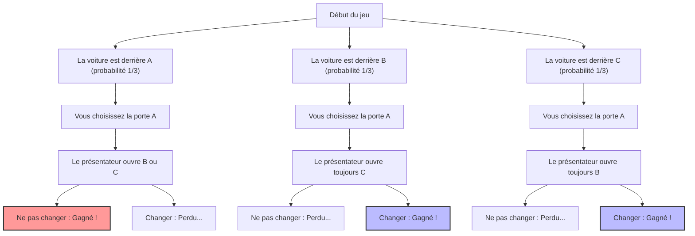
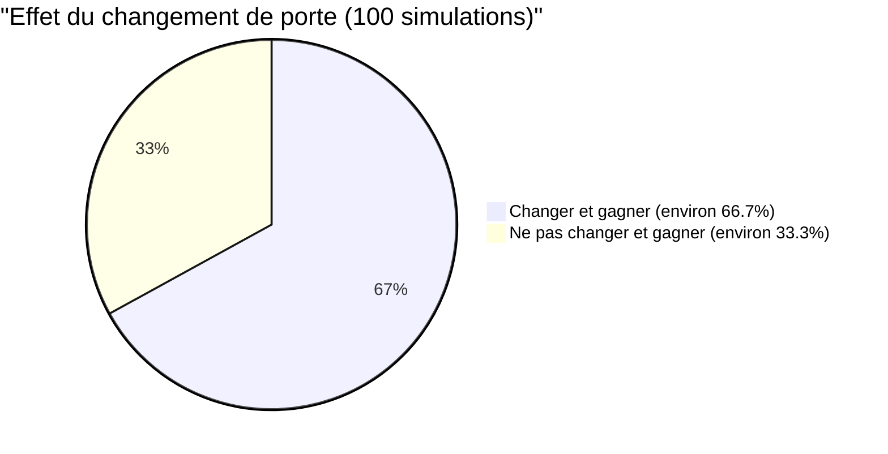

## 1. Le décor est un jeu télévisé : que feriez-vous ?

En 1990, dans la chronique « Ask Marilyn » (Demandez à Marilyn) du magazine d'actualité américain *Parade*, un lecteur a posé la question suivante :

> Vous participez à un jeu télévisé. Devant vous se trouvent **3 portes (A, B, C)**.
> Derrière l'une des portes se trouve **une voiture neuve (le gros lot)**, et derrière les deux autres se trouvent **des chèvres (les perdants)**.
> 
> 1. Vous choisissez d'abord la **porte A**.
> 2. Ensuite, le présentateur Monty Hall, qui sait quelle porte cache la voiture, ouvre la **porte B**, qui révèle une chèvre parmi les portes restantes.
> 3. Monty vous dit : **« Vous pouvez maintenant changer pour la porte C si vous le souhaitez. Que faites-vous ? »**
> 
> Finalement, **devriez-vous changer de porte ?**

Intuitivement, on pourrait penser : « Il ne reste que deux portes, A et C. Puisque la position de la voiture est complètement aléatoire, la probabilité de gagner pour chaque porte est de $\frac{1}{2}$ (50 %). Par conséquent, cela ne change rien de changer de porte ou non. »

Cependant, la chroniqueuse Marilyn vos Savant (reconnue par le Livre Guinness des records comme la personne ayant le QI le plus élevé) a répondu : **« Vous devriez changer. Si vous changez, vos chances de gagner seront doublées. »**

Cette réponse a fait sensation dans tous les États-Unis et a déclenché une avalanche d'environ 10 000 lettres de protestation (dont environ 1 000 provenaient d'universitaires titulaires d'un doctorat en mathématiques). C'était une tempête de critiques acerbes telles que « Vous ne comprenez pas les bases des probabilités » ou « C'est de la logique féminine ».

Cependant, pour en venir à la conclusion, **la réponse de Marilyn était mathématiquement tout à fait exacte**.

---

## 2. L'écart entre l'intuition et les mathématiques : les ramifications des probabilités vues avec Mermaid

Pourquoi notre intuition nous donne-t-elle l'illusion de « $\frac{1}{2}$ » ?
Tout d'abord, visualisons tous les scénarios possibles du jeu.

En supposant que vous ayez choisi la « porte A », les 3 scénarios suivants se produisent avec des probabilités égales ($\frac{1}{3}$).

1. **Scénario 1 (la voiture est en A) :** Le présentateur ouvre B ou C, qui cache une chèvre. Si vous changez de porte, vous **perdez**.
2. **Scénario 2 (la voiture est en B) :** Le présentateur ne peut ouvrir que C, qui cache une chèvre. Si vous changez de porte, vous **gagnez**.
3. **Scénario 3 (la voiture est en C) :** Le présentateur ne peut ouvrir que B, qui cache une chèvre. Si vous changez de porte, vous **gagnez**.

En d'autres termes, 2 fois sur 3 (scénarios 2 et 3), vous êtes dans une situation où **« si vous changez de porte, vous gagnerez à coup sûr »**.
Par conséquent, votre taux de victoire si vous changez de porte est de $\frac{2}{3}$, soit **le double** du taux de victoire si vous ne changez pas, qui est de $\frac{1}{3}$.

---

## 3. Preuve rigoureuse par le théorème de Bayes

Pour résoudre mathématiquement ce problème de manière rigoureuse, nous utilisons le « théorème de Bayes » pour calculer les probabilités conditionnelles.

$$ P(H|E) = \frac{P(E|H) P(H)}{P(E)} $$

Ici, nous définissons les événements comme suit :
- $C_A, C_B, C_C$ : Les événements où la voiture neuve se trouve respectivement derrière la porte A, B et C. Les probabilités a priori sont $P(C_A) = P(C_B) = P(C_C) = \frac{1}{3}$
- Supposons que vous ayez choisi la **porte A** en premier.
- $M_B$ : L'événement où le présentateur ouvre la **porte B**, qui révèle une chèvre.

Ce que nous voulons trouver, c'est la « probabilité que la voiture se trouve derrière la porte C, étant donné que le présentateur a ouvert la porte B », c'est-à-dire la probabilité a posteriori $P(C_C|M_B)$.

Tout d'abord, considérons la probabilité $P(M_B|C_X)$ que le présentateur ouvre la porte B, en fonction de l'endroit où se trouve la voiture.

1. **Si la voiture est derrière la porte A ($C_A$)**
   Le présentateur peut ouvrir aléatoirement B ou C.
   $$ P(M_B|C_A) = \frac{1}{2} $$

2. **Si la voiture est derrière la porte B ($C_B$)**
   Le présentateur ne peut pas ouvrir la porte cachant la voiture, donc la probabilité d'ouvrir B est nulle.
   $$ P(M_B|C_B) = 0 $$

3. **Si la voiture est derrière la porte C ($C_C$)**
   Le présentateur ne peut ouvrir ni A (votre choix) ni C (qui cache la voiture), il doit donc nécessairement ouvrir B.
   $$ P(M_B|C_C) = 1 $$

Ensuite, nous trouvons la probabilité totale $P(M_B)$ que le présentateur ouvre la porte B à l'aide de la « loi des probabilités totales ».

$$ P(M_B) = P(M_B|C_A)P(C_A) + P(M_B|C_B)P(C_B) + P(M_B|C_C)P(C_C) $$
$$ P(M_B) = \left(\frac{1}{2} \times \frac{1}{3}\right) + \left(0 \times \frac{1}{3}\right) + \left(1 \times \frac{1}{3}\right) = \frac{1}{6} + 0 + \frac{1}{3} = \frac{1}{2} $$

Nous appliquons enfin le théorème de Bayes pour calculer les probabilités a posteriori pour la porte A et la porte C.

**Probabilité que la voiture soit derrière la porte A (si vous ne changez pas) :**
$$ P(C_A|M_B) = \frac{P(M_B|C_A) P(C_A)}{P(M_B)} = \frac{\frac{1}{2} \times \frac{1}{3}}{\frac{1}{2}} = \frac{1}{3} $$

**Probabilité que la voiture soit derrière la porte C (si vous changez) :**
$$ P(C_C|M_B) = \frac{P(M_B|C_C) P(C_C)}{P(M_B)} = \frac{1 \times \frac{1}{3}}{\frac{1}{2}} = \frac{2}{3} $$

Même avec une preuve mathématique, il est clairement démontré que **« la probabilité de gagner est multipliée par deux (2/3) si vous changez de porte »**.

---

## 4. Biais cognitifs : la valeur de l'information en tant que « conditionnement »

Pourquoi même de nombreux mathématiciens de génie se sont-ils trompés intuitivement sur ce problème ?
Il y a là un « biais d'équiprobabilité » et un « échec de la mise à jour de l'information » ancrés dans le cerveau humain.

### 4.1. Biais d'équiprobabilité (Equiprobability Bias)
Les humains ont tendance à assigner inconsciemment que « la probabilité des options restantes est toujours égale » face à des options inconnues.
Au moment où l'on voit qu'il reste deux portes, le cerveau les étiquette automatiquement comme « $50\%$ : $50\%$ ».

### 4.2. L'information sur l'« intention » du présentateur
La principale raison pour laquelle l'intuition se trompe est le fait d'ignorer que **les actions du présentateur ne sont pas aléatoires**.
Si les règles étaient que le présentateur « ouvrait une porte au hasard sans savoir où se trouve la voiture, et que cela tombait sur une chèvre » (connu sous le nom de problème de Monty Fall), la probabilité pour la porte A et la porte C serait toutes deux de $\frac{1}{2}$.

Cependant, dans le véritable problème de Monty Hall, le présentateur agit sous les contraintes strictes suivantes :
1. Il ne peut pas ouvrir la porte choisie par le participant.
2. Il ne peut pas ouvrir la porte cachant la voiture neuve.

En raison de ces contraintes, l'acte même d'ouvrir la « porte B » par le présentateur nous donne **une information énorme concernant la porte C**. Cela contient le message silencieux : « Je ne pouvais pas ouvrir la porte C (parce que la voiture neuve s'y trouve) ».

---

## 5. Corriger l'intuition avec un exemple extrême

Si vous n'êtes toujours pas convaincu, essayons d'augmenter le nombre de portes à **1 million**.

1. Vous choisissez la **porte 1** parmi 1 million de portes. (La probabilité de gagner est de $\frac{1}{1,000,000}$)
2. Le présentateur omniscient **ouvre l'intégralité des 999 998 portes** cachant une chèvre parmi les 999 999 portes restantes.
3. Les seules portes fermées sont la « porte 1 » que vous avez choisie et la « porte 777 777 » que le présentateur a délibérément laissée.

Maintenant, allez-vous changer de porte ?
Dans ce cas, si vous croyez avoir réussi le miracle de « 1 sur 1 million » lors du premier choix, vous ne devriez pas changer. Cependant, en réalité, vous pouvez intuitivement comprendre que la probabilité que la voiture se trouve derrière la **« seule porte que le présentateur ne pouvait absolument pas ouvrir »** est de $\frac{999,999}{1,000,000}$.

Le problème de Monty Hall (3 portes) n'est qu'un phénomène qui réduit l'échelle de cette situation à « 1 million de portes ».

## 6. Conclusion : les leçons que la théorie des probabilités enseigne pour les affaires et la vie

Le problème de Monty Hall dépasse le cadre d'un simple quiz et nous enseigne des leçons importantes.

1. **L'intuition se trompe souvent** : Le cerveau humain n'a pas évolué pour traiter intuitivement des probabilités conditionnelles complexes. Il est dangereux de s'en remettre uniquement à l'intuition lors de prises de décisions importantes.
2. **Mettre à jour les probabilités avec de nouvelles informations (mise à jour bayésienne)** : Lorsque la situation change et que de nouvelles informations (comme quelle porte le présentateur a ouverte) sont apportées, la clé du succès est de pouvoir mettre à jour de manière flexible ses probabilités et ses stratégies, au lieu de s'en tenir à des idées préconçues.

La petite décision de « changer de porte » pourrait multiplier par deux vos chances d'obtenir la « voiture neuve » dans votre vie.
