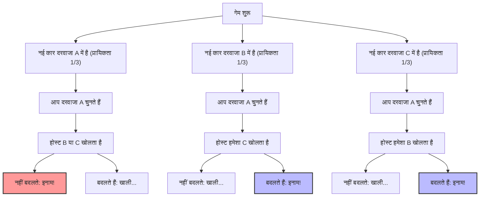
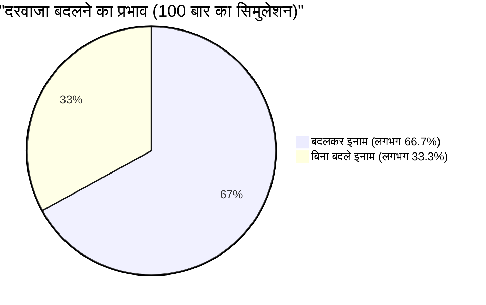

## 1. मंच एक टीवी क्विज शो है: आप क्या करेंगे?

1990 में, अमेरिकी समाचार पत्रिका 'Parade' के कॉलम "Ask Marilyn (मर्लिन से पूछें)" में एक पाठक ने यह प्रश्न पूछा:

> आप एक टीवी गेम शो के प्रतिभागी हैं। आपके सामने **3 दरवाजे (A, B, C)** हैं।
> 1 दरवाजे के पीछे एक **नई कार (इनाम)** है, और बाकी 2 दरवाजों के पीछे **बकरियां (खाली)** हैं।
> 
> 1. आपने सबसे पहले **दरवाजा A** चुना।
> 2. फिर, मोंटी हॉल (होस्ट), जो जानता है कि किस दरवाजे के पीछे नई कार है, बचे हुए दरवाजों में से **दरवाजा B** खोलता है जिसके पीछे बकरी है।
> 3. मोंटी आपसे कहता है: **"अगर आप चाहें तो अब दरवाजा C चुन सकते हैं। आप क्या करेंगे?"**
> 
> अंततः, क्या आपको **दरवाजा बदलना चाहिए?**

सहज रूप से ऐसा लगता है कि "केवल A और C 2 दरवाजे बचे हैं। नई कार किसमें है यह पूरी तरह से यादृच्छिक है, इसलिए जीतने की प्रायिकता दोनों की $\frac{1}{2}$ (50%) है। इसलिए बदलना या न बदलना एक ही बात है।"

लेकिन, स्तंभकार मर्लिन वोस सावांत (गिनीज बुक के अनुसार दुनिया का सबसे अधिक IQ रखने वाली महिला) ने जवाब दिया: **"आपको बदलना चाहिए। अगर आप बदलते हैं तो जीतने की प्रायिकता दोगुनी हो जाती है।"**

इस जवाब ने पूरे अमेरिका में सनसनी मचा दी, और लगभग 10,000 विरोध पत्र (जिनमें से लगभग 1,000 गणित में पीएचडी धारकों के थे) आए। "आप प्रायिकता के मूल सिद्धांतों को नहीं समझतीं", "यह महिलाओं का तर्क है" जैसी तीखी आलोचनाओं की बाढ़ आ गई।
लेकिन, संक्षेप में कहें तो, **मर्लिन का जवाब गणितीय रूप से पूरी तरह सही था**।

---

## 2. अंतर्ज्ञान और गणित के बीच का अंतर: मरमेड (Mermaid) के साथ प्रायिकता का विभाजन

हमारा अंतर्ज्ञान यह भ्रम क्यों पैदा करता है कि प्रायिकता "$\frac{1}{2}$" है?
आइए सबसे पहले गेम के सभी संभावित पैटर्नों की कल्पना करें।

अगर हम मान लें कि आपने "दरवाजा A" चुना है, तो निम्नलिखित 3 परिदृश्य समान प्रायिकता ($\frac{1}{3}$) के साथ घटित होते हैं:

1. **परिदृश्य 1 (नई कार A में है):** होस्ट बकरी वाले B या C दरवाजे को खोलता है। अगर आप दरवाजा बदलते हैं तो **खाली** मिलेगा।
2. **परिदृश्य 2 (नई कार B में है):** होस्ट केवल बकरी वाले C दरवाजे को खोल सकता है। अगर आप दरवाजा बदलते हैं तो **इनाम** मिलेगा।
3. **परिदृश्य 3 (नई कार C में है):** होस्ट केवल बकरी वाले B दरवाजे को खोल सकता है। अगर आप दरवाजा बदलते हैं तो **इनाम** मिलेगा।

यानी, 3 में से 2 बार (परिदृश्य 2 और 3) स्थिति ऐसी होती है कि **"अगर आप दरवाजा बदलते हैं तो पक्का जीतेंगे"**।
इसलिए, दरवाजा बदलने पर जीतने की प्रायिकता $\frac{2}{3}$ हो जाती है, जो कि नहीं बदलने की प्रायिकता $\frac{1}{3}$ की **दोगुनी** है।

---

## 3. बायेस की प्रमेय द्वारा सख्त प्रमाण

गणितीय रूप से इस समस्या को सख्ती से हल करने के लिए, हम सशर्त प्रायिकता (conditional probability) की गणना करने के लिए "बायेस की प्रमेय" का उपयोग करते हैं।

$$ P(H|E) = \frac{P(E|H) P(H)}{P(E)} $$

यहाँ, हम घटनाओं को इस प्रकार परिभाषित करते हैं:
- $C_A, C_B, C_C$ : क्रमशः दरवाजा A, B, C में नई कार होने की घटना। पूर्व प्रायिकता $P(C_A) = P(C_B) = P(C_C) = \frac{1}{3}$ है।
- मान लीजिए आपने शुरुआत में **दरवाजा A** चुना है।
- $M_B$ : होस्ट के बकरी वाले **दरवाजा B** खोलने की घटना।

हम जो खोजना चाहते हैं वह है, "होस्ट द्वारा दरवाजा B खोलने की शर्त के तहत, दरवाजा C में नई कार होने की प्रायिकता", यानी पश्च प्रायिकता $P(C_C|M_B)$।

सबसे पहले, नई कार कहाँ है इसके आधार पर, हम होस्ट द्वारा दरवाजा B खोलने की प्रायिकता $P(M_B|C_X)$ पर विचार करते हैं।

1. **अगर नई कार दरवाजा A में है ($C_A$)**
   होस्ट B या C को यादृच्छिक रूप से खोल सकता है।
   $$ P(M_B|C_A) = \frac{1}{2} $$

2. **अगर नई कार दरवाजा B में है ($C_B$)**
   होस्ट नई कार वाले दरवाजे को नहीं खोल सकता, इसलिए B को खोलने की प्रायिकता शून्य है।
   $$ P(M_B|C_B) = 0 $$

3. **अगर नई कार दरवाजा C में है ($C_C$)**
   होस्ट A (जिसे आपने चुना है) और C (जहाँ नई कार है) को नहीं खोल सकता, इसलिए उसके पास B को खोलने के अलावा कोई विकल्प नहीं है।
   $$ P(M_B|C_C) = 1 $$

इसके बाद, "संपूर्ण प्रायिकता की प्रमेय" से होस्ट द्वारा दरवाजा B खोलने की कुल प्रायिकता $P(M_B)$ की गणना करते हैं।

$$ P(M_B) = P(M_B|C_A)P(C_A) + P(M_B|C_B)P(C_B) + P(M_B|C_C)P(C_C) $$
$$ P(M_B) = \left(\frac{1}{2} \times \frac{1}{3}\right) + \left(0 \times \frac{1}{3}\right) + \left(1 \times \frac{1}{3}\right) = \frac{1}{6} + 0 + \frac{1}{3} = \frac{1}{2} $$

अब, दरवाजा A और दरवाजा C की पश्च प्रायिकता की गणना के लिए बायेस की प्रमेय लागू करते हैं।

**दरवाजा A (नहीं बदलने की स्थिति में) में नई कार होने की प्रायिकता:**
$$ P(C_A|M_B) = \frac{P(M_B|C_A) P(C_A)}{P(M_B)} = \frac{\frac{1}{2} \times \frac{1}{3}}{\frac{1}{2}} = \frac{1}{3} $$

**दरवाजा C (बदलने की स्थिति में) में नई कार होने की प्रायिकता:**
$$ P(C_C|M_B) = \frac{P(M_B|C_C) P(C_C)}{P(M_B)} = \frac{1 \times \frac{1}{3}}{\frac{1}{2}} = \frac{2}{3} $$

गणितीय प्रमाण स्पष्ट रूप से दिखाता है कि **"दरवाजा बदलने पर जीतने की प्रायिकता दोगुनी (2/3) हो जाती है"**।

---

## 4. संज्ञानात्मक पूर्वाग्रह: "कंडीशनिंग" नामक जानकारी का मूल्य

कई प्रतिभाशाली गणितज्ञों ने भी सहज रूप से इस समस्या में गलती क्यों की?
इसके पीछे हमारे मस्तिष्क में मौजूद "समान प्रायिकता पूर्वाग्रह (Equiprobability Bias)" और "जानकारी को अपडेट करने में विफलता" है।

### 4.1. समान प्रायिकता पूर्वाग्रह (Equiprobability Bias)
जब इंसानों को अज्ञात विकल्प दिए जाते हैं, तो उनमें अनजाने में यह मानने की प्रवृत्ति होती है कि "बचे हुए विकल्पों की प्रायिकता हमेशा समान होती है"।
जैसे ही वे 2 दरवाजे बचे हुए देखते हैं, मस्तिष्क स्वतः ही उन्हें "$50\%$ : $50\%$" का लेबल लगा देता है।

### 4.2. होस्ट के "इरादे" की जानकारी
सहज ज्ञान के गलत होने का सबसे बड़ा कारण इस तथ्य को नज़रअंदाज़ करना है कि **होस्ट का व्यवहार यादृच्छिक नहीं है**।
यदि नियम ऐसा होता कि "होस्ट बिना यह जाने कि नई कार कहाँ है, यादृच्छिक रूप से एक दरवाजा खोलता है, और संयोग से वहाँ एक बकरी होती" (इसे मोंटी फॉल समस्या कहा जाता है), तो दरवाजा A और दरवाजा C दोनों की प्रायिकता $\frac{1}{2}$ होती।

लेकिन वास्तविक मोंटी हॉल समस्या में, होस्ट निम्नलिखित सख्त प्रतिबंधों के तहत कार्य करता है:
1. वह प्रतिभागी द्वारा चुना गया दरवाजा नहीं खोल सकता।
2. वह नई कार वाला दरवाजा नहीं खोल सकता।

इन प्रतिबंधों के कारण, होस्ट द्वारा "दरवाजा B खोलने" का कृत्य ही हमें **दरवाजा C के बारे में एक बहुत बड़ी जानकारी** देता है। इसमें एक मूक संदेश छिपा है: "मैं दरवाजा C नहीं खोल सका (क्योंकि वहाँ एक नई कार है)"।

---

## 5. एक चरम उदाहरण के साथ अंतर्ज्ञान को सुधारना

अगर आप अभी भी आश्वस्त नहीं हैं, तो आइए दरवाजों की संख्या बढ़ाकर **1 मिलियन** कर दें।

1. आप 1 मिलियन दरवाजों में से **दरवाजा 1** चुनते हैं। (जीतने की प्रायिकता $\frac{1}{1,000,000}$ है)
2. सब कुछ जानने वाला होस्ट बचे हुए 999,999 दरवाजों में से उन **999,998 दरवाजों को खोल देता है** जिनमें बकरियां हैं।
3. अब केवल दो दरवाजे बंद हैं: आपका चुना हुआ "दरवाजा 1", और वह दरवाजा जिसे होस्ट ने जानबूझकर छोड़ दिया "दरवाजा 777,777"।

अब, क्या आप बदलेंगे?
इस मामले में, यदि आप मानते हैं कि आपने पहली बार में "10 लाख में 1" का चमत्कार हासिल कर लिया था, तो आपको नहीं बदलना चाहिए। लेकिन, वास्तविक रूप से यह समझना आसान है कि **"उस इकलौते दरवाजे जिसे होस्ट ने बिल्कुल नहीं खोला"** में नई कार होने की प्रायिकता $\frac{999,999}{1,000,000}$ है।

मोंटी हॉल समस्या (3 दरवाजे) वास्तव में इसी "1 मिलियन दरवाजों" की घटना का छोटा संस्करण है।

## 6. निष्कर्ष: व्यापार और जीवन के सबक जो प्रायिकता सिद्धांत सिखाता है

मोंटी हॉल समस्या केवल एक क्विज से बढ़कर है, यह हमें महत्वपूर्ण सबक सिखाती है।

1. **अंतर्ज्ञान अक्सर गलत होता है**: मानव मस्तिष्क जटिल सशर्त प्रायिकताओं को सहज रूप से संसाधित करने के लिए विकसित नहीं हुआ है। महत्वपूर्ण निर्णय लेते समय, केवल अंतर्ज्ञान पर निर्भर रहना खतरनाक है।
2. **नई जानकारी के साथ प्रायिकता को अपडेट करना (Bayesian updating)**: जब परिस्थितियाँ बदलती हैं और नई जानकारी (जैसे कि होस्ट ने कौन सा दरवाजा खोला) सामने आती है, तो अपने मौजूदा विचारों से चिपके न रहकर प्रायिकता और रणनीतियों को लचीले ढंग से अपडेट करने की क्षमता ही सफलता की कुंजी है।

"दरवाजा बदलने" का यह छोटा सा निर्णय आपके जीवन में "नई कार" प्राप्त करने की प्रायिकता को दोगुना कर सकता है।
