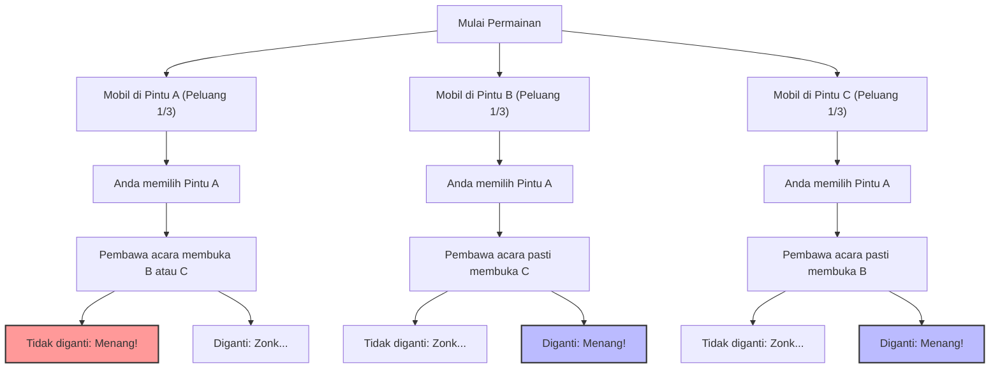
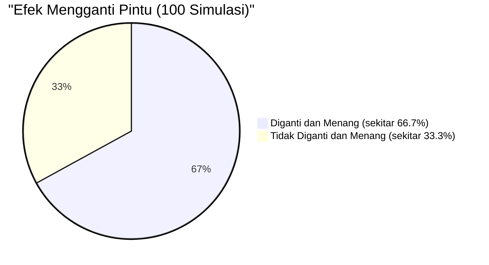

## 1. Panggungnya adalah Acara Kuis Televisi: Apa yang Akan Anda Lakukan?

Pada tahun 1990, sebuah kolom "Ask Marilyn" di majalah berita Amerika, *Parade*, menerima pertanyaan berikut dari seorang pembaca:

> Anda adalah peserta di sebuah acara kuis televisi. Di depan Anda ada **3 pintu (A, B, C)**.
> Di belakang 1 pintu terdapat **mobil baru (hadiah utama)**, dan di belakang 2 pintu lainnya terdapat **kambing (zonk/kosong)**.
> 
> 1. Pertama, Anda memilih **Pintu A**.
> 2. Kemudian, pembawa acara, Monty Hall, yang tahu di mana letak mobil baru itu, membuka **Pintu B** yang berisi kambing dari sisa pintu yang ada.
> 3. Monty lalu berkata kepada Anda, **"Sekarang, Anda boleh mengganti pilihan Anda ke Pintu C. Bagaimana?"**
> 
> Pertanyaannya, haruskah Anda **mengganti pilihan pintu Anda?**

Secara intuitif, kita mungkin berpikir, "Pintu yang tersisa adalah A dan C. Karena letak mobil baru di antara keduanya sepenuhnya acak, peluang untuk menang di masing-masing pintu adalah $\frac{1}{2}$ (50%). Jadi, mengganti atau tidak mengganti sama saja."

Namun, kolumnis Marilyn vos Savant (diakui oleh Guinness Book of Records sebagai orang dengan IQ tertinggi) menjawab, **"Anda harus mengganti pilihan. Jika Anda mengganti pilihan, peluang Anda untuk menang menjadi dua kali lipat."**

Jawaban ini menimbulkan sensasi di seluruh Amerika dan memicu sekitar 10.000 surat protes (sekitar 1.000 di antaranya dari para akademisi bergelar Ph.D. di bidang matematika). Itu adalah badai kritik tajam seperti, "Anda tidak memahami dasar-dasar probabilitas," dan "Itu logika wanita."
Namun, kesimpulannya, **jawaban Marilyn sepenuhnya benar secara matematis**.

---

## 2. Kesenjangan antara Intuisi dan Matematika: Melihat Percabangan Probabilitas dengan Mermaid

Mengapa intuisi kita keliru dan berpikir bahwa peluangnya adalah "$\frac{1}{2}$"?
Pertama-tama, mari kita visualisasikan semua pola dalam permainan ini.

Jika kita berasumsi bahwa Anda memilih "Pintu A", 3 skenario berikut akan terjadi dengan peluang yang sama ($\frac{1}{3}$).

1. **Skenario 1 (Mobil di A):** Pembawa acara membuka B atau C yang berisi kambing. Jika Anda mengganti pilihan pintu, Anda **kalah**.
2. **Skenario 2 (Mobil di B):** Pembawa acara hanya bisa membuka C yang berisi kambing. Jika Anda mengganti pilihan pintu, Anda **menang**.
3. **Skenario 3 (Mobil di C):** Pembawa acara hanya bisa membuka B yang berisi kambing. Jika Anda mengganti pilihan pintu, Anda **menang**.

Artinya, dalam 2 dari 3 kasus (Skenario 2 dan 3), Anda berada dalam kondisi **"pasti menang jika mengganti pilihan pintu"**.
Oleh karena itu, peluang kemenangan jika Anda mengganti pilihan pintu adalah $\frac{2}{3}$, yang merupakan **dua kali lipat** dari peluang kemenangan $\frac{1}{3}$ jika Anda tidak mengganti pilihan.

---

## 3. Bukti Ketat menggunakan Teorema Bayes

Untuk menyelesaikan masalah ini secara matematis dengan ketat, kita menggunakan "Teorema Bayes" untuk menghitung probabilitas bersyarat.

$$ P(H|E) = \frac{P(E|H) P(H)}{P(E)} $$

Di sini, kita mendefinisikan kejadian-kejadian sebagai berikut:
- $C_A, C_B, C_C$ : Kejadian di mana mobil baru berada di Pintu A, B, dan C berturut-turut. Probabilitas prior adalah $P(C_A) = P(C_B) = P(C_C) = \frac{1}{3}$
- Asumsikan Anda pertama kali memilih **Pintu A**.
- $M_B$ : Kejadian di mana pembawa acara membuka **Pintu B** yang berisi kambing.

Yang ingin kita cari adalah probabilitas posterior $P(C_C|M_B)$, yaitu "probabilitas mobil berada di Pintu C dengan syarat pembawa acara telah membuka Pintu B".

Pertama-tama, kita pertimbangkan probabilitas pembawa acara membuka Pintu B, yaitu $P(M_B|C_X)$, tergantung di mana mobil berada.

1. **Jika mobil ada di Pintu A ($C_A$)**
   Pembawa acara dapat membuka B atau C secara acak.
   $$ P(M_B|C_A) = \frac{1}{2} $$

2. **Jika mobil ada di Pintu B ($C_B$)**
   Pembawa acara tidak dapat membuka pintu yang berisi mobil, jadi probabilitas dia membuka B adalah nol.
   $$ P(M_B|C_B) = 0 $$

3. **Jika mobil ada di Pintu C ($C_C$)**
   Pembawa acara tidak dapat membuka A (pilihan Anda) dan C (berisi mobil), jadi dia pasti harus membuka B.
   $$ P(M_B|C_C) = 1 $$

Selanjutnya, kita cari probabilitas total pembawa acara membuka Pintu B, $P(M_B)$, dengan menggunakan "Teorema Probabilitas Total".

$$ P(M_B) = P(M_B|C_A)P(C_A) + P(M_B|C_B)P(C_B) + P(M_B|C_C)P(C_C) $$
$$ P(M_B) = \left(\frac{1}{2} \times \frac{1}{3}\right) + \left(0 \times \frac{1}{3}\right) + \left(1 \times \frac{1}{3}\right) = \frac{1}{6} + 0 + \frac{1}{3} = \frac{1}{2} $$

Sekarang, kita terapkan Teorema Bayes untuk menghitung probabilitas posterior untuk Pintu A dan Pintu C.

**Probabilitas mobil berada di Pintu A (jika tidak mengganti pilihan):**
$$ P(C_A|M_B) = \frac{P(M_B|C_A) P(C_A)}{P(M_B)} = \frac{\frac{1}{2} \times \frac{1}{3}}{\frac{1}{2}} = \frac{1}{3} $$

**Probabilitas mobil berada di Pintu C (jika mengganti pilihan):**
$$ P(C_C|M_B) = \frac{P(M_B|C_C) P(C_C)}{P(M_B)} = \frac{1 \times \frac{1}{3}}{\frac{1}{2}} = \frac{2}{3} $$

Bukti matematis ini juga menunjukkan dengan jelas bahwa **"peluang untuk menang menjadi dua kali lipat (2/3) jika mengganti pintu"**.

---

## 4. Bias Kognitif: Nilai Informasi dari "Pengkondisian"

Mengapa begitu banyak ahli matematika jenius bahkan salah dalam menjawab pertanyaan ini secara intuitif?
Jawabannya terletak pada "bias equiprobabilitas" dan "kegagalan memperbarui informasi" yang tertanam dalam otak manusia.

### 4.1. Bias Equiprobabilitas (Equiprobability Bias)
Manusia cenderung secara tidak sadar mengasumsikan bahwa "probabilitas pilihan yang tersisa selalu merata" ketika dihadapkan pada opsi yang tidak diketahui.
Saat melihat hanya dua pintu yang tersisa, otak secara otomatis melabelinya sebagai "$50\%$ : $50\%$".

### 4.2. Informasi Berupa "Niat" Pembawa Acara
Alasan utama intuisi kita salah adalah karena kita mengabaikan fakta bahwa **tindakan pembawa acara tidak acak**.
Jika aturannya adalah "Pembawa acara membuka pintu secara acak tanpa tahu di mana letak mobil, dan kebetulan itu adalah kambing" (dikenal sebagai Monty Fall problem), maka probabilitas Pintu A dan Pintu C keduanya akan menjadi $\frac{1}{2}$.

Namun, dalam Masalah Monty Hall yang sebenarnya, pembawa acara bertindak di bawah batasan ketat berikut:
1. Pintu yang dipilih peserta tidak dapat dibuka.
2. Pintu yang menyembunyikan mobil tidak dapat dibuka.

Karena batasan ini, tindakan pembawa acara "membuka Pintu B" itu sendiri memberi kita **informasi yang sangat besar tentang Pintu C**. Pesan tersiratnya adalah, "Saya tidak bisa membuka Pintu C (karena ada mobil di baliknya)."

---

## 5. Mengoreksi Intuisi dengan Contoh Ekstrem

Jika Anda masih belum yakin, mari tingkatkan jumlah pintu menjadi **1 juta**.

1. Anda memilih **Pintu 1** dari 1 juta pintu. (Peluang menang adalah $\frac{1}{1,000,000}$)
2. Pembawa acara yang maha tahu **membuka 999.998 pintu** yang berisi kambing dari 999.999 pintu yang tersisa.
3. Pintu yang masih tertutup hanyalah "Pintu 1" yang Anda pilih, dan "Pintu 777.777" yang sengaja disisakan oleh pembawa acara.

Nah, apakah Anda akan mengganti pilihan?
Dalam kasus ini, jika Anda percaya bahwa Anda berhasil menarik keajaiban "1 banding 1 juta" pada percobaan pertama, maka Anda tidak boleh mengganti. Namun secara realistis, Anda akan secara intuitif memahami bahwa peluang mobil berada di **"satu-satunya pintu yang tidak bisa dibuka oleh pembawa acara"** adalah $\frac{999,999}{1,000,000}$.

Masalah Monty Hall (3 pintu) hanyalah fenomena yang sama namun disajikan dalam skala yang lebih kecil daripada "1 juta pintu" ini.

## 6. Kesimpulan: Pelajaran Bisnis dan Kehidupan dari Teori Probabilitas

Masalah Monty Hall melampaui sekadar kuis dan memberi kita pelajaran berharga.

1. **Intuisi sering kali salah**: Otak manusia belum berevolusi untuk memproses probabilitas bersyarat yang kompleks secara intuitif. Sangat berbahaya untuk mengandalkan intuisi saja dalam pengambilan keputusan yang penting.
2. **Memperbarui probabilitas dengan informasi baru (Pembaruan Bayesian)**: Ketika situasi berubah dan informasi baru diberikan (seperti pintu mana yang dibuka pembawa acara), kunci kesuksesan adalah kemampuan untuk memperbarui probabilitas dan strategi secara fleksibel tanpa terpaku pada pemikiran yang sudah ada.

Keputusan kecil untuk "mengganti pintu" mungkin saja melipatgandakan peluang Anda untuk mendapatkan "mobil baru" dalam hidup Anda.
