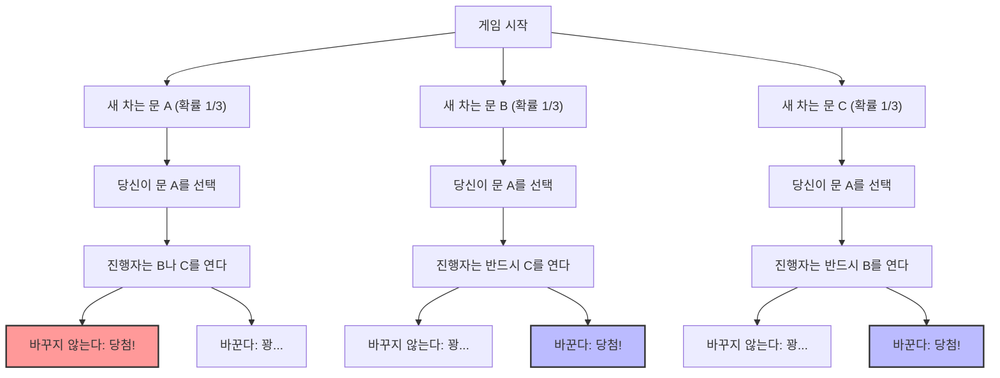
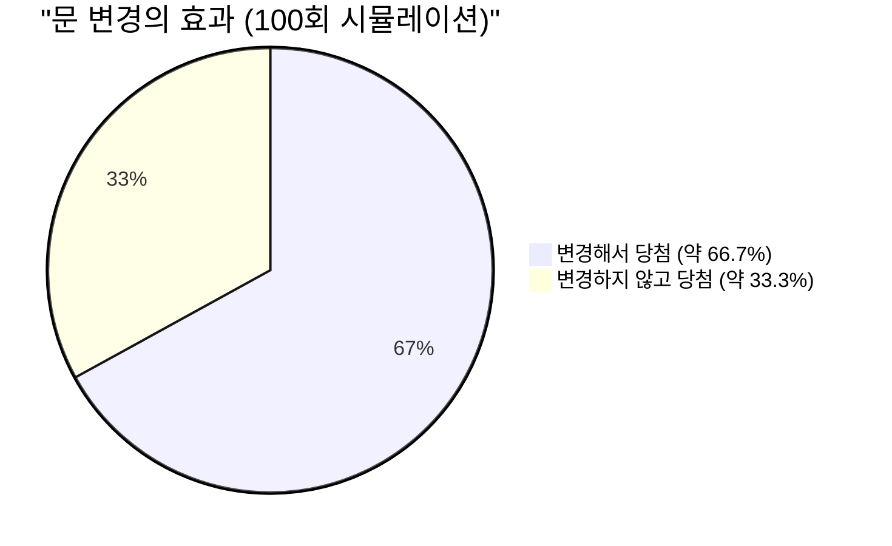

## 1. 무대는 TV 퀴즈 프로그램: 당신이라면 어떻게 하겠습니까?

1990년, 미국의 뉴스 잡지 『Parade』의 칼럼 "Ask Marilyn(마릴린에게 물어보세요)"에 한 독자로부터 다음과 같은 질문이 도착했습니다.

> 당신은 TV 게임 프로그램의 참가자입니다. 눈앞에 **3개의 문(A, B, C)**이 있습니다.
> 1개의 문 뒤에는 **새 차(당첨)**가, 나머지 2개의 문 뒤에는 **염소(꽝)**가 있습니다.
> 
> 1. 당신은 먼저 **문 A**를 선택했습니다.
> 2. 그러자 어떤 문에 새 차가 있는지 알고 있는 진행자 몬티 홀이 남은 문 중에서 염소가 있는 **문 B**를 열었습니다.
> 3. 몬티는 당신에게 이렇게 말합니다. **"지금이라면 문 C로 바꿔도 됩니다. 어떻게 하시겠습니까?"**
> 
> 과연, 당신은 **문을 바꿔야 할까요?**

직관적으로는 "남은 문은 A와 C 2개. 새 차가 어느 쪽에 있는지는 완전히 무작위이므로 당첨 확률은 어느 쪽이든 $\frac{1}{2}$(50%). 그러니까 바꾸든 바꾸지 않든 똑같다"라고 생각하기 쉽습니다.

하지만, 칼럼니스트 마릴린 보스 사반트(기네스북에서 가장 IQ가 높은 인물로 인정받은 사람)는 **"바꿔야 합니다. 바꾸면 당첨 확률이 2배가 됩니다"**라고 답변했습니다.

이 답변은 전미에 센세이션을 불러일으켰고, 약 1만 통의 항의 편지(그중 약 1000통은 수학 박사 학위를 가진 학자들로부터)가 쇄도했습니다. "당신은 확률의 기본을 이해하지 못하고 있다", "여성의 논리다"와 같은 신랄한 비판의 폭풍이었습니다.
하지만 결론부터 말하자면, **마릴린의 답변은 수학적으로 완전히 옳았습니다**.

---

## 2. 직관과 수학의 괴리: Mermaid로 보는 확률의 분기

왜 우리의 직관은 "$\frac{1}{2}$"이라고 착각해버리는 걸까요?
먼저 게임의 모든 패턴을 시각화해 보겠습니다.

당신이 "문 A"를 선택했다고 가정할 경우, 다음의 3가지 시나리오가 동일한 확률($\frac{1}{3}$)로 발생합니다.

1. **시나리오 1(새 차가 A):** 진행자는 염소가 있는 B나 C를 엽니다. 문을 바꾸면 **꽝**.
2. **시나리오 2(새 차가 B):** 진행자는 염소가 있는 C밖에 열 수 없습니다. 문을 바꾸면 **당첨**.
3. **시나리오 3(새 차가 C):** 진행자는 염소가 있는 B밖에 열 수 없습니다. 문을 바꾸면 **당첨**.

즉, 3번 중 2번(시나리오 2와 3)은 **"문을 바꾸면 반드시 당첨되는"** 상태가 되는 것입니다.
따라서 문을 바꿨을 때의 승률은 $\frac{2}{3}$가 되며, 바꾸지 않았을 때의 승률 $\frac{1}{3}$의 **2배**가 됩니다.

---

## 3. 베이즈 정리에 의한 엄밀한 증명

수학적으로 이 문제를 엄밀하게 풀기 위해서는 조건부 확률을 계산하는 '베이즈 정리'를 사용합니다.

$$ P(H|E) = \frac{P(E|H) P(H)}{P(E)} $$

여기서 사건을 다음과 같이 정의합니다.
- $C_A, C_B, C_C$ : 각각 문 A, B, C에 새 차가 있는 사건. 사전 확률은 $P(C_A) = P(C_B) = P(C_C) = \frac{1}{3}$
- 당신은 처음에 **문 A**를 선택했다고 합시다.
- $M_B$ : 진행자가 염소가 있는 **문 B**를 여는 사건.

우리가 구하고 싶은 것은 "진행자가 문 B를 열었다는 조건 하에, 문 C에 새 차가 있을 확률", 즉 사후 확률 $P(C_C|M_B)$입니다.

먼저, 새 차가 어디에 있는지에 따라 진행자가 문 B를 열 확률 $P(M_B|C_X)$를 생각해보겠습니다.

1. **새 차가 문 A에 있는 경우 ($C_A$)**
   진행자는 B나 C를 무작위로 열 수 있습니다.
   $$ P(M_B|C_A) = \frac{1}{2} $$

2. **새 차가 문 B에 있는 경우 ($C_B$)**
   진행자는 새 차가 있는 문을 열 수 없으므로 B를 열 확률은 0입니다.
   $$ P(M_B|C_B) = 0 $$

3. **새 차가 문 C에 있는 경우 ($C_C$)**
   진행자는 A(당신이 선택한)와 C(새 차가 있는)를 열 수 없으므로 필연적으로 B를 열 수밖에 없습니다.
   $$ P(M_B|C_C) = 1 $$

다음으로, 진행자가 문 B를 열 전체 확률 $P(M_B)$를 '전체 확률의 법칙'으로부터 구합니다.

$$ P(M_B) = P(M_B|C_A)P(C_A) + P(M_B|C_B)P(C_B) + P(M_B|C_C)P(C_C) $$
$$ P(M_B) = \left(\frac{1}{2} \times \frac{1}{3}\right) + \left(0 \times \frac{1}{3}\right) + \left(1 \times \frac{1}{3}\right) = \frac{1}{6} + 0 + \frac{1}{3} = \frac{1}{2} $$

드디어 베이즈 정리를 적용하여 문 A와 문 C의 사후 확률을 계산합니다.

**문 A(바꾸지 않을 경우)에 새 차가 있을 확률:**
$$ P(C_A|M_B) = \frac{P(M_B|C_A) P(C_A)}{P(M_B)} = \frac{\frac{1}{2} \times \frac{1}{3}}{\frac{1}{2}} = \frac{1}{3} $$

**문 C(바꿀 경우)에 새 차가 있을 확률:**
$$ P(C_C|M_B) = \frac{P(M_B|C_C) P(C_C)}{P(M_B)} = \frac{1 \times \frac{1}{3}}{\frac{1}{2}} = \frac{2}{3} $$

수식을 통한 증명에서도 **"문을 바꾸는 편이 당첨 확률이 2배(2/3)가 된다"**는 것이 명확하게 나타났습니다.

---

## 4. 인지 편향: '조건화'라는 정보의 가치

왜 수많은 천재 수학자들조차 이 문제를 직관적으로 틀려버렸을까요?
거기에는 인간의 뇌에 내재된 '등확률 편향'과 '정보 업데이트의 실패'가 있습니다.

### 4.1. 등확률 편향 (Equiprobability Bias)
인간은 미지의 선택지가 주어졌을 때, '남은 선택지의 확률은 항상 균등하다'라고 무의식적으로 할당해버리는 성질이 있습니다.
문이 2개 남은 것을 본 순간, 뇌는 자동으로 "$50\%$ : $50\%$"라고 라벨링 해버리는 것입니다.

### 4.2. 진행자의 '의도'라는 정보
직관이 틀리는 가장 큰 이유는 **진행자의 행동이 무작위가 아니라는 것**을 간과하는 데 있습니다.
만약 진행자가 "새 차가 어디 있는지 모르고 무작위로 문을 열었는데, 우연히 염소였다"는 규칙(몬티 폴 문제라고 불립니다)이라면, 문 A와 문 C의 확률은 모두 $\frac{1}{2}$이 됩니다.

하지만 실제 몬티 홀 문제에서는 진행자가 다음과 같은 엄격한 제약을 받으며 행동합니다.
1. 참가자가 선택한 문은 열 수 없다.
2. 새 차가 있는 문은 열 수 없다.

이 제약으로 인해 진행자가 "문 B를 열었다"는 행위 자체가, **문 C에 관한 거대한 정보**를 우리에게 제공하고 있는 것입니다. "나는 문 C를 열 수 없었다(왜냐하면 거기에 새 차가 있으니까)"라는 무언의 메시지가 담겨 있는 셈입니다.

---

## 5. 극단적인 예로 직관 교정하기

아직도 납득이 가지 않는다면 문의 수를 **100만 개**로 늘려봅시다.

1. 당신은 100만 개의 문 중에서 **문 1**을 선택했습니다. (당첨될 확률은 $\frac{1}{1,000,000}$)
2. 모든 것을 알고 있는 진행자가 남은 99만 9999개의 문 중에서 염소가 있는 **99만 9998개의 문을 전부 열어** 버렸습니다.
3. 닫혀 있는 것은 당신이 선택한 "문 1"과 진행자가 일부러 남긴 "문 777,777"뿐입니다.

자, 바꾸시겠습니까?
이 경우 당신이 처음에 "100만 분의 1"의 기적을 뽑았다고 믿는다면 바꾸지 말아야 합니다. 하지만 현실적으로 **"진행자가 절대 열 수 없었던 단 1개의 문"**에 새 차가 있을 확률이 $\frac{999,999}{1,000,000}$이라는 것은 직관적으로 이해할 수 있을 것입니다.

몬티 홀 문제(3개의 문)는 단지 이 "100만 개의 문"의 스케일을 작게 만든 현상일 뿐입니다.

## 6. 요약: 확률론이 가르쳐주는 비즈니스와 인생의 교훈

몬티 홀 문제는 단순한 퀴즈의 틀을 넘어 우리에게 중요한 교훈을 알려줍니다.

1. **직관은 종종 틀린다**: 인간의 뇌는 복잡한 조건부 확률을 직관적으로 처리하도록 진화하지 않았습니다. 중요한 의사 결정에서 직관만으로 판단하는 단독 행동은 위험합니다.
2. **새로운 정보로 확률을 업데이트한다(베이즈 업데이트)**: 상황이 변하고 새로운 정보(진행자가 어떤 문을 열었는지 등)가 주어졌을 때, 기존의 생각에 고집하지 않고 확률이나 전략을 유연하게 업데이트할 수 있는지가 성공의 열쇠가 됩니다.

"문을 바꾼다"는 작은 결단이 당신 인생의 "새 차"를 손에 넣을 확률을 2배로 만들어줄지도 모릅니다.
