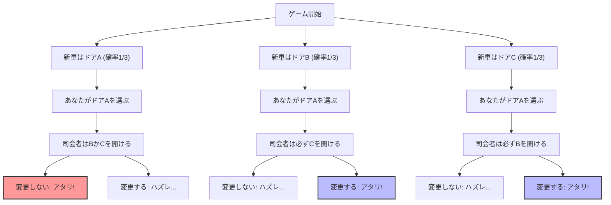
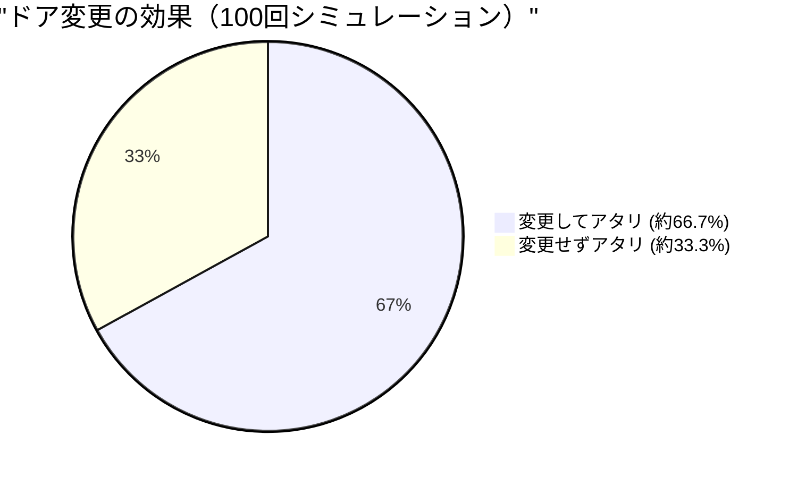

## 1. 舞台はテレビのクイズ番組：あなたならどうする？

1990年、アメリカのニュース雑誌『Parade』のコラム「Ask Marilyn（マリリンに聞いてみよう）」に、ある読者から次のような質問が寄せられました。

> あなたはテレビのゲーム番組の参加者です。目の前に **3つのドア (A, B, C)** があります。
> 1つのドアの後ろには**新車（アタリ）**が、残り2つのドアの後ろには**ヤギ（ハズレ）**がいます。
> 
> 1. あなたはまず、**ドアA** を選びました。
> 2. すると、どのドアに新車があるかを知っている司会者のモンティ・ホールが、残りのドアのうちヤギがいる**ドアB** を開けました。
> 3. モンティはあなたにこう言います。**「今ならドアCに変更してもいいですよ。どうしますか？」**
> 
> 果たして、あなたは**ドアを変更するべきでしょうか？**

直感的には「残ったドアはAとCの2つ。新車がどちらにあるかは完全にランダムなのだから、当たる確率はどちらも $\frac{1}{2}$（50%）。だから変更しても変更しなくても同じ」と思えます。

しかし、コラムニストのマリリン・ボス サバント（ギネスブックで最も高いIQを持つと認定された人物）は、**「変更すべきです。変更すれば当たる確率は2倍になります」** と回答しました。

この回答は全米にセンセーションを巻き起こし、約1万通もの抗議の手紙（そのうち約1000通は数学の博士号を持つ学者から）が殺到しました。「あなたは確率の基本を理解していない」「女性の論理だ」といった辛辣な批判の嵐です。
しかし、結論から言えば、**マリリンの回答は数学的に完全に正しかった**のです。

---

## 2. 直感と数学のズレ：Mermaidで見る確率の分岐

なぜ私たちの直感は「$\frac{1}{2}$」だと錯覚してしまうのでしょうか？
まずは、ゲームのすべてのパターンを可視化してみましょう。

あなたが「ドアA」を選んだと仮定した場合、以下の3つのシナリオが等確率（$\frac{1}{3}$）で発生します。

1. **シナリオ1（新車がA）：** 司会者はヤギがいるBかCを開ける。ドアを変更すると**ハズレ**。
2. **シナリオ2（新車がB）：** 司会者はヤギがいるCしか開けられない。ドアを変更すると**アタリ**。
3. **シナリオ3（新車がC）：** 司会者はヤギがいるBしか開けられない。ドアを変更すると**アタリ**。

つまり、3回のうち2回（シナリオ2と3）は**「ドアを変更すれば必ず当たる」**状態になっているのです。
したがって、ドアを変更した場合の勝率は $\frac{2}{3}$ となり、変更しなかった場合の勝率 $\frac{1}{3}$ の**2倍**になります。

---

## 3. ベイズの定理による厳密な証明

数学的にこの問題を厳密に解くためには、条件付き確率を計算する「ベイズの定理」を用います。

$$ P(H|E) = \frac{P(E|H) P(H)}{P(E)} $$

ここで、事象を次のように定義します。
- $C_A, C_B, C_C$ : それぞれドアA, B, Cに新車がある事象。事前確率は $P(C_A) = P(C_B) = P(C_C) = \frac{1}{3}$
- あなたは最初に**ドアA**を選んだとします。
- $M_B$ : 司会者がヤギのいる**ドアB**を開ける事象。

私たちが求めたいのは、「司会者がドアBを開けたという条件のもとで、ドアCに新車がある確率」すなわち事後確率 $P(C_C|M_B)$ です。

まず、新車がどこにあるかによって、司会者がドアBを開ける確率 $P(M_B|C_X)$ を考えます。

1. **新車がドアAにある場合 ($C_A$)**
   司会者はBかCをランダムに開けることができます。
   $$ P(M_B|C_A) = \frac{1}{2} $$

2. **新車がドアBにある場合 ($C_B$)**
   司会者は新車のあるドアを開けられないため、Bを開ける確率はゼロです。
   $$ P(M_B|C_B) = 0 $$

3. **新車がドアCにある場合 ($C_C$)**
   司会者はA（あなたが選んだ）とC（新車がある）を開けられないため、必然的にBを開けるしかありません。
   $$ P(M_B|C_C) = 1 $$

次に、司会者がドアBを開ける全確率 $P(M_B)$ を「全確率の定理」から求めます。

$$ P(M_B) = P(M_B|C_A)P(C_A) + P(M_B|C_B)P(C_B) + P(M_B|C_C)P(C_C) $$
$$ P(M_B) = \left(\frac{1}{2} \times \frac{1}{3}\right) + \left(0 \times \frac{1}{3}\right) + \left(1 \times \frac{1}{3}\right) = \frac{1}{6} + 0 + \frac{1}{3} = \frac{1}{2} $$

いよいよベイズの定理を適用して、ドアAとドアCの事後確率を計算します。

**ドアA（変更しない場合）に新車がある確率：**
$$ P(C_A|M_B) = \frac{P(M_B|C_A) P(C_A)}{P(M_B)} = \frac{\frac{1}{2} \times \frac{1}{3}}{\frac{1}{2}} = \frac{1}{3} $$

**ドアC（変更する場合）に新車がある確率：**
$$ P(C_C|M_B) = \frac{P(M_B|C_C) P(C_C)}{P(M_B)} = \frac{1 \times \frac{1}{3}}{\frac{1}{2}} = \frac{2}{3} $$

数式による証明でも、**「ドアを変更した方が当たる確率が2倍（2/3）になる」**ことが明確に示されました。

---

## 4. 認知バイアス：「条件付け」という情報の価値

なぜ多くの天才数学者たちでさえ、この問題を直感的に間違えてしまったのでしょうか。
そこには人間の脳に組み込まれた「等確率バイアス」と「情報のアップデートの失敗」があります。

### 4.1. 等確率バイアス (Equiprobability Bias)
人間は、未知の選択肢が与えられたとき、「残った選択肢の確率は常に均等である」と無意識に割り当ててしまう性質があります。
ドアが2つ残っているのを見た瞬間、脳は自動的に「$50\%$ : $50\%$」とラベリングしてしまうのです。

### 4.2. 司会者の「意図」という情報
直感が間違う最大の理由は、**司会者の行動がランダムではない**ことを見落とす点にあります。
もし、司会者が「新車がどこにあるか知らずに、ランダムにドアを開けたら、たまたまヤギだった」というルール（モンティ・フォール問題と呼ばれます）であれば、ドアAとドアCの確率はどちらも $\frac{1}{2}$ になります。

しかし実際のモンティ・ホール問題では、司会者は以下の厳しい制約を受けて行動しています。
1. 参加者が選んだドアは開けられない。
2. 新車がいるドアは開けられない。

この制約により、司会者が「ドアBを開けた」という行為自体が、**ドアCに関する巨大な情報**を私たちに与えているのです。「私はドアCを開けられなかった（なぜならそこに新車があるからだ）」という無言のメッセージが込められているわけです。

---

## 5. 極端な例で直感を矯正する

まだ納得できない場合は、ドアの数を **100万枚** に増やしてみましょう。

1. あなたは 100万枚のドアの中から、**ドア1** を選びました。（当たる確率は $\frac{1}{1,000,000}$）
2. 全てを知っている司会者が、残りの99万9999枚のドアのうち、ヤギがいる **99万9998枚のドアを全て開けて** しまいました。
3. 閉まっているのは、あなたが選んだ「ドア1」と、司会者がわざと残した「ドア777,777」だけです。

さて、変更しますか？
この場合、あなたが最初に「100万分の1」の奇跡を引き当てていたと信じるなら、変更すべきではありません。しかし、現実的には**「司会者が絶対に開けられなかったたった1つのドア」**に新車がある確率が $\frac{999,999}{1,000,000}$ であることは直感的に理解できるでしょう。

モンティ・ホール問題（3枚のドア）は、単にこの「100万枚のドア」のスケールを小さくしただけの現象なのです。

## 6. まとめ：確率論が教えるビジネスと人生の教訓

モンティ・ホール問題は、単なるクイズの枠を超えて、私たちに重要な教訓を教えてくれます。

1. **直感はしばしば間違える**：人間の脳は、複雑な条件付き確率を直感的に処理するようには進化していません。重要な意思決定において、直感だけで判断するのは危険です。
2. **新しい情報で確率を更新する（ベイズ更新）**：状況が変化し、新しい情報（司会者がどのドアを開けたか等）がもたらされたとき、既存の考えに固執せず、確率や戦略を柔軟にアップデートできるかどうかが成功の鍵となります。

「ドアを変更する」という小さな決断が、あなたの人生の「新車」を手に入れる確率を2倍にするかもしれません。