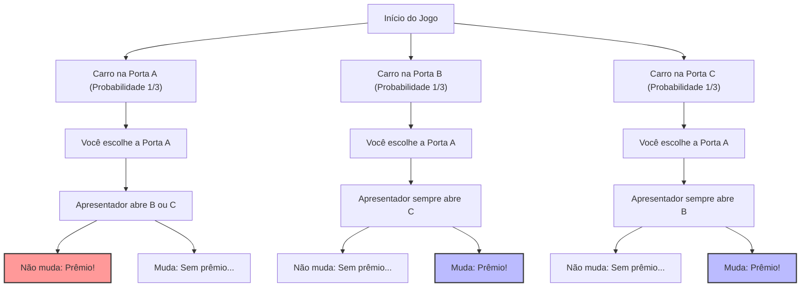
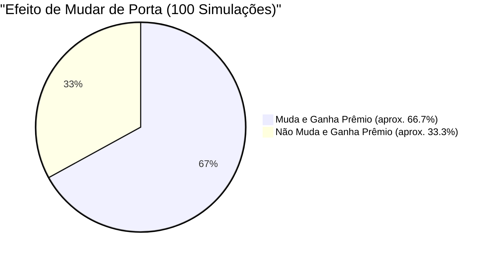

## 1. O Cenário é um Programa de TV de Perguntas: O Que Você Faria?

Em 1990, na coluna "Ask Marilyn" da revista americana de notícias "Parade", um leitor enviou a seguinte pergunta:

> Você é um participante em um programa de TV. Há **3 portas (A, B, C)** à sua frente.
> Atrás de uma das portas há um **carro novo (prêmio)**, e atrás das outras duas portas há **cabras (sem prêmio)**.
> 
> 1. Primeiro, você escolhe a **porta A**.
> 2. Então, o apresentador, Monty Hall, que sabe onde está o carro novo, abre a **porta B** revelando uma cabra.
> 3. Monty então diz a você: **"Se quiser, pode mudar para a porta C agora. O que você faz?"**
> 
> Afinal, você **deve mudar de porta?**

Intuitivamente, pensamos: "Restam duas portas, A e C. Como o carro estar em qualquer uma delas é algo completamente aleatório, a probabilidade de acertar é de $\frac{1}{2}$ (50%) para ambas. Portanto, mudar ou não mudar dá no mesmo".

No entanto, a colunista Marilyn vos Savant (reconhecida pelo Guinness Book of Records como a pessoa com o QI mais alto) respondeu: **"Você deve mudar. Se você mudar, suas chances de ganhar dobram."**

Essa resposta causou sensação em todos os Estados Unidos, e cerca de 10.000 cartas de protesto (sendo cerca de 1.000 de acadêmicos com doutorado em matemática) a inundaram. Foi uma tempestade de críticas severas, como "Você não entende o básico de probabilidade" e "Isso é a lógica das mulheres".
Mas, indo direto ao ponto, **a resposta de Marilyn estava matematicamente correta**.

---

## 2. A Discrepância Entre a Intuição e a Matemática: A Bifurcação das Probabilidades Visualizada no Mermaid

Por que nossa intuição nos engana e nos faz pensar que é "$\frac{1}{2}$"?
Primeiro, vamos visualizar todos os padrões do jogo.

Assumindo que você escolheu a "Porta A", os três cenários a seguir ocorrem com probabilidades iguais ($\frac{1}{3}$).

1. **Cenário 1 (Carro em A):** O apresentador abre B ou C, onde há cabras. Mudar de porta significa ficar **sem prêmio**.
2. **Cenário 2 (Carro em B):** O apresentador só pode abrir C, que tem uma cabra. Mudar de porta significa ganhar o **prêmio**.
3. **Cenário 3 (Carro em C):** O apresentador só pode abrir B, que tem uma cabra. Mudar de porta significa ganhar o **prêmio**.

Em outras palavras, em 2 de 3 vezes (Cenários 2 e 3), **"mudar a porta garante uma vitória"**.
Portanto, a probabilidade de ganhar se você mudar de porta é $\frac{2}{3}$, o que é o **dobro** da probabilidade de $\frac{1}{3}$ se você não mudar.

---

## 3. Prova Rigorosa Através do Teorema de Bayes

Para resolver esse problema rigorosamente de forma matemática, usamos o "Teorema de Bayes" para calcular a probabilidade condicional.

$$ P(H|E) = \frac{P(E|H) P(H)}{P(E)} $$

Aqui, definimos os eventos da seguinte forma:
- $C_A, C_B, C_C$ : Eventos em que o carro está nas portas A, B e C, respectivamente. As probabilidades a priori são $P(C_A) = P(C_B) = P(C_C) = \frac{1}{3}$
- Suponha que você escolheu inicialmente a **porta A**.
- $M_B$ : O evento onde o apresentador abre a **porta B** com a cabra.

O que queremos encontrar é "a probabilidade do carro estar na porta C, dado que o apresentador abriu a porta B", ou seja, a probabilidade a posteriori $P(C_C|M_B)$.

Primeiro, considere a probabilidade do apresentador abrir a porta B $P(M_B|C_X)$ dependendo de onde o carro está.

1. **Se o carro estiver na porta A ($C_A$)**
   O apresentador pode abrir B ou C aleatoriamente.
   $$ P(M_B|C_A) = \frac{1}{2} $$

2. **Se o carro estiver na porta B ($C_B$)**
   Como o apresentador não pode abrir a porta com o carro novo, a probabilidade de abrir B é zero.
   $$ P(M_B|C_B) = 0 $$

3. **Se o carro estiver na porta C ($C_C$)**
   Como o apresentador não pode abrir A (que você escolheu) e C (onde está o carro), ele deve abrir B.
   $$ P(M_B|C_C) = 1 $$

A seguir, encontramos a probabilidade total de o apresentador abrir a porta B, $P(M_B)$, usando o "Teorema da Probabilidade Total".

$$ P(M_B) = P(M_B|C_A)P(C_A) + P(M_B|C_B)P(C_B) + P(M_B|C_C)P(C_C) $$
$$ P(M_B) = \left(\frac{1}{2} \times \frac{1}{3}\right) + \left(0 \times \frac{1}{3}\right) + \left(1 \times \frac{1}{3}\right) = \frac{1}{6} + 0 + \frac{1}{3} = \frac{1}{2} $$

Finalmente, aplicamos o Teorema de Bayes para calcular as probabilidades a posteriori das portas A e C.

**Probabilidade do carro estar na porta A (caso você não mude):**
$$ P(C_A|M_B) = \frac{P(M_B|C_A) P(C_A)}{P(M_B)} = \frac{\frac{1}{2} \times \frac{1}{3}}{\frac{1}{2}} = \frac{1}{3} $$

**Probabilidade do carro estar na porta C (caso você mude):**
$$ P(C_C|M_B) = \frac{P(M_B|C_C) P(C_C)}{P(M_B)} = \frac{1 \times \frac{1}{3}}{\frac{1}{2}} = \frac{2}{3} $$

A prova matemática mostra claramente que **"as chances de ganhar dobram (2/3) se você mudar de porta"**.

---

## 4. Viés Cognitivo: O Valor da Informação do "Condicionamento"

Por que até mesmo muitos matemáticos geniais erraram intuitivamente neste problema?
Isso se deve ao "Viés de Equiprobabilidade" e à "Falha na Atualização de Informações" incorporados ao cérebro humano.

### 4.1. Viés de Equiprobabilidade (Equiprobability Bias)
Quando os humanos se deparam com escolhas desconhecidas, eles têm uma tendência subconsciente de assumir que "as probabilidades das opções restantes são sempre iguais".
No momento em que o cérebro vê duas portas restantes, ele automaticamente as rotula como "$50\%$ : $50\%$".

### 4.2. A Informação da "Intenção" do Apresentador
A principal razão pela qual nossa intuição falha é porque ignoramos o fato de que **as ações do apresentador não são aleatórias**.
Se a regra fosse "o apresentador abre uma porta aleatoriamente sem saber onde está o carro, e por acaso é uma cabra" (conhecido como Problema de Monty Fall), a probabilidade para as portas A e C seria $\frac{1}{2}$ para cada.

No entanto, no Problema de Monty Hall real, o apresentador opera sob restrições estritas:
1. Ele não pode abrir a porta escolhida pelo participante.
2. Ele não pode abrir a porta com o carro novo.

Devido a essas restrições, o próprio ato do apresentador "abrir a porta B" nos fornece uma **informação enorme sobre a porta C**. Ele está enviando a mensagem não dita: "Eu não pude abrir a porta C (porque o carro novo está lá)".

---

## 5. Corrigindo a Intuição com um Exemplo Extremo

Se você ainda não está convencido, tente aumentar o número de portas para **1 milhão**.

1. Dentre 1 milhão de portas, você escolhe a **porta 1**. (A chance de ganhar é $\frac{1}{1.000.000}$)
2. O apresentador, que sabe de tudo, abre **999.998 portas** contendo cabras, das 999.999 restantes.
3. As únicas portas fechadas são a "porta 1" que você escolheu e a "porta 777.777" que o apresentador deixou fechada de propósito.

E então, você vai mudar?
Neste caso, a menos que você acredite que acertou o milagre de "1 em 1 milhão" no começo, você deve mudar. Realisticamente, você pode entender intuitivamente que a probabilidade de que o carro novo esteja na **"única porta que o apresentador absolutamente não pôde abrir"** é $\frac{999.999}{1.000.000}$.

O Problema de Monty Hall (3 portas) é simplesmente o mesmo fenômeno deste "1 milhão de portas" em uma escala menor.

## 6. Conclusão: Lições de Vida e Negócios Ensinadas Pela Teoria das Probabilidades

O Problema de Monty Hall vai além de ser apenas um jogo e nos ensina lições importantes.

1. **A intuição costuma falhar**: O cérebro humano não evoluiu para lidar intuitivamente com probabilidades condicionais complexas. Tomar decisões importantes contando apenas com a intuição é perigoso.
2. **Atualize as probabilidades com novas informações (Atualização Bayesiana)**: Quando a situação muda e novas informações são apresentadas (como qual porta o apresentador abriu), a chave para o sucesso é a capacidade de atualizar de forma flexível as probabilidades e estratégias sem se apegar às ideias existentes.

A pequena decisão de "mudar de porta" pode dobrar suas chances de conseguir o "carro novo" de sua vida.
