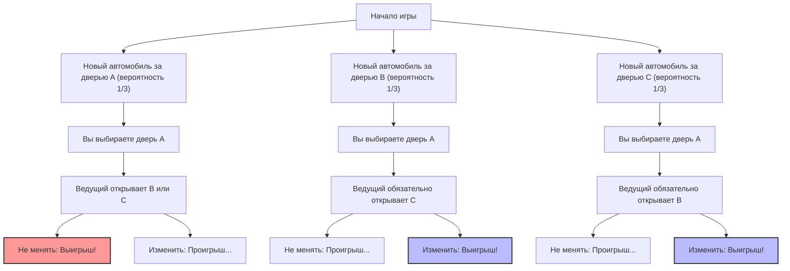
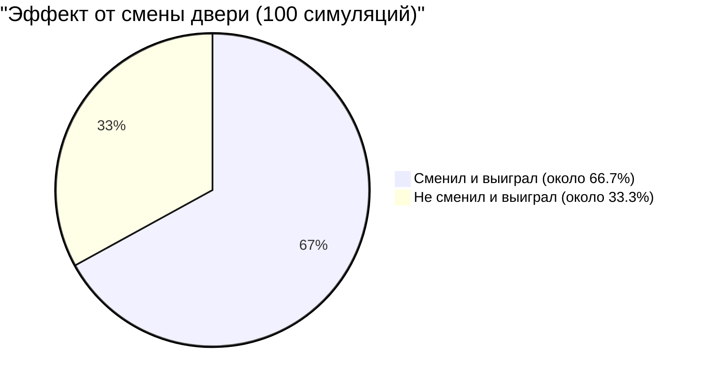

## 1. Место действия — телевикторина: что бы вы сделали?

В 1990 году в колонку "Спросите Мэрилин" (Ask Marilyn) американского новостного журнала "Parade" поступил следующий вопрос от читателя:

> Вы — участник телевизионной игры. Перед вами **3 двери (A, B, C)**.
> За одной из дверей находится **новый автомобиль (выигрыш)**, а за двумя другими — **козы (проигрыш)**.
> 
> 1. Сначала вы выбираете **дверь A**.
> 2. Затем ведущий Монти Холл, который знает, где находится новый автомобиль, открывает из оставшихся дверей **дверь B**, за которой стоит коза.
> 3. Монти говорит вам: **«Теперь вы можете изменить свой выбор на дверь C. Что вы решите?»**
> 
> Итак, **стоит ли вам менять дверь?**

Интуитивно кажется: «Остались 2 двери, A и C. Поскольку новый автомобиль может быть за любой из них с равной случайностью, вероятность выигрыша составляет $\frac{1}{2}$ (50%) для обеих. Поэтому нет никакой разницы, менять выбор или нет».

Однако колумнистка Мэрилин вос Савант (занесенная в Книгу рекордов Гиннесса как обладательница самого высокого IQ) ответила: **«Вам следует изменить выбор. Если вы это сделаете, ваши шансы на выигрыш удвоятся»**.

Этот ответ вызвал сенсацию по всей Америке, и в редакцию обрушилась лавина из примерно 10 000 писем с протестами (из которых около 1000 были от ученых со степенью доктора математики). Это была буря резкой критики вроде «вы не понимаете основ теории вероятностей» или «это женская логика».
Но, забегая вперед, **ответ Мэрилин был математически абсолютно верен**.

---

## 2. Расхождение между интуицией и математикой: Разветвление вероятностей в Mermaid

Почему наша интуиция создает иллюзию вероятности «$\frac{1}{2}$»?
Для начала давайте визуализируем все паттерны игры.

Предполагая, что вы выбрали «дверь A», с равной вероятностью ($\frac{1}{3}$) могут произойти 3 следующих сценария:

1. **Сценарий 1 (Новый автомобиль за A):** Ведущий открывает B или C, где находится коза. Если изменить выбор, то **проигрыш**.
2. **Сценарий 2 (Новый автомобиль за B):** Ведущий может открыть только C, где коза. Если изменить выбор, то **выигрыш**.
3. **Сценарий 3 (Новый автомобиль за C):** Ведущий может открыть только B, где коза. Если изменить выбор, то **выигрыш**.

Другими словами, в 2 случаях из 3 (Сценарии 2 и 3) возникает ситуация, когда **«изменение двери гарантирует выигрыш»**.
Следовательно, вероятность выигрыша при изменении выбора составляет $\frac{2}{3}$, что **в 2 раза** больше вероятности выигрыша $\frac{1}{3}$, если выбор не менять.

---

## 3. Строгое доказательство с помощью теоремы Байеса

Для строгого математического решения этой проблемы мы используем «теорему Байеса», которая вычисляет условную вероятность.

$$ P(H|E) = \frac{P(E|H) P(H)}{P(E)} $$

Здесь мы определяем события следующим образом:
- $C_A, C_B, C_C$ : События, при которых новый автомобиль находится за дверью A, B и C соответственно. Априорные вероятности: $P(C_A) = P(C_B) = P(C_C) = \frac{1}{3}$
- Предположим, что сначала вы выбрали **дверь A**.
- $M_B$ : Событие, при котором ведущий открывает **дверь B** с козой.

То, что мы хотим найти, — это «вероятность того, что новый автомобиль находится за дверью C, при условии, что ведущий открыл дверь B», то есть апостериорную вероятность $P(C_C|M_B)$.

Сначала рассмотрим вероятность $P(M_B|C_X)$ того, что ведущий откроет дверь B, в зависимости от того, где находится машина.

1. **Если новый автомобиль за дверью A ($C_A$)**
   Ведущий может случайно открыть B или C.
   $$ P(M_B|C_A) = \frac{1}{2} $$

2. **Если новый автомобиль за дверью B ($C_B$)**
   Поскольку ведущий не может открыть дверь с автомобилем, вероятность того, что он откроет B, равна нулю.
   $$ P(M_B|C_B) = 0 $$

3. **Если новый автомобиль за дверью C ($C_C$)**
   Поскольку ведущий не может открыть A (которую вы выбрали) и C (где находится машина), ему неизбежно придется открыть B.
   $$ P(M_B|C_C) = 1 $$

Далее мы находим полную вероятность $P(M_B)$ того, что ведущий откроет дверь B, по «формуле полной вероятности».

$$ P(M_B) = P(M_B|C_A)P(C_A) + P(M_B|C_B)P(C_B) + P(M_B|C_C)P(C_C) $$
$$ P(M_B) = \left(\frac{1}{2} \times \frac{1}{3}\right) + \left(0 \times \frac{1}{3}\right) + \left(1 \times \frac{1}{3}\right) = \frac{1}{6} + 0 + \frac{1}{3} = \frac{1}{2} $$

Наконец, мы применяем теорему Байеса для вычисления апостериорной вероятности для дверей A и C.

**Вероятность того, что новый автомобиль находится за дверью A (если не менять выбор):**
$$ P(C_A|M_B) = \frac{P(M_B|C_A) P(C_A)}{P(M_B)} = \frac{\frac{1}{2} \times \frac{1}{3}}{\frac{1}{2}} = \frac{1}{3} $$

**Вероятность того, что новый автомобиль находится за дверью C (если изменить выбор):**
$$ P(C_C|M_B) = \frac{P(M_B|C_C) P(C_C)}{P(M_B)} = \frac{1 \times \frac{1}{3}}{\frac{1}{2}} = \frac{2}{3} $$

Даже математическое доказательство ясно показывает, что **«изменение двери удваивает вероятность выигрыша (2/3)»**.

---

## 4. Когнитивное искажение: Ценность информации под названием «условие»

Почему даже многие гениальные математики интуитивно ошиблись в этой задаче?
Всё дело в заложенных в человеческий мозг «предвзятости к равной вероятности» и «ошибке обновления информации».

### 4.1. Предвзятость к равной вероятности (Equiprobability Bias)
Люди склонны бессознательно предполагать, что «оставшиеся варианты всегда имеют равную вероятность», когда сталкиваются с неизвестными альтернативами.
В тот момент, когда мы видим, что осталось две двери, мозг автоматически маркирует их как «$50\%$ : $50\%$».

### 4.2. Информация о «намерениях» ведущего
Главная причина, по которой интуиция нас подводит, заключается в игнорировании того факта, что **действия ведущего не случайны**.
Если бы правило было таким: «Ведущий не знает, где автомобиль, случайно открывает дверь, и там случайно оказывается коза» (это называется «Проблема Монти Фолла» (Monty Fall problem)), то вероятности для дверей A и C действительно были бы по $\frac{1}{2}$.

Однако в реальной проблеме Монти Холла ведущий действует под строгими ограничениями:
1. Он не может открыть дверь, которую выбрал участник.
2. Он не может открыть дверь, за которой находится новый автомобиль.

Из-за этих ограничений само действие ведущего — «открытие двери B» — дает нам **огромную информацию о двери C**. В этом заключается скрытое послание: «Я не мог открыть дверь C (потому что там находится новый автомобиль)».

---

## 5. Исправление интуиции с помощью экстремального примера

Если вас всё еще не убедили, давайте увеличим количество дверей до **1 миллиона**.

1. Вы выбираете **дверь 1** из 1 миллиона дверей. (Вероятность выигрыша $\frac{1}{1,000,000}$)
2. Всезнающий ведущий открывает **999 998 дверей**, за которыми находятся козы, из оставшихся 999 999 дверей.
3. Закрытыми остаются только ваша «дверь 1» и «дверь 777 777», которую ведущий намеренно оставил.

Ну что, теперь вы поменяете свой выбор?
В этом случае вам не следует менять выбор только если вы верите, что с самого начала вытянули чудо с вероятностью «один на миллион». Но в реальности интуитивно понятно, что вероятность того, что новый автомобиль находится за **«той единственной дверью, которую ведущий ни в коем случае не мог открыть»**, составляет $\frac{999,999}{1,000,000}$.

Проблема Монти Холла (с 3 дверями) — это просто то же самое явление, но в уменьшенном масштабе «миллиона дверей».

## 6. Заключение: Уроки бизнеса и жизни от теории вероятностей

Проблема Монти Холла выходит за рамки простой викторины и преподает нам важные уроки.

1. **Интуиция часто ошибается**: Человеческий мозг не эволюционировал для интуитивной обработки сложных условных вероятностей. Опасно полагаться только на интуицию при принятии важных решений.
2. **Обновление вероятностей новой информацией (Байесовское обновление)**: Когда ситуация меняется и поступает новая информация (например, какую дверь открыл ведущий), ключом к успеху становится умение гибко обновлять вероятности и стратегии, а не цепляться за старые убеждения.

Маленькое решение «изменить дверь» может удвоить ваши шансы заполучить «новый автомобиль» в вашей жизни.
