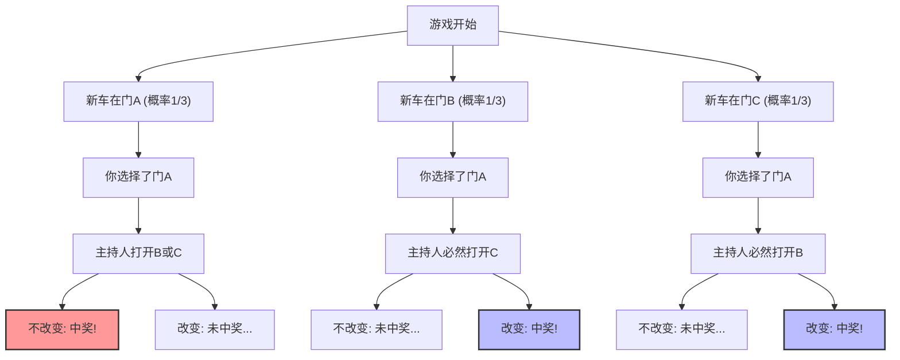
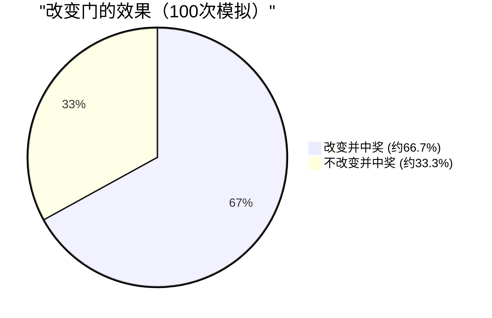

## 1. 舞台是电视问答节目：换作是你，会怎么做？

1990年，美国新闻杂志《Parade》的专栏“Ask Marilyn（问问玛丽莲）”中，收到了一位读者发来的如下问题：

> 你正在参加一个电视游戏节目。在你面前有 **3扇门 (A, B, C)**。
> 其中1扇门后面是**新车（大奖）**，剩下的2扇门后面是**山羊（未中奖）**。
> 
> 1. 首先，你选择了**门A**。
> 2. 接着，知道新车在哪扇门后面的主持人蒙提·霍尔，在剩下的门中打开了藏有山羊的**门B**。
> 3. 蒙提对你说：**“现在你可以把选择更改为门C。你要怎么做？”**
> 
> 那么，你究竟**应该改变选择吗？**

直觉上，你可能会觉得：“剩下的门只有A和C两扇。新车在哪扇门后面完全是随机的，所以中奖的概率都是 $\frac{1}{2}$（50%）。因此，改不改变选择都一样。”

然而，专栏作家玛丽莲·沃斯·莎凡特（被吉尼斯世界纪录认定为拥有最高智商的人）回答说：**“应该改变选择。如果你改变选择，中奖的概率将增加一倍。”**

这个回答在全美引起了轰动，她收到了大约1万封抗议信（其中约1000封来自拥有数学博士学位的学者）。信中充满了尖锐的批评，比如“你根本不懂概率的基本原理”、“这就是女人的逻辑”等等。
但是，从结论上来说，**玛丽莲的回答在数学上是完全正确的**。

---

## 2. 直觉与数学的偏差：用 Mermaid 看看概率的分支

为什么我们的直觉会产生“$\frac{1}{2}$”的错觉呢？
首先，让我们把游戏的所有模式可视化。

假设你选择了“门A”，以下3种情况将以相等的概率（$\frac{1}{3}$）发生。

1. **情况1（新车在A）：** 主持人打开有山羊的B或C。如果改变选择就会**未中奖**。
2. **情况2（新车在B）：** 主持人只能打开有山羊的C。如果改变选择就会**中奖**。
3. **情况3（新车在C）：** 主持人只能打开有山羊的B。如果改变选择就会**中奖**。

也就是说，3次中有2次（情况2和3）处于**“只要改变选择就必然中奖”**的状态。
因此，改变选择时的胜率为 $\frac{2}{3}$，是不改变选择时胜率 $\frac{1}{3}$ 的**2倍**。

---

## 3. 基于贝叶斯定理的严格证明

为了在数学上严格解决这个问题，我们使用计算条件概率的“贝叶斯定理”。

$$ P(H|E) = \frac{P(E|H) P(H)}{P(E)} $$

在这里，我们将事件定义如下：
- $C_A, C_B, C_C$ : 新车分别在门A, B, C的事件。先验概率为 $P(C_A) = P(C_B) = P(C_C) = \frac{1}{3}$
- 假设你最初选择了**门A**。
- $M_B$ : 主持人打开有山羊的**门B**的事件。

我们想要计算的是“在主持人打开了门B的条件下，新车在门C的概率”，即后验概率 $P(C_C|M_B)$。

首先，根据新车所在的位置，考虑主持人打开门B的概率 $P(M_B|C_X)$。

1. **当新车在门A时 ($C_A$)**
   主持人可以随机打开B或C。
   $$ P(M_B|C_A) = \frac{1}{2} $$

2. **当新车在门B时 ($C_B$)**
   因为主持人不能打开有新车的门，所以打开B的概率为零。
   $$ P(M_B|C_B) = 0 $$

3. **当新车在门C时 ($C_C$)**
   主持人不能打开A（你选择的）和C（有新车），因此必然只能打开B。
   $$ P(M_B|C_C) = 1 $$

接着，利用“全概率公式”求出主持人打开门B的总概率 $P(M_B)$。

$$ P(M_B) = P(M_B|C_A)P(C_A) + P(M_B|C_B)P(C_B) + P(M_B|C_C)P(C_C) $$
$$ P(M_B) = \left(\frac{1}{2} \times \frac{1}{3}\right) + \left(0 \times \frac{1}{3}\right) + \left(1 \times \frac{1}{3}\right) = \frac{1}{6} + 0 + \frac{1}{3} = \frac{1}{2} $$

终于，我们可以应用贝叶斯定理，计算门A和门C的后验概率。

**门A（不改变选择）有新车的概率：**
$$ P(C_A|M_B) = \frac{P(M_B|C_A) P(C_A)}{P(M_B)} = \frac{\frac{1}{2} \times \frac{1}{3}}{\frac{1}{2}} = \frac{1}{3} $$

**门C（改变选择）有新车的概率：**
$$ P(C_C|M_B) = \frac{P(M_B|C_C) P(C_C)}{P(M_B)} = \frac{1 \times \frac{1}{3}}{\frac{1}{2}} = \frac{2}{3} $$

数学公式的证明也明确地表明了**“改变选择能使中奖的概率增加一倍（2/3）”**。

---

## 4. 认知偏差：作为信息的“条件”的价值

为什么连许多天才数学家都在这个问题上直觉犯错了呢？
这其中有人类大脑固有的“等概率偏差”以及“更新信息的失败”。

### 4.1. 等概率偏差 (Equiprobability Bias)
人类在面对未知的选项时，会有一种无意识中分配“剩下的选项概率总是均等的”的倾向。
在看到只剩两扇门的瞬间，大脑就会自动将其标记为“$50\%$ : $50\%$”。

### 4.2. 主持人的“意图”这一信息
直觉出错的最大原因在于，忽略了**主持人的行为并非随机**这一点。
如果规则是主持人“在不知道新车在哪里的情况下，随机打开一扇门，结果碰巧是山羊”（这被称为蒙提·霍尔变体问题/蒙提·佛尔问题），那么门A和门C的概率就都是 $\frac{1}{2}$。

但是在真实的蒙提·霍尔问题中，主持人的行动受到以下严格的限制：
1. 不能打开参赛者选择的门。
2. 不能打开有新车的门。

由于这些限制，主持人“打开门B”这一行为本身，就为我们提供了**关于门C的巨大信息量**。其中暗含了这样的无声信息：“我无法打开门C（因为那里有新车）”。

---

## 5. 用极端的例子纠正直觉

如果你仍然觉得难以信服，让我们把门的数量增加到 **100万扇**。

1. 你在100万扇门中，选择了**门1**。（中奖概率是 $\frac{1}{1,000,000}$）
2. 无所不知的主持人，在剩下的99万9999扇门中，**打开了99万9998扇有山羊的门**。
3. 现在关着的，只有你选择的“门1”，以及主持人刻意留下的“门777,777”。

那么，你要改变选择吗？
在这种情况下，如果你坚信自己一开始就碰上了“百万分之一”的奇迹，那就不该换。但在现实中，我们能直观地理解，新车在那扇**“主持人绝对无法打开的唯一一扇门”**后面的概率是 $\frac{999,999}{1,000,000}$。

蒙提·霍尔问题（3扇门），只不过是将这种“100万扇门”的规模缩小了的现象而已。

## 6. 总结：概率论带给商业和人生的教训

蒙提·霍尔问题已经超越了单纯的谜题范畴，为我们带来了重要的教训。

1. **直觉经常会出错**：人类的大脑并未进化到能够直观地处理复杂的条件概率。在做重要的决策时，仅凭直觉判断是危险的。
2. **用新信息更新概率（贝叶斯更新）**：当情况发生变化，有了新的信息（例如主持人打开了哪扇门）时，能否不固执己见，灵活地更新概率和策略，是成功的关键。

“改变选择”这一小小的决定，或许能让你在人生中获得“新车”的概率翻倍。
