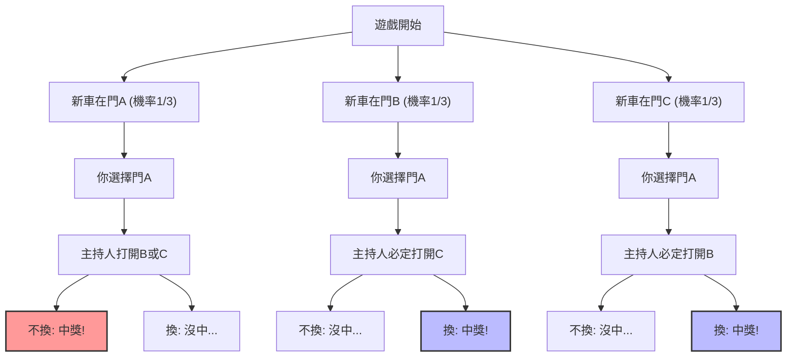
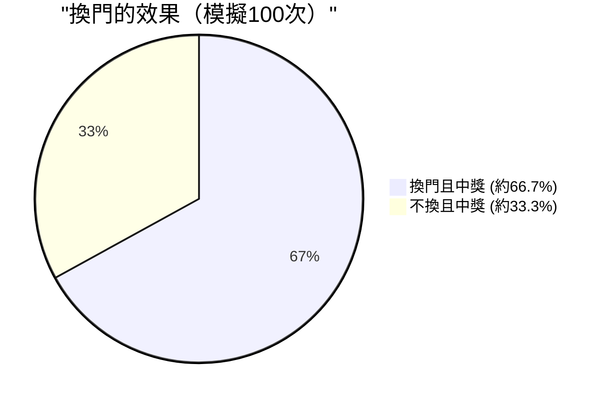

## 1. 舞台是電視問答節目：換作是你會怎麼做？

1990年，美國新聞雜誌《Parade》的專欄「Ask Marilyn（問問瑪麗蓮）」中，收到了一位讀者寄來的以下問題：

> 你是電視遊戲節目的參賽者。你的面前有 **3扇門 (A, B, C)**。
> 其中1扇門的後面是**新車（大獎）**，剩下2扇門的後面是**山羊（沒中）**。
> 
> 1. 你首先選擇了**門A**。
> 2. 接著，知道哪扇門後有新車的主持人蒙提·霍爾，打開了剩下的門中藏有山羊的**門B**。
> 3. 蒙提對你說：**「現在你可以改選門C。你要換嗎？」**
> 
> 究竟，你**應該改變選擇嗎？**

直覺上會認為「剩下的門只有A和C這2扇。新車在哪裡完全是隨機的，所以中獎的機率都是 $\frac{1}{2}$（50%）。因此換不換都一樣」。

然而，專欄作家瑪麗蓮·沃斯·莎凡特（被金氏世界紀錄認定為擁有最高IQ的人）回答道：**「應該換。如果改變選擇，中獎的機率會變成兩倍」**。

這個回答在全美引起了轟動，並湧入了大約1萬封的抗議信（其中約0封來自擁有數學博士學位的學者）。引發了諸如「你根本不懂機率的基礎」、「這是女人的邏輯」等嚴厲批評的風暴。
但是，先說結論，**瑪麗蓮的回答在數學上是完全正確的**。

---

## 2. 直覺與數學的落差：用Mermaid來看機率的分支

為什麼我們的直覺會產生「$\frac{1}{2}$」的錯覺呢？
首先，讓我們將遊戲的所有模式視覺化。

假設你選擇了「門A」，以下3種情境將會以相等的機率（$\frac{1}{3}$）發生。

1. **情境1（新車在A）：** 主持人打開有山羊的B或C。如果換門就會**沒中**。
2. **情境2（新車在B）：** 主持人只能打開有山羊的C。如果換門就會**中獎**。
3. **情境3（新車在C）：** 主持人只能打開有山羊的B。如果換門就會**中獎**。

也就是說，在3次之中有2次（情境2和3）是處於**「只要換門就一定會中獎」**的狀態。
因此，如果改變選擇，勝率將為 $\frac{2}{3}$，是不改變選擇時勝率 $\frac{1}{3}$ 的**2倍**。

---

## 3. 透過貝氏定理的嚴密證明

為了在數學上嚴密地解開這個問題，我們使用計算條件機率的「貝氏定理」。

$$ P(H|E) = \frac{P(E|H) P(H)}{P(E)} $$

在這裡，我們將事件定義如下：
- $C_A, C_B, C_C$ : 分別代表新車在門A, B, C的事件。事前機率為 $P(C_A) = P(C_B) = P(C_C) = \frac{1}{3}$
- 假設你一開始選擇了**門A**。
- $M_B$ : 主持人打開有山羊的**門B**的事件。

我們想要求的是「在主持人打開門B的條件下，新車在門C的機率」，即事後機率 $P(C_C|M_B)$。

首先，根據新車所在的位置，思考主持人打開門B的機率 $P(M_B|C_X)$。

1. **新車在門A的情況 ($C_A$)**
   主持人可以隨機打開B或C。
   $$ P(M_B|C_A) = \frac{1}{2} $$

2. **新車在門B的情況 ($C_B$)**
   因為主持人不能打開有新車的門，所以打開B的機率為零。
   $$ P(M_B|C_B) = 0 $$

3. **新車在門C的情況 ($C_C$)**
   主持人不能打開A（你選的）和C（有新車），因此必然只能打開B。
   $$ P(M_B|C_C) = 1 $$

接著，由「全機率定理」求出主持人打開門B的總機率 $P(M_B)$。

$$ P(M_B) = P(M_B|C_A)P(C_A) + P(M_B|C_B)P(C_B) + P(M_B|C_C)P(C_C) $$
$$ P(M_B) = \left(\frac{1}{2} \times \frac{1}{3}\right) + \left(0 \times \frac{1}{3}\right) + \left(1 \times \frac{1}{3}\right) = \frac{1}{6} + 0 + \frac{1}{3} = \frac{1}{2} $$

終於要應用貝氏定理，來計算門A與門C的事後機率了。

**新車在門A（不換的情況）的機率：**
$$ P(C_A|M_B) = \frac{P(M_B|C_A) P(C_A)}{P(M_B)} = \frac{\frac{1}{2} \times \frac{1}{3}}{\frac{1}{2}} = \frac{1}{3} $$

**新車在門C（換的情況）的機率：**
$$ P(C_C|M_B) = \frac{P(M_B|C_C) P(C_C)}{P(M_B)} = \frac{1 \times \frac{1}{3}}{\frac{1}{2}} = \frac{2}{3} $$

即使是透過數學公式證明，也明確地顯示了**「換門中獎的機率會變成2倍（2/3）」**。

---

## 4. 認知偏誤：「制約」這種情報的價值

為什麼連許多天才數學家們都會在直覺上弄錯這個問題呢？
原因在於人類大腦中內建的「等機率偏誤」與「資訊更新的失敗」。

### 4.1. 等機率偏誤 (Equiprobability Bias)
當人類面對未知的選項時，會有一種無意識將「剩下的選項機率總是均等分配」的傾向。
在看到剩下2扇門的瞬間，大腦便會自動貼上「$50\%$ : $50\%$」的標籤。

### 4.2. 主持人「意圖」的資訊
直覺出錯最大的原因，在於忽略了**主持人的行為並非隨機**這一點。
如果主持人的規則是「不知道新車在哪裡，隨機開門，結果剛好是山羊」（這被稱為蒙提·佛爾問題），那麼門A與門C的機率就都會是 $\frac{1}{2}$。

但在實際的蒙提霍爾問題中，主持人在行動時受到了以下嚴格的限制：
1. 不能打開參賽者選擇的門。
2. 不能打開有新車的門。

因為這些限制，主持人「打開門B」的這個行為本身，就給予了我們**關於門C的巨大情報**。這等同於傳達了一個無言的訊息：「我無法打開門C（因為那裡面有新車）」。

---

## 5. 用極端的例子來矯正直覺

如果你還是無法接受，那麼讓我們把門的數量增加到 **100萬扇** 吧。

1. 你從100萬扇門中，選擇了**門1**。（中獎機率為 $\frac{1}{1,000,000}$）
2. 全知的主持人，在剩下的99萬9999扇門中，把有山羊的 **99萬9998扇門全部打開了**。
3. 現在關著的，只有你選擇的「門1」，以及主持人刻意留下的「門777,777」。

那麼，你要換嗎？
在這種情況下，除非你相信自己一開始就創造了「百萬分之一」的奇蹟，否則你應該換。而在現實中，大家都能直覺地理解到，**「主持人絕對無法打開的那唯一一扇門」**藏有新車的機率是 $\frac{999,999}{1,000,000}$。

蒙提霍爾問題（3扇門），只不過是將這個「100萬扇門」的規模縮小後的現象而已。

## 6. 總結：機率論所教導的商業與人生啟示

蒙提霍爾問題超越了單純的問答遊戲範疇，教導了我們重要的啟示。

1. **直覺經常出錯**：人類大腦的演化，並不是為了直覺地處理複雜的條件機率。在重要的決策中，僅憑直覺來判斷是危險的。
2. **用新資訊更新機率（貝氏更新）**：當狀況改變，帶來了新資訊（如主持人打開了哪扇門等）時，不固執於原有的想法，能夠彈性地更新機率與策略，這才是成功的關鍵。

「換門」這個小小的決定，或許會讓你在人生中獲得「新車」的機率變成2倍。
