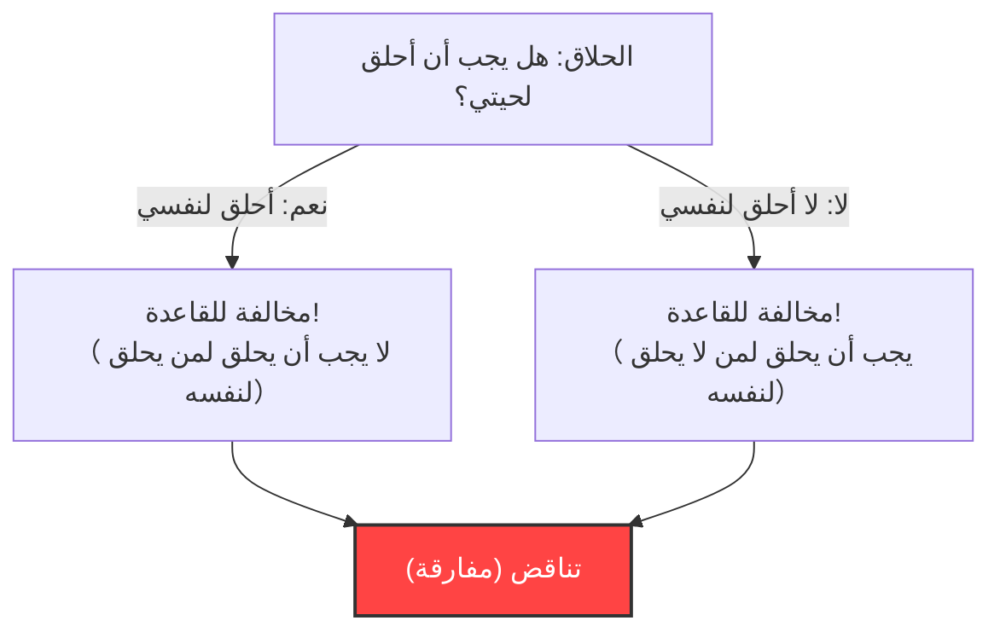
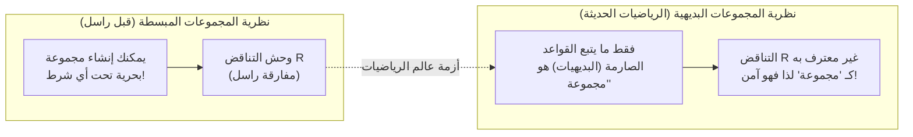

## 1. "مفارقة الحلاق" التي عصفت بقرية هادئة

في قرية مسالمة، كان هناك حلاق واحد.
وعلى مدخل القرية، كانت توجد لافتة غريبة مكتوب عليها الآتي:

**"حلاق هذه القرية يحلق لحى جميع القرويين الذين لا يحلقون لأنفسهم، ولا يحلق لحى غيرهم."**

كان القرويون راضين عن هذه القاعدة. فمن لا يستطيع الحلاقة لنفسه يمكنه الذهاب إلى الحلاق، ومن يستطيع أن يحلق لنفسه يفعل ذلك في منزله.

لكن في أحد الأيام، نظر الحلاق الشاب إلى المرآة وأدرك فجأة أن لحية خفيفة قد نبتت على ذقنه.
"حسناً، هل يجب أن أحلق لحيتي بنفسي؟"

قرر أن يفكر بشكل منطقي وفقًا لقاعدة اللافتة.

1. **ماذا لو قرر "أن يحلق لنفسه"؟**
   وفقًا للقاعدة، يُسمح للحلاق فقط بحلاقة لحى "الأشخاص الذين لا يحلقون لأنفسهم". لذلك، إذا كان يحلق لنفسه، فليس له الحق في أن يحلق له الحلاق (نفسه). أي أنه "يجب ألا يحلق لنفسه".
2. **ماذا لو قرر "ألا يحلق لنفسه"؟**
   وفقًا للقاعدة، يجب على الحلاق أن يحلق لحى جميع "الأشخاص الذين لا يحلقون لأنفسهم". لذلك، إذا لم يحلق لنفسه، فيجب أن يحلق له الحلاق (نفسه). أي أنه "يجب أن يحلق لنفسه".

"إذا قرر أن يحلق، فلا يجب أن يحلق."
"إذا قرر ألا يحلق، فيجب أن يحلق."

أصيب الحلاق بالذعر التام ولم يعد قادرًا على اتخاذ أي من الإجراءين. هذه هي **"مفارقة الحلاق"** الشهيرة.

---

## 2. "مفارقة راسل" التي زلزلت عالم الرياضيات

هذه "مفارقة الحلاق" هي مجرد قصة رمزية ابتكرها عالم المنطق والفيلسوف البريطاني برتراند راسل لشرح المفارقة الرياضية التي اكتشفها بطريقة يسهل على عامة الناس فهمها.

ما اكتشفه حقًا لم يكن حلاقًا، بل كان تناقضًا مرعبًا يتعلق بـ **"المجموعة (Set)"**.
يطلق على هذا اسم **"مفارقة راسل (1901)"**.

### مفهوم "مجموعة المجموعات"
"المجموعة" في الرياضيات تعني تجمعًا من الأشياء التي تلبي شروطًا معينة.
- "مجموعة الأعداد الزوجية التي تساوي أو تقل عن 10" = $\{2, 4, 6, 8, 10\}$
- "مجموعة التفاح الأحمر"

ويمكن أيضًا إدراج "مجموعة" أخرى كعنصر داخل المجموعة.
على سبيل المثال، لنفكر في "مجموعة كل الكتب في العالم". هذه المجموعة بحد ذاتها ليست "كتابًا"، لذا فإن "مجموعة كل الكتب في العالم" لا تتضمن نفسها كعنصر في مجموعتها.

من ناحية أخرى، لنفكر في "مجموعة الأشياء التي ليست كتبًا". هذه المجموعة بحد ذاتها ليست "كتابًا". وبالتالي، فإن "مجموعة الأشياء التي ليست كتبًا" ستكون متضمنة داخل مجموعتها نفسها.

بهذه الطريقة، يمكن تقسيم المجموعات في العالم إلى نوعين رئيسيين:
- **A: مجموعات لا تحتوي على نفسها كعنصر** (مثال: مجموعة الكتب)
- **B: مجموعات تحتوي على نفسها كعنصر** (مثال: مجموعة الأشياء التي ليست كتبًا)

### ولادة المجموعة الشيطانية $R$

هنا، فكر راسل في مجموعة خاصة $R$ كما يلي:

**المجموعة $R$ = مجموعة تحتوي على جميع "المجموعات التي لا تحتوي على نفسها كعنصر (من النوع A)"**

عند كتابتها كصيغة رياضية (التدوين البنائي)، تصبح هكذا:
$$ R = \{ x \mid x \notin x \} $$

حسنًا، هنا يكمن صلب الموضوع. طرح راسل السؤال التالي على هذه المجموعة $R$:

**"هل المجموعة $R$ تحتوي على نفسها ($R$) كعنصر؟"**

لنفكر في ذلك.

1. **ماذا لو كانت $R$ "تحتوي على نفسها ($R \in R$)"؟**
   شرط الدخول إلى $R$ هو "ألا تحتوي على نفسها". بالتالي، $R$ لا تلبي الشرط ولا يمكن أن تدخل ضمن $R$. (يصبح $R \notin R$ مما يشكل تناقضًا)

2. **ماذا لو كانت $R$ "لا تحتوي على نفسها ($R \notin R$)"؟**
   شرط الدخول إلى $R$ هو "ألا تحتوي على نفسها". بالتالي، $R$ تلبي الشرط بامتياز ويجب أن تدخل ضمن $R$. (يصبح $R \in R$ مما يشكل تناقضًا)

إذا كتبناها رياضياً، فهو انهيار منطقي في سطر واحد.
$$ R \in R \iff R \notin R $$

"إذا كانت تحتوي، فهي لا تحتوي." "إذا كانت لا تحتوي، فهي تحتوي."
هذا هو نفس هيكل مفارقة الحلاق تمامًا. ولكن في حالة حلاق القرية، يمكن أن ينتهي الأمر بضحكة والقول "العمدة الذي وضع هذه القاعدة مجرد غبي"، أما في عالم الرياضيات فالأمر ليس كذلك.

ذلك لأن عالم الرياضيات في ذلك الوقت كان في خضم محاولة إعادة بناء جميع الرياضيات على أساس قاعدة بسيطة (نظرية المجموعات المبسطة) تنص على أنه **"طالما قمت بتحديد الشروط بوضوح، يمكنك إنشاء 'مجموعة' بحرية من أي شيء"**.

---

## 3. مأساة فريجه

كان الشخص الذي أرسل إليه راسل هذه الرسالة هو عالم المنطق الألماني العظيم جوتلوب فريجه.
كان فريجه قد أرسل للتو المجلد الثاني من كتابه الضخم "القوانين الأساسية لعلم الحساب"، الذي كرس حياته كلها من أجله، إلى المطبعة. كان هذا الكتاب هو تتويج لمحاولة إثبات كمال الرياضيات بناءً على قاعدة أنه "يمكنك إنشاء مجموعة من أي شرط".

عندما قرأ فريجه رسالة راسل، أصيب باليأس. لأنه تم إثبات أن استخدام قاعدة "أساس الأساس" في كتابه يمكن أن يخلق "مجموعة متناقضة تمامًا" مثل مفارقة راسل. إذا انهار الأساس، فإن جميع المعادلات الرياضية التي تم بناؤها عليه والتي تبلغ مئات الصفحات ستصبح باطلة.

ترك فريجه الملحق المؤلم التالي في نهاية كتابه قبل نشره مباشرة:

> "بالنسبة للعالم، لا يوجد شيء أكثر بؤسًا من رؤية أساس عمله ينهار في اللحظة التي اعتقد فيها أن عمله قد اكتمل. بعد إرسال هذا الكتاب للطباعة مباشرة، وضعتني رسالة من السيد برتراند راسل في هذا الموقف بالذات."

---

## 4. التغلب على الأزمة: ولادة نظرية المجموعات البديهية

تسببت مفارقة راسل في حالة من الذعر الكبير في عالم الرياضيات، والتي يشار إليها باسم "أزمة أسس الرياضيات".
القاعدة الحرة التي كانت تنص على "طالما حددت الشروط، يمكنك إنشاء مجموعة بحرية" قد أدت إلى خلق وحش يسمى التناقض.

لحل هذه الأزمة، شرع علماء الرياضيات في جعل القواعد أكثر صرامة.
قام علماء الرياضيات مثل تسيرميلو وفرينكل بتطوير **كتاب قواعد (نظام بديهي) يميز بصرامة بين "المجموعات المسموح بإنشائها" و"المجموعات غير المسموح بإنشائها (لأنها كبيرة جداً)"**. يُطلق على هذا اسم "بديهيات زيرميلو-فرانكل (نظرية المجموعات البديهية)".

بموجب نظام ZFC البديهي، فإن المجموعة $R$ التي فكر فيها راسل والتي تضم "جميع 'المجموعات التي لا تحتوي على نفسها'" تم منعها من دخول عالم الرياضيات على أساس أنها **"كبيرة جدًا وخطيرة، لذا لم تعد تعتبر 'مجموعة' (بل هي مجرد 'صنف')"**.

---

## 5. الخلاصة: المفارقة هي دواء قوي لإصلاح "أخطاء المنطق"

مفارقة راسل هي الذروة لأخطاء المنطق التي تسببها الإشارة الذاتية (الإشارة إلى الذات)، مثل "الثعبان الذي يأكل ذيله (أوروبوروس)" أو "الكاذب الذي يقول أنا كاذب".

ما يبدو للوهلة الأولى كمجرد سفسطة أو تلاعب بالكلمات، أدى إلى تدمير أسس الرياضيات، التي تعتبر أكثر العلوم صرامة، ونتيجة لذلك تطورت الرياضيات إلى شيء أقوى وأكثر صرامة.

لو لم يلاحظ هذا العبقري راسل "خطأ الحلاق"، لكان من الممكن أن تتطور الرياضيات الحديثة وعلوم الكمبيوتر، التي هي امتداد لمنطقها، وهي تحمل تناقضًا مميتًا في مكان ما.
المفارقة هي الدواء الأكثر تحفيزًا الذي يعلمنا حدود المنطق البشري.
