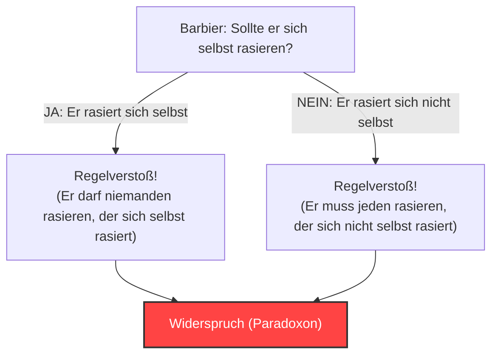
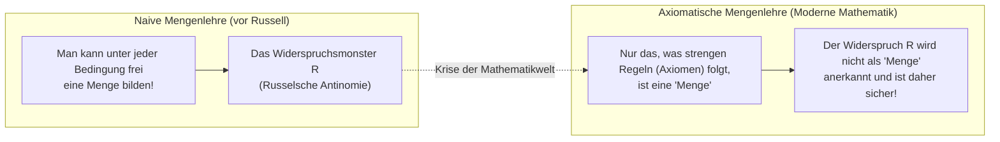

## 1. Das "Barbier-Paradoxon", das ein friedliches Dorf heimsuchte

In einem friedlichen Dorf gab es einen einzigen Barbier.
Am Eingang des Dorfes stand ein seltsames Schild mit folgender Aufschrift:

**"Der Barbier dieses Dorfes rasiert alle Männer im Dorf, die sich nicht selbst rasieren, und nur diese."**

Die Dorfbewohner waren mit dieser Regel zufrieden. Wer sich nicht selbst rasieren konnte, ging zum Barbier, und wer es konnte, rasierte sich zu Hause.

Doch eines Tages schaute der junge Barbier in den Spiegel und erschrak. Auf seinem Kinn waren Bartstoppeln gewachsen.
"Nun, sollte ich mich selbst rasieren?"

Er beschloss, der Regel auf dem Schild zu folgen und logisch darüber nachzudenken.

1. **Was ist, wenn er beschließt, "sich selbst zu rasieren"?**
   Laut der Regel darf der Barbier nur die Männer rasieren, "die sich nicht selbst rasieren". Wenn er sich also selbst rasiert, ist er nicht berechtigt, vom Barbier (sich selbst) rasiert zu werden. Das heißt, er "darf sich nicht rasieren".
2. **Was ist, wenn er beschließt, "sich nicht selbst zu rasieren"?**
   Laut der Regel muss der Barbier alle Männer rasieren, "die sich nicht selbst rasieren". Wenn er sich also nicht selbst rasiert, muss er vom Barbier (sich selbst) rasiert werden. Das heißt, er "muss sich rasieren".

"Wenn ich mich rasiere, darf ich mich nicht rasieren."
"Wenn ich mich nicht rasiere, muss ich mich rasieren."

Der Barbier geriet völlig in Panik und konnte keine von beiden Handlungen ausführen. Dies ist das berühmte **"Barbier-Paradoxon"**.

---

## 2. Die "Russelsche Antinomie", die die Welt der Mathematik erschütterte

Dieses "Barbier-Paradoxon" ist eine Metapher, die der britische Logiker und Philosoph Bertrand Russell erfunden hat, um sein mathematisches Paradoxon der Allgemeinheit verständlich zu erklären.

Was er wirklich entdeckte, war kein Barbier, sondern ein schrecklicher Widerspruch bezüglich von **"Mengen (Sets)"**.
Dies wird als **"Russelsche Antinomie (1901)"** bezeichnet.

### Die Idee einer "Menge von Mengen"
Eine "Menge" in der Mathematik ist eine Ansammlung von Objekten, die eine bestimmte Bedingung erfüllen.
- "Menge der geraden Zahlen bis 10" = $\{2, 4, 6, 8, 10\}$
- "Menge der roten Äpfel"

Außerdem können Sie andere "Mengen" als Elemente in eine Menge aufnehmen.
Betrachten wir zum Beispiel die "Menge aller Bücher der Welt". Da diese Menge selbst kein "Buch" ist, ist die "Menge aller Bücher der Welt" nicht in ihrer eigenen Menge enthalten.

Betrachten wir andererseits die "Menge aller Dinge, die keine Bücher sind". Auch diese Menge selbst ist kein "Buch". Daher ist die "Menge aller Dinge, die keine Bücher sind" in ihrer eigenen Menge enthalten.

Auf diese Weise lassen sich die Mengen der Welt grob in zwei Arten einteilen:
- **A: Mengen, die sich nicht selbst als Element enthalten** (z. B. die Menge der Bücher)
- **B: Mengen, die sich selbst als Element enthalten** (z. B. die Menge der Dinge, die keine Bücher sind)

### Die Geburt der teuflischen Menge $R$

Hier betrachtete Russell die folgende spezielle Menge $R$:

**Menge $R$ = Die Menge, die alle "Mengen, die sich nicht selbst enthalten (Typ A)" zusammenfasst**

Mathematisch (in Intensionsnotation) geschrieben sieht das so aus:
$$ R = \{ x \mid x \notin x \} $$

Nun zum Kernpunkt. Russell stellte die folgende Frage an diese Menge $R$:

**"Enthält die Menge $R$ sich selbst ($R$)?"**

Lassen Sie uns nachdenken.

1. **Was ist, wenn $R$ "sich selbst enthält ($R \in R$)"?**
   Die Bedingung, um in $R$ aufgenommen zu werden, ist, "sich nicht selbst zu enthalten". Daher erfüllt $R$ die Bedingung nicht und kann nicht in $R$ aufgenommen werden. (Dies führt zum Widerspruch $R \notin R$)

2. **Was ist, wenn $R$ "sich nicht selbst enthält ($R \notin R$)"?**
   Die Bedingung, um in $R$ aufgenommen zu werden, ist, "sich nicht selbst zu enthalten". Daher erfüllt $R$ diese Bedingung perfekt und muss in $R$ aufgenommen werden. (Dies führt zum Widerspruch $R \in R$)

Mathematisch geschrieben ist es ein Zusammenbruch der Logik in nur einer Zeile:
$$ R \in R \iff R \notin R $$

"Wenn sie es enthält, ist sie nicht enthalten." "Wenn sie nicht enthalten ist, enthält sie es."
Dies ist genau die gleiche Struktur wie beim Barbier-Paradoxon. Aber beim Dorfbarbier kann man einfach lachen und sagen: "Der Bürgermeister, der so ein Regelschild aufgestellt hat, ist einfach nur dumm", in der Welt der Mathematik ist das jedoch nicht so einfach.

Der Grund dafür ist, dass die damalige Welt der Mathematik gerade dabei war, die gesamte Mathematik auf der Grundlage der naiven Regel (naive Mengenlehre) neu aufzubauen: **"Solange die Bedingung klar definiert ist, kann man aus allem frei eine 'Menge' bilden"**.

---

## 3. Freges Tragödie

Die Person, an die Russell diesen Brief schickte, war der große deutsche Logiker Gottlob Frege.
Frege hatte gerade den zweiten Band seines monumentalen Werks "Grundgesetze der Arithmetik", dem er sein ganzes Leben gewidmet hatte, an die Druckerei übergeben. Dieses Buch war der Höhepunkt seines Versuchs, die Vollständigkeit der Mathematik zu beweisen, basierend auf der Regel, dass "Mengen aus jeder Bedingung gebildet werden können".

Als Frege den Brief von Russell las, verzweifelte er. Es wurde bewiesen, dass man mit der "grundlegendsten Grundlage" seines Buches eine "absolut widersprüchliche Menge" wie das Russellsche Paradoxon erschaffen kann. Wenn das Fundament zusammenbricht, werden hunderte Seiten von mathematischen Formeln, die darauf aufgebaut sind, alle ungültig.

Frege hinterließ kurz vor der Veröffentlichung seines Buches folgenden herzzerreißenden Nachtrag am Ende des Bandes:

> "Einem wissenschaftlichen Schriftsteller kann kaum etwas Unerwünschteres begegnen, als dass ihm nach Vollendung einer Arbeit eine der Grundlagen seines Baues erschüttert wird. In diese Lage wurde ich durch einen Brief des Herrn Bertrand Russell versetzt, als der Druck dieses Bandes sich seinem Ende näherte."

---

## 4. Die Krise überwinden: Die Geburt der axiomatischen Mengenlehre

Die Russelsche Antinomie löste in der Mathematikwelt eine große Panik aus, die als "Grundlagenkrise der Mathematik" bezeichnet wird.
Die freie Regel "Solange man eine Bedingung festlegt, kann man frei eine Menge bilden" hatte ein Monster namens Widerspruch hervorgebracht.

Um diese Krise zu lösen, begannen Mathematiker, die Regeln zu verschärfen.
Mathematiker wie Zermelo und Fraenkel entwickelten ein **Regelwerk (Axiomensystem), das strikt zwischen "Mengen, die gebildet werden dürfen" und "Mengen, die nicht gebildet werden dürfen (zu große Mengen)" unterscheidet**. Dies wird als "ZFC-Axiomensystem (axiomatische Mengenlehre)" bezeichnet.

Unter dem ZFC-Axiomensystem wurde eine Menge $R$, die alle "Mengen sammelt, die sich nicht selbst enthalten", wie Russell sie sich vorgestellt hatte, aus der Welt der Mathematik verbannt mit der Begründung: **"Sie ist zu groß und gefährlich, also wird sie nicht mehr als 'Menge' anerkannt (sie ist lediglich eine 'Klasse')"**.

---

## 5. Fazit: Paradoxien sind eine "starke Medizin", um "Logik-Bugs" zu beheben

Die Russelsche Antinomie ist das Extrem eines Logik-Bugs, der durch Selbstreferenz (sich auf sich selbst beziehen) verursacht wird, ähnlich wie "die Schlange, die ihren eigenen Schwanz frisst (Ouroboros)" oder der Lügner, der sagt: "Ich bin ein Lügner".

Paradoxien, die auf den ersten Blick wie bloße Haarspalterei oder Wortspiele wirken, zerstörten die Grundlage der Mathematik, der strengsten aller Wissenschaften, und führten letztendlich dazu, dass sich die Mathematik zu etwas Stärkerem und Strengerem entwickelte.

Wenn das Genie Russell diesen "Barbier-Bug" nicht bemerkt hätte, hätten sich die moderne Mathematik und die Informatik, die eine Erweiterung ihrer Logik ist, vielleicht mit einem fatalen Widerspruch irgendwo weiterentwickelt.
Ein Paradoxon ist die anregendste Medizin, die uns die Grenzen der menschlichen Logik lehrt.
