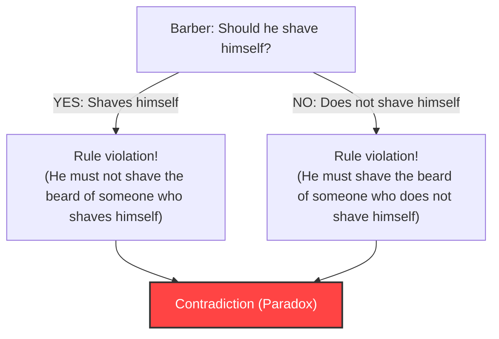
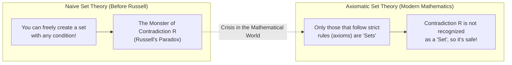

## 1. The "Barber Paradox" That Struck a Peaceful Village

In a certain peaceful village, there was a single barber.
At the entrance of the village stood a strange sign with the following rule:

**"The barber of this village shaves all and only those villagers who do not shave themselves."**

The villagers were satisfied with this rule. Those who couldn't shave themselves just had to go to the barber, and those who could shave themselves would just do it at home.

However, one day, the young barber looked in the mirror and was suddenly startled. He had stubble growing on his chin.
"Now then, should I shave my own beard?"

He decided to think logically according to the rule on the sign.

1. **What if he decides to "shave himself"?**
   According to the rule, the barber must only shave those who "do not shave themselves." Therefore, if he shaves himself, he is not eligible to be shaved by the barber (himself). In other words, "he must not shave himself."
2. **What if he decides "not to shave himself"?**
   According to the rule, the barber must shave everyone who "does not shave themselves." Therefore, if he doesn't shave himself, he must be shaved by the barber (himself). In other words, "he must shave himself."

"If he shaves himself, he must not shave himself."
"If he does not shave himself, he must shave himself."

The barber completely panicked and became unable to take either action. This is the famous **"Barber Paradox"**.

---

## 2. "Russell's Paradox" That Shook the Mathematical World

This "Barber Paradox" is an allegory created by the British logician and philosopher Bertrand Russell to explain a mathematical paradox he discovered in a way that is easy for the general public to understand.

What he actually discovered was not about a barber, but a terrifying contradiction regarding **"Sets"**.
It is called **"Russell's Paradox (1901)"**.

### The Concept of a "Set of Sets"
In mathematics, a "set" is a collection of things that satisfy a certain condition.
- "The set of even numbers less than or equal to 10" = $\{2, 4, 6, 8, 10\}$
- "The set of red apples"

And, as the contents (elements) of a set, you can also put in another "set".
For example, consider "the set of all books in the world". Since this set itself is not a "book", "the set of all books in the world" is not included within its own set.

On the other hand, consider "the set of things that are not books". This set itself is also not a "book". Therefore, "the set of things that are not books" is included within its own set.

In this way, sets in the world can be broadly divided into two types:
- **A: Sets that do not contain themselves** (e.g., the set of books)
- **B: Sets that contain themselves** (e.g., the set of things that are not books)

### The Birth of the Demonic Set $R$

Here, Russell considered the following special set $R$:

**Set $R$ = The set of all "sets that do not contain themselves (Type A)"**

Written as a mathematical formula (intensional notation), it looks like this:
$$ R = \{ x \mid x \notin x \} $$

Now, here is the main point. Russell posed the following question regarding this set $R$:

**"Does the set $R$ contain itself ($R$)?"**

Let's think about it.

1. **What if $R$ "contains itself ($R \in R$)"?**
   The condition to be included in $R$ is "not containing oneself". Therefore, $R$ does not satisfy the condition, and cannot be included in $R$. (Leading to $R \notin R$, a contradiction)

2. **What if $R$ "does not contain itself ($R \notin R$)"?**
   The condition to be included in $R$ is "not containing oneself". Therefore, $R$ perfectly satisfies the condition, and must be included in $R$. (Leading to $R \in R$, a contradiction)

Written as a formula, it is a logical collapse in just one line:
$$ R \in R \iff R \notin R $$

"If it contains itself, it is not contained." "If it is not contained, it contains itself."
This has exactly the same structure as the Barber Paradox. However, while the village barber story can be laughed off with "the mayor who put up a sign with such rules is just stupid", in the world of mathematics, it's not that simple.

This was because the mathematical community at the time was right in the middle of trying to rebuild all of mathematics based on the naive rule (Naive Set Theory) that **"as long as you clearly define the condition, you can freely create a 'set' out of anything"**.

---

## 3. Frege's Tragedy

The person to whom Russell sent a letter detailing this was the great German logician Gottlob Frege.
Frege had just sent the second volume of his magnum opus, *The Basic Laws of Arithmetic*, to the printing press, having dedicated his entire life to it. This book was a culmination of his attempt to prove the completeness of mathematics based on the rule that "a set can be created from any condition".

Upon reading Russell's letter, Frege despaired. It proved that using the "most fundamental of foundations" rules in his book, an "absolutely contradictory set" like Russell's Paradox could be created. If the foundation collapses, hundreds of pages of mathematical formulas built upon it all become invalid.

At the very end of his book, right before publication, Frege left the following agonizing postscript:

> "Hardly anything more unfortunate can befall a scientific writer than to have one of the foundations of his edifice shaken after the work is finished. This was the position I was placed in by a letter of Mr. Bertrand Russell, just when the printing of this volume was nearing its completion."

---

## 4. Overcoming the Crisis: The Birth of Axiomatic Set Theory

Russell's Paradox triggered a massive panic in the mathematical community, known as the "foundational crisis of mathematics".
The freewheeling rule that "as long as you decide the condition, you can freely create a set" had given birth to a monster called contradiction.

To resolve this crisis, mathematicians set out to strictly enforce the rules.
Mathematicians such as Zermelo and Fraenkel established a **rulebook (axiomatic system) that strictly distinguishes between "sets that are allowed to be created" and "sets that must not be created (too large)"**. This is called the "ZFC Axioms (Axiomatic Set Theory)".

Under the ZFC axioms, a "set $R$ that collects all 'sets that do not contain themselves'" as conceived by Russell was banned from the world of mathematics, deemed **"too huge and dangerous, so it is no longer recognized as a 'set' (it is merely a 'class')"**.

---

## 5. Conclusion: Paradoxes are a "Drastic Medicine" for Fixing "Logic Bugs"

Russell's Paradox is the ultimate logic bug caused by self-reference (referring to oneself), similar to "a snake eating its own tail (Ouroboros)" or "the liar who says 'I am a liar'".

At first glance, paradoxes may seem like mere sophistry or wordplay, but they destroyed the very foundation of mathematics, the most rigorous of disciplines, and consequently forced it to evolve into something stronger and more rigorous.

If the genius Russell had not noticed this "barber's bug", modern mathematics, and computer science which lies on the extension of that logic, might have developed while harboring a fatal contradiction somewhere.
A paradox is the most stimulating drastic medicine that teaches us the limits of human logic.
