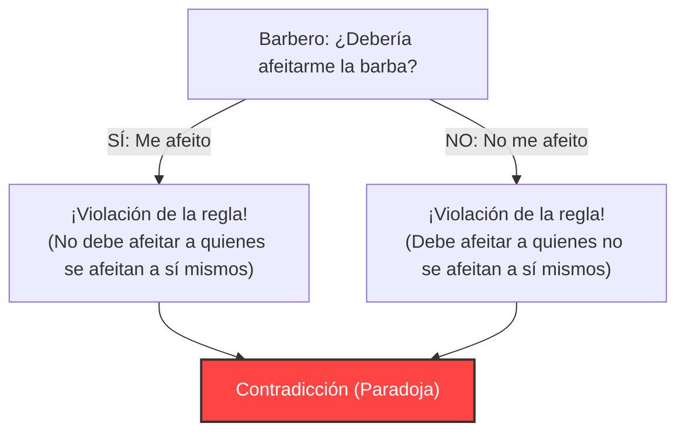
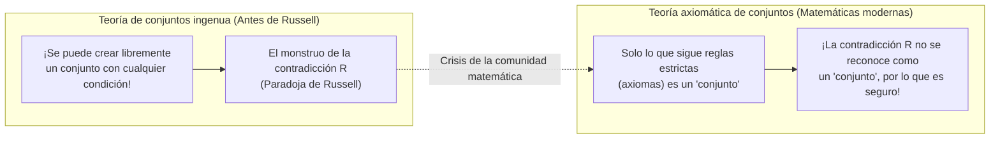

## 1. La "Paradoja del Barbero" que atacó a un pueblo tranquilo

En un pueblo pacífico, había un solo barbero.
A la entrada del pueblo, había un extraño cartel que decía:

**"El barbero de este pueblo afeita a todos los aldeanos que no se afeitan a sí mismos, y no afeita a nadie más."**

Los aldeanos estaban satisfechos con esta regla. Si no podías afeitarte a ti mismo, podías ir al barbero; si podías afeitarte a ti mismo, podías hacerlo en casa.

Pero un día, el joven barbero se miró al espejo y se dio cuenta de algo. En su barbilla había crecido una barba incipiente.
"Bueno, ¿debería afeitarme yo mismo?"

Decidió pensar lógicamente, siguiendo la regla del cartel.

1. **¿Qué pasaría si "se afeita a sí mismo"?**
   Según la regla, el barbero solo debe afeitar a "las personas que no se afeitan a sí mismas". Por lo tanto, si se afeita a sí mismo, no tiene derecho a que el barbero (él mismo) lo afeite. Es decir, "no debe afeitarse".
2. **¿Qué pasaría si "no se afeita a sí mismo"?**
   Según la regla, el barbero debe afeitar a todas las personas "que no se afeitan a sí mismas". Por lo tanto, si no se afeita a sí mismo, debe pedirle al barbero (él mismo) que lo afeite. Es decir, "debe afeitarse".

"Si se afeita, no debe afeitarse."
"Si no se afeita, debe afeitarse."

El barbero entró en pánico total y ya no pudo tomar ninguna decisión. Esta es la famosa **"Paradoja del Barbero"**.

---

## 2. La "Paradoja de Russell" que sacudió el mundo matemático

Esta "paradoja del barbero" es una analogía creada por el lógico y filósofo británico Bertrand Russell para explicar de forma sencilla a la gente en general una paradoja matemática que él mismo había descubierto.

Lo que realmente descubrió no fue un barbero, sino una terrible contradicción sobre los **"Conjuntos (Sets)"**.
A esto se le llama la **"Paradoja de Russell (1901)"**.

### El concepto de un "conjunto de conjuntos"
En matemáticas, un "conjunto" es una colección de cosas que cumplen con cierta condición.
- "El conjunto de los números pares menores o iguales a 10" = $\{2, 4, 6, 8, 10\}$
- "El conjunto de las manzanas rojas"

Además, es posible incluir otro "conjunto" como contenido (elemento) de un conjunto.
Por ejemplo, pensemos en "el conjunto de todos los libros del mundo". Este conjunto en sí mismo no es un "libro", por lo que "el conjunto de todos los libros del mundo" no está incluido dentro de su propio conjunto.

Por otro lado, pensemos en "el conjunto de las cosas que no son libros". Este conjunto en sí mismo tampoco es un "libro". Por lo tanto, "el conjunto de las cosas que no son libros" sí está incluido dentro de su propio conjunto.

De esta manera, los conjuntos del mundo se pueden dividir a grandes rasgos en dos tipos:
- **A: Conjuntos que no se contienen a sí mismos** (ej: el conjunto de libros)
- **B: Conjuntos que se contienen a sí mismos** (ej: el conjunto de las cosas que no son libros)

### El nacimiento del conjunto diabólico $R$

Aquí, Russell pensó en un conjunto especial $R$ como el siguiente:

**Conjunto $R$ = El conjunto de todos los "conjuntos que no se contienen a sí mismos (tipo A)"**

Escrito en fórmula matemática (notación por comprensión), se vería así:
$$ R = \{ x \mid x \notin x \} $$

Ahora, aquí está el problema principal. Russell planteó la siguiente pregunta sobre este conjunto $R$:

**"¿El conjunto $R$ se contiene a sí mismo ($R$)?"**

Pensemos en ello.

1. **¿Qué pasaría si $R$ "se contiene a sí mismo ($R \in R$)"?**
   La condición para entrar en $R$ es "no contenerse a sí mismo". Por lo tanto, $R$ no cumple la condición y no puede entrar en $R$. (Resulta en $R \notin R$, lo cual es una contradicción)

2. **¿Qué pasaría si $R$ "no se contiene a sí mismo ($R \notin R$)"?**
   La condición para entrar en $R$ es "no contenerse a sí mismo". Por lo tanto, $R$ cumple perfectamente la condición y debe entrar en $R$. (Resulta en $R \in R$, lo cual es una contradicción)

Escrito en una fórmula matemática, es un colapso lógico en una sola línea:
$$ R \in R \iff R \notin R $$

"Si se contiene, no se contiene." "Si no se contiene, se contiene."
Esto tiene exactamente la misma estructura que la paradoja del barbero. Sin embargo, en el caso del barbero del pueblo, sería solo un chiste como "el alcalde que puso un cartel con una regla tan tonta es un idiota", pero en el mundo de las matemáticas no es así.

Esto se debe a que la comunidad matemática de la época estaba en medio de un esfuerzo por reconstruir todas las matemáticas basándose en la regla ingenua de que **"mientras se defina claramente una condición, se puede crear libremente cualquier 'conjunto'"** (Teoría de conjuntos ingenua).

---

## 3. La tragedia de Frege

La persona a la que Russell le envió esta carta fue el gran lógico alemán Gottlob Frege.
Frege acababa de enviar a la imprenta el segundo volumen de su monumental obra, "Las leyes fundamentales de la aritmética", a la que había dedicado toda su vida. Este libro era la culminación de su intento de demostrar la completitud de las matemáticas, basándose en la regla de que "se puede crear un conjunto a partir de cualquier condición".

Al leer la carta de Russell, Frege cayó en la desesperación. Se acababa de demostrar que, utilizando las reglas de la "base de la base" de su libro, se podían crear "conjuntos absolutamente contradictorios" como la paradoja de Russell. Si la base se derrumba, todos los cientos de páginas de fórmulas matemáticas construidas sobre ella quedan invalidadas.

En el apéndice de su libro a punto de ser publicado, Frege dejó escrita la siguiente nota desgarradora:

> "Para un científico, apenas hay algo más indeseable que ver cómo se derrumban sus cimientos justo en el momento en que el trabajo está terminado. Fui puesto en esta posición por una carta del señor Bertrand Russell, justo cuando el libro iba a imprimirse."

---

## 4. Superando la crisis: el nacimiento de la teoría axiomática de conjuntos

La paradoja de Russell provocó un pánico masivo en la comunidad matemática conocido como la "crisis de los fundamentos de las matemáticas".
La regla libre y sin restricciones de que "mientras se decida una condición, se puede crear libremente un conjunto" había creado un monstruo llamado contradicción.

Para resolver esta crisis, los matemáticos comenzaron a hacer las reglas más estrictas.
Matemáticos como Zermelo y Fraenkel establecieron un **libro de reglas (sistema axiomático) que distingue estrictamente entre los "conjuntos que se pueden crear" y los "conjuntos que no se pueden crear (son demasiado grandes)"**. A esto se le llama el "Sistema de axiomas ZFC (Teoría axiomática de conjuntos)".

Bajo el sistema de axiomas ZFC, el conjunto $R$, "el conjunto que agrupa a todos los 'conjuntos que no se contienen a sí mismos'" que pensó Russell, fue prohibido en el mundo de las matemáticas, afirmando que **"es demasiado grande y peligroso, por lo que ya no se reconoce como un 'conjunto' (es simplemente una 'clase')"**.

---

## 5. Conclusión: Las paradojas son medicinas potentes para corregir los "errores de la lógica"

La paradoja de Russell es el pináculo de los errores lógicos causados por la autorreferencia (referirse a uno mismo), al igual que "la serpiente que se come su propia cola (Uróboros)" o "el mentiroso que dice 'yo soy un mentiroso'".

Las paradojas, que a primera vista parecen ser solo sofismas o juegos de palabras, destruyeron los cimientos de las matemáticas, la disciplina más rigurosa, y como resultado hicieron que las matemáticas evolucionaran para ser más sólidas y estrictas.

Si un genio como Russell no hubiera notado este "error del barbero", es posible que las matemáticas modernas y la informática, que es una extensión de su lógica, se hubieran desarrollado con contradicciones fatales en algún lugar.
Una paradoja es la medicina más estimulante que nos enseña los límites de la lógica humana.
