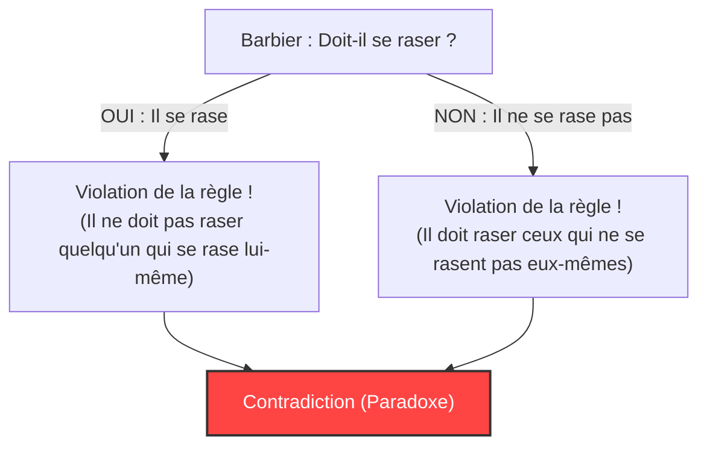
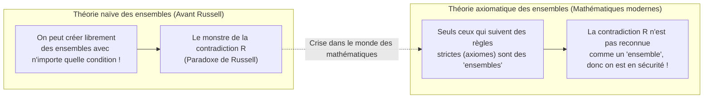

## 1. Le "paradoxe du barbier" qui frappa un paisible village

Dans un village paisible vivait un barbier.
À l'entrée du village se trouvait un étrange panneau d'affichage :

**"Le barbier de ce village rase tous les villageois qui ne se rasent pas eux-mêmes, et ne rase personne d'autre."**

Les villageois étaient satisfaits de cette règle. Ceux qui ne pouvaient pas se raser eux-mêmes n'avaient qu'à aller chez le barbier, et ceux qui pouvaient se raser le faisaient chez eux.

Cependant, un jour, le jeune barbier se regarda dans le miroir et réalisa soudainement quelque chose. Il avait une barbe naissante sur le menton.
"Alors, devrais-je me raser ?" se demanda-t-il.

Il décida de réfléchir logiquement en suivant la règle du panneau.

1. **S'il "se rase lui-même" ?**
   Selon la règle, le barbier ne peut raser que "ceux qui ne se rasent pas eux-mêmes". Par conséquent, puisqu'il se rase lui-même, il n'a pas le droit de se faire raser par le barbier (lui-même). Autrement dit, il "ne doit pas se raser".
2. **S'il "ne se rase pas lui-même" ?**
   Selon la règle, le barbier doit raser tous "ceux qui ne se rasent pas eux-mêmes". Par conséquent, puisqu'il ne se rase pas lui-même, il doit se faire raser par le barbier (lui-même). Autrement dit, il "doit se raser".

"S'il se rase, il ne doit pas se raser."
"S'il ne se rase pas, il doit se raser."

Le barbier a complètement paniqué, incapable de choisir l'une ou l'autre action. C'est le célèbre **"paradoxe du barbier"**.

---

## 2. Le "paradoxe de Russell" qui a secoué le monde des mathématiques

Ce "paradoxe du barbier" est une métaphore créée par le logicien et philosophe britannique Bertrand Russell pour expliquer de manière compréhensible au grand public le paradoxe mathématique qu'il avait découvert.

Ce qu'il avait vraiment découvert n'était pas un barbier, mais une terrible contradiction concernant la **"théorie des ensembles (Set)"**.
C'est ce qu'on appelle le **"paradoxe de Russell (1901)"**.

### L'idée d'"un ensemble d'ensembles"
En mathématiques, un "ensemble" est une collection d'objets qui satisfont à une certaine condition.
- "L'ensemble des nombres pairs inférieurs ou égaux à 10" = $\{2, 4, 6, 8, 10\}$
- "L'ensemble des pommes rouges"

Et il est également possible d'inclure d'autres "ensembles" comme éléments d'un ensemble.
Par exemple, considérons "l'ensemble de tous les livres du monde". Comme cet ensemble lui-même n'est pas un "livre", "l'ensemble de tous les livres du monde" n'est pas inclus dans son propre ensemble.

D'un autre côté, considérons "l'ensemble des choses qui ne sont pas des livres". Cet ensemble lui-même n'est pas non plus un "livre". Par conséquent, "l'ensemble des choses qui ne sont pas des livres" sera inclus dans son propre ensemble.

Ainsi, les ensembles de ce monde peuvent être globalement divisés en deux catégories :
- **A : Les ensembles qui ne se contiennent pas eux-mêmes** (ex. : l'ensemble des livres)
- **B : Les ensembles qui se contiennent eux-mêmes** (ex. : l'ensemble des choses qui ne sont pas des livres)

### La naissance de l'ensemble diabolique $R$

Ici, Russell a imaginé un ensemble spécial $R$ tel que :

**L'ensemble $R$ = l'ensemble de tous "les ensembles qui ne se contiennent pas eux-mêmes (type A)"**

Écrit sous forme mathématique (notation en compréhension), cela donne :
$$ R = \{ x \mid x \notin x \} $$

Maintenant, voici le cœur du problème. Russell a posé la question suivante concernant cet ensemble $R$ :

**"L'ensemble $R$ se contient-il lui-même ($R$) ?"**

Réfléchissons-y.

1. **Si $R$ "se contient lui-même ($R \in R$)" ?**
   La condition pour être inclus dans $R$ est de "ne pas se contenir soi-même". Par conséquent, $R$ ne remplit pas la condition et ne peut pas être inclus dans $R$. ($R \notin R$, ce qui est une contradiction)

2. **Si $R$ "ne se contient pas lui-même ($R \notin R$)" ?**
   La condition pour être inclus dans $R$ est de "ne pas se contenir soi-même". Par conséquent, $R$ remplit parfaitement la condition et doit être inclus dans $R$. ($R \in R$, ce qui est une contradiction)

Exprimé mathématiquement, c'est un effondrement logique en une seule ligne :
$$ R \in R \iff R \notin R $$

"S'il se contient, il ne se contient pas." "S'il ne se contient pas, il se contient."
C'est exactement la même structure que le paradoxe du barbier. Mais si, pour le barbier du village, cela peut se résumer à une plaisanterie du genre "le maire qui a mis en place une telle règle est juste stupide", dans le monde des mathématiques, ce n'est pas le cas.

En effet, la communauté mathématique de l'époque était en train d'essayer de reconstruire l'ensemble des mathématiques sur la base de la règle naïve (la théorie naïve des ensembles) selon laquelle **"tant que les conditions sont clairement définies, on peut librement créer un 'ensemble' de n'importe quoi"**.

---

## 3. La tragédie de Frege

La personne à qui Russell a envoyé cette lettre était le grand logicien allemand Gottlob Frege.
Frege venait tout juste d'envoyer à l'imprimerie le deuxième volume de son chef-d'œuvre, "Les Lois fondamentales de l'arithmétique", auquel il avait consacré toute sa vie. Ce livre était l'aboutissement d'une tentative de prouver la complétude des mathématiques sur la base de la règle selon laquelle "des ensembles peuvent être créés à partir de n'importe quelle condition".

En lisant la lettre de Russell, Frege fut désespéré. Car il était prouvé qu'en utilisant la règle du "fondement des fondements" de son livre, on pouvait créer des "ensembles absolument contradictoires" comme le paradoxe de Russell. Si les fondations s'effondrent, les centaines de pages de formules mathématiques construites dessus deviennent toutes invalides.

Frege a laissé le post-scriptum déchirant suivant à la fin du livre juste avant sa publication :

> "Pour un scientifique, il n'y a rien de plus tragique que de voir ses fondations s'effondrer au moment même où il pense avoir terminé son travail. Juste après l'envoi de ce livre à l'imprimerie, une lettre de M. Bertrand Russell m'a placé précisément dans cette situation."

---

## 4. Surmonter la crise : la naissance de la théorie axiomatique des ensembles

Le paradoxe de Russell a provoqué une grande panique dans le monde mathématique, connue sous le nom de "crise des fondements des mathématiques".
La règle désinvolte selon laquelle "tant que les conditions sont définies, vous pouvez créer librement des ensembles" avait engendré un monstre nommé contradiction.

Pour résoudre cette crise, les mathématiciens ont entrepris de durcir les règles.
Des mathématiciens tels que Zermelo et Fraenkel ont établi un **livre de règles (système d'axiomes) qui distingue strictement "les ensembles que l'on peut créer" et "les ensembles que l'on ne doit pas créer (trop grands)"**. C'est ce qu'on appelle la "théorie des ensembles de Zermelo-Fraenkel (ZFC)" ou "théorie axiomatique des ensembles".

Sous le système axiomatique ZFC, "l'ensemble $R$ regroupant tous 'les ensembles qui ne se contiennent pas eux-mêmes'", tel que l'avait imaginé Russell, a été banni du monde mathématique, car **"trop grand et dangereux, il n'est plus reconnu comme un 'ensemble' (c'est simplement une 'classe')"**.

---

## 5. Conclusion : Les paradoxes sont un remède de cheval pour corriger les "bugs logiques"

Le paradoxe de Russell est le summum du bug logique provoqué par l'autoréférence (faire référence à soi-même), semblable à "un serpent qui se mord la queue (Ouroboros)" ou "un menteur qui dit qu'il est un menteur".

Des paradoxes, qui à première vue peuvent sembler n'être que de la sophistique ou des jeux de mots, ont détruit les fondements de la discipline la plus rigoureuse qu'est les mathématiques, et ont finalement fait évoluer les mathématiques vers quelque chose de plus solide et de plus rigoureux.

Si le génie qu'était Russell n'avait pas remarqué ce "bug du barbier", les mathématiques modernes et l'informatique qui s'inscrit dans le prolongement de cette logique se seraient peut-être développées avec une contradiction fatale quelque part.
Les paradoxes sont les remèdes les plus stimulants qui nous enseignent les limites de la logique humaine.
