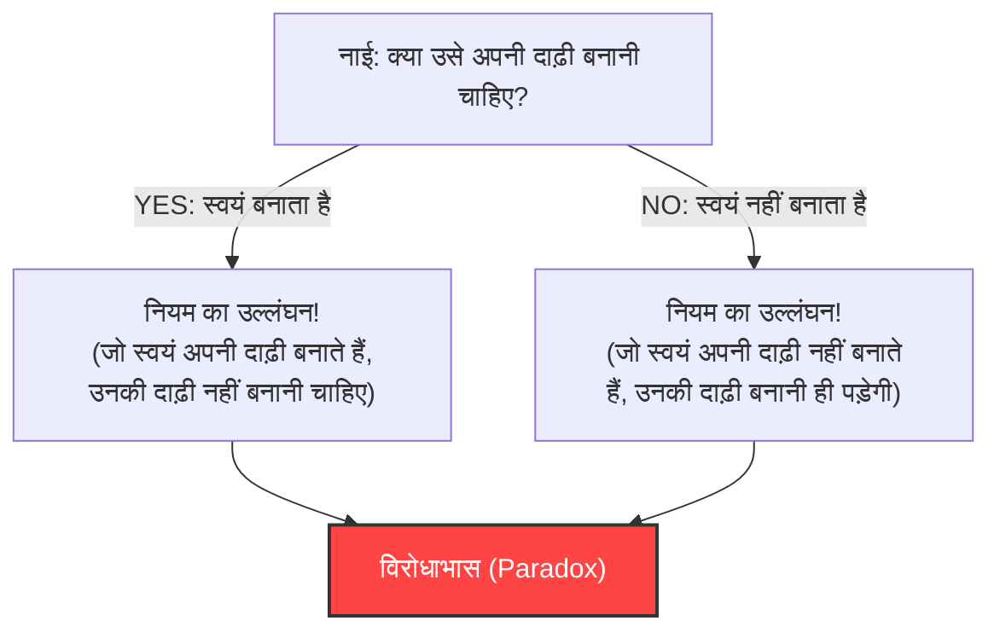
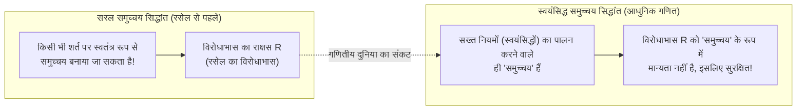

## 1. एक शांत गाँव पर हमला करने वाला "नाई का विरोधाभास (Barber Paradox)"

एक शांतिपूर्ण गाँव में एक नाई रहता था।
गाँव के प्रवेश द्वार पर एक अजीब सा साइनबोर्ड लगा था, जिस पर लिखा था:

**"इस गाँव का नाई केवल उन सभी ग्रामीणों की दाढ़ी बनाता है जो स्वयं अपनी दाढ़ी नहीं बनाते हैं, और अन्य किसी की दाढ़ी नहीं बनाता है।"**

गाँव वाले इस नियम से संतुष्ट थे। जो लोग अपनी दाढ़ी खुद नहीं बना सकते थे, वे नाई के पास जा सकते थे, और जो लोग खुद बना सकते थे, वे घर पर बना सकते थे।

लेकिन एक दिन, उस युवा नाई ने आईने में देखा और चौंक गया। उसकी ठुड्डी पर दाढ़ी बढ़ आई थी।
"तो, क्या मुझे अपनी दाढ़ी खुद बनानी चाहिए?"

उसने साइनबोर्ड के नियम के अनुसार तार्किक रूप से सोचने का फैसला किया।

1. **यदि वह "स्वयं अपनी दाढ़ी बनाता है" तो क्या होगा?**
   नियम के अनुसार, नाई केवल "उन लोगों की दाढ़ी बना सकता है जो स्वयं अपनी दाढ़ी नहीं बनाते हैं"। इसलिए, यदि वह स्वयं अपनी दाढ़ी बनाता है, तो वह नाई (स्वयं) से दाढ़ी बनवाने के योग्य नहीं है। अर्थात्, "उसे अपनी दाढ़ी नहीं बनानी चाहिए।"
2. **यदि वह "स्वयं अपनी दाढ़ी नहीं बनाता है" तो क्या होगा?**
   नियम के अनुसार, नाई को "उन सभी लोगों की दाढ़ी बनानी चाहिए जो स्वयं अपनी दाढ़ी नहीं बनाते हैं"। इसलिए, यदि वह स्वयं अपनी दाढ़ी नहीं बनाता है, तो उसे नाई (स्वयं) से दाढ़ी बनवानी ही होगी। अर्थात्, "उसे अपनी दाढ़ी बनानी ही पड़ेगी।"

"अगर बनाता है, तो उसे नहीं बनानी चाहिए।"
"अगर नहीं बनाता है, तो उसे बनानी ही पड़ेगी।"

नाई पूरी तरह से घबरा गया और दोनों में से कोई भी काम नहीं कर सका। यही प्रसिद्ध **"नाई का विरोधाभास"** है।

---

## 2. गणितीय दुनिया को हिला कर रख देने वाला "रसेल का विरोधाभास"

यह "नाई का विरोधाभास" एक रूपक है जिसे ब्रिटिश तर्कशास्त्री और दार्शनिक बर्ट्रेंड रसेल ने आम लोगों को अपने द्वारा खोजे गए गणितीय विरोधाभास को आसानी से समझाने के लिए बनाया था।

उसने वास्तव में नाई के बारे में नहीं, बल्कि **"समुच्चय (Set)"** से संबंधित एक भयानक विरोधाभास की खोज की थी।
इसे **"रसेल का विरोधाभास (1901)"** कहा जाता है।

### "समुच्चयों का समुच्चय" की अवधारणा
गणित में "समुच्चय" का अर्थ उन चीजों का संग्रह है जो किसी निश्चित शर्त को पूरा करते हैं।
- "10 या उससे कम सम संख्याओं का समुच्चय" = $\{2, 4, 6, 8, 10\}$
- "लाल सेबों का समुच्चय"

और एक समुच्चय की सामग्री (अवयवों) के रूप में, किसी अन्य "समुच्चय" को भी रखा जा सकता है।
उदाहरण के लिए, "दुनिया की सभी पुस्तकों का समुच्चय" पर विचार करें। यह समुच्चय स्वयं कोई "पुस्तक" नहीं है, इसलिए "दुनिया की सभी पुस्तकों का समुच्चय" स्वयं अपने समुच्चय में शामिल नहीं होता है।

दूसरी ओर, "उन चीज़ों का समुच्चय जो पुस्तकें नहीं हैं" पर विचार करें। यह समुच्चय स्वयं भी "पुस्तक" नहीं है। इसलिए, "उन चीज़ों का समुच्चय जो पुस्तकें नहीं हैं" स्वयं अपने समुच्चय में शामिल होगा।

इस तरह, दुनिया में समुच्चयों को मोटे तौर पर दो प्रकारों में विभाजित किया जा सकता है:
- **A: ऐसे समुच्चय जो स्वयं को शामिल नहीं करते हैं** (उदाहरण: पुस्तकों का समुच्चय)
- **B: ऐसे समुच्चय जो स्वयं को शामिल करते हैं** (उदाहरण: उन चीज़ों का समुच्चय जो पुस्तकें नहीं हैं)

### शैतानी समुच्चय $R$ का जन्म

यहाँ रसेल ने एक विशेष समुच्चय $R$ पर विचार किया, जो इस प्रकार है:

**समुच्चय $R$ = सभी "ऐसे समुच्चयों का समुच्चय जो स्वयं को शामिल नहीं करते हैं (प्रकार A)"**

गणितीय सूत्र (समुच्चय निर्माण रूप) में लिखने पर यह ऐसा दिखता है:
$$ R = \{ x \mid x \notin x \} $$

अब, मुख्य बात यह है। रसेल ने इस समुच्चय $R$ के लिए निम्नलिखित प्रश्न पूछा:

**"क्या समुच्चय $R$ स्वयं ($R$) को शामिल करता है?"**

आइए विचार करें:

1. **यदि $R$ "स्वयं को शामिल करता है ($R \in R$)" तो क्या होगा?**
   $R$ में शामिल होने की शर्त "स्वयं को शामिल न करना" है। इसलिए, $R$ इस शर्त को पूरा नहीं करता है और $R$ में प्रवेश नहीं कर सकता। ($R \notin R$ होता है, जो एक विरोधाभास है)

2. **यदि $R$ "स्वयं को शामिल नहीं करता है ($R \notin R$)" तो क्या होगा?**
   $R$ में शामिल होने की शर्त "स्वयं को शामिल न करना" है। इसलिए, $R$ पूरी तरह से शर्त को पूरा करता है और उसे $R$ में शामिल होना ही चाहिए। ($R \in R$ होता है, जो एक विरोधाभास है)

गणितीय सूत्र में, यह केवल एक पंक्ति का तार्किक पतन है:
$$ R \in R \iff R \notin R $$

"यदि शामिल करता है, तो शामिल नहीं है।" "यदि शामिल नहीं है, तो शामिल करता है।"
यह पूरी तरह से नाई के विरोधाभास की संरचना के समान है। हालांकि, गाँव के नाई के मामले में यह कह कर हंसा जा सकता है कि "ऐसा नियम बनाने वाला गाँव का मुखिया ही मूर्ख है," लेकिन गणित की दुनिया में ऐसा नहीं होता।

क्योंकि उस समय गणित की दुनिया में, **"यदि शर्तें स्पष्ट रूप से परिभाषित हैं, तो कोई भी स्वतंत्र रूप से 'समुच्चय' बना सकता है"** जैसे सरल नियम (सरल समुच्चय सिद्धांत - Naive Set Theory) को आधार मानकर सभी गणित का पुनर्निर्माण करने का प्रयास जोरों पर था।

---

## 3. फ्रेगे की त्रासदी

रसेल ने यह पत्र जर्मनी के महान तर्कशास्त्री गोटलोब फ्रेगे को भेजा था।
फ्रेगे ने ठीक उसी समय अपनी महान कृति, 'अंकगणित के मूल नियम' का दूसरा खंड प्रेस में छपने के लिए भेजा था, जिसके लिए उन्होंने अपना पूरा जीवन समर्पित कर दिया था। यह पुस्तक "किसी भी शर्त से समुच्चय बनाया जा सकता है" के नियम पर आधारित होकर गणित की पूर्णता को साबित करने का एक संग्रह था।

रसेल का पत्र पढ़कर फ्रेगे निराश हो गए। ऐसा इसलिए क्योंकि यह साबित हो गया था कि उनकी पुस्तक के "मूल आधार" के नियमों का उपयोग करके रसेल के विरोधाभास जैसा "पूर्णतः विरोधाभासी समुच्चय" बनाया जा सकता है। यदि नींव ही ढह जाए, तो उस पर बने सैकड़ों पन्नों के गणितीय सूत्र सभी अमान्य हो जाएंगे।

फ्रेगे ने प्रकाशन से ठीक पहले अपनी पुस्तक के अंत में निम्नलिखित दर्दनाक नोट जोड़ा:

> "एक वैज्ञानिक के लिए इससे अधिक दुखद कुछ नहीं हो सकता कि जब वह सोचे कि उसका काम पूरा हो गया है, तभी वह उसकी नींव को ढहते हुए देखे। इस पुस्तक के छपने के लिए भेजे जाने के ठीक बाद, बर्ट्रेंड रसेल के एक पत्र ने मुझे बिल्कुल इसी स्थिति में ला खड़ा किया है।"

---

## 4. संकट से उबरना: स्वयंसिद्ध समुच्चय सिद्धांत (Axiomatic Set Theory) का जन्म

रसेल के विरोधाभास ने गणितीय दुनिया में "गणित की नींव का संकट" नामक भारी दहशत पैदा कर दी।
"यदि शर्तें तय कर दी जाएं, तो स्वतंत्र रूप से समुच्चय बनाए जा सकते हैं" वाले इस बेलगाम नियम ने विरोधाभास नाम के एक राक्षस को जन्म दे दिया था।

इस संकट को हल करने के लिए, गणितज्ञों ने नियमों को सख्त करने का निर्णय लिया।
ज़र्मेलो (Zermelo) और फ़्रेंकेल (Fraenkel) जैसे गणितज्ञों ने एक **नियम-पुस्तिका (स्वयंसिद्ध प्रणाली - Axiom System) विकसित की जो "बनाए जा सकने वाले समुच्चयों" और "न बनाए जा सकने वाले (बहुत बड़े) समुच्चयों" के बीच स्पष्ट अंतर करती है**। इसे "ZFC स्वयंसिद्ध प्रणाली (स्वयंसिद्ध समुच्चय सिद्धांत)" कहा जाता है।

ZFC स्वयंसिद्ध प्रणाली के तहत, रसेल द्वारा विचार किए गए "सभी 'ऐसे समुच्चयों का समुच्चय जो स्वयं को शामिल नहीं करते हैं' $R$" को गणित की दुनिया से यह कहकर प्रतिबंधित कर दिया गया कि **"यह इतना बड़ा और खतरनाक है कि इसे अब 'समुच्चय' के रूप में मान्यता नहीं दी जाएगी (यह केवल एक 'वर्ग' या 'Class' है)।"**

---

## 5. निष्कर्ष: विरोधाभास "तार्किक बग" को ठीक करने के लिए एक शक्तिशाली औषधि है

रसेल का विरोधाभास आत्म-संदर्भ (स्वयं का उल्लेख करना) के कारण होने वाले तार्किक बग का चरम रूप है, जैसे कि "अपनी ही पूंछ खाने वाला सांप (उरोबोरोस)" या "झूठा जो कहता है कि मैं झूठा हूँ"।

पहली नज़र में महज़ कुतर्क या शब्दों का खेल लगने वाला यह विरोधाभास, गणित जैसे सबसे कठोर विषय की नींव को नष्ट कर देता है, और परिणामस्वरूप गणित को और अधिक मजबूत तथा सख्त रूप में विकसित होने के लिए प्रेरित करता है।

यदि रसेल जैसे प्रतिभाशाली व्यक्ति ने इस "नाई के बग" को नहीं देखा होता, तो आधुनिक गणित और उसके तर्क के विस्तार में कंप्यूटर विज्ञान का विकास शायद किसी घातक विरोधाभास के साथ हुआ होता।
विरोधाभास एक बहुत ही उत्तेजक और शक्तिशाली औषधि है जो हमें मानवीय तर्क की सीमाओं के बारे में सिखाती है।
