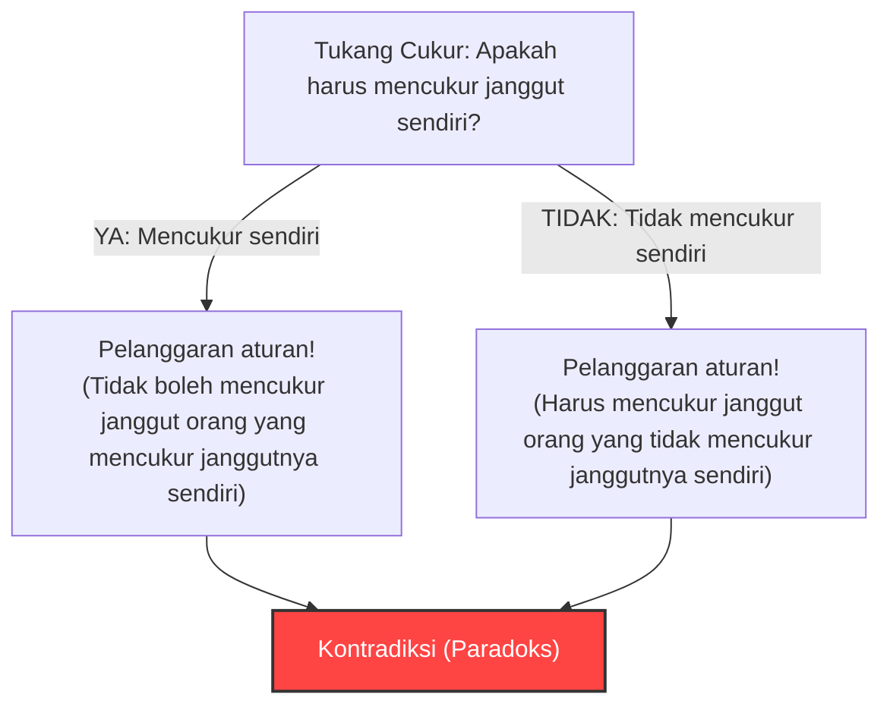
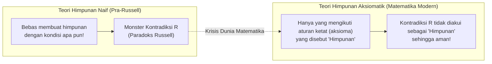

## 1. "Paradoks Tukang Cukur" yang Menyerang Desa yang Damai

Di sebuah desa yang damai, ada seorang tukang cukur.
Di pintu masuk desa, terdapat papan pengumuman aneh sebagai berikut:

**"Tukang cukur di desa ini mencukur janggut semua penduduk yang tidak mencukur janggutnya sendiri, dan tidak mencukur janggut orang selain itu."**

Penduduk desa merasa puas dengan aturan ini. Orang yang tidak bisa mencukur janggutnya sendiri bisa pergi ke tukang cukur, sedangkan orang yang bisa mencukur janggutnya sendiri bisa mencukurnya di rumah.

Namun suatu hari, pemuda tukang cukur itu melihat ke cermin dan terkejut. Ada janggut tipis tumbuh di dagunya.
"Nah, apakah aku harus mencukur janggutku sendiri?"

Dia memutuskan untuk berpikir secara logis mengikuti aturan di papan pengumuman.

1. **Bagaimana jika dia memutuskan untuk "mencukur janggutnya sendiri"?**
   Menurut aturan, tukang cukur hanya boleh mencukur janggut "orang yang tidak mencukur janggutnya sendiri". Oleh karena itu, jika dia mencukur janggutnya sendiri, dia tidak memenuhi syarat untuk dicukur janggutnya oleh tukang cukur (dirinya sendiri). Artinya, "tidak boleh mencukur".
2. **Bagaimana jika dia memutuskan untuk "tidak mencukur janggutnya sendiri"?**
   Menurut aturan, tukang cukur harus mencukur janggut semua "orang yang tidak mencukur janggutnya sendiri". Oleh karena itu, jika dia tidak mencukur janggutnya sendiri, dia harus meminta tukang cukur (dirinya sendiri) untuk mencukur janggutnya. Artinya, "harus mencukur".

"Jika mencukur, maka tidak boleh mencukur."
"Jika tidak mencukur, maka harus mencukur."

Tukang cukur itu menjadi panik sepenuhnya dan tidak bisa mengambil tindakan apa pun. Inilah **"Paradoks Tukang Cukur"** yang terkenal.

---

## 2. "Paradoks Russell" yang Mengguncang Dunia Matematika

"Paradoks Tukang Cukur" ini adalah sebuah analogi yang dibuat oleh ahli logika dan filsuf Inggris, Bertrand Russell, untuk menjelaskan paradoks matematika temuannya agar mudah dipahami oleh masyarakat umum.

Apa yang sebenarnya dia temukan bukanlah tentang tukang cukur, melainkan kontradiksi mengerikan terkait **"Himpunan (Set)"**.
Hal tersebut disebut **"Paradoks Russell (1901)"**.

### Konsep "Himpunan dari Himpunan"
"Himpunan" dalam matematika adalah kumpulan dari objek-objek yang memenuhi kondisi tertentu.
- "Himpunan bilangan genap 10 atau kurang" = $\{2, 4, 6, 8, 10\}$
- "Himpunan apel merah"

Lalu, sebagai isi (elemen) dari sebuah himpunan, kita juga bisa memasukkan "himpunan" lain.
Misalnya, mari kita pertimbangkan "himpunan semua buku di seluruh dunia". Karena himpunan ini sendiri bukanlah sebuah "buku", maka "himpunan semua buku di seluruh dunia" tidak termasuk ke dalam himpunannya sendiri.

Di sisi lain, mari kita pertimbangkan "himpunan benda-benda yang bukan buku". Himpunan ini sendiri juga bukanlah sebuah "buku". Oleh karena itu, "himpunan benda-benda yang bukan buku" akan termasuk ke dalam himpunannya sendiri.

Dengan demikian, himpunan di dunia ini secara garis besar dapat dibagi menjadi 2 jenis:
- **A: Himpunan yang tidak memuat dirinya sendiri** (Contoh: himpunan buku)
- **B: Himpunan yang memuat dirinya sendiri** (Contoh: himpunan benda yang bukan buku)

### Lahirnya Himpunan Iblis $R$

Di sini, Russell mempertimbangkan sebuah himpunan khusus $R$ sebagai berikut:

**Himpunan $R$ = Himpunan yang mengumpulkan semua "himpunan yang tidak memuat dirinya sendiri (tipe A)"**

Jika ditulis dalam rumus matematika (notasi pembentuk himpunan), maka akan menjadi seperti ini:
$$ R = \{ x \mid x \notin x \} $$

Nah, dari sinilah inti permasalahannya dimulai. Russell mengajukan pertanyaan berikut terhadap himpunan $R$ ini:

**"Apakah himpunan $R$ memuat dirinya sendiri ($R$)?"**

Mari kita pikirkan.

1. **Bagaimana jika $R$ "memuat dirinya sendiri ($R \in R$)"?**
   Syarat untuk masuk ke dalam $R$ adalah "tidak memuat dirinya sendiri". Oleh karena itu, $R$ tidak memenuhi syarat dan tidak dapat masuk ke dalam $R$. (Menjadi $R \notin R$ yang merupakan sebuah kontradiksi)

2. **Bagaimana jika $R$ "tidak memuat dirinya sendiri ($R \notin R$)"?**
   Syarat untuk masuk ke dalam $R$ adalah "tidak memuat dirinya sendiri". Oleh karena itu, $R$ dengan sempurna memenuhi syarat dan harus masuk ke dalam $R$. (Menjadi $R \in R$ yang merupakan sebuah kontradiksi)

Jika ditulis dengan rumus matematika, ini adalah keruntuhan logika yang hanya terdiri dari satu baris.
$$ R \in R \iff R \notin R $$

"Jika memuat, maka tidak dimuat." "Jika tidak dimuat, maka memuat."
Ini adalah struktur yang persis sama dengan Paradoks Tukang Cukur. Namun, jika ini tentang tukang cukur di desa, itu hanya akan menjadi bahan tertawaan "kepala desa yang membuat aturan konyol itu saja yang bodoh", tetapi di dunia matematika tidak bisa begitu.

Sebab pada saat itu, dunia matematika sedang berada di tengah proses membangun ulang seluruh matematika dengan berlandaskan pada aturan sederhana (Teori Himpunan Naif) yang berbunyi: **"Selama kondisinya didefinisikan dengan jelas, kita bebas membuat 'himpunan' dari apa pun."**

---

## 3. Tragedi Frege

Orang yang dikirimi surat ini oleh Russell adalah ahli logika hebat asal Jerman, Gottlob Frege.
Frege baru saja mengirimkan buku kedua dari karya besarnya, "Hukum Dasar Aritmetika", yang telah ia dedikasikan seluruh hidupnya, ke percetakan. Buku ini adalah puncak upayanya untuk membuktikan kelengkapan matematika berdasarkan pada aturan "himpunan dapat dibuat dari kondisi apa pun".

Membaca surat dari Russell, Frege menjadi putus asa. Sebab terbukti bahwa jika ia menggunakan aturan "dasar dari segala dasar" dalam bukunya, ia bisa menciptakan "himpunan yang mutlak berkontradiksi" seperti Paradoks Russell. Jika fondasinya runtuh, ratusan halaman rumus matematika yang dibangun di atasnya akan menjadi tidak valid sama sekali.

Frege meninggalkan sebuah catatan tambahan yang memilukan di bagian akhir buku yang baru saja akan diterbitkan tersebut:

> "Bagi seorang ilmuwan, tidak ada yang lebih menyedihkan daripada melihat fondasinya runtuh tepat pada saat ia merasa pekerjaannya telah selesai. Segera setelah buku ini dikirim ke percetakan, saya ditempatkan tepat dalam situasi itu oleh surat dari Bapak Bertrand Russell."

---

## 4. Mengatasi Krisis: Lahirnya Teori Himpunan Aksiomatik

Paradoks Russell menyebabkan kepanikan besar di dunia matematika yang disebut sebagai "Krisis Fondasi Matematika".
Aturan bebas yang mengatakan "Selama kondisinya ditentukan, bebas membuat himpunan apa pun" telah melahirkan monster bernama kontradiksi.

Untuk mengatasi krisis ini, para matematikawan mulai memperketat aturan.
Matematikawan seperti Zermelo dan Fraenkel merumuskan **sistem aturan (sistem aksioma) yang secara ketat membedakan antara "himpunan yang boleh dibuat" dan "himpunan yang tidak boleh dibuat (terlalu besar)"**. Ini disebut "Sistem Aksioma ZFC (Teori Himpunan Aksiomatik)".

Di bawah sistem aksioma ZFC, himpunan $R$ seperti yang dipikirkan oleh Russell, yaitu "himpunan yang mengumpulkan semua 'himpunan yang tidak memuat dirinya sendiri'", dinyatakan sebagai **"terlalu besar dan berbahaya, sehingga tidak lagi diakui sebagai sebuah 'himpunan' (itu hanyalah sebuah 'kelas')"** dan dilarang masuk dari dunia matematika.

---

## 5. Kesimpulan: Paradoks adalah "Obat Kuat" untuk Memperbaiki "Bug Logika"

Paradoks Russell adalah puncak dari bug logika yang disebabkan oleh referensi diri (merujuk pada diri sendiri), mirip dengan "ular yang memakan ekornya sendiri (Ouroboros)" atau "pembohong yang mengatakan bahwa saya adalah pembohong".

Paradoks, yang pada pandangan pertama mungkin tampak seperti sekadar permainan kata-kata atau argumen konyol, telah menghancurkan fondasi matematika—disiplin ilmu yang paling ketat—dan pada akhirnya membuat matematika berevolusi menjadi sesuatu yang lebih kuat dan lebih ketat.

Seandainya seorang jenius bernama Russell tidak menyadari "bug tukang cukur" ini, matematika modern dan ilmu komputer yang merupakan perpanjangan dari logika matematika mungkin akan berkembang dengan membawa kontradiksi yang fatal di suatu tempat.
Paradoks adalah obat kuat yang paling merangsang, yang mengajarkan kita batas dari logika manusia.
