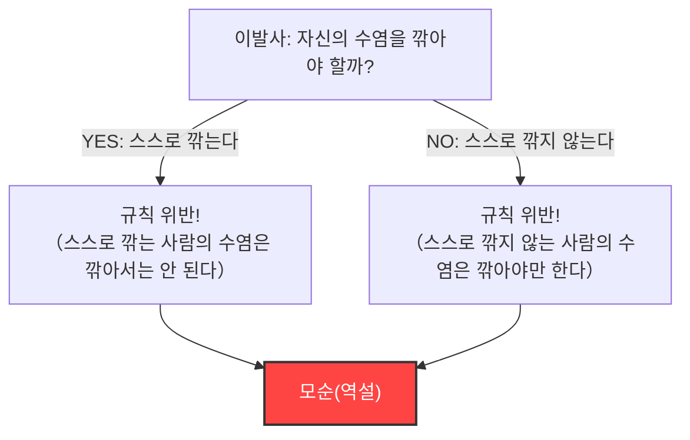
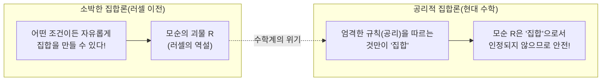

## 1. 평화로운 마을을 덮친 "이발사의 역설"

어느 평화로운 마을에, 한 명의 이발사가 있었습니다.
마을 입구에는 다음과 같은 기묘한 푯말이 서 있었습니다.

**"이 마을의 이발사는, 스스로 자신의 수염을 깎지 않는 마을 사람 전원의 수염을 깎아주고, 그 외의 사람의 수염은 깎지 않습니다."**

마을 사람들은 이 규칙에 만족했습니다. 스스로 깎을 수 없는 사람은 이발사에게 가면 되고, 스스로 깎을 수 있는 사람은 집에서 깎으면 되기 때문입니다.

그러나 어느 날, 젊은 이발사는 거울을 보고 깜짝 놀랐습니다. 그의 턱에는 까칠하게 수염이 자라 있었던 것입니다.
"자, 나는 내 수염을 깎아야 할까?"

그는 푯말의 규칙에 따라 논리적으로 생각해 보기로 했습니다.

1. **만약 그가 "자신의 수염을 깎는다"고 한다면?**
   규칙에 따르면, 이발사는 "스스로 자신의 수염을 깎지 않는 사람"의 수염만 깎아야 합니다. 따라서, 스스로 수염을 깎는 그는, 이발사(자기 자신)에게 수염을 깎을 자격이 없습니다. 즉, "깎아서는 안 된다".
2. **만약 그가 "자신의 수염을 깎지 않는다"고 한다면?**
   규칙에 따르면, 이발사는 "스스로 자신의 수염을 깎지 않는 사람" 전원의 수염을 깎아야만 합니다. 따라서, 스스로 수염을 깎지 않는 그는, 이발사(자기 자신)에게 수염을 깎게 해야 합니다. 즉, "깎아야만 한다".

"깎는다고 한다면, 깎아서는 안 된다."
"깎지 않는다고 한다면, 깎아야만 한다."

이발사는 완전히 패닉에 빠져, 어느 쪽의 행동도 취할 수 없게 되어버렸습니다. 이것이 유명한 **"이발사의 역설"**입니다.

---

## 2. 수학계를 뒤흔든 "러셀의 역설"

이 "이발사의 역설"은, 영국의 논리학자이자 철학자인 버트런드 러셀이 자신이 발견한 수학적 역설을 일반인들도 알기 쉽게 설명하기 위해 만든 비유입니다.

그가 실제로 발견한 것은 이발사가 아니라, **"집합(Set)"**에 관한 무서운 모순이었습니다.
그것을 **"러셀의 역설(1901년)"**이라고 부릅니다.

### "집합의 집합"이라는 사고방식
수학에서 "집합"이란, 어떠한 조건을 만족하는 것들의 모임을 말합니다.
- "10 이하의 짝수의 집합" = $\{2, 4, 6, 8, 10\}$
- "붉은 사과의 집합"

그리고, 집합의 내용물(원소)로서, 다른 "집합"을 넣을 수도 있습니다.
예를 들어, "전 세계의 모든 책의 집합"을 생각해 봅니다. 이 집합 자체는 "책"이 아니므로, "전 세계의 모든 책의 집합"은 자기 자신의 집합 안에는 포함되지 않습니다.

한편, "책이 아닌 것들의 집합"을 생각해 봅니다. 이 집합 자체도 "책"이 아닙니다. 따라서, "책이 아닌 것들의 집합"은 자기 자신의 집합 안에 포함되게 됩니다.

이처럼, 세상의 집합은 크게 두 종류로 나눌 수 있습니다.
- **A: 자기 자신을 포함하지 않는 집합**(예: 책의 집합)
- **B: 자기 자신을 포함하는 집합**(예: 책이 아닌 것들의 집합)

### 악마의 집합 $R$ 의 탄생

여기서 러셀은, 다음과 같은 특수한 집합 $R$ 을 생각했습니다.

**집합 $R$ = "자기 자신을 포함하지 않는 집합(A의 유형)"을 모두 모은 집합**

수식(조건제시법)으로 쓰면 이렇게 됩니다.
$$ R = \{ x \mid x \notin x \} $$

자, 이제부터가 본론입니다. 러셀은 이 집합 $R$ 에 대해, 다음과 같은 질문을 던졌습니다.

**"집합 $R$ 은 자기 자신($R$)을 포함합니까?"**

생각해 봅시다.

1. **만약 $R$ 이 "자기 자신을 포함한다($R \in R$)"고 한다면?**
   $R$ 안에 들어갈 조건은 "자기 자신을 포함하지 않는 것"입니다. 따라서, $R$ 은 조건을 만족하지 못하고, $R$ 안에 들어갈 수 없습니다. ($R \notin R$ 이 되어 모순)

2. **만약 $R$ 이 "자기 자신을 포함하지 않는다($R \notin R$)"고 한다면?**
   $R$ 안에 들어갈 조건은 "자기 자신을 포함하지 않는 것"입니다. 따라서, $R$ 은 훌륭하게 조건을 만족하며, $R$ 안에 들어가야만 합니다. ($R \in R$ 이 되어 모순)

수식으로 쓰면, 단 한 줄의 논리 붕괴입니다.
$$ R \in R \iff R \notin R $$

"포함한다고 하면, 포함되지 않는다." "포함되지 않는다고 하면, 포함한다."
이것은 이발사의 역설과 완전히 똑같은 구조입니다. 하지만, 마을의 이발사라면 "그런 규칙의 푯말을 세운 촌장이 바보일 뿐이다"라며 웃어넘길 일이지만, 수학의 세계에서는 그렇지 않습니다.

왜냐하면 당시의 수학계는, **"조건만 명확히 정의하면, 어떤 것이든 자유롭게 '집합'을 만들어도 좋다"**는 소박한 규칙(소박한 집합론)을 토대로 하여, 모든 수학을 재구축하려던 한창이었기 때문입니다.

---

## 3. 프레게의 비극

러셀이 이 편지를 보낸 상대는, 독일의 위대한 논리학자 고틀로프 프레게였습니다.
프레게는 마침 자신의 인생 전부를 바친 대저 『산술의 기본 법칙』 제2권을 인쇄소에 넘긴 직후였습니다. 이 책은, "어떤 조건에서든 집합을 만들 수 있다"는 규칙을 기초로 하여, 수학의 완전성을 증명하려고 한 집대성이었습니다.

러셀의 편지를 읽은 프레게는 절망했습니다. 자신의 책의 "기초 중의 기초" 규칙을 사용하면, 러셀의 역설과 같은 "절대로 모순되는 집합"을 만들 수 있다는 것이 증명되었기 때문입니다. 기초가 무너지면, 그 위에 세워진 수백 페이지의 수식은 모두 무효가 되어버립니다.

프레게는 출판 직전의 책 말미에, 다음과 같은 비통한 추기를 남겼습니다.

> "과학자에게, 자신의 작업이 완성되었다고 생각한 순간에 그 기초가 무너져 내리는 것을 보는 것만큼 비참한 일은 없다. 이 책이 인쇄에 들어간 직후, 버트런드 러셀 씨의 편지로 인해, 나는 바로 그 상황에 처하게 되었다."

---

## 4. 위기를 극복하며: 공리적 집합론의 탄생

러셀의 역설은, 수학계에 "수학 기초의 위기"라 불리는 대패닉을 일으켰습니다.
"조건만 정하면 자유롭게 집합을 만들어도 좋다"는 자유분방한 규칙이, 모순이라는 이름의 괴물을 낳아버린 것입니다.

이 위기를 해결하기 위해, 수학자들은 규칙의 엄격화에 나섰습니다.
체르멜로나 프렝켈 같은 수학자들은, **"만들어도 좋은 집합"과 "만들어서는 안 되는 (너무 큰) 집합"을 엄밀하게 구별하는 규칙서(공리계)**를 정비했습니다. 이것을 "ZFC 공리계(공리적 집합론)"라고 부릅니다.

ZFC 공리계 하에서는, 러셀이 생각했던 것과 같은 "모든 '자신을 포함하지 않는 집합'을 모은 집합 $R$"은, **"너무 커서 위험하기 때문에, 더 이상 '집합'으로서 인정하지 않는다(그것은 단순한 '고유 클래스'이다)"**라며 수학의 세계에서 출입을 금지당했습니다.

---

## 5. 요약: 역설은 "논리의 버그"를 고치기 위한 극약

러셀의 역설은, "자신의 꼬리를 먹는 뱀(우로보로스)"이나 "나는 거짓말쟁이라고 말하는 거짓말쟁이"와 같이, 자기 언급(자기 자신을 언급하는 것)이 일으키는 논리 버그의 극치입니다.

언뜻 보면 단순한 억지나 말장난처럼 생각될 수 있는 역설이, 수학이라는 가장 엄밀한 학문의 근저를 파괴하고, 결과적으로 수학을 보다 견고하고 엄밀한 것으로 진화시켰습니다.

만약 러셀이라는 천재가 이 "이발사의 버그"를 눈치채지 못했다면, 현대의 수학이나, 그 논리의 연장선상에 있는 컴퓨터 과학은 어딘가에 치명적인 모순을 안은 채 발전했을지도 모릅니다.
역설이란, 인간 논리의 한계를 가르쳐 주는 가장 자극적인 극약인 것입니다.
