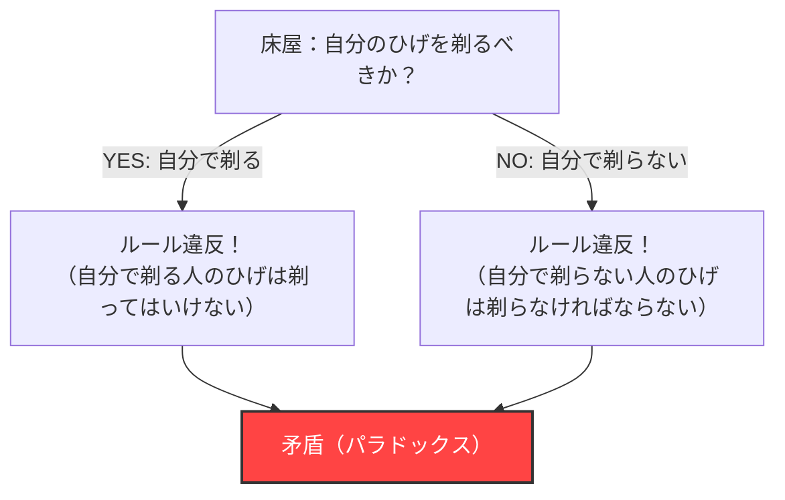
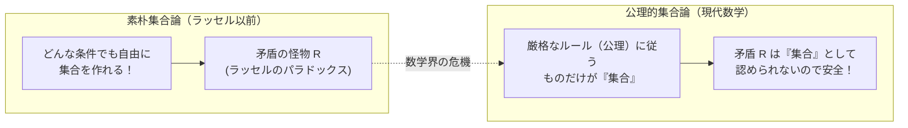

## 1. 穏やかな村を襲った「床屋のパラドックス」

ある平和な村に、一人の床屋がいました。
村の入り口には、次のような奇妙な立て札が立っています。

**「この村の床屋は、自分で自分のひげを剃らない村人全員のひげを剃り、それ以外の人のひげは剃りません。」**

村人たちはこのルールに満足していました。自分で剃れない人は床屋に行けばいいし、自分で剃れる人は家で剃ればいいからです。

しかしある日、床屋の青年は鏡を見てハッと気付きました。彼の顎には無精ひげが生えていたのです。
「さて、俺は自分のひげを剃るべきだろうか？」

彼は立て札のルールに従って、論理的に考えてみることにしました。

1. **もし彼が「自分のひげを剃る」としたら？**
   ルールによれば、床屋は「自分で自分のひげを剃らない人」のひげしか剃ってはいけません。したがって、自分でひげを剃る彼は、床屋（自分自身）にひげを剃ってもらう資格がありません。つまり、「剃ってはいけない」。
2. **もし彼が「自分のひげを剃らない」としたら？**
   ルールによれば、床屋は「自分で自分のひげを剃らない人」全員のひげを剃らなければなりません。したがって、自分でひげを剃らない彼は、床屋（自分自身）にひげを剃ってもらわなければなりません。つまり、「剃らなければならない」。

「剃るとしたら、剃ってはいけない。」
「剃らないとしたら、剃らなければならない。」

床屋は完全にパニックになり、どちらの行動も取れなくなってしまいました。これが有名な**「床屋のパラドックス」**です。

---

## 2. 数学界を激震させた「ラッセルのパラドックス」

この「床屋のパラドックス」は、イギリスの論理学者・哲学者であるバートランド・ラッセルが、自身の発見した数学的パラドックスを一般の人にもわかりやすく説明するために作った例え話です。

彼が本当に発見したものは床屋ではなく、**「集合（Set）」**に関する恐ろしい矛盾でした。
それを**「ラッセルのパラドックス（1901年）」**と呼びます。

### 「集合の集合」という考え方
数学における「集合」とは、何らかの条件を満たすモノの集まりのことです。
- 「10以下の偶数の集合」＝ $\{2, 4, 6, 8, 10\}$
- 「赤いリンゴの集合」

そして、集合の中身（要素）として、別の「集合」を入れることもできます。
例えば、「世界中のあらゆる本の集合」を考えます。この集合そのものは「本」ではありませんから、「世界中のあらゆる本の集合」は、自分自身の集合の中には含まれません。

一方で、「本ではないモノの集合」を考えます。この集合そのものも「本」ではありません。したがって、「本ではないモノの集合」は、自分自身の集合の中に含まれることになります。

このように、世の中の集合は大きく2種類に分けられます。
- **A：自分自身を含まない集合**（例：本の集合）
- **B：自分自身を含む集合**（例：本ではないモノの集合）

### 悪魔の集合 $R$ の誕生

ここでラッセルは、次のような特殊な集合 $R$ を考えました。

**集合 $R$ ＝「自分自身を含まない集合（Aのタイプ）」をすべて集めた集合**

数式（内包的記法）で書くとこうなります。
$$ R = \{ x \mid x \notin x \} $$

さて、ここからが本題です。ラッセルはこの集合 $R$ に対して、次のような質問を投げかけました。

**「集合 $R$ は、自分自身（$R$）を含みますか？」**

考えてみましょう。

1. **もし $R$ が「自分自身を含む（$R \in R$）」としたら？**
   $R$ の中に入れる条件は「自分自身を含まないこと」です。したがって、$R$ は条件を満たさず、$R$ の中に入れません。（$R \notin R$ となり矛盾）

2. **もし $R$ が「自分自身を含まない（$R \notin R$）」としたら？**
   $R$ の中に入れる条件は「自分自身を含まないこと」です。したがって、$R$ は見事に条件を満たし、$R$ の中に入らなければなりません。（$R \in R$ となり矛盾）

数式で書くと、たった一行の論理崩壊です。
$$ R \in R \iff R \notin R $$

「含むとしたら、含まれない。」「含まれないとしたら、含む。」
これは床屋のパラドックスと全く同じ構造です。しかし、村の床屋なら「そんなルールの看板を立てた村長がバカなだけだ」で笑い話になりますが、数学の世界ではそうはいきません。

なぜなら当時の数学界は、**「条件さえはっきり定義すれば、どんなものでも自由に『集合』を作って良い」**という素朴なルール（素朴集合論）を土台にして、すべての数学を再構築しようとしていた真っ最中だったからです。

---

## 3. フレーゲの悲劇

ラッセルがこの手紙を送った相手は、ドイツの偉大な論理学者ゴットロープ・フレーゲでした。
フレーゲはちょうど、自分の人生のすべてを捧げた大著『算術の基本法則』の第2巻を印刷所に出した直後でした。この本は、「どんな条件からでも集合を作れる」というルールを基礎にして、数学の完全性を証明しようとした集大成でした。

ラッセルからの手紙を読んだフレーゲは絶望しました。自分の本の「基礎の基礎」のルールを使えば、ラッセルのパラドックスのような「絶対に矛盾する集合」が作れてしまうことが証明されたからです。基礎が崩れれば、その上に築かれた何百ページもの数式はすべて無効になってしまいます。

フレーゲは出版直前の本の巻末に、次のような悲痛な追記を書き残しました。

> 「科学者にとって、自分の仕事が完成したと思った瞬間に、その基礎が崩れ去るのを見ることほど悲惨なことはない。この本が印刷に回された直後、バートランド・ラッセル氏からの手紙によって、私はまさにその状況に置かれた。」

---

## 4. 危機を乗り越えて：公理的集合論の誕生

ラッセルのパラドックスは、数学界に「数学の基礎の危機」と呼ばれる大パニックを引き起こしました。
「条件さえ決めれば、自由に集合を作って良い」という自由奔放なルールが、矛盾という名の怪物を生み出してしまったのです。

この危機を解決するために、数学者たちはルールの厳格化に乗り出しました。
ツェルメロやフレンケルといった数学者たちは、**「作って良い集合」と「作ってはいけない（大きすぎる）集合」を厳密に区別するルールブック（公理系）**を整備しました。これを「ZFC公理系（公理的集合論）」と呼びます。

ZFC公理系の下では、ラッセルが考えたような「すべての『自分を含まない集合』を集めた集合 $R$」は、**「デカすぎて危険だから、もはや『集合』としては認めない（それは単なる『クラス』である）」**として、数学の世界から出入り禁止にされました。

---

## 5. まとめ：パラドックスは「論理のバグ」を直すための劇薬

ラッセルのパラドックスは、「自分の尻尾を食べるヘビ（ウロボロス）」や「私は嘘つきであると言う嘘つき」のような、自己言及（自分自身に言及すること）が引き起こす論理のバグの極致です。

一見するとただの屁理屈や言葉遊びのように思えるパラドックスが、数学という最も厳密な学問の根底を破壊し、そして結果的に数学をより強固で厳密なものへと進化させました。

もし、ラッセルという天才がこの「床屋のバグ」に気づいていなかったら、現代の数学や、その論理の延長線上にあるコンピューターサイエンスは、どこかで致命的な矛盾を抱えたまま発展していたかもしれません。
パラドックスとは、人間の論理の限界を教えてくれる、最も刺激的な劇薬なのです。
