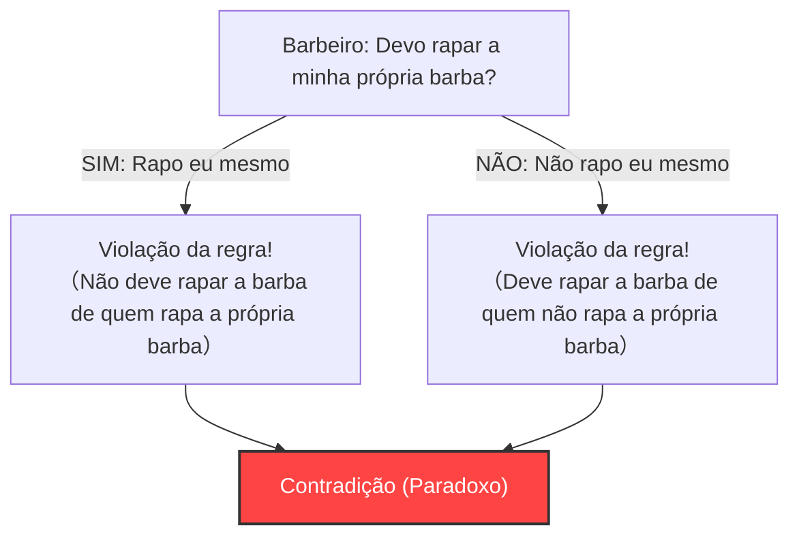
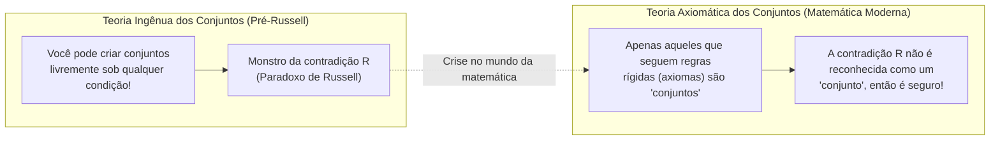

## 1. O "Paradoxo do Barbeiro" que atacou uma aldeia pacífica

Em uma aldeia pacífica, havia um barbeiro.
Na entrada da aldeia, havia uma placa estranha que dizia o seguinte:

**"O barbeiro desta aldeia rapa a barba de todos os aldeões que não rapam a sua própria barba, e não rapa a barba de mais ninguém."**

Os aldeões estavam satisfeitos com esta regra. Aqueles que não conseguiam rapar a própria barba iam ao barbeiro, e aqueles que conseguiam, rapavam em casa.

Mas um dia, o jovem barbeiro olhou-se no espelho e de repente percebeu: uma barba por fazer crescia em seu queixo.
"Bem, eu deveria rapar a minha própria barba?"

Ele decidiu pensar logicamente, seguindo a regra da placa.

1. **E se ele "rapar a própria barba"?**
   De acordo com a regra, o barbeiro só deve rapar a barba de "pessoas que não rapam a própria barba". Portanto, se ele rapar a própria barba, ele não tem o direito de ter sua barba rapada pelo barbeiro (ele mesmo). Ou seja, "não deve rapar".
2. **E se ele "não rapar a própria barba"?**
   De acordo com a regra, o barbeiro deve rapar a barba de todas as "pessoas que não rapam a própria barba". Portanto, se ele não rapar a própria barba, ele deve ter sua barba rapada pelo barbeiro (ele mesmo). Ou seja, "deve rapar".

"Se eu rapar, não devo rapar."
"Se eu não rapar, devo rapar."

O barbeiro entrou em pânico total e tornou-se incapaz de tomar qualquer das atitudes. Este é o famoso **"Paradoxo do Barbeiro"**.

---

## 2. O "Paradoxo de Russell" que abalou o mundo da matemática

Este "Paradoxo do Barbeiro" é uma analogia criada pelo lógico e filósofo britânico Bertrand Russell para explicar de forma simples ao público em geral o paradoxo matemático que ele descobriu.

O que ele realmente descobriu não foi um barbeiro, mas uma terrível contradição sobre **"Conjuntos (Sets)"**.
Isso é chamado de **"Paradoxo de Russell (1901)"**.

### O conceito de "Conjunto de Conjuntos"
Na matemática, um "conjunto" é uma coleção de coisas que satisfazem uma certa condição.
- "Conjunto de números pares menores ou iguais a 10" = $\{2, 4, 6, 8, 10\}$
- "Conjunto de maçãs vermelhas"

E, como conteúdo (elemento) de um conjunto, podemos colocar outro "conjunto".
Por exemplo, considere o "conjunto de todos os livros do mundo". Uma vez que esse conjunto em si não é um "livro", o "conjunto de todos os livros do mundo" não está incluído no seu próprio conjunto.

Por outro lado, considere o "conjunto de coisas que não são livros". Esse conjunto em si também não é um "livro". Portanto, o "conjunto de coisas que não são livros" estará incluído no seu próprio conjunto.

Dessa forma, os conjuntos no mundo podem ser amplamente divididos em dois tipos:
- **A: Conjuntos que não contêm a si mesmos** (Exemplo: conjunto de livros)
- **B: Conjuntos que contêm a si mesmos** (Exemplo: conjunto de coisas que não são livros)

### O nascimento do conjunto diabólico $R$

Aqui, Russell considerou o seguinte conjunto especial $R$.

**Conjunto $R$ = O conjunto que reúne todos os "conjuntos que não contêm a si mesmos (tipo A)"**

Escrito em fórmula matemática (notação de construtor de conjuntos), fica assim:
$$ R = \{ x \mid x \notin x \} $$

Agora, aqui está o ponto principal. Russell fez a seguinte pergunta sobre este conjunto $R$.

**"O conjunto $R$ contém a si mesmo ($R$)?"**

Vamos pensar.

1. **Se $R$ "contém a si mesmo ($R \in R$)"?**
   A condição para ser incluído em $R$ é "não conter a si mesmo". Portanto, $R$ não satisfaz a condição e não pode ser incluído em $R$. ($R \notin R$, o que é uma contradição)

2. **Se $R$ "não contém a si mesmo ($R \notin R$)"?**
   A condição para ser incluído em $R$ é "não conter a si mesmo". Portanto, $R$ satisfaz perfeitamente a condição e deve ser incluído em $R$. ($R \in R$, o que é uma contradição)

Escrito em uma fórmula, é o colapso lógico em apenas uma linha.
$$ R \in R \iff R \notin R $$

"Se contém, não é contido." "Se não contém, é contido."
Esta é exatamente a mesma estrutura que o paradoxo do barbeiro. No entanto, se fosse o barbeiro da aldeia, poderia ser uma piada de "o chefe da aldeia que colocou a placa com essa regra é apenas um tolo", mas no mundo da matemática não é assim.

Isso porque a comunidade matemática daquela época estava no meio da tentativa de reconstruir toda a matemática com base na regra ingênua de que **"desde que você defina a condição claramente, você é livre para criar um 'conjunto' de qualquer coisa"** (Teoria Ingênua dos Conjuntos).

---

## 3. A tragédia de Frege

A pessoa a quem Russell enviou esta carta foi o grande lógico alemão Gottlob Frege.
Frege tinha acabado de enviar à gráfica o segundo volume de sua obra magna, "Leis Básicas da Aritmética" (Grundgesetze der Arithmetik), à qual ele dedicou toda a sua vida. Este livro foi a culminação de sua tentativa de provar a completude da matemática baseada na regra de que "você pode criar um conjunto a partir de qualquer condição".

Frege entrou em desespero ao ler a carta de Russell. Foi porque foi provado que usando a regra da "base das bases" de seu próprio livro, um "conjunto absolutamente contraditório" como o paradoxo de Russell poderia ser criado. Se a fundação desmoronasse, as centenas de páginas de fórmulas matemáticas construídas sobre ela se tornariam todas inválidas.

No final de seu livro, pouco antes da publicação, Frege deixou a seguinte e amarga adição:

> "Dificilmente algo mais indesejável pode acontecer a um cientista do que ter uma de suas fundações abalada logo quando a obra está concluída. Fui colocado exatamente nessa situação por uma carta do Sr. Bertrand Russell logo após este livro ter ido para a impressão."

---

## 4. Superando a crise: O nascimento da Teoria Axiomática dos Conjuntos

O paradoxo de Russell causou um grande pânico na comunidade matemática conhecido como a "crise dos fundamentos da matemática".
A regra libertina de "desde que você decida a condição, você pode criar conjuntos livremente" deu à luz um monstro chamado contradição.

Para resolver essa crise, os matemáticos propuseram-se a tornar as regras mais rígidas.
Matemáticos como Zermelo e Fraenkel desenvolveram um **livro de regras (sistema axiomático) que distingue estritamente entre "conjuntos que podem ser criados" e "conjuntos que não podem ser criados (porque são muito grandes)"**. Isso é chamado de "Sistema de Axiomas ZFC (Teoria Axiomática dos Conjuntos)".

Sob o sistema de axiomas ZFC, o "conjunto $R$ que reúne todos os 'conjuntos que não contêm a si mesmos'", como Russell pensou, foi banido do mundo da matemática, pois **"é muito grande e perigoso, por isso não é mais reconhecido como um 'conjunto' (é apenas uma 'classe')"**.

---

## 5. Conclusão: Paradoxos são um "remédio forte" para corrigir "bugs lógicos"

O Paradoxo de Russell é o extremo de um bug lógico causado por auto-referência (referindo-se a si mesmo), muito parecido com "uma cobra comendo a própria cauda (Ouroboros)" ou "um mentiroso dizendo 'eu sou um mentiroso'".

À primeira vista, paradoxos que parecem ser apenas sofismas ou jogos de palavras destruíram o fundamento da disciplina mais rigorosa, a matemática, e como resultado fizeram a matemática evoluir para algo mais forte e rigoroso.

Se um gênio chamado Russell não tivesse notado este "bug do barbeiro", a matemática moderna e a ciência da computação, que é uma extensão de sua lógica, poderiam ter se desenvolvido carregando uma contradição fatal em algum lugar.
Paradoxos são o remédio forte mais estimulante que nos ensina os limites da lógica humana.
