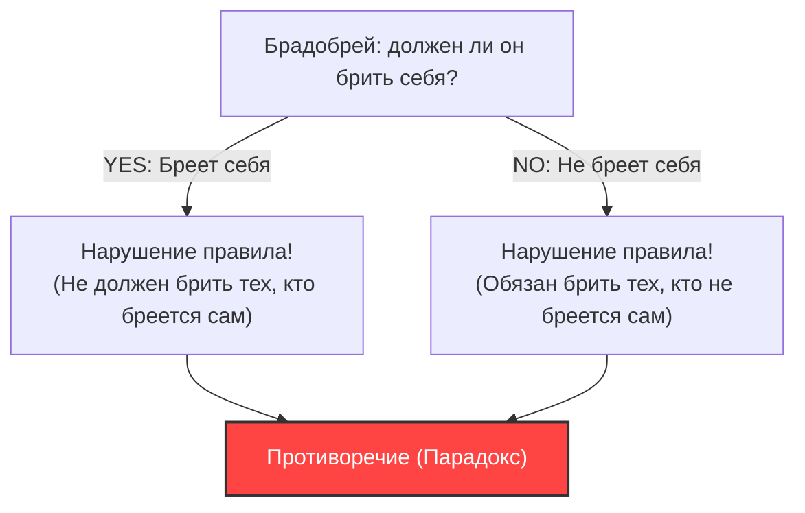
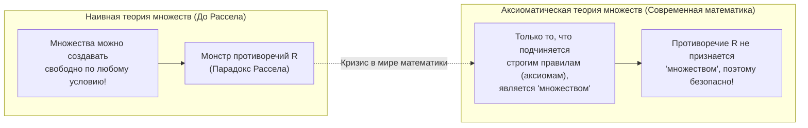

## 1. «Парадокс брадобрея», поразивший мирную деревню

В одной мирной деревне жил брадобрей.
На въезде в деревню стояла странная табличка со следующей надписью:

**«Брадобрей этой деревни бреет всех тех и только тех жителей деревни, которые не бреются сами.»**

Жители деревни были довольны этим правилом. Те, кто не мог бриться сам, просто шли к брадобрею, а те, кто мог, брились дома.

Однако однажды молодой брадобрей посмотрел в зеркало и вдруг понял кое-что. На его подбородке отросла щетина.
«Так, должен ли я побрить себя?»

Он решил рассуждать логически, следуя правилу на табличке.

1. **Если он «побреет себя»?**
   Согласно правилу, брадобрей может брить только тех, кто «не бреется сам». Следовательно, если он бреется сам, он не имеет права на то, чтобы его брил брадобрей (он сам). То есть он «не должен бриться».
2. **Если он «не побреет себя»?**
   Согласно правилу, брадобрей обязан брить всех, кто «не бреется сам». Следовательно, если он не бреется сам, он должен быть побрит брадобреем (собой). То есть он «должен бриться».

«Если бреюсь, то не должен бриться.»
«Если не бреюсь, то должен бриться.»

Брадобрей впал в полную панику и не смог совершить ни того, ни другого действия. Это и есть знаменитый **«парадокс брадобрея»**.

---

## 2. «Парадокс Рассела», потрясший математический мир

Этот «парадокс брадобрея» — аллегория, придуманная британским логиком и философом Бертраном Расселом, чтобы понятно объяснить широкой публике открытый им математический парадокс.

То, что он на самом деле обнаружил, касалось не брадобрея, а ужасающего противоречия, связанного с **«множествами» (Set)**.
Это называется **«парадоксом Рассела» (1901 год)**.

### Концепция «множества множеств»
В математике «множество» — это совокупность объектов, удовлетворяющих определенному условию.
- «Множество четных чисел меньше или равных 10» = $\{2, 4, 6, 8, 10\}$
- «Множество красных яблок»

В качестве содержимого (элементов) множества можно включать другие «множества».
Например, рассмотрим «множество всех книг в мире». Само это множество не является «книгой», поэтому «множество всех книг в мире» не включено в само себя в качестве элемента.

С другой стороны, рассмотрим «множество всех объектов, не являющихся книгами». Это множество само по себе также не является «книгой». Следовательно, «множество объектов, не являющихся книгами» будет включено в само себя.

Таким образом, все множества в мире можно грубо разделить на два типа:
- **A: Множества, не содержащие себя** (пример: множество книг)
- **B: Множества, содержащие себя** (пример: множество объектов, не являющихся книгами)

### Рождение дьявольского множества $R$

Здесь Рассел рассмотрел следующее особое множество $R$:

**Множество $R$ = множество всех множеств, которые «не содержат себя» (типа A)**

В математической нотации (через условия) это записывается так:
$$ R = \{ x \mid x \notin x \} $$

А теперь перейдем к главному. Рассел задал следующий вопрос относительно этого множества $R$:

**«Содержит ли множество $R$ само себя ($R$)?»**

Давайте подумаем.

1. **Если $R$ «содержит себя ($R \in R$)»?**
   Условие для включения в $R$ — «не содержать себя». Следовательно, $R$ не удовлетворяет условию и не может быть включено в $R$. (Получаем $R \notin R$, что является противоречием).

2. **Если $R$ «не содержит себя ($R \notin R$)»?**
   Условие для включения в $R$ — «не содержать себя». Следовательно, $R$ идеально удовлетворяет условию и обязано быть включено в $R$. (Получаем $R \in R$, что является противоречием).

В математической записи это крушение логики в одну строку:
$$ R \in R \iff R \notin R $$

«Если содержит, то не содержит.» «Если не содержит, то содержит.»
Эта структура абсолютно идентична парадоксу брадобрея. Однако, если в случае с деревенским брадобреем можно отшутиться: «Это просто староста, поставивший такую табличку, идиот», — то в мире математики так не получится.

Дело в том, что в то время математическое сообщество было в самом разгаре попыток перестроить всю математику на основе наивного правила: **«Можно свободно создавать 'множество' из чего угодно, если четко определить условие»** (наивная теория множеств).

---

## 3. Трагедия Фреге

Рассел отправил это письмо великому немецкому логику Готлобу Фреге.
Фреге как раз только что отправил в типографию второй том своего монументального труда «Основные законы арифметики», которому он посвятил всю свою жизнь. Эта книга была кульминацией его попыток доказать полноту математики, основываясь на правиле, что «множества можно создавать из любых условий».

Прочитав письмо от Рассела, Фреге пришел в отчаяние. Было доказано, что использование самых базовых правил из его книги позволяет создать «абсолютно противоречивое множество», подобное парадоксу Рассела. Если рухнет фундамент, все сотни страниц формул, построенных на нем, станут недействительными.

Фреге оставил следующее душераздирающее послесловие в самом конце книги прямо перед ее публикацией:

> «Для ученого нет ничего более трагичного, чем в момент, когда он считает свою работу завершенной, увидеть, как рушится ее фундамент. Именно в такой ситуации я оказался из-за письма от господина Бертрана Рассела сразу после того, как эта книга была отправлена в печать.»

---

## 4. Преодоление кризиса: рождение аксиоматической теории множеств

Парадокс Рассела вызвал огромную панику в математическом мире, получившую название «кризис оснований математики».
Слишком свободное правило «Можно свободно создавать множества, лишь бы было задано условие» породило монстра по имени противоречие.

Чтобы разрешить этот кризис, математики взялись за ужесточение правил.
Такие математики, как Цермело и Френкель, разработали **свод правил (систему аксиом), который строго различал «множества, которые можно создавать» и «множества, которые создавать нельзя (слишком большие)»**. Это называется «системой аксиом Цермело-Френкеля (ZFC)» или аксиоматической теорией множеств.

В рамках системы аксиом ZFC такое «множество $R$, состоящее из всех 'множеств, не содержащих себя'», придуманное Расселом, было изгнано из мира математики под предлогом того, что **«оно слишком велико и опасно, поэтому больше не признается 'множеством' (это просто 'класс')»**.

---

## 5. Заключение: Парадоксы — это сильнодействующее лекарство для исправления «багов в логике»

Парадокс Рассела — это высшая точка логических багов, вызываемых самореференцией (ссылкой на самого себя), подобных «змее, кусающей свой хвост (уроборос)» или «лжецу, который говорит, что он лжец».

Парадокс, который на первый взгляд может показаться простой софистикой или игрой слов, разрушил основы математики — самой строгой из наук — и в результате заставил математику эволюционировать, став еще более прочной и строгой.

Если бы гений Рассела не заметил этого «бага брадобрея», современная математика и вытекающая из ее логики информатика (компьютерные науки) могли бы развиваться дальше, неся в себе где-то фатальное противоречие.
Парадокс — это самое захватывающее сильнодействующее лекарство, которое показывает нам пределы человеческой логики.
