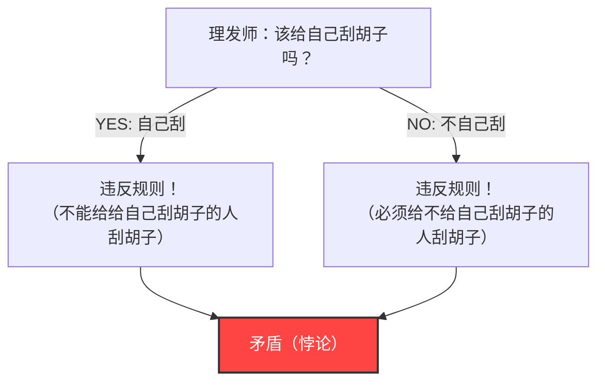
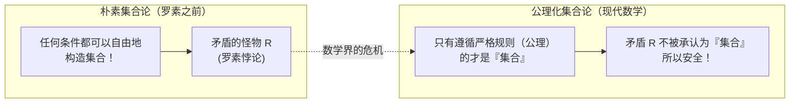

## 1. 袭击平静村庄的“理发师悖论”

在一个和平的村庄里，有一位理发师。
村庄的入口处立着一块奇怪的告示牌：

**“本村的理发师只给村里所有不自己刮胡子的人刮胡子，不给其他人刮胡子。”**

村民们对这个规则很满意。因为不能自己刮胡子的人只需去找理发师就行了，而能自己刮胡子的人在家里刮就可以了。

然而有一天，理发师小伙子看着镜子突然意识到了一件事。他的下巴上长出了胡茬。
“那么，我该给自己刮胡子吗？”

他决定根据告示牌的规则进行逻辑思考。

1. **如果他“给自己刮胡子”呢？**
   根据规则，理发师只能给“不自己刮胡子的人”刮胡子。因此，自己刮胡子的他，没有资格让理发师（也就是他自己）来刮胡子。也就是说，“不能刮”。
2. **如果他“不给自己刮胡子”呢？**
   根据规则，理发师必须给所有“不自己刮胡子的人”刮胡子。因此，不自己刮胡子的他，必须让理发师（也就是他自己）来刮胡子。也就是说，“必须刮”。

“如果要刮，就不能刮。”
“如果不刮，就必须刮。”

理发师陷入了彻底的恐慌，无论哪种行动都无法采取。这就是著名的**“理发师悖论”**。

---

## 2. 震惊数学界的“罗素悖论”

这个“理发师悖论”是英国逻辑学家、哲学家伯特兰·罗素为了向普通大众通俗易懂地解释他所发现的数学悖论而编造的一个比喻。

他真正发现的并非理发师，而是关于**“集合（Set）”**的一个可怕的矛盾。
这被称为**“罗素悖论（1901年）”**。

### “集合的集合”这一概念
数学中的“集合”是指满足某种条件的事物的聚集。
- “10以内的偶数集合”＝ $\{2, 4, 6, 8, 10\}$
- “红苹果的集合”

并且，作为集合的内容（元素），也可以放入另一个“集合”。
例如，考虑“世界上所有书的集合”。因为这个集合本身并不是“书”，所以“世界上所有书的集合”并不包含在它自身的集合之中。

另一方面，考虑“不是书的事物的集合”。这个集合本身也不是“书”。因此，“不是书的事物的集合”会包含在它自身的集合之中。

像这样，世间的集合大致可以分为两类：
- **A：不包含自身的集合**（例：书的集合）
- **B：包含自身的集合**（例：不是书的事物的集合）

### 恶魔集合 $R$ 的诞生

在此，罗素思考了如下一种特殊的集合 $R$。

**集合 $R$ ＝ 收集了所有“不包含自身的集合（A类型）”的集合**

用数学公式（内涵公理）来写就是：
$$ R = \{ x \mid x \notin x \} $$

那么，正题来了。罗素对这个集合 $R$ 提出了如下问题：

**“集合 $R$ 包含它自身（$R$）吗？”**

让我们思考一下。

1. **如果 $R$ “包含它自身（$R \in R$）”呢？**
   进入 $R$ 的条件是“不包含自身”。因此，$R$ 不满足条件，不能进入 $R$。（得出 $R \notin R$ 从而产生矛盾）

2. **如果 $R$ “不包含自身（$R \notin R$）”呢？**
   进入 $R$ 的条件是“不包含自身”。因此，$R$ 完美满足条件，必须进入 $R$。（得出 $R \in R$ 从而产生矛盾）

用数学公式来写，仅仅一行的逻辑崩溃：
$$ R \in R \iff R \notin R $$

“如果包含，则不包含。”“如果不包含，则包含。”
这与理发师悖论的结构完全相同。不过，如果是村里的理发师，这可以作为一个笑话，即“立下那种规则告示牌的村长真是个傻瓜”，但在数学的世界里就不能这样了。

因为当时的数学界正试图建立在**“只要明确定义了条件，就可以自由地构造任何事物的『集合』”**这一朴素的规则（朴素集合论）基础之上，并正处于重建整个数学的过程之中。

---

## 3. 弗雷格的悲剧

罗素将这封信寄给了一位德国伟大的逻辑学家戈特洛布·弗雷格。
弗雷格当时刚刚将他倾注了全部心血的巨著《算术基本法则》第2卷送到印刷厂。这本书是试图基于“从任何条件都可以构造集合”的规则来证明数学完整性的集大成之作。

读了罗素的信后，弗雷格绝望了。因为这证明了如果使用他书中“最基本的基础”规则，就能构造出像罗素悖论那样“绝对矛盾的集合”。一旦基础崩溃，建立其上的数百页数学公式都将变得无效。

弗雷格在即将出版的书的末尾，留下了以下令人悲痛的附录：

> “对于一位科学家来说，最悲惨的事情莫过于在认为自己的工作已经完成的那一刻，看着它的基础崩塌。这本书刚刚交付印刷，伯特兰·罗素先生的一封信，让我恰恰陷入了这种境地。”

---

## 4. 克服危机：公理化集合论的诞生

罗素悖论在数学界引起了被称为“数学基础危机”的大恐慌。
“只要确定了条件，就可以自由构造集合”这种自由散漫的规则，诞生了名为矛盾的怪物。

为了解决这场危机，数学家们开始着手严格化规则。
策梅洛和弗兰克尔等数学家，建立了一套严格区分**“可以构造的集合”和“不可以构造的（过大的）集合”的规则手册（公理系统）**。这被称为“ZFC公理系统（公理化集合论）”。

在ZFC公理系统下，像罗素所设想的那种“收集了所有『不包含自身的集合』的集合 $R$”，由于**“大到危险，所以不再承认其为『集合』（它仅仅是一个『类』）”**，从而被数学世界禁止入内。

---

## 5. 总结：悖论是修复“逻辑Bug”的一剂猛药

罗素悖论是由自我指涉（提及自身）引发的逻辑Bug的极致表现，就像“吃自己尾巴的蛇（衔尾蛇）”或“说自己是说谎者的说谎者”一样。

乍一看，这个悖论似乎只是强词夺理或文字游戏，但它却破坏了数学这门最严密学科的根基，并最终促使数学进化得更加坚固和严密。

如果罗素这个天才没有注意到这个“理发师Bug”，现代数学以及作为其逻辑延伸的计算机科学，可能就会带着某个致命的矛盾发展下去。
悖论，就是告诉我们人类逻辑极限的最刺激的一剂猛药。
