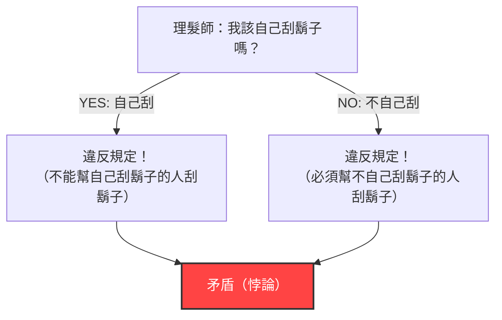
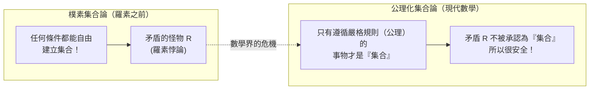

## 1. 席捲寧靜村莊的「理髮師悖論」

在一個和平的村莊裡，有一位理髮師。
村莊的入口處立著一塊奇怪的告示牌，上面寫著：

**「本村的理髮師只幫所有不自己刮鬍子的村民刮鬍子，不幫其他人刮鬍子。」**

村民們對這個規定很滿意。因為自己不會刮的人去理髮店就好，自己會刮的人在家刮就行了。

然而有一天，年輕的理髮師看著鏡子突然驚覺：他的下巴長滿了雜亂的鬍渣。
「那麼，我到底該不該自己刮鬍子呢？」

他決定按照告示牌的規定，從邏輯上來思考看看。

1. **如果他「自己刮鬍子」呢？**
   根據規定，理髮師只能幫「不自己刮鬍子的人」刮鬍子。因此，自己刮鬍子的他，沒有資格讓理髮師（他自己）幫他刮鬍子。也就是說，「不能刮」。
2. **如果他「不自己刮鬍子」呢？**
   根據規定，理髮師必須幫所有「不自己刮鬍子的人」刮鬍子。因此，不自己刮鬍子的他，必須讓理髮師（他自己）幫他刮鬍子。也就是說，「必須刮」。

「如果刮，就不能刮。」
「如果不刮，就必須刮。」

理髮師徹底陷入恐慌，進退兩難。這就是著名的**「理髮師悖論」**。

---

## 2. 震驚數學界的「羅素悖論」

這個「理髮師悖論」是英國邏輯學家兼哲學家伯特蘭·羅素為了向一般大眾解釋他所發現的數學悖論，而創造的一個通俗比喻。

他真正發現的並不是理髮師的問題，而是關於**「集合（Set）」**的一個可怕矛盾。
這個矛盾被稱為**「羅素悖論（1901年）」**。

### 「集合的集合」的概念
數學中的「集合」是指滿足某種條件的事物的群體。
- 「10以內的偶數集合」＝ $\{2, 4, 6, 8, 10\}$
- 「紅蘋果的集合」

而且，集合的內容物（元素）也可以是另一個「集合」。
例如，考慮「世界上所有書的集合」。這個集合本身並不是「書」，所以「世界上所有書的集合」不包含在它自身的集合之中。

另一方面，考慮「不是書的事物的集合」。這個集合本身也不是「書」。因此，「不是書的事物的集合」會包含在它自身的集合之中。

像這樣，世上的集合可以大致分為兩類：
- **A：不包含自身的集合**（例：書的集合）
- **B：包含自身的集合**（例：不是書的事物的集合）

### 惡魔集合 $R$ 的誕生

在這裡，羅素考慮了以下這種特殊的集合 $R$：

**集合 $R$ ＝ 由所有「不包含自身的集合（A類）」所構成的集合**

用數學公式（內涵定義）來寫就是這樣：
$$ R = \{ x \mid x \notin x \} $$

接下來才是重點。羅素對這個集合 $R$ 提出了一個問題：

**「集合 $R$ 包含它自己（$R$）嗎？」**

讓我們來思考看看：

1. **如果 $R$ 「包含自身（$R \in R$）」呢？**
   進入 $R$ 的條件是「不包含自身」。因此，$R$ 不滿足條件，不能進入 $R$ 之中。（推導出 $R \notin R$，產生矛盾）

2. **如果 $R$ 「不包含自身（$R \notin R$）」呢？**
   進入 $R$ 的條件是「不包含自身」。因此，$R$ 完美滿足了條件，必須進入 $R$ 之中。（推導出 $R \in R$，產生矛盾）

用數學公式來寫，這只是一行字的邏輯崩潰：
$$ R \in R \iff R \notin R $$

「如果包含，就不包含。」「如果不包含，就包含。」
這和理髮師悖論的結構完全相同。然而，如果是村裡的理髮師，大家當成「只怪立這種告示牌的村長太蠢了」的笑話就過去了，但在數學的世界裡可不能這樣。

因為當時的數學界，正處於以**「只要明確定義條件，就可以自由創造任何『集合』」**這種樸素規則（樸素集合論）為基礎，試圖重建所有數學的過程中。

---

## 3. 弗雷格的悲劇

羅素將這封信寄給了德國偉大的邏輯學家戈特洛布·弗雷格。
當時弗雷格正好剛將他傾注畢生心血的巨著《算術基本法則》第二卷送交印刷廠。這本書是以「可以從任何條件建立集合」的規則為基礎，試圖證明數學完備性的集大成之作。

讀完羅素的信後，弗雷格感到絕望。因為這證明了使用他書中「最基礎的」規則，就會創造出像羅素悖論那樣「絕對矛盾的集合」。一旦基礎崩潰，建立在其上的數百頁數學公式都將化為烏有。

弗雷格在即將出版的書末，留下了以下這段悲痛的附記：

> 「對一個科學家來說，沒有什麼比在認為自己的工作即將完成之際，眼睜睜看著其基礎崩塌更悲慘的事了。就在這本書送交印刷後不久，伯特蘭·羅素先生的一封信，讓我正處於這種境地。」

---

## 4. 克服危機：公理化集合論的誕生

羅素悖論在數學界引發了被稱為「數學基礎危機」的大恐慌。
「只要決定條件，就能自由建立集合」這種無拘無束的規則，竟然誕生出了名為矛盾的怪物。

為了解決這場危機，數學家們開始著手嚴格化規則。
策梅洛和弗蘭克爾等數學家，制定了**嚴格區分「可以建立的集合」與「不可建立（太大）的集合」的規則手冊（公理系統）**。這被稱為「ZFC公理系統（公理化集合論）」。

在ZFC公理系統下，像羅素所設想的「收集所有『不包含自身的集合』的集合 $R$」，被認定為**「太過龐大且危險，因此不再承認其為『集合』（它只是一個『類』）」**，從此被數學世界拒之門外。

---

## 5. 總結：悖論是修復「邏輯Bug」的一劑猛藥

羅素悖論就像「吃自己尾巴的蛇（銜尾蛇）」或「說自己是騙子的騙子」一樣，是自我指涉（提及自身）所引發的邏輯Bug的極致。

乍看之下像是在強詞奪理或玩文字遊戲的悖論，卻破壞了數學這門最嚴密學科的根基，並最終促使數學進化成更堅固、更嚴謹的體系。

如果沒有羅素這位天才發現這個「理髮師的Bug」，現代數學以及作為其邏輯延伸的電腦科學，可能就會在某處帶著致命的矛盾發展下去。
悖論就是告訴我們人類邏輯極限，最具刺激性的一劑猛藥。
