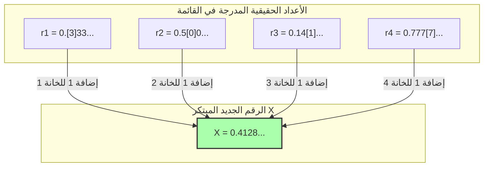

## 1. قائمة الأرقام التي يمكن تعريفها بالكلمات

تعتبر "مفارقة ريشار"، التي نشرها عالم الرياضيات الفرنسي جول ريشار عام 1905، بمثابة قريب لـ "مفارقة بيري" التي قدمناها سابقاً. لكن هذه المفارقة أكثر رياضية وتحتوي على تناقض أعمق يشبه النظر في اللانهاية.

أولاً، تخيل جمع كل **"الأعداد الحقيقية (الكسور العشرية) بين 0 و 1 التي يمكن تعريفها بالكامل بجمل لغوية"**. (في المثال الأصلي، باللغة اليابانية، وهنا سنفترض لغة محددة).

على سبيل المثال، أرقام مثل هذه:
- "صفر نقطة خمسة" $\rightarrow$ $0.5$
- "ثلث" $\rightarrow$ $0.333333...$
- "الرقم المكون من الأرقام بعد الفاصلة العشرية لـ بي (pi)" $\rightarrow$ $0.14159265...$

بما أن التراكيب الممكنة للجمل التي يمكن التعبير عنها بلغة ما تتكون فقط من ترتيب الأحرف الموجودة في القاموس، فيمكننا تحديد "ترتيب" لها.
(على سبيل المثال، ترتيبها حسب عدد الأحرف من الأقل إلى الأكثر، وإذا كان لها نفس عدد الأحرف، يتم ترتيبها حسب الترتيب الأبجدي).

وبهذه الطريقة، يمكننا إنشاء **قائمة (رقم) لا نهائية** للأرقام: الأول، الثاني، الثالث... لـ "كل الأعداد الحقيقية التي يمكن تعريفها باللغة".

$$
\begin{align*}
r_1 &= 0.\mathbf{3}333... \\
r_2 &= 0.5\mathbf{0}00... \\
r_3 &= 0.14\mathbf{1}5... \\
r_4 &= 0.777\mathbf{7}... \\
&\vdots
\end{align*}
$$

في هذه القائمة، يجب أن تكون "كل الأعداد الحقيقية التي يمكن تعريفها باللغة" مشمولة بالكامل دون ترك أي استثناء.

---

## 2. تقنية الشيطان "الحجة القطرية"

هنا، يقوم ريشار بعملية مرعبة.
إنه يخلق بشكل مصطنع **"رقماً جديداً تماماً $X$"** يتجنب كل الأرقام الموجودة في القائمة.

طريقة إنشائه بسيطة:
- انظر إلى الرقم في الخانة العشرية **الأولى** للرقم **الأول** في القائمة (في المثال أعلاه، هو $3$). أضف $1$ إلى هذا الرقم، واجعله الخانة الأولى لـ $X$ ($3+1=4$).
- انظر إلى الرقم في الخانة العشرية **الثانية** للرقم **الثاني** في القائمة (في المثال أعلاه، هو $0$). أضف $1$ إلى هذا الرقم، واجعله الخانة الثانية لـ $X$ ($0+1=1$).
- انظر إلى الرقم في الخانة العشرية **الثالثة** للرقم **الثالث** في القائمة (في المثال أعلاه، هو $1$). أضف $1$ إلى هذا الرقم، واجعله الخانة الثالثة لـ $X$ ($1+1=2$).

※ إذا كان الرقم الأصلي $9$، نفترض أنه يعود إلى $0$.

الرقم الجديد $X$ الذي تم إنشاؤه بهذه الطريقة (في المثال أعلاه، $X = 0.4128...$) **لا يتطابق أبداً مع أي رقم** في القائمة.
والسبب هو أنه تم تعمد إزاحة الرقم في "الخانة العشرية $n$" ليكون مختلفاً عن الرقم $n$ في القائمة.
(هذه الطريقة ابتكرها عالم الرياضيات العبقري كانتور لإثبات الحجم اللانهائي للأعداد الحقيقية وتسمى **"الحجة القطرية"**).

---

## 3. اكتمال مفارقة ريشار

الآن، هنا تكمن المفارقة.

لقد أنشأنا للتو الرقم الجديد $X$.
والـ "قاعدة" لإنشاء هذا الـ $X$ مشروحة (معرّفة) بشكل كامل بواسطة **الجمل اللغوية التي كتبتها للتو أعلاه**.

بعبارة أخرى، $X$ هو **"عدد حقيقي يمكن تعريفه باللغة"**.

لكن تذكر الفرضية الأولى.
يجب أن تكون "الأعداد الحقيقية التي يمكن تعريفها باللغة" **مشمولة بالكامل في القائمة الأولى ($r_1, r_2, r_3...$)**.
ومع ذلك، تم تصميم $X$ بحيث لا يتطابق مع أي رقم في القائمة.

1. **يجب أن يكون $X$ موجوداً في القائمة (لأنه عُرِّف باللغة).**
2. **يجب ألا يكون $X$ موجوداً في القائمة (لأنه صُمم باستخدام الحجة القطرية ليكون مختلفاً عن كل الأعداد في القائمة).**

تناقض كامل! هذه هي مفارقة ريشار.

---

## 4. لماذا انهار المنطق؟ (فخ لغة الميتا)

السبب وراء ولادة هذه المفارقة، تماماً مثل مفارقة بيري، يكمن في الخلط بين "مستويات اللغة".

للقيام بالرياضيات بدقة، يجب التمييز بوضوح بين "قائمة الأرقام المستهدفة (اللغة الهدف)" و"القواعد التي تتحدث عن خصائص تلك القائمة من الخارج (لغة الميتا / اللغة الفوقية)".

قائمة ريشار هي مجموعة من "التعريفات للأرقام القابلة للحساب".
ومع ذلك، فإن قاعدة "النظر إلى الخانة $n$ للرقم $n$ في القائمة" لإنشاء الرقم الجديد $X$ هي عملية تخص **"لغة الميتا" ولا يمكن تنفيذها إلا بالنظر إلى القائمة بأكملها من الخارج**.

انفجرت مفارقة ريشار في تناقض ذاتي لأنها حاولت خلسة إدخال "الرقم الميتالغوي $X$ الذي تم إنشاؤه عن طريق معالجة القائمة من الخارج" إلى "القائمة الداخلية".

---

## 5. تسليم الراية إلى غودل

أحدثت مفارقة ريشار هذه صدمة كبيرة في الأوساط الرياضية في ذلك الوقت.
"الكلمات البشرية (والأنظمة المنطقية)، إذا لم نكن حذرين، تؤدي بسرعة إلى تناقضات ذاتية. كيف يمكننا جعل الرياضيات مثالية وخالية من التناقضات؟"

في عام 1931، تم حل هذه المشكلة نهائياً من قبل عالم الرياضيات العبقري الشاب كورت غودل، الذي كان يبلغ من العمر 25 عاماً فقط.
قام غودل بترجمة وإعادة إنتاج هيكل هذه المفارقة - التي أثارها ريشار باستخدام "غموض اللغة" - بشكل مثالي باستخدام **"صيغ رياضية دقيقة (أرقام غودل)"**.

النتيجة التي تم استخلاصها من ذلك هي **"مبرهنة عدم الاكتمال لغودل"** الشهيرة.
كان هذا اكتشافاً عظيماً يثبت حدود المعرفة البشرية: "بغض النظر عن مدى دقة القواعد الرياضية التي نضعها، ستظهر دائماً "حقائق لا يمكن إثباتها أو دحضها" ضمن تلك القواعد (الرياضيات غير مكتملة)".

بدأت مفارقة ريشار كلعب بالكلمات المتناقضة، ثم تطورت في النهاية إلى أقوى سلاح لتحطيم "المطلقية" في مجال الرياضيات نفسه.
