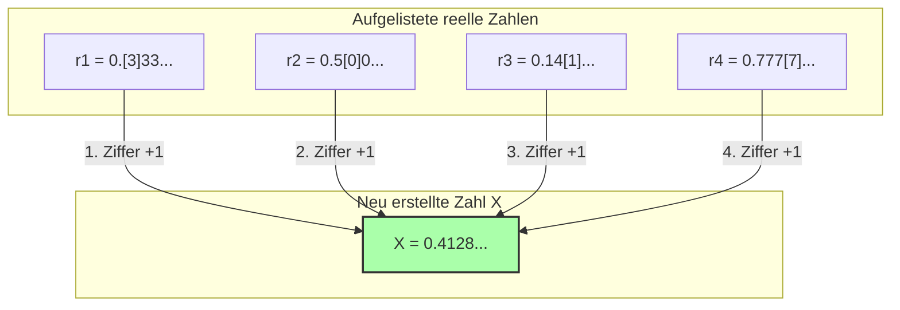

## 1. Eine Liste von Zahlen, die durch Worte definiert werden können

Das "Richard-Paradoxon", das 1905 vom französischen Mathematiker Jules Richard veröffentlicht wurde, ist so etwas wie ein Verwandter des zuvor vorgestellten "Berry-Paradoxons". Es ist jedoch mathematischer und birgt einen tieferen Widerspruch, der einen Blick in die Unendlichkeit wirft.

Stellen Sie sich zunächst vor, wir sammeln **"alle reellen Zahlen (Dezimalzahlen) zwischen 0 und 1, die in der deutschen Sprache vollständig definiert werden können"**.

Dies wären zum Beispiel folgende Zahlen:
- "Null Komma fünf" $\rightarrow$ $0.5$
- "Ein Drittel" $\rightarrow$ $0.333333...$
- "Die Zahl, die aus den Ziffern der Kreiszahl Pi nach dem Komma besteht" $\rightarrow$ $0.14159265...$

Da die Kombinationen von Sätzen, die im Deutschen ausgedrückt werden können, nur aus dem Aneinanderreihen von Buchstaben aus dem Wörterbuch bestehen, können sie in eine "Reihenfolge" gebracht werden.
(Zum Beispiel ordnet man sie nach der Anzahl der Buchstaben und bei gleicher Buchstabenanzahl alphabetisch.)

Auf diese Weise konnten wir allen "reellen Zahlen, die im Deutschen definiert werden können", eine erste, zweite, dritte... und somit **unendlich weitergehende Nummerierung (Liste)** zuweisen.

$$
\begin{align*}
r_1 &= 0.\mathbf{3}333... \\
r_2 &= 0.5\mathbf{0}00... \\
r_3 &= 0.14\mathbf{1}5... \\
r_4 &= 0.777\mathbf{7}... \\
&\vdots
\end{align*}
$$

In dieser Liste sollten "alle reellen Zahlen, die in der deutschen Sprache definiert werden können", ohne Ausnahme perfekt abgedeckt sein.

---

## 2. Die teuflische Technik: Das "Diagonalargument"

Hier wendet Richard eine beängstigende Operation an.
Er erschafft künstlich eine **"völlig neue Zahl $X$"**, die so konstruiert ist, dass sie sich von allen Zahlen in der Liste unterscheidet.

Die Erstellung ist einfach:
- Schauen Sie sich die **erste Nachkommastelle** der **ersten** Zahl in der Liste an (im obigen Beispiel $3$). Addieren Sie $1$ dazu und machen Sie dies zur ersten Nachkommastelle von $X$ ($3+1=4$).
- Schauen Sie sich die **zweite Nachkommastelle** der **zweiten** Zahl in der Liste an (im obigen Beispiel $0$). Addieren Sie $1$ dazu und machen Sie dies zur zweiten Nachkommastelle von $X$ ($0+1=1$).
- Schauen Sie sich die **dritte Nachkommastelle** der **dritten** Zahl in der Liste an (im obigen Beispiel $1$). Addieren Sie $1$ dazu und machen Sie dies zur dritten Nachkommastelle von $X$ ($1+1=2$).

※Wenn die ursprüngliche Ziffer eine $9$ ist, nehmen wir an, dass sie auf $0$ zurückkehrt.

Die nach dieser Methode erstellte neue Zahl $X$ (im obigen Beispiel $X = 0.4128...$) wird **absolut nicht mit irgendeiner Zahl** in der Liste übereinstimmen.
Der Grund dafür ist, dass die $n$-te Ziffer nach dem Komma absichtlich gegenüber der $n$-ten Zahl verschoben wurde.
(Diese Methode wird als **"Diagonalargument"** bezeichnet, das vom genialen Mathematiker Georg Cantor erfunden wurde, um die unendliche Größe der reellen Zahlen zu beweisen.)

---

## 3. Die Vollendung des Richard-Paradoxons

Nun, hier beginnt das Paradoxon.

Wir haben gerade eine neue Zahl $X$ erschaffen.
Und die "Regel", um dieses $X$ zu erschaffen, wird durch **die deutschen Sätze, die ich gerade oben geschrieben habe**, perfekt erklärt (definiert).

Das bedeutet, dass $X$ eine **"reelle Zahl ist, die im Deutschen definiert werden kann"**.

Aber erinnern Sie sich an die anfängliche Prämisse.
"Reelle Zahlen, die im Deutschen definiert werden können", sollten **alle in der anfänglichen Liste ($r_1, r_2, r_3...$) enthalten sein**.
Trotzdem wurde $X$ so konstruiert, dass es mit keiner Zahl in der Liste übereinstimmt.

1. **$X$ muss in der Liste existieren (weil es im Deutschen definiert wurde).**
2. **$X$ darf nicht in der Liste existieren (weil es durch das Diagonalargument so konstruiert wurde, dass es sich von allen Zahlen in der Liste unterscheidet).**

Ein perfekter Widerspruch! Das ist das Richard-Paradoxon.

---

## 4. Warum brach die Logik zusammen? (Die Falle der Metasprache)

Die Ursache für die Entstehung dieses Paradoxons liegt, genau wie beim Berry-Paradoxon, in der Verwechslung der "Sprachhierarchien".

Um Mathematik streng zu betreiben, muss man klar zwischen der "Liste der Zielzahlen (Objektsprache)" und den "Regeln, die von außen über die Eigenschaften dieser Liste sprechen (Metasprache)" unterscheiden.

Richards Liste ist eine Sammlung von "Definitionen berechenbarer Zahlen".
Die Regel "Betrachte die $n$-te Ziffer der $n$-ten Zahl der Liste", um die neue Zahl $X$ zu erschaffen, ist jedoch eine **Operation in der "Metasprache", die nicht ausgeführt werden kann, ohne die Liste von außen zu betrachten**.

Das Richard-Paradoxon explodierte in einem Selbstwiderspruch, weil es versuchte, die "metasprachliche Zahl $X$, die durch Manipulation der Liste von außen erstellt wurde", heimlich in die "innere Liste" einzuschmuggeln.

---

## 5. Staffelübergabe an Gödel

Dieses Richard-Paradoxon löste in der damaligen mathematischen Welt einen großen Schock aus.
"Menschliche Worte (und logische Systeme) führen schnell zu Selbstwidersprüchen, wenn man nicht aufpasst. Wie kann man die Mathematik perfekt und widerspruchsfrei machen?"

Im Jahr 1931 löste der junge und brillante Mathematiker Kurt Gödel im Alter von 25 Jahren dieses Problem endgültig.
Gödel übersetzte und reproduzierte die Struktur dieses Paradoxons, das Richard unter Ausnutzung der "Mehrdeutigkeit der Sprache" ausgelöst hatte, perfekt mithilfe von **"strengen mathematischen Formeln (Gödelnummern)"**.

Das Ergebnis war der berühmte **"Gödelsche Unvollständigkeitssatz"**.
Es war eine großartige Entdeckung, die die Grenzen des menschlichen Wissens bewies: "Egal wie streng man mathematische Regeln aufstellt, es wird innerhalb dieser Regeln immer eine 'Wahrheit geben, die weder bewiesen noch widerlegt werden kann' (die Mathematik ist unvollständig)".

Das Richard-Paradoxon begann als bloßes widersprüchliches Wortspiel und entwickelte sich schließlich zur stärksten Waffe, um die "Absolutheit" der Mathematik als Wissenschaft zu erschüttern.
