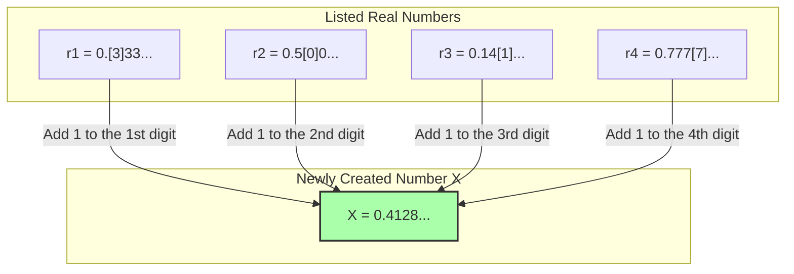

## 1. A List of Numbers Definable in Words

"Richard's Paradox", published by the French mathematician Jules Richard in 1905, is akin to a relative of the "Berry Paradox" introduced earlier. However, this one is more mathematical and contains a deep contradiction that feels like peering into the abyss of infinity.

First, imagine collecting all the **"real numbers between 0 and 1 (decimals) that can be completely defined by English sentences"**.

For example, numbers like these:
- "Zero point five" $\rightarrow$ $0.5$
- "One third" $\rightarrow$ $0.333333...$
- "The number formed by the decimal digits of pi" $\rightarrow$ $0.14159265...$

The combinations of sentences that can be expressed in English are simply rearrangements of characters found in a dictionary, so we can assign an "order" to them.
(For example, arranging them in order of length, and if they have the same length, arranging them in alphabetical order.)

In this way, we have created an **infinitely continuing numbered list** (1st, 2nd, 3rd...) of "all real numbers definable in English".

$$
\begin{align*}
r_1 &= 0.\mathbf{3}333... \\
r_2 &= 0.5\mathbf{0}00... \\
r_3 &= 0.14\mathbf{1}5... \\
r_4 &= 0.777\mathbf{7}... \\
&\vdots
\end{align*}
$$

Within this list, "every possible real number definable in English" should be perfectly included without a single exception.

---

## 2. The Demonic Technique: "Diagonal Argument"

Here, Richard performs a terrifying operation.
He artificially creates a **"completely new number $X$"** that avoids all the numbers currently in the list.

The method is simple:
- Look at the **1st decimal digit** of the **1st** number in the list (in the above example, $3$). Add $1$ to it, and make that the 1st digit of $X$ ($3+1=4$).
- Look at the **2nd decimal digit** of the **2nd** number in the list (in the above example, $0$). Add $1$ to it, and make that the 2nd digit of $X$ ($0+1=1$).
- Look at the **3rd decimal digit** of the **3rd** number in the list (in the above example, $1$). Add $1$ to it, and make that the 3rd digit of $X$ ($1+1=2$).

*If the original digit is $9$, let's assume it loops back to $0$.

The new number $X$ created by this method (in the example above, $X = 0.4128...$) will **absolutely never match any number** in the list.
This is because the $n$-th decimal digit of $X$ is intentionally shifted from the $n$-th decimal digit of the $n$-th number.
(This technique is called the **"Diagonal Argument"**, devised by the genius mathematician Cantor to prove the infinite size of real numbers.)

---

## 3. The Completion of Richard's Paradox

Now, here comes the paradox.

We have just created a new number $X$.
And the "rule" for creating this $X$ is perfectly explained (defined) by **the English sentences I just wrote above**.

In other words, $X$ is a **"real number definable in English"**.

However, remember the initial premise.
"Real numbers definable in English" were supposed to be **all comprehensively included in the initial list ($r_1, r_2, r_3...$)**.
Yet, $X$ was constructed so that it does not match any number in the list.

1. **$X$ must exist within the list (because it was defined in English).**
2. **$X$ must not exist within the list (because it was constructed using the diagonal argument to differ from all numbers in the list).**

A perfect contradiction! This is Richard's Paradox.

---

## 4. Why Did the Logic Collapse? (The Trap of Meta-language)

The reason this paradox arose, similarly to the Berry Paradox, lies in the confusion of "levels of language."

To perform mathematics rigorously, one must clearly separate the "list of numbers in question (object language)" from the "rules that talk about the properties of that list from the outside (meta-language)".

Richard's list is a collection of "definitions of computable numbers".
However, the rule to create the new number $X$, "look at the $n$-th digit of the $n$-th number in the list", is a **"meta-language" operation that cannot be executed without looking down at the list itself from the outside**.

Richard's Paradox exploded into self-contradiction because it secretly tried to slip the "meta-linguistic number $X$ created by manipulating the list from the outside" into the "inside list".

---

## 5. Passing the Baton to Gödel

This Richard's Paradox sent a massive shockwave through the mathematical community of the time.
"Human language (and logical systems) can easily cause self-contradiction if we are not careful. How can we make mathematics perfect and free of contradiction?"

In 1931, it was the 25-year-old genius mathematician Kurt Gödel who brought a final resolution to this problem.
Gödel perfectly translated and reproduced the structure of this paradox, which Richard caused using the "ambiguity of language," by using **"rigorous mathematical formulas (Gödel numbering)"**.

The result derived from this was the famous **"Gödel's Incompleteness Theorems"**.
It was a monumental discovery proving the limits of human knowledge: "No matter how rigorously mathematical rules are established, 'truths that can neither be proved nor disproved' will inevitably arise within those rules (mathematics is incomplete)."

Richard's Paradox began as a mere contradictory play on words, and eventually evolved into the ultimate weapon to shatter the "absoluteness" of mathematics itself.
