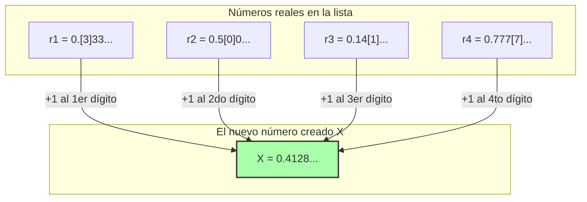

## 1. Una lista de números definibles con palabras

La "Paradoja de Richard", publicada por el matemático francés Jules Richard en 1905, es como un pariente de la "Paradoja de Berry" que presentamos antes. Sin embargo, esta es más matemática y contiene una profunda contradicción, como si asomara al infinito.

Primero, imagina recopilar todos los **"números reales (decimales) entre 0 y 1 que puedan definirse completamente en español"**.

Por ejemplo, números como los siguientes:
- "Cero punto cinco" $\rightarrow$ $0.5$
- "Un tercio" $\rightarrow$ $0.333333...$
- "El número formado por los decimales de pi a partir del primer decimal" $\rightarrow$ $0.14159265...$

Las combinaciones de frases que se pueden expresar en español solo requieren reorganizar las letras que aparecen en el diccionario, por lo que se les puede asignar un "orden".
(Por ejemplo, ordenándolos del menor número de letras al mayor, y si tienen el mismo número de letras, ordenarlos alfabéticamente).

De esta manera, a "todos los números reales definibles en español" se les puede asignar un **número continuo infinito (una lista)**: primero, segundo, tercero...

$$
\begin{align*}
r_1 &= 0.\mathbf{3}333... \\
r_2 &= 0.5\mathbf{0}00... \\
r_3 &= 0.14\mathbf{1}5... \\
r_4 &= 0.777\mathbf{7}... \\
&\vdots
\end{align*}
$$

En esta lista deberían estar cubiertos de manera absolutamente exhaustiva, sin faltar ni uno, "todos los números reales concebibles que puedan definirse en español".

---

## 2. La técnica diabólica: el "argumento de la diagonal"

Aquí, Richard realiza una operación aterradora.
Crea artificialmente un **"número $X$ completamente nuevo"** que evita todos los números de la lista.

La forma de crearlo es sencilla.
- Mira el **primer** decimal del **primer** número de la lista (en el ejemplo anterior, el $3$). Suma $1$ a ese número para que sea el primer dígito de $X$ ($3+1=4$).
- Mira el **segundo** decimal del **segundo** número de la lista (en el ejemplo anterior, el $0$). Suma $1$ a ese número para que sea el segundo dígito de $X$ ($0+1=1$).
- Mira el **tercer** decimal del **tercer** número de la lista (en el ejemplo anterior, el $1$). Suma $1$ a ese número para que sea el tercer dígito de $X$ ($1+1=2$).

※ Si el número original fuera un $9$, se regresaría a $0$.

El nuevo número $X$ creado con este método (en el ejemplo anterior, $X = 0.4128...$) **nunca coincidirá en absoluto con ningún número** de la lista.
Esto se debe a que el número del "lugar decimal $n$" ha sido modificado intencionalmente para que sea distinto al del $n$-ésimo número.
(Esta técnica se llama **"argumento de la diagonal"**, la cual fue ideada por el matemático genio Cantor para demostrar el tamaño infinito de los números reales).

---

## 3. La completitud de la Paradoja de Richard

Ahora bien, aquí comienza la paradoja.

Acabamos de crear un nuevo número $X$.
Y la "regla" para crear este $X$ ha sido explicada (definida) perfectamente por **las frases en español que escribí arriba**.

Es decir, $X$ es **"un número real definible en español"**.

Sin embargo, recordemos la premisa inicial.
Se suponía que "los números reales definibles en español" estaban **todos exhaustivamente incluidos dentro de la lista inicial ($r_1, r_2, r_3...$)**.
A pesar de esto, $X$ está hecho de manera que no coincida con ningún número de la lista.

1. **$X$ debe existir dentro de la lista (porque se definió en español).**
2. **$X$ no debe existir dentro de la lista (porque se hizo diferente a todos los números de la lista mediante el argumento de la diagonal).**

¡Una contradicción perfecta! Esta es la paradoja de Richard.

---

## 4. ¿Por qué se derrumbó la lógica? (La trampa del metalenguaje)

La causa de esta paradoja, al igual que la paradoja de Berry, radica en haber confundido la "jerarquía de los lenguajes".

Para hacer matemáticas rigurosamente, se debe separar claramente la "lista de números objetivo (lenguaje objeto)" y "las reglas que hablan desde el exterior sobre las propiedades de esa lista (metalenguaje)".

La lista de Richard es una colección de "definiciones de números calculables".
Sin embargo, la regla para crear el nuevo número $X$, que consiste en "mirar el $n$-ésimo dígito del $n$-ésimo número de la lista", es una **operación del "metalenguaje" que no puede ejecutarse sin tener una vista panorámica de la lista desde el exterior**.

La paradoja de Richard estalló creando una autocontradicción porque intentó infiltrar en secreto el "número $X$ metalingüístico, creado operando la lista desde afuera", en el interior de la "lista interna".

---

## 5. El paso del testigo a Gödel

Esta paradoja de Richard causó un gran impacto en el mundo de las matemáticas de aquel entonces.
"Si no tenemos cuidado, las palabras humanas (y los sistemas lógicos) provocan autocontradicciones de inmediato. ¿Cómo podemos hacer que las matemáticas sean perfectas y libres de contradicciones?"

En 1931, el matemático genio Kurt Gödel, de tan solo 25 años, dio una solución final a este problema.
Gödel logró traducir y reproducir perfectamente la estructura de esta paradoja —que Richard había provocado usando "la ambigüedad del español"— utilizando **"fórmulas matemáticas estrictas (Números de Gödel)"**.

El resultado que derivó de esto es el famoso **"Teorema de Incompletitud de Gödel"**.
Fue un gran descubrimiento que demostró los límites del conocimiento humano: "Sin importar cuán rigurosamente construyas las reglas matemáticas, dentro de esas reglas siempre surgirán 'verdades que no se pueden probar ni refutar' (las matemáticas son incompletas)".

La paradoja de Richard comenzó como un simple juego de palabras contradictorio, y eventualmente evolucionó hasta convertirse en el arma más poderosa para destruir la "absolutidad" de las matemáticas como disciplina académica.
