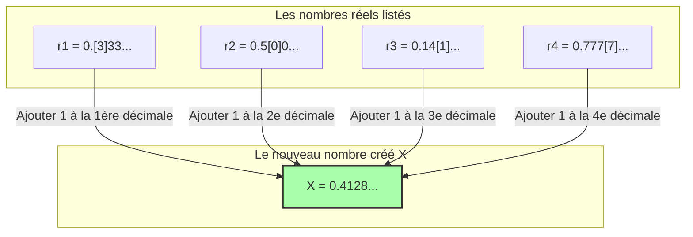

## 1. La liste des nombres définissables par des mots

Le "paradoxe de Richard", présenté en 1905 par le mathématicien français Jules Richard, est en quelque sorte le parent du "paradoxe de Berry" que nous avons vu précédemment. Cependant, celui-ci est plus mathématique et contient une contradiction profonde qui semble scruter l'infini.

Tout d'abord, imaginez que nous rassemblons **"tous les nombres réels (décimaux) compris entre 0 et 1 qui peuvent être parfaitement définis par une phrase en français"**.

Par exemple, des nombres comme ceux-ci :
- "Zéro virgule cinq" $\rightarrow$ $0.5$
- "Un tiers" $\rightarrow$ $0.333333...$
- "Le nombre formé par les décimales de pi" $\rightarrow$ $0.14159265...$

Puisque les combinaisons de phrases pouvant être exprimées en français ne sont que des réarrangements de lettres trouvées dans le dictionnaire, il est possible de leur donner un "ordre".
(Par exemple, en les triant par ordre croissant du nombre de lettres, et à nombre de lettres égal, par ordre alphabétique.)

Ainsi, nous avons pu créer une **liste numérotée à l'infini** (1er, 2e, 3e...) de "tous les nombres réels définissables en français".

$$
\begin{align*}
r_1 &= 0.\mathbf{3}333... \\
r_2 &= 0.5\mathbf{0}00... \\
r_3 &= 0.14\mathbf{1}5... \\
r_4 &= 0.777\mathbf{7}... \\
&\vdots
\end{align*}
$$

Dans cette liste, "absolument tous les nombres réels définissables en français" devraient être parfaitement répertoriés, sans aucune exception.

---

## 2. La technique diabolique : l'"argument de la diagonale"

C'est ici que Richard effectue une opération terrifiante.
Il crée artificiellement un **"nouveau nombre $X$ complètement inédit"**, de telle sorte qu'il évite tous les nombres de la liste.

La méthode de fabrication est simple.
- Regardez la **1ère décimale** du **1er** nombre de la liste (dans l'exemple ci-dessus, $3$). Ajoutez $1$ à ce chiffre, et cela devient la 1ère décimale de $X$ ($3+1=4$).
- Regardez la **2e décimale** du **2e** nombre de la liste (dans l'exemple ci-dessus, $0$). Ajoutez $1$ à ce chiffre, et cela devient la 2e décimale de $X$ ($0+1=1$).
- Regardez la **3e décimale** du **3e** nombre de la liste (dans l'exemple ci-dessus, $1$). Ajoutez $1$ à ce chiffre, et cela devient la 3e décimale de $X$ ($1+1=2$).

※ Si le chiffre d'origine est $9$, on suppose qu'il revient à $0$.

Le nouveau nombre $X$ créé de cette manière (dans l'exemple ci-dessus, $X = 0.4128...$) ne correspondra **absolument jamais à aucun nombre de la liste**.
Pourquoi ? Parce que la "$n$-ième décimale" est intentionnellement décalée par rapport au $n$-ième nombre de la liste.
(Cette technique, inventée par le génial mathématicien Cantor pour prouver la grandeur infinie des nombres réels, est appelée l'**"argument de la diagonale"**.)

---

## 3. L'achèvement du paradoxe de Richard

Maintenant, voici le paradoxe.

Nous venons tout juste de créer un nouveau nombre $X$.
Et la "règle" pour créer ce $X$ est parfaitement expliquée (définie) par **la phrase en français que je viens d'écrire ci-dessus**.

En d'autres termes, $X$ est un **"nombre réel définissable en français"**.

Cependant, souvenez-vous de la prémisse initiale.
"Les nombres réels définissables en français" devaient être **tous répertoriés dans la première liste ($r_1, r_2, r_3...$)**.
Pourtant, $X$ a été conçu de manière à ne correspondre à aucun nombre de la liste.

1. **$X$ doit exister dans la liste (car il a été défini en français).**
2. **$X$ ne doit pas exister dans la liste (car il a été conçu par l'argument de la diagonale pour être différent de tous les nombres de la liste).**

C'est une contradiction parfaite ! C'est le paradoxe de Richard.

---

## 4. Pourquoi la logique s'est-elle effondrée ? (Le piège du métalangage)

La cause de ce paradoxe, tout comme le paradoxe de Berry, réside dans la confusion des "niveaux de langage".

Pour faire des mathématiques de manière rigoureuse, il faut séparer clairement la "liste des nombres cibles (le langage objet)" et les "règles qui parlent de l'extérieur des propriétés de cette liste (le métalangage)".

La liste de Richard est un rassemblement de "définitions de nombres calculables".
Cependant, la règle pour créer le nouveau nombre $X$, "regarder la $n$-ième décimale du $n$-ième nombre de la liste", est une opération du **"métalangage" qui ne peut être exécutée qu'en observant la liste elle-même de l'extérieur**.

Le paradoxe de Richard a explosé en une contradiction interne parce qu'il a tenté de glisser secrètement ce "nombre métalinguistique $X$ créé en manipulant la liste de l'extérieur" à l'intérieur de la "liste interne".

---

## 5. Le passage de témoin à Gödel

Le paradoxe de Richard a provoqué une grande onde de choc dans le monde mathématique de l'époque.
"Le langage humain (et les systèmes logiques), si l'on n'y prend pas garde, peuvent rapidement générer des contradictions internes. Que doit-on faire pour rendre les mathématiques parfaites et exemptes de contradictions ?"

En 1931, c'est Kurt Gödel, un jeune mathématicien de génie de 25 ans, qui a apporté une conclusion définitive à ce problème.
Gödel a parfaitement traduit et reproduit la structure de ce paradoxe, que Richard avait provoqué en utilisant "l'ambiguïté du langage humain", à l'aide de **"formules mathématiques rigoureuses (nombres de Gödel)"**.

Le résultat qui en a découlé est le célèbre **"théorème d'incomplétude de Gödel"**.
C'était une découverte majeure démontrant les limites du savoir humain : "Aussi rigoureusement que vous définissiez les règles mathématiques, il y aura toujours dans ces règles des 'vérités qui ne peuvent être ni prouvées ni réfutées' (les mathématiques sont incomplètes)."

Le paradoxe de Richard a commencé comme un simple jeu de mots contradictoire, pour évoluer ensuite en l'arme ultime permettant de briser "l'absoluité" de la discipline mathématique elle-même.
