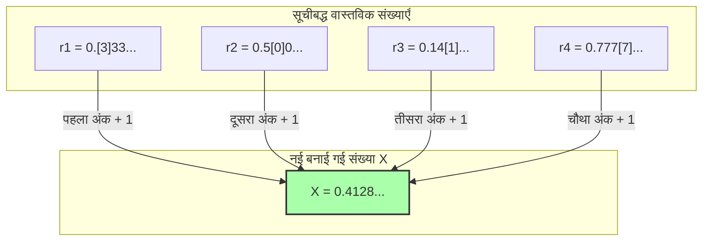

## 1. शब्दों द्वारा परिभाषित की जा सकने वाली संख्याओं की सूची

1905 में फ्रांसीसी गणितज्ञ जूल्स रिचर्ड द्वारा प्रकाशित "रिचर्ड का विरोधाभास" (Richard's Paradox), पहले बताए गए "बेरी के विरोधाभास" का ही एक रिश्तेदार है। हालाँकि, यह अधिक गणितीय है और इसमें एक गहरा अंतर्विरोध शामिल है, मानो हम अनंत की गहराई में झाँक रहे हों।

सबसे पहले, उन **"0 और 1 के बीच की सभी वास्तविक संख्याओं (दशमलवों) की कल्पना करें जिन्हें हिंदी भाषा के वाक्यों द्वारा पूरी तरह से परिभाषित किया जा सकता है"** और उन्हें एक साथ इकट्ठा करें।

उदाहरण के लिए, निम्नलिखित संख्याएँ:
- "शून्य दशमलव पाँच" $\rightarrow$ $0.5$
- "एक तिहाई" $\rightarrow$ $0.333333...$
- "पाई (pi) का मान दशमलव के पहले स्थान से आगे तक" $\rightarrow$ $0.14159265...$

हिंदी में व्यक्त किए जा सकने वाले वाक्यों का संयोजन केवल शब्दकोश में मौजूद अक्षरों को फिर से व्यवस्थित करने से बनता है, इसलिए हम उन्हें एक "क्रम" दे सकते हैं।
(उदाहरण के लिए, अक्षरों की संख्या के आधार पर छोटे से बड़े के क्रम में, और यदि अक्षरों की संख्या समान है, तो वर्णमाला के क्रम में व्यवस्थित किया जा सकता है।)

इस प्रकार, हम "हिंदी में परिभाषित की जा सकने वाली सभी वास्तविक संख्याओं" की पहली, दूसरी, तीसरी... और इसी तरह **एक अनंत सूची** बना सकते हैं।

$$
\begin{align*}
r_1 &= 0.\mathbf{3}333... \\
r_2 &= 0.5\mathbf{0}00... \\
r_3 &= 0.14\mathbf{1}5... \\
r_4 &= 0.777\mathbf{7}... \\
&\vdots
\end{align*}
$$

इस सूची में, "हिंदी में परिभाषित की जा सकने वाली हर एक वास्तविक संख्या" को बिना कोई संख्या छोड़े पूरी तरह से शामिल किया जाना चाहिए।

---

## 2. शैतान की तकनीक "विकर्ण तर्क"

यहाँ, रिचर्ड एक भयानक चाल चलते हैं।
वह जानबूझकर एक **"बिल्कुल नई संख्या $X$"** बनाते हैं जो सूची में मौजूद सभी संख्याओं से बचकर निकल जाती है।

इसे बनाने का तरीका सरल है:
- सूची की **पहली** संख्या के दशमलव के बाद **पहले** अंक को देखें (ऊपर के उदाहरण में $3$)। इसमें $1$ जोड़ें, और उसे $X$ का पहला अंक बना दें ($3+1=4$)।
- सूची की **दूसरी** संख्या के दशमलव के बाद **दूसरे** अंक को देखें (ऊपर के उदाहरण में $0$)। इसमें $1$ जोड़ें, और उसे $X$ का दूसरा अंक बना दें ($0+1=1$)।
- सूची की **तीसरी** संख्या के दशमलव के बाद **तीसरे** अंक को देखें (ऊपर के उदाहरण में $1$)। इसमें $1$ जोड़ें, और उसे $X$ का तीसरा अंक बना दें ($1+1=2$)।

※ यदि मूल संख्या $9$ है, तो हम इसे वापस $0$ मान लेंगे।

इस विधि द्वारा बनाई गई नई संख्या $X$ (ऊपर के उदाहरण में $X = 0.4128...$) सूची में मौजूद **किसी भी संख्या से बिल्कुल भी मेल नहीं खाती है**।
ऐसा इसलिए है क्योंकि $n$ वीं संख्या के "दशमलव के बाद $n$ वें" अंक को जानबूझकर बदल दिया गया है।
(इस तकनीक को महान गणितज्ञ कैंटर (Cantor) द्वारा वास्तविक संख्याओं के अनंत आकार को साबित करने के लिए विकसित किया गया था और इसे **"विकर्ण तर्क" (Diagonal Argument)** कहा जाता है।)

---

## 3. रिचर्ड के विरोधाभास का पूर्ण होना

अब, यहाँ से विरोधाभास शुरू होता है।

हमने अभी-अभी एक नई संख्या $X$ बनाई है।
और इस $X$ को बनाने का "नियम" **ऊपर लिखे गए हिंदी वाक्यों** द्वारा पूरी तरह से समझाया (परिभाषित) गया है।

अर्थात, $X$ भी **"हिंदी में परिभाषित की जा सकने वाली एक वास्तविक संख्या"** है।

लेकिन, हमारी शुरुआती शर्त को याद करें:
"हिंदी में परिभाषित की जा सकने वाली सभी वास्तविक संख्याओं" को **शुरुआती सूची ($r_1, r_2, r_3...$) में पूरी तरह से शामिल होना चाहिए था**।
इसके बावजूद, $X$ को इस तरह से बनाया गया है कि वह सूची की किसी भी संख्या से मेल नहीं खाती।

1. **$X$ को सूची में मौजूद होना चाहिए (क्योंकि इसे हिंदी में परिभाषित किया गया है)।**
2. **$X$ को सूची में मौजूद नहीं होना चाहिए (क्योंकि इसे विकर्ण तर्क द्वारा सूची की सभी संख्याओं से अलग बनाया गया है)।**

यह एक पूर्ण अंतर्विरोध है! यही रिचर्ड का विरोधाभास है।

---

## 4. तर्क क्यों विफल हुआ? (मेटा-भाषा का जाल)

इस विरोधाभास के उत्पन्न होने का कारण भी "बेरी के विरोधाभास" के समान ही "भाषा के स्तरों" को आपस में मिला देना है।

गणित को कड़ाई से करने के लिए, हमें "लक्षित संख्याओं की सूची (लक्षित भाषा)" और "उन नियमों जो सूची की प्रकृति के बारे में बाहर से बात करते हैं (मेटा-भाषा)" के बीच स्पष्ट रूप से अंतर करना होगा।

रिचर्ड की सूची "गणनीय संख्याओं की परिभाषाओं" का एक संग्रह है।
हालाँकि, नई संख्या $X$ बनाने के लिए "सूची की $n$ वीं संख्या का $n$ वां अंक देखना" एक **मेटा-भाषाई प्रक्रिया** है, जिसे सूची को बाहर से देखे बिना निष्पादित नहीं किया जा सकता।

रिचर्ड का विरोधाभास इसलिए उत्पन्न हुआ क्योंकि उन्होंने एक "मेटा-भाषाई संख्या $X$", जो सूची को बाहर से हेरफेर करके बनाई गई थी, को चुपके से "अंदर की सूची" में शामिल करने का प्रयास किया, जिससे आत्म-अंतर्विरोध उत्पन्न हुआ और तर्क ध्वस्त हो गया।

---

## 5. गोडेल को बैटन सौंपना

रिचर्ड के इस विरोधाभास ने उस समय के गणितीय जगत को झकझोर कर रख दिया था।
"मानवीय भाषा (और तार्किक प्रणालियाँ), यदि सावधानी न बरती जाए, तो आसानी से आत्म-अंतर्विरोध उत्पन्न कर सकती हैं। हम गणित को पूर्ण और अंतर्विरोध-मुक्त कैसे बना सकते हैं?"

1931 में, मात्र 25 वर्षीय प्रतिभाशाली गणितज्ञ कुर्ट गोडेल ने इस समस्या का अंतिम समाधान किया।
गोडेल ने "कठोर गणितीय सूत्रों (गोडेल संख्या)" का उपयोग करके इस विरोधाभास की संरचना का पूरी तरह से अनुवाद और पुनरुत्पादन किया, जो रिचर्ड ने "भाषा की अस्पष्टता" का उपयोग करके उत्पन्न किया था।

इसके परिणामस्वरूप प्रसिद्ध **"गोडेल की अपूर्णता प्रमेय"** सामने आई।
यह इस बात की एक बड़ी खोज थी कि मानव ज्ञान की एक सीमा है: "चाहे हम गणित के नियमों को कितनी भी कड़ाई से क्यों न बना लें, उन नियमों के भीतर हमेशा ऐसे 'सत्य' उत्पन्न होंगे जिन्हें 'साबित या गलत साबित नहीं किया जा सकता' (गणित अपूर्ण है)।"

रिचर्ड का विरोधाभास केवल शब्दों के एक विरोधाभासी खेल के रूप में शुरू हुआ था, लेकिन अंततः यह गणित के अनुशासन की "पूर्णता" को तोड़ने वाले सबसे शक्तिशाली हथियार के रूप में विकसित हो गया।
