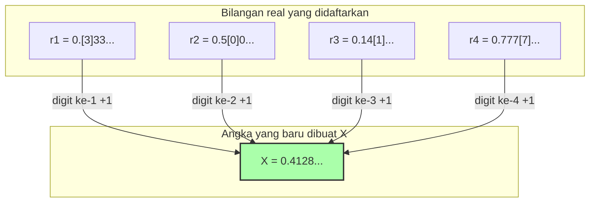

## 1. Daftar Angka yang Dapat Didefinisikan dengan Kata-kata

"Paradoks Richard" yang diterbitkan oleh matematikawan Prancis Jules Richard pada tahun 1905 adalah kerabat dari "Paradoks Berry" yang telah diperkenalkan sebelumnya. Namun, paradoks ini lebih matematis dan mengandung kontradiksi mendalam yang seolah mengintip ke dalam ketakterhinggaan.

Pertama, bayangkan kita mengumpulkan semua **"bilangan real (desimal) antara 0 dan 1 yang dapat didefinisikan secara sempurna dalam kalimat bahasa Indonesia"**.

Misalnya, angka-angka berikut:
- "Nol koma lima" $\rightarrow$ $0.5$
- "Sepertiga" $\rightarrow$ $0.333333...$
- "Angka pi dari tempat desimal pertama dan seterusnya" $\rightarrow$ $0.14159265...$

Kombinasi kalimat yang dapat diekspresikan dalam bahasa Indonesia hanyalah menyusun ulang huruf-huruf yang ada di kamus, sehingga kita dapat mengurutkannya.
(Misalnya, diurutkan dari yang jumlah hurufnya paling sedikit, dan jika jumlah hurufnya sama, diurutkan berdasarkan abjad, dan seterusnya.)

Dengan cara ini, kita dapat membuat **penomoran (daftar) tanpa akhir**, seperti ke-1, ke-2, ke-3, dan seterusnya untuk "semua bilangan real yang dapat didefinisikan dalam bahasa Indonesia".

$$
\begin{align*}
r_1 &= 0.\mathbf{3}333... \\
r_2 &= 0.5\mathbf{0}00... \\
r_3 &= 0.14\mathbf{1}5... \\
r_4 &= 0.777\mathbf{7}... \\
&\vdots
\end{align*}
$$

Daftar ini seharusnya mencakup secara sempurna "setiap bilangan real yang dapat didefinisikan dalam bahasa Indonesia", tanpa ada yang tertinggal.

---

## 2. Teknik Iblis "Argumen Diagonal"

Di sini, Richard melakukan operasi yang menakutkan.
Dia secara artifisial menciptakan **"angka yang sama sekali baru $X$"** yang menghindari semua angka yang ada di dalam daftar.

Cara membuatnya sederhana:
- Lihat angka pada **tempat desimal ke-1** dari angka **ke-1** dalam daftar (dalam contoh di atas adalah $3$). Tambahkan $1$ padanya, dan jadikan angka tersebut sebagai digit ke-1 dari $X$ ($3+1=4$).
- Lihat angka pada **tempat desimal ke-2** dari angka **ke-2** dalam daftar (dalam contoh di atas adalah $0$). Tambahkan $1$ padanya, dan jadikan angka tersebut sebagai digit ke-2 dari $X$ ($0+1=1$).
- Lihat angka pada **tempat desimal ke-3** dari angka **ke-3** dalam daftar (dalam contoh di atas adalah $1$). Tambahkan $1$ padanya, dan jadikan angka tersebut sebagai digit ke-3 dari $X$ ($1+1=2$).

※Jika angka aslinya adalah $9$, kita mengembalikannya menjadi $0$.

Angka baru $X$ yang dibuat dengan cara ini (dalam contoh di atas $X = 0.4128...$) **sama sekali tidak akan cocok** dengan angka mana pun di dalam daftar.
Karena digit pada "tempat desimal ke-$n$" dari angka ke-$n$ sengaja digeser.
(Teknik ini disebut **"Argumen Diagonal"**, yang diciptakan oleh matematikawan jenius Cantor untuk membuktikan ukuran ketakterhinggaan bilangan real.)

---

## 3. Kesempurnaan Paradoks Richard

Nah, dari sinilah paradoksnya dimulai.

Kita baru saja menciptakan angka baru $X$.
Dan "aturan" untuk menciptakan $X$ ini telah dijelaskan (didefinisikan) secara sempurna oleh **kalimat bahasa Indonesia yang baru saja saya tulis di atas**.

Dengan kata lain, $X$ adalah **"bilangan real yang dapat didefinisikan dalam bahasa Indonesia"**.

Namun, ingat kembali premis awalnya.
"Bilangan real yang dapat didefinisikan dalam bahasa Indonesia" seharusnya **semuanya telah tercakup dalam daftar awal ($r_1, r_2, r_3...$)**.
Meskipun demikian, $X$ dibuat sedemikian rupa sehingga tidak cocok dengan angka mana pun di dalam daftar.

1. **$X$ harus ada di dalam daftar (karena didefinisikan dalam bahasa Indonesia).**
2. **$X$ tidak boleh ada di dalam daftar (karena dibuat berbeda dari semua angka di dalam daftar menggunakan argumen diagonal).**

Sebuah kontradiksi yang sempurna! Inilah Paradoks Richard.

---

## 4. Mengapa Logikanya Runtuh? (Jebakan Bahasa Meta)

Penyebab lahirnya paradoks ini, sama seperti Paradoks Berry, terletak pada pencampuran "hierarki bahasa".

Untuk melakukan matematika dengan ketat, kita harus memisahkan dengan jelas "daftar angka yang menjadi objek (bahasa objek)" dan "aturan yang berbicara dari luar tentang sifat daftar tersebut (bahasa meta)".

Daftar Richard adalah kumpulan "definisi angka yang dapat dihitung".
Namun, aturan "melihat digit ke-$n$ dari angka ke-$n$ dalam daftar" untuk menciptakan angka baru $X$ adalah **operasi "bahasa meta" yang hanya dapat dieksekusi dengan melihat daftar tersebut dari luar**.

Paradoks Richard meledak dalam kontradiksi diri karena secara diam-diam mencoba menyusupkan "angka metalinguistik $X$ yang dibuat dengan memanipulasi daftar dari luar" ke "daftar di dalam".

---

## 5. Estafet kepada Gödel

Paradoks Richard ini memberikan kejutan besar bagi dunia matematika pada saat itu.
"Kata-kata manusia (dan sistem logika), jika tidak berhati-hati, dapat dengan cepat menyebabkan kontradiksi diri. Bagaimana kita bisa membuat matematika menjadi sempurna dan bebas dari kontradiksi?"

Pada tahun 1931, masalah ini akhirnya diselesaikan oleh matematikawan jenius berusia 25 tahun, Kurt Gödel.
Gödel menerjemahkan dan mereproduksi secara sempurna struktur paradoks yang disebabkan oleh Richard menggunakan "ambiguitas bahasa", dengan menggunakan **"rumus matematika yang ketat (bilangan Gödel)"**.

Hasil yang diturunkan darinya adalah **"Teorema Ketidaklengkapan Gödel"** yang terkenal.
Itu adalah penemuan besar yang membuktikan batas pengetahuan umat manusia: "Tidak peduli seberapa ketat Anda membuat aturan matematika, 'kebenaran yang tidak dapat dibuktikan maupun disangkal' pasti akan muncul di dalam aturan tersebut (matematika itu tidak lengkap)".
