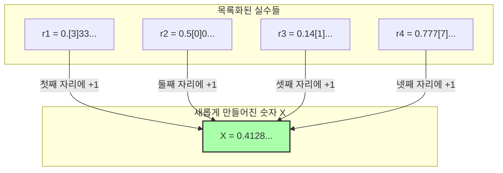

## 1. 말로 정의할 수 있는 숫자의 목록

프랑스의 수학자 쥘 리샤르(Jules Richard)가 1905년에 발표한 "리샤르의 역설(Richard's paradox)"은 앞서 소개한 "베리의 역설"과 친척 같은 존재입니다. 하지만 이쪽은 좀 더 수학적이고, 무한의 저편을 들여다보는 듯한 깊은 모순을 포함하고 있습니다.

먼저, **"한국어 문장으로 완벽하게 정의할 수 있는, 0에서 1 사이의 실수(소수)"**를 모두 모아온다고 상상해 보세요.

예를 들어, 다음과 같은 숫자입니다.
- "영 포인트 오" $\rightarrow$ $0.5$
- "삼분의 일" $\rightarrow$ $0.333333...$
- "원주율의 소수점 첫째 자리부터 차례대로 나열한 수" $\rightarrow$ $0.14159265...$

한국어로 표현할 수 있는 문장의 조합은 사전에 실린 글자를 나열하기만 하면 되기 때문에 "순서"를 매길 수 있습니다.
(예를 들어, 글자 수가 적은 순서대로 나열하고, 글자 수가 같다면 가나다순으로 나열하는 식입니다.)

이렇게 해서 "한국어로 정의할 수 있는 모든 실수"에 1번째, 2번째, 3번째... 하고 **무한히 이어지는 번호(목록)**를 만들 수 있었습니다.

$$
\begin{align*}
r_1 &= 0.\mathbf{3}333... \\
r_2 &= 0.5\mathbf{0}00... \\
r_3 &= 0.14\mathbf{1}5... \\
r_4 &= 0.777\mathbf{7}... \\
&\vdots
\end{align*}
$$

이 목록 안에는 "한국어로 정의할 수 있는 모든 실수"가 하나도 빠짐없이 완벽하게 망라되어 있을 것입니다.

---

## 2. 악마의 테크닉 "대각선 논법"

여기서 리샤르는 무서운 조작을 가합니다.
목록에 있는 모든 숫자를 교묘히 피해 가는 **"완전히 새로운 숫자 $X$"**를 인공적으로 만들어 내는 것입니다.

만드는 방법은 간단합니다.
- 목록의 **1번째** 숫자의 소수점 이하 **첫째 자리**를 봅니다 (위의 예라면 $3$). 거기에 $1$을 더한 수를 $X$의 첫째 자리로 만듭니다 ($3+1=4$).
- 목록의 **2번째** 숫자의 소수점 이하 **둘째 자리**를 봅니다 (위의 예라면 $0$). 거기에 $1$을 더한 수를 $X$의 둘째 자리로 만듭니다 ($0+1=1$).
- 목록의 **3번째** 숫자의 소수점 이하 **셋째 자리**를 봅니다 (위의 예라면 $1$). 거기에 $1$을 더한 수를 $X$의 셋째 자리로 만듭니다 ($1+1=2$).

※만약 원래 숫자가 $9$라면 $0$으로 되돌린다고 가정합니다.

이 방법으로 만들어진 새로운 숫자 $X$ (위의 예라면 $X = 0.4128...$)는 목록 안의 **어떤 숫자와도 절대로 일치하지 않습니다**.
왜냐하면, $n$번째 숫자와는 반드시 "소수점 이하 $n$번째" 숫자가 의도적으로 어긋나 있기 때문입니다.
(이 기법은 천재 수학자 칸토어가 실수의 무한한 크기를 증명하기 위해 고안해 낸 **"대각선 논법"**이라고 불립니다.)

---

## 3. 리샤르의 역설의 완성

자, 여기서부터가 역설입니다.

우리는 방금 전, 새로운 숫자 $X$를 만들어 냈습니다.
그리고 이 $X$를 만들어 내기 위한 "규칙"은 **지금, 제가 위에서 적은 한국어 문장**에 의해 완벽하게 설명(정의)되었습니다.

즉, $X$는 **"한국어로 정의할 수 있는 실수"**인 것입니다.

하지만 처음의 전제를 떠올려 보세요.
"한국어로 정의할 수 있는 실수"는 **모두 처음 목록($r_1, r_2, r_3...$) 안에 망라되어 있어야** 했습니다.
그런데도 $X$는 목록 안의 어떤 숫자와도 일치하지 않도록 만들어졌습니다.

1. **$X$는 목록 안에 존재해야 한다 (한국어로 정의되었으므로).**
2. **$X$는 목록 안에 존재해서는 안 된다 (대각선 논법으로 목록 내의 모든 수와 다르게 만들어졌으므로).**

완벽한 모순입니다! 이것이 리샤르의 역설입니다.

---

## 4. 왜 논리가 붕괴되었는가? (메타 언어의 함정)

이 역설이 생겨난 원인도, 베리의 역설과 마찬가지로 "언어의 계층"을 혼동해 버렸기 때문입니다.

수학을 엄밀하게 다루기 위해서는 "대상이 되는 숫자의 목록(대상 언어)"과 "그 목록의 성질에 대해 외부에서 언급하는 규칙(메타 언어)"을 명확하게 구별해야 합니다.

리샤르의 목록은 "계산 가능한 숫자의 정의"를 모아둔 것입니다.
하지만 새로운 수 $X$를 만들어 내기 위한 "목록의 $n$번째 숫자의 $n$번째 자리를 본다"는 규칙은 목록 자체를 **외부에서 부감하지 않으면 실행할 수 없는 "메타 언어"적인 조작**입니다.

리샤르의 역설은 "목록을 외부에서 조작하여 만든 메타 언어적인 숫자 $X$"를, 슬그머니 "내부의 목록" 안에 끼워 넣으려 했기 때문에 자기 모순을 일으켜 폭발해 버린 것입니다.

---

## 5. 괴델에게로 바통 터치

이 리샤르의 역설은 당시 수학계에 큰 충격을 주었습니다.
"인간의 언어(또는 논리 체계)는 조심하지 않으면 금방 자기 모순을 일으키고 만다. 수학을 완벽하고 모순이 없는 것으로 만들려면 어떻게 해야 할까?"

1931년, 이 문제에 최종적인 결론을 낸 것이 갓 25살의 천재 수학자 쿠르트 괴델이었습니다.
괴델은 리샤르가 "언어의 모호함"을 사용해 일으킨 이 역설의 구조를, **"엄밀한 수학의 수식(괴델 수)"**을 사용하여 완벽하게 번역 및 재현해 보였습니다.

그 결과 도출된 것이, 그 유명한 **"괴델의 불완전성 정리"**입니다.
"아무리 엄밀하게 수학의 규칙을 만들어도, 그 규칙 안에는 '증명도 반증도 할 수 없는 진리'가 반드시 발생해 버린다 (수학은 불완전하다)"는, 인류 지성의 한계를 증명하는 대발견이었습니다.

리샤르의 역설은 단순한 모순된 말장난에서 시작되어, 이윽고 수학이라는 학문 그 자체의 "절대성"을 깨부수기 위한 최강의 무기로 진화한 것입니다.
