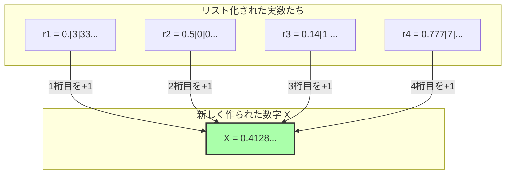

## 1. 言葉で定義できる数字のリスト

フランスの数学者ジュール・リシャールが1905年に発表した「リシャールのパラドックス」は、先ほど紹介した「ベリーのパラドックス」の親戚のような存在です。しかし、こちらはより数学的で、無限の彼方を覗き込むような深い矛盾を含んでいます。

まず、**「日本語の文章で完全に定義できる、0から1の間の実数（小数）」**をすべて集めてくることを想像してください。

たとえば、次のような数字です。
- 「ゼロ・ポイント・ゴ」 $\rightarrow$ $0.5$
- 「さんぶんのいち」 $\rightarrow$ $0.333333...$
- 「えんしゅうりつのしょうすうだいいちいからさきをならべたかず」 $\rightarrow$ $0.14159265...$

日本語で表現できる文章の組み合わせは、辞書に載っている文字を並べ替えるだけなので、「順番」をつけることができます。
（たとえば、文字数が少ない順に並べ、同じ文字数ならあいうえお順に並べる、といった具合です。）

こうして、「日本語で定義できるすべての実数」に、1番目、2番目、3番目……と**無限に続く番号（リスト）**を作ることができました。

$$
\begin{align*}
r_1 &= 0.\mathbf{3}333... \\
r_2 &= 0.5\mathbf{0}00... \\
r_3 &= 0.14\mathbf{1}5... \\
r_4 &= 0.777\mathbf{7}... \\
&\vdots
\end{align*}
$$

このリストの中には、「日本語で定義できるありとあらゆる実数」が、一つ残らず完璧に網羅されているはずです。

---

## 2. 悪魔のテクニック「対角線論法」

ここで、リシャールは恐ろしい操作を行います。
リストの中にあるすべての数字を避けて通るような、**「全く新しい数字 $X$」**を人工的に作り出してしまうのです。

作り方は簡単です。
- リストの**1番目**の数字の、小数点以下**1桁目**を見る（上の例なら $3$）。それに $1$ を足した数を、$X$ の1桁目にする（$3+1=4$）。
- リストの**2番目**の数字の、小数点以下**2桁目**を見る（上の例なら $0$）。それに $1$ を足した数を、$X$ の2桁目にする（$0+1=1$）。
- リストの**3番目**の数字の、小数点以下**3桁目**を見る（上の例なら $1$）。それに $1$ を足した数を、$X$ の3桁目にする（$1+1=2$）。

※もし元の数字が $9$ だったら $0$ に戻すとします。

この方法で作られた新しい数字 $X$（上の例なら $X = 0.4128...$）は、リストの中の**どの数字とも絶対に一致しません**。
なぜなら、$n$ 番目の数字とは必ず「小数点以下 $n$ 桁目」の数字が意図的にズラしてあるからです。
（この手法は、天才数学者カントールが実数の無限の大きさを証明するために編み出した**「対角線論法」**と呼ばれます。）

---

## 3. リシャールのパラドックスの完成

さて、ここからがパラドックスです。

私たちはたった今、新しい数字 $X$ を作り出しました。
そして、この $X$ を作り出すための「ルール」は、**今、私が上で書いた日本語の文章**によって完璧に説明（定義）されています。

つまり、$X$ は**「日本語で定義できる実数」**なのです。

しかし、最初の前提を思い出してください。
「日本語で定義できる実数」は、**すべて最初のリスト（$r_1, r_2, r_3...$）の中に網羅されているはず**でした。
それなのに、$X$ はリストの中のどの数字とも一致しないように作られています。

1. **$X$ はリストの中に存在しなければならない（日本語で定義されたから）。**
2. **$X$ はリストの中に存在してはならない（対角線論法でリスト内のすべての数と違うように作られたから）。**

完璧な矛盾です！ これがリシャールのパラドックスです。

---

## 4. なぜ論理が崩壊したのか？（メタ言語の罠）

このパラドックスが生まれた原因も、ベリーのパラドックスと同様に「言語の階層」を混同してしまったことにあります。

数学を厳密に行うためには、「対象となる数字のリスト（対象言語）」と、「そのリストの性質について外側から語るルール（メタ言語）」を明確に分けなければなりません。

リシャールのリストは、「計算可能な数字の定義」を集めたものです。
しかし、新しい数 $X$ を作り出すための「リストの $n$ 番目の数字の $n$ 桁目を見る」というルールは、リストそのものを**外側から俯瞰しなければ実行できない「メタ言語」の操作**です。

リシャールのパラドックスは、「リストを外側から操作して作ったメタ言語的な数字 $X$」を、こっそりと「内側のリスト」の中に紛れ込ませようとしたため、自己矛盾を起こして爆発してしまったのです。

---

## 5. ゲーデルへのバトンタッチ

このリシャールのパラドックスは、当時の数学界に大きな衝撃を与えました。
「人間の言葉（や論理体系）は、気をつけないとすぐに自己矛盾を起こしてしまう。数学を完璧で矛盾のないものにするにはどうすればいいのか？」

1931年、この問題に最終的な決着をつけたのが、弱冠25歳の天才数学者クルト・ゲーデルでした。
ゲーデルは、リシャールが「日本語の曖昧さ」を使って引き起こしたこのパラドックスの構造を、**「厳密な数学の数式（ゲーデル数）」**を使って完璧に翻訳・再現してみせました。

その結果導き出されたのが、かの有名な**「ゲーデルの不完全性定理」**です。
「どんなに厳密に数学のルールを作っても、そのルールの中には『証明も反証もできない真理』が必ず発生してしまう（数学は不完全である）」という、人類の知の限界を証明する大発見でした。

リシャールのパラドックスは、単なる矛盾した言葉遊びから始まり、やがて数学という学問そのものの「絶対性」を打ち砕くための最強の武器へと進化したのです。
