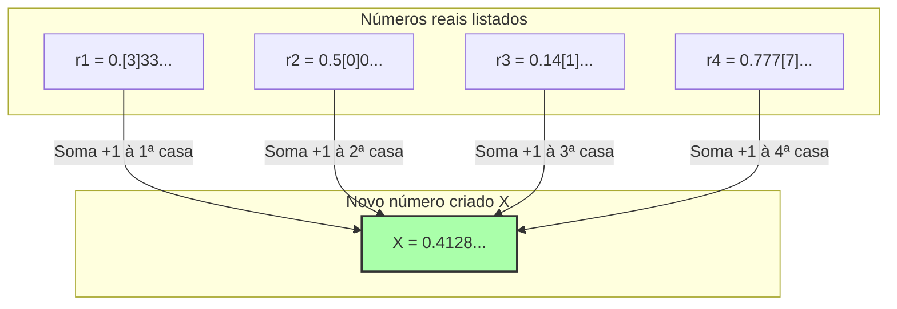

## 1. Uma lista de números que podem ser definidos por palavras

O "Paradoxo de Richard", publicado pelo matemático francês Jules Richard em 1905, é como um parente do "Paradoxo de Berry" apresentado anteriormente. No entanto, este é mais matemático e contém uma contradição profunda que parece espiar para o infinito.

Primeiro, imagine que você reúna todos os **"números reais (decimais) entre 0 e 1 que podem ser perfeitamente definidos em palavras"**.

Por exemplo, números como os seguintes:
- "zero vírgula cinco" $\rightarrow$ $0.5$
- "um terço" $\rightarrow$ $0.333333...$
- "o número formado pela sequência de casas decimais de pi" $\rightarrow$ $0.14159265...$

Como as combinações de frases que podem ser expressas em um idioma são apenas rearranjos das letras e palavras encontradas em um dicionário, podemos atribuir-lhes uma "ordem".
(Por exemplo, ordenando-as pelo número de letras e, se tiverem o mesmo número de letras, em ordem alfabética.)

Desta forma, conseguimos criar uma **lista numerada infinitamente** (1º, 2º, 3º...) para "todos os números reais que podem ser definidos em palavras".

$$
\begin{align*}
r_1 &= 0.\mathbf{3}333... \\
r_2 &= 0.5\mathbf{0}00... \\
r_3 &= 0.14\mathbf{1}5... \\
r_4 &= 0.777\mathbf{7}... \\
&\vdots
\end{align*}
$$

Dentro desta lista, "absolutamente todos os números reais que podem ser definidos em palavras" devem estar perfeitamente incluídos, sem faltar nenhum.

---

## 2. A técnica diabólica: "Argumento da Diagonal"

Aqui, Richard realiza uma operação assustadora.
Ele cria artificialmente um **"número $X$ completamente novo"** de forma a evitar todos os números presentes na lista.

A forma de criar é simples:
- Olhe para a **1ª casa** decimal do **1º** número da lista (no exemplo acima, $3$). O número resultante de somar $1$ a ele será a 1ª casa de $X$ ($3+1=4$).
- Olhe para a **2ª casa** decimal do **2º** número da lista (no exemplo acima, $0$). O número resultante de somar $1$ a ele será a 2ª casa de $X$ ($0+1=1$).
- Olhe para a **3ª casa** decimal do **3º** número da lista (no exemplo acima, $1$). O número resultante de somar $1$ a ele será a 3ª casa de $X$ ($1+1=2$).

※ Se o número original for $9$, assumimos que ele retorna a $0$.

O novo número $X$ criado por este método (no exemplo acima, $X = 0.4128...$) **absolutamente não coincidirá** com nenhum dos números da lista.
Isso ocorre porque o $n$-ésimo número tem a sua "$n$-ésima casa decimal" intencionalmente deslocada em relação à lista.
(Esta técnica foi desenvolvida pelo genial matemático Cantor para provar a magnitude infinita dos números reais e é chamada de **"Argumento da diagonal"**.)

---

## 3. A conclusão do Paradoxo de Richard

Agora, aqui é que entra o paradoxo.

Nós acabamos de criar um novo número $X$.
E a "regra" para criar este $X$ foi perfeitamente explicada (definida) pelas **frases que acabei de escrever acima**.

Ou seja, $X$ é **"um número real que pode ser definido em palavras"**.

No entanto, lembre-se da premissa inicial.
Supunha-se que "os números reais que podem ser definidos em palavras" **estavam todos incluídos na primeira lista ($r_1, r_2, r_3...$)**.
Apesar disso, $X$ foi criado de forma a não coincidir com nenhum número dentro da lista.

1. **$X$ deve existir na lista (porque foi definido em palavras).**
2. **$X$ não deve existir na lista (porque foi criado pelo argumento da diagonal para ser diferente de todos os números da lista).**

Uma contradição perfeita! Este é o Paradoxo de Richard.

---

## 4. Por que a lógica colapsou? (A armadilha da metalinguagem)

A causa que gerou este paradoxo, assim como no Paradoxo de Berry, reside em confundir os "níveis de linguagem".

Para fazer matemática rigorosamente, a "lista de números alvo (linguagem objeto)" e as "regras que falam de fora sobre as propriedades dessa lista (metalinguagem)" devem ser claramente separadas.

A lista de Richard é uma coleção de "definições de números computáveis".
No entanto, a regra "olhar para a $n$-ésima casa do $n$-ésimo número da lista" para criar o novo número $X$ é uma **operação de "metalinguagem" que não pode ser executada sem observar a própria lista de fora**.

O Paradoxo de Richard ocorreu porque ele tentou secretamente misturar um "número metalinguístico $X$ criado operando a lista de fora" dentro da "lista interna", fazendo com que ela entrasse em autocontradição e explodisse.

---

## 5. Passando o bastão para Gödel

Este Paradoxo de Richard causou um grande choque na comunidade matemática da época.
"Se não tivermos cuidado, a linguagem (e os sistemas lógicos) humana pode facilmente gerar autocontradições. O que devemos fazer para tornar a matemática perfeita e livre de contradições?"

Em 1931, quem colocou um fim definitivo a este problema foi o jovem gênio matemático Kurt Gödel, de apenas 25 anos.
Gödel conseguiu traduzir e reproduzir perfeitamente a estrutura deste paradoxo que Richard causou usando a "ambiguidade da linguagem humana", através de **"fórmulas matemáticas rigorosas (Números de Gödel)"**.

O resultado deduzido a partir disso é o famoso **"Teorema da Incompletude de Gödel"**.
Foi uma grande descoberta que provou os limites do conhecimento humano: "Por mais rigorosas que sejam as regras matemáticas criadas, dentro dessas regras invariavelmente surgirão 'verdades que não podem ser provadas nem refutadas' (a matemática é incompleta)".

O Paradoxo de Richard começou como um mero jogo de palavras contraditório, e com o tempo evoluiu para a arma mais poderosa para destruir a "absolutividade" da disciplina chamada matemática.
