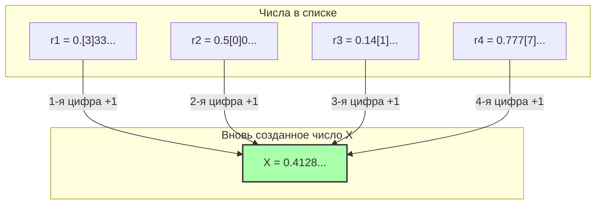

## 1. Список чисел, которые можно определить словами

«Парадокс Ришара», представленный французским математиком Жюлем Ришаром в 1905 году, является своего рода родственником упомянутого ранее «парадокса Берри». Однако он более математический и содержит в себе глубокое противоречие, словно заглядывающее в бесконечность.

Сначала представьте, что мы собираем **«все действительные числа (десятичные дроби) от 0 до 1, которые можно полностью определить с помощью предложений на русском языке»**.

Например, такие числа:
- «Ноль целых пять десятых» $\rightarrow$ $0.5$
- «Одна третья» $\rightarrow$ $0.333333...$
- «Число, состоящее из цифр числа пи после запятой» $\rightarrow$ $0.14159265...$

Поскольку комбинации предложений, которые можно выразить на русском языке, — это просто перестановка букв, имеющихся в словаре, мы можем установить для них «порядок».
(Например, расположить их в порядке возрастания количества букв, а если количество букв совпадает — в алфавитном порядке.)

Таким образом, мы смогли создать **бесконечный список**, присвоив номера 1, 2, 3... «всем действительным числам, которые можно определить на русском языке».

$$
\begin{align*}
r_1 &= 0.\mathbf{3}333... \\
r_2 &= 0.5\mathbf{0}00... \\
r_3 &= 0.14\mathbf{1}5... \\
r_4 &= 0.777\mathbf{7}... \\
&\vdots
\end{align*}
$$

В этом списке должны быть абсолютно все «действительные числа, которые можно определить на русском языке», без единого исключения.

---

## 2. Дьявольская техника: «Диагональный аргумент»

Здесь Ришар применяет пугающую операцию.
Он искусственно создает **«совершенно новое число $X$»**, которое обходит все числа из этого списка.

Способ создания прост:
- Берем **первую** цифру после запятой **первого** числа в списке (в примере выше это $3$). Прибавляем к ней $1$, и это становится первой цифрой числа $X$ ($3+1=4$).
- Берем **вторую** цифру после запятой **второго** числа в списке (в примере выше это $0$). Прибавляем к ней $1$, и это становится второй цифрой числа $X$ ($0+1=1$).
- Берем **третью** цифру после запятой **третьего** числа в списке (в примере выше это $1$). Прибавляем к ней $1$, и это становится третьей цифрой числа $X$ ($1+1=2$).

※ Если исходная цифра — $9$, то мы превращаем её в $0$.

Новое число $X$, созданное таким образом (в нашем примере $X = 0.4128...$), **абсолютно точно не совпадает ни с одним числом** в списке.
Причина в том, что оно намеренно отличается от $n$-го числа как минимум его «$n$-й цифрой после запятой».
(Этот метод называется **«диагональным аргументом»** (или канторовым диагональным процессом), и он был разработан гениальным математиком Георгом Кантором для доказательства того, что множество действительных чисел несчетно бесконечно.)

---

## 3. Завершение парадокса Ришара

А вот теперь начинается сам парадокс.

Мы только что создали новое число $X$.
И «правило» создания этого числа $X$ сейчас было полностью объяснено (определено) **текстом на русском языке, который я написал выше**.

То есть $X$ — это **«действительное число, которое можно определить на русском языке»**.

Но вспомните исходную предпосылку:
«Действительные числа, которые можно определить на русском языке», **должны быть полностью охвачены исходным списком ($r_1, r_2, r_3...$)**.
И тем не менее, $X$ было создано таким образом, чтобы не совпадать ни с одним числом в этом списке.

1. **$X$ должно быть в списке (так как оно было определено на русском языке).**
2. **$X$ не должно быть в списке (поскольку с помощью диагонального аргумента оно было создано так, чтобы отличаться от всех чисел в списке).**

Идеальное противоречие! Это и есть парадокс Ришара.

---

## 4. Почему рухнула логика? (Ловушка метаязыка)

Причина возникновения этого парадокса, как и в случае с парадоксом Берри, кроется в смешении «языковых уровней».

Для того чтобы заниматься математикой со всей строгостью, мы должны четко разделять «список целевых чисел (объектный язык)» и «правила, которые описывают свойства этого списка извне (метаязык)».

Список Ришара представляет собой совокупность «определений вычислимых чисел».
Однако правило для создания нового числа $X$ — «взять $n$-ю цифру $n$-го числа в списке» — это **метаязыковая операция, которую нельзя выполнить без взгляда на список извне**.

Парадокс Ришара взорвался самопротиворечием из-за того, что мы попытались тайком протащить «метаязыковое число $X$, созданное путем манипуляции списком извне» внутрь самого этого «внутреннего списка».

---

## 5. Передача эстафеты Гёделю

Этот парадокс Ришара произвел настоящий фурор в математическом мире того времени.
«Человеческий язык (и логические системы) могут легко привести к самопротиворечиям, если не быть осторожными. Как же сделать математику совершенной и непротиворечивой?»

В 1931 году окончательную точку в этом вопросе поставил молодой 25-летний гениальный математик Курт Гёдель.
Гёдель смог идеально перевести и воспроизвести структуру этого парадокса, который Ришар создал, используя «неоднозначность человеческого языка», с помощью **«строгих математических формул (гёделевых чисел)»**.

В результате появилась на свет знаменитая **«теорема Гёделя о неполноте»**.
Это было великое открытие, доказавшее пределы человеческого познания: «Как бы строго мы ни выстраивали математические правила, внутри этих правил обязательно возникнет "истина, которую невозможно ни доказать, ни опровергнуть" (математика неполна)».

Парадокс Ришара, начавшийся как простая противоречивая игра слов, со временем эволюционировал в мощнейшее оружие, разрушившее «абсолютность» самой математики как науки.
