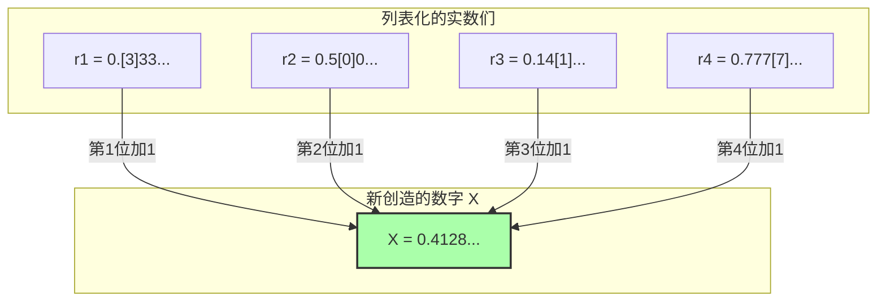

## 1. 可以用语言定义的数字列表

法国数学家朱尔·理查德（Jules Richard）在1905年发表的“理查德悖论”，可以说是之前介绍的“贝里悖论”的亲戚。然而，它更具数学性，包含了如同窥视无限彼岸般的深刻矛盾。

首先，请想象一下把**“能够用中文句子完全定义的，0到1之间的实数（小数）”**全部收集起来。
（注：原文为日语，此处为便于理解译为中文）

例如，下面这些数字：
- “零点五” $\rightarrow$ $0.5$
- “三分之一” $\rightarrow$ $0.333333...$
- “圆周率的小数第一位及之后排列的数” $\rightarrow$ $0.14159265...$

因为可以用中文表达的句子组合只是将字典里的汉字重新排列，所以我们可以给它们排定“顺序”。
（例如，按字数从少到多排列，字数相同则按拼音字母顺序排列，等等。）

这样一来，我们就可以为“可以用中文定义的所有实数”，建立一个第1个、第2个、第3个……**无限延伸的编号（列表）**。

$$
\begin{align*}
r_1 &= 0.\mathbf{3}333... \\
r_2 &= 0.5\mathbf{0}00... \\
r_3 &= 0.14\mathbf{1}5... \\
r_4 &= 0.777\mathbf{7}... \\
&\vdots
\end{align*}
$$

在这个列表里，应该完美地囊括了“可以用中文定义的所有的实数”，一个不漏。

---

## 2. 恶魔的技巧“对角线论证”

在这里，理查德进行了一项可怕的操作。
他人为地创造出了一个**“全新的数字 $X$”**，避开了列表中的所有数字。

构造方法很简单。
- 看列表里**第1个**数字的，小数点后**第1位**（上面的例子中是 $3$）。给它加上 $1$ 得到的数，作为 $X$ 的第1位（$3+1=4$）。
- 看列表里**第2个**数字的，小数点后**第2位**（上面的例子中是 $0$）。给它加上 $1$ 得到的数，作为 $X$ 的第2位（$0+1=1$）。
- 看列表里**第3个**数字的，小数点后**第3位**（上面的例子中是 $1$）。给它加上 $1$ 得到的数，作为 $X$ 的第3位（$1+1=2$）。

※如果原来的数字是 $9$，我们规定它回到 $0$。

用这种方法创造出的新数字 $X$（在上面的例子中 $X = 0.4128...$），**绝对不会与列表中的任何数字相同**。
因为，它与第 $n$ 个数字的“小数点后第 $n$ 位”数字是被故意错开的。
（这种方法被称为**“对角线论证”**，是天才数学家康托尔为了证明实数的无限大而发明出来的。）

---

## 3. 理查德悖论的完成

那么，悖论从这里开始。

我们刚刚创造出了一个新的数字 $X$。
而且，用来创造这个 $X$ 的“规则”，已经通过**我刚才在上面写下的中文句子**得到了完美的解释（定义）。

也就是说，$X$ 是一个**“能用中文定义的实数”**。

但是，请回想一下最初的前提。
“能用中文定义的实数”，**应该都已经全部囊括在最初的列表（$r_1, r_2, r_3...$）中了**。
然而，$X$ 却是被构造成不与列表中任何数字一致的。

1. **$X$ 必须存在于列表中（因为它是用中文定义的）。**
2. **$X$ 绝不能存在于列表中（因为它通过对角线论证被构造成与列表内的所有数都不相同）。**

完美的矛盾！这就是理查德悖论。

---

## 4. 为什么逻辑会崩溃？（元语言的陷阱）

产生这个悖论的原因，和贝里悖论一样，都在于混淆了“语言的层级”。

为了严谨地进行数学研究，必须把“作为对象的数字列表（对象语言）”和“从外部探讨该列表性质的规则（元语言）”明确区分开来。

理查德的列表收集的是“可计算数字的定义”。
然而，用来创造新数字 $X$ 的“看列表中第 $n$ 个数字的第 $n$ 位”这个规则，是一个**必须从外部俯瞰列表本身才能执行的“元语言”操作**。

理查德悖论之所以发生自我矛盾并爆炸，是因为它试图把“从外部操作列表创造出的元语言式的数字 $X$”，偷偷地塞进“内部的列表”中。

---

## 5. 交棒给哥德尔

这个理查德悖论给当时的数学界带来了巨大的冲击。
“人类的语言（或逻辑体系），稍不注意就会立刻引起自我矛盾。怎样才能让数学变得完美而没有矛盾呢？”

1931年，为这个问题画上最终句号的，是年仅25岁的天才数学家库尔特·哥德尔。
哥德尔运用**“严谨的数学公式（哥德尔数）”**，完美地翻译并重现了理查德利用“语言的模糊性”引发的这个悖论结构。

其结果导出的，就是那著名的**“哥德尔不完备定理”**。
这是一项证明人类智慧极限的伟大发现：“无论把数学规则制定得多么严谨，在这个规则体系内必定会产生‘既不能证明也不能证伪的真理’（数学是不完备的）。”

理查德悖论，从一个单纯的矛盾文字游戏开始，最终进化成了粉碎数学这门学问本身“绝对性”的最强武器。
