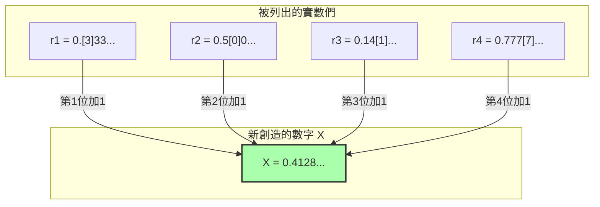

## 1. 可以用文字定義的數字列表

法國數學家朱爾·理查在1905年發表的「理查悖論」，就像是先前介紹的「貝里悖論」的親戚。然而，這個悖論更具數學性，包含著彷彿窺視無限彼端的深刻矛盾。

首先，請想像將**「可以用中文句子完全定義的、介於0到1之間的實數（小數）」**全部收集起來。

例如，像下面這樣的數字：
- 「零點五」 $\rightarrow$ $0.5$
- 「三分之一」 $\rightarrow$ $0.333333...$
- 「圓周率小數點第一位開始排列的數字」 $\rightarrow$ $0.14159265...$

可以用中文表達的句子組合，只是將字典裡的字重新排列，所以可以排定「順序」。
（例如，可以先按字數多寡排列，字數相同的再按筆畫順序排列等。）

就這樣，我們為「可以用中文定義的所有實數」建立了第一個、第二個、第三個……**無限延伸的編號（列表）**。

$$
\begin{align*}
r_1 &= 0.\mathbf{3}333... \\
r_2 &= 0.5\mathbf{0}00... \\
r_3 &= 0.14\mathbf{1}5... \\
r_4 &= 0.777\mathbf{7}... \\
&\vdots
\end{align*}
$$

在這個列表中，應該毫無遺漏、完美地網羅了「可以用中文定義的各種實數」。

---

## 2. 惡魔的技巧「對角線論證」

在這裡，理查進行了一個可怕的操作。
他刻意避開列表中所有的數字，人工創造出了一個**「全新的數字 $X$」**。

做法很簡單。
- 查看列表**第1個**數字的，小數點以下**第1位**（以上面的例子是 $3$）。將這個數字加 $1$，作為 $X$ 的第1位數（$3+1=4$）。
- 查看列表**第2個**數字的，小數點以下**第2位**（以上面的例子是 $0$）。將這個數字加 $1$，作為 $X$ 的第2位數（$0+1=1$）。
- 查看列表**第3個**數字的，小數點以下**第3位**（以上面的例子是 $1$）。將這個數字加 $1$，作為 $X$ 的第3位數（$1+1=2$）。

※如果原本的數字是 $9$，則變回 $0$。

用這個方法創造出來的新數字 $X$（以上面的例子為 $X = 0.4128...$），**絕對不會與列表中的任何數字一致**。
因為，它與第 $n$ 個數字在「小數點以下第 $n$ 位」的數字，是刻意錯開的。
（這個手法，是天才數學家康托爾為了證明實數無限的大小而想出來的，被稱為**「對角線論證」**。）

---

## 3. 理查悖論的完成

那麼，接下來就是悖論了。

我們剛剛創造出了新的數字 $X$。
而且，創造出這個 $X$ 的「規則」，是**現在我用上面寫的中文句子**完美地解釋（定義）出來的。

也就是說，$X$ 是**「可以用中文定義的實數」**。

但是，請回想一下最初的前提。
「可以用中文定義的實數」，應該**全部都被網羅在最初的列表（$r_1, r_2, r_3...$）中了**。
儘管如此，$X$ 卻被製造成與列表中的任何數字都不一致。

1. **$X$ 必須存在於列表之中（因為它是用中文定義的）。**
2. **$X$ 不能存在於列表之中（因為用對角線論證將其製造成與列表內所有數字都不同）。**

完美的矛盾！這就是理查悖論。

---

## 4. 為什麼邏輯崩潰了？（後設語言的陷阱）

產生這個悖論的原因，與貝里悖論一樣，都是因為混淆了「語言的階層」。

為了嚴謹地進行數學運算，必須明確區分「作為對象的數字列表（對象語言）」和「從外部討論該列表性質的規則（後設語言）」。

理查的列表收集的是「可計算數字的定義」。
然而，為了創造出新數字 $X$ 而使用的「查看列表第 $n$ 個數字的第 $n$ 位」這個規則，是一種必須從外部俯瞰列表本身才能執行的**「後設語言」操作**。

理查悖論之所以會發生自我矛盾並爆發，是因為它試圖將「從外部操作列表所製造出的後設語言數字 $X$」，偷偷地混入「內部的列表」之中。

---

## 5. 交棒給哥德爾

這個理查悖論，給當時的數學界帶來了巨大的衝擊。
「人類的語言（以及邏輯體系），只要稍不注意就會立刻產生自我矛盾。要怎麼做才能讓數學變得完美且沒有矛盾呢？」

1931年，為這個問題畫下最終休止符的，是年僅25歲的天才數學家庫爾特·哥德爾。
哥德爾將理查利用「語言的曖昧性」所引起的悖論結構，使用了**「嚴謹的數學公式（哥德爾數）」**，完美地翻譯並重現了出來。

其結果推導出來的，幾是那著名的**「哥德爾不完備定理」**。
這是一項證明了人類智慧極限的重大發現：「無論多麼嚴謹地制定數學規則，在該規則中必定會產生『無法證明也無法反證的真理』（數學是不完備的）」。

理查悖論，從單純充滿矛盾的文字遊戲開始，最終進化成了粉碎數學這門學問本身「絕對性」的最強武器。
