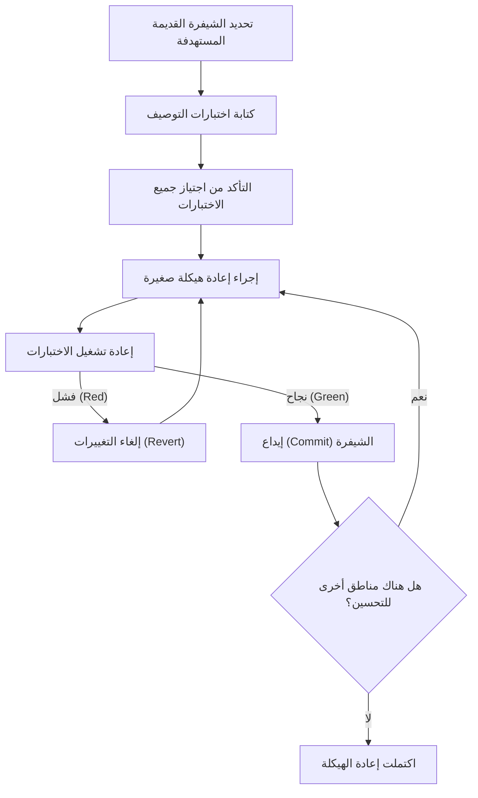
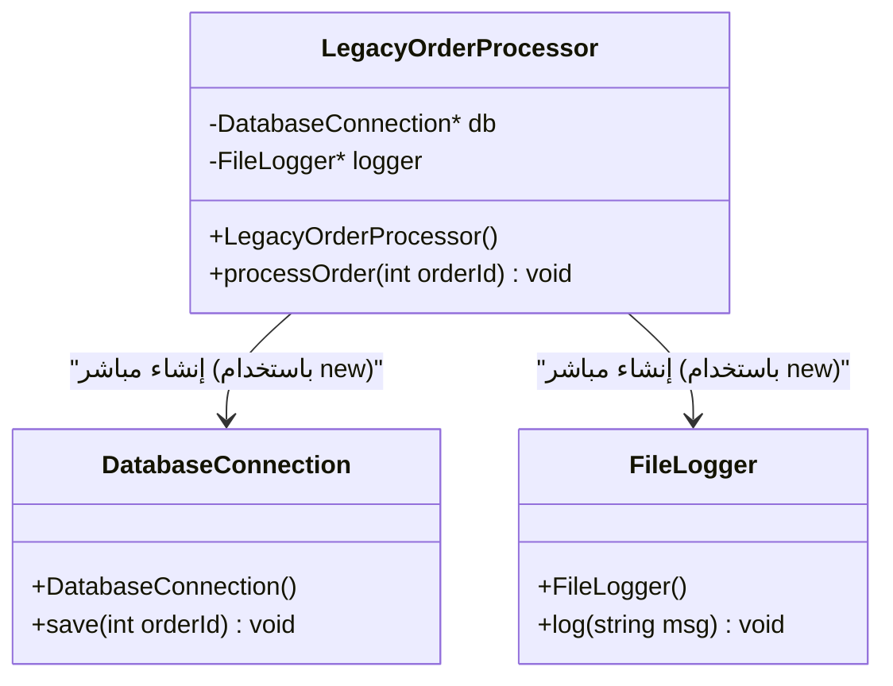
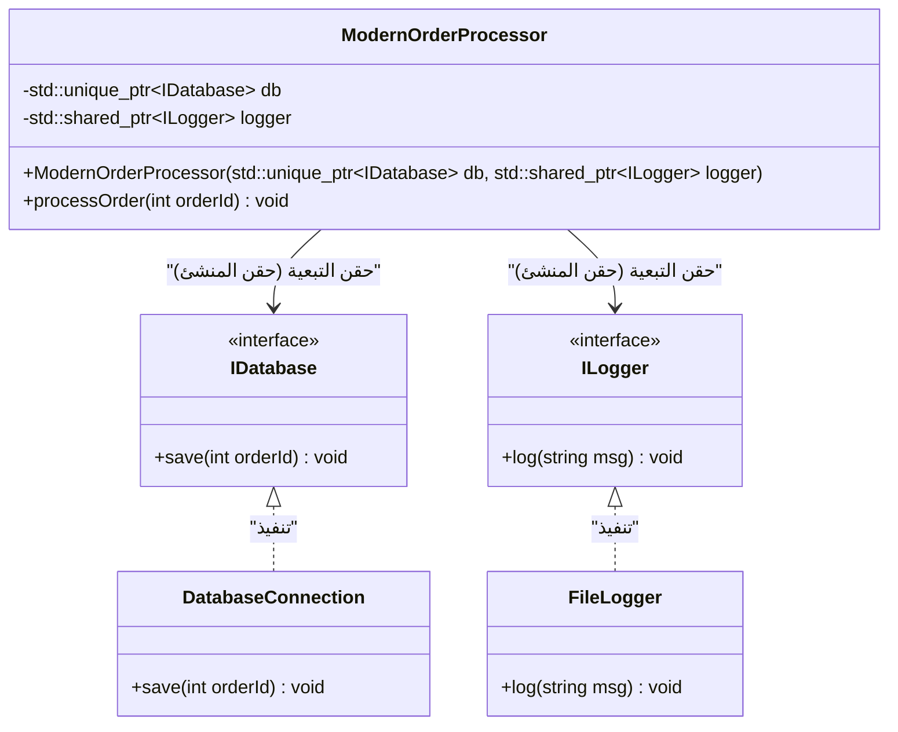

# أسرار إعادة الهيكلة: تحسين شيفرات C++ القديمة بأمان

في تطوير البرمجيات الحديثة، المعركة ضد "الشيفرات القديمة (Legacy Code)" هي طريق لا مفر منه. خاصة في لغة C++، تشكل الشيفرات القديمة تهديدًا لا يقارن بتلك الموجودة في اللغات الأخرى. إدارة الذاكرة يدويًا (عاصفة من المؤشرات الخام و `new` / `delete`)، الإساءة في استخدام المتغيرات العامة، الافتقار إلى أمان الاستثناءات، والأهم من ذلك حقيقة "عدم وجود اختبارات". صرح مايكل فيذرز بشكل قاطع في كتابه الشهير "العمل بفعالية مع الشيفرات القديمة" أن "الشيفرات التي لا تحتوي على اختبارات هي شيفرات قديمة".

في هذا المقال، سنشرح بالتفصيل أسرار إعادة الهيكلة والانتقال الآمن والموثوق لقاعدة شيفرات C++ القديمة المتراكمة على مدى عقود إلى Modern C++ (C++11/14/17/20)، من الناحيتين النظرية والعملية. سنغطي النهج العملي الشامل، بدءًا من النماذج الرياضية للدين التقني، الفصل الآمن للتبعيات، وحتى تنظيف الشيفرة باستخدام ميزات اللغة الحديثة.

---

## 1. النماذج الرياضية للتعقيد والدين التقني

لتبرير عملية إعادة الهيكلة، من الضروري تحديد المشكلات التي تواجهها قاعدة الشيفرة الحالية بشكل كمي. المقياس الأكثر شيوعًا لقياس التعقيد الهيكلي للشيفرة هو "التعقيد السيكلوماتي (Cyclomatic Complexity)". يُعرّف هذا التعقيد بالمعادلة التالية استنادًا إلى نظرية الرسوم البيانية للرسم البياني لتدفق التحكم:

$$ M = E - N + 2P $$

حيث،
- $M$ هو التعقيد السيكلوماتي
- $E$ هو عدد الحواف في الرسم البياني (تدفقات العمليات، الانتقالات)
- $N$ هو عدد العقد في الرسم البياني (الكتل الأساسية للعمليات)
- $P$ هو عدد المكونات المتصلة (عادةً، في دالة أو طريقة واحدة، يكون $P=1$)

كلما زاد التعقيد $M$، زاد عدد حالات الاختبار اللازمة لاختبار تلك الدالة بشكل شامل، إما بشكل خطي، أو في بعض حالات مجموعات التفريغ الشرطي بشكل أُسي. علاوة على ذلك، هناك قاعدة تجريبية تفيد بأن احتمالية حدوث خطأ $P(bug)$ تزداد أُسيًا مع التعقيد $M$. إذا قمنا بصياغة هذا في شكل يشبه توزيع بواسون، فإنه يصبح كالتالي:

$$ P(bug) = 1 - e^{-\lambda \cdot M} $$

(حيث $\lambda$ هو ثابت يعتمد على مهارات فريق التطوير وصعوبة المجال.)

كما أن تكلفة الدين التقني تزداد بشكل مركب. إذا اعتبرنا أن الدين التقني الأولي هو $C_0$، ومعدل الفائدة لكل تكرار (نسبة انخفاض الإنتاجية بسبب صعوبة تغيير الشيفرة) هو $r$، فإن تكلفة الإصلاح $Cost(t)$ بعد فترة $t$ يمكن التعبير عنها كما يلي:

$$ Cost(t) = C_0 \times (1 + r)^t $$

ما توضحه هذه المعادلة بوضوح هو الحقيقة القاسية المتمثلة في أن "إهمال الشيفرات القديمة يؤدي إلى زيادة التكاليف بشكل أُسي مع مرور الوقت". لذلك، من الضروري سداد الديون (إعادة الهيكلة) في مرحلة مبكرة.

---

## 2. المبدأ المطلق لإعادة الهيكلة: "الاختبار أولاً"

الخوف الأكبر عند تغيير الشيفرات القديمة هو "ألا يؤدي ذلك إلى كسر السلوكيات الصحيحة الحالية (حدوث تراجع أو انحدار في الأداء)". الطريقة الوحيدة لتبديد هذا الخوف هي "الاختبارات الآلية".

ومع ذلك، فإن الشيفرات القديمة لا تحتوي على اختبارات في المقام الأول. وهنا تبرز أهمية إدخال "اختبارات التوصيف (Characterization Test)". اختبار التوصيف هو اختبار لا يسجل "كيف يجب أن يتصرف النظام في الأصل"، بل يسجل "كيف يتصرف حاليًا" كما هو.

المخطط الانسيابي أدناه يوضح دورة الحياة الآمنة لإعادة الهيكلة.



من خلال تدوير هذه الدورة، يمكن للمطورين دائمًا تعديل الشيفرة على شبكة أمان. إذا فشل الاختبار، فمن المهم للغاية إجراء `Revert` (إلغاء التغييرات) فورًا دون التعمق في ملاحقة الأسباب.

---

## 3. مفهوم "الدرز (Seams)" الذي يخلق القابلية للاختبار

عند محاولة إضافة اختبارات إلى شيفرات قديمة، فإن العقبة الأولى التي ستواجهها هي "التبعيات (Dependencies)". عندما يكون الاتصال المباشر بقاعدة البيانات، والاتصالات الشبكية، والوصول إلى نظام الملفات المبرمج بشكل ثابت مقترنة بشكل وثيق، يصبح من المستحيل كتابة اختبارات الوحدة (Unit Test).

هنا يظهر مفهوم "الدرز (Seam)". الدرز يشير إلى "المكان الذي يمكنك فيه تغيير سلوك النظام دون تعديل الشيفرة نفسها". في C++، يتم استخدام الدروز الثلاثة الرئيسية التالية:

1. **دروز الكائنات (Object Seams)**: تعدد الأشكال (Polymorphism) باستخدام الدوال الافتراضية (Virtual Functions).
2. **دروز وقت الترجمة (Compile-time Seams)**: التبديل عبر القوالب (Templates) أو `#include`.
3. **دروز وقت الربط (Link-time Seams)**: التبديل بين المكتبات أو ملفات الكائنات المرتبطة أثناء البناء.

من خلال استغلال هذه الدروز، يمكنك عزل التبعيات عن طريق استبدال وحدات بيئة الإنتاج بكائنات وهمية (Mock) مخصصة لبيئة الاختبار.

---

## 4. كسر الاقتران الوثيق: حقن التبعية (Dependency Injection)

حقن التبعية (DI: Dependency Injection) هو نمط قوي لنزع مسؤولية إنشاء الكائنات من داخل الفئة إلى الخارج.

أولاً، دعنا نلقي نظرة على تصميم فئة C++ قديم ومقترن بشكل وثيق.



لا يحتوي هذا `LegacyOrderProcessor` على درز يمكن استبداله بكائن وهمي نظرًا لأنه يقوم بإنشاء `DatabaseConnection` و `FileLogger` مباشرة باستخدام `new` داخل المنشئ (Constructor). سنقوم بإعادة هيكلته إلى اقتران فضفاض باستخدام الواجهات (الفئات الافتراضية النقية).



### مثال على الشيفرة القديمة (C++03)
```cpp
class LegacyOrderProcessor {
private:
    DatabaseConnection* db_;
    FileLogger* logger_;
public:
    LegacyOrderProcessor() {
        db_ = new DatabaseConnection("localhost", 3306);
        logger_ = new FileLogger("/var/log/app.log");
    }
    
    ~LegacyOrderProcessor() {
        delete db_;
        delete logger_;
    }
    
    void processOrder(int orderId) {
        // معالجة...
        db_->save(orderId);
        logger_->log("Order processed");
    }
};
```

### بعد إعادة الهيكلة (Modern C++)
```cpp
// تعريف الواجهة (درز الكائنات)
class IDatabase {
public:
    virtual ~IDatabase() = default;
    virtual void save(int orderId) = 0;
};

class ILogger {
public:
    virtual ~ILogger() = default;
    virtual void log(const std::string& msg) = 0;
};

// تصميم لحقن التبعيات من الخارج
class ModernOrderProcessor {
private:
    std::unique_ptr<IDatabase> db_;
    std::shared_ptr<ILogger> logger_;
public:
    // حقن المنشئ (Constructor Injection)
    ModernOrderProcessor(std::unique_ptr<IDatabase> db, std::shared_ptr<ILogger> logger)
        : db_(std::move(db)), logger_(std::move(logger)) {}
    
    void processOrder(int orderId) {
        db_->save(orderId);
        logger_->log("Order processed");
    }
};
```
من خلال تعديل التصميم بهذه الطريقة، يمكنك بسهولة إنشاء كائنات وهمية لـ `IDatabase` باستخدام أطر عمل مثل Google Mock (gmock)، مما يتيح التطوير الموجه بالاختبار (TDD).

---

## 5. تفكيك المتغيرات العامة الشيطانية ونمط المتفرد (Singleton)

ما يسبب أكبر قدر من الصداع في C++ القديمة هو المتغيرات العامة والإساءة في استخدام "نمط المتفرد (Singleton)". قد يبدو المتفرد للوهلة الأولى كنمط تصميم مفيد، لكنه في الواقع مجرد "متغير عام متخفٍ في ثوب موجه للكائنات".

الوضع العام (Global State) يشارك الحالة بين حالات الاختبار، مما يجعل التنفيذ المتوازي للاختبارات مستحيلاً ويتسبب في اختبارات متقلبة (Flaky Tests) غير معروفة السبب.

الحل هو القضاء على الاعتماد الضمني على الوضع العام وتمرير الحالات الضرورية بشكل صريح كمعلمات للدوال (البارامترات). وهذا ما يسمى بـ "تمرير السياق".

---

## 6. تحديث إدارة الذاكرة وجوهر RAII

تنتشر عمليات `new` و `delete` في كل مكان في شيفرات عصر C++98/03، وهي تشكل بؤرة لتسرب الذاكرة والمؤشرات المتدلية (Dangling Pointers). في Modern C++ (C++11 وما بعده)، يتم دعم مفهوم **الملكية (Ownership)** على مستوى اللغة، وأصبحت الإدارة الآمنة للموارد باستخدام المؤشرات الذكية هي المعيار.

### RAII (تخصيص الموارد هو التهيئة)
RAII هو أهم اصطلاح (Idiom) في لغة C++. من خلال ربط تأمين المورد بتهيئة الكائن (المنشئ) وربط تحرير المورد بتدمير الكائن (المهدم)، يضمن تحرير المورد بشكل مؤكد عند الخروج من النطاق.

حتى في حالة حدوث استثناءات (Exceptions)، يتم استدعاء المهدمات للمتغيرات المحلية تلقائيًا خلال عملية فك المكدس (Stack Unwinding)، مما يمنع تسرب الموارد.

**قبل (شيفرة قديمة خطيرة)**
```cpp
void processFile(const char* filename) {
    FILE* file = fopen(filename, "r");
    if (!file) return;

    Data* data = new Data();
    if (!readData(file, data)) {
        delete data; // سهل النسيان
        fclose(file); // سهل النسيان
        return;
    }

    try {
        process(data);
    } catch (...) {
        delete data; // تجنب تسرب الذاكرة عند حدوث استثناء
        fclose(file);
        throw;
    }

    delete data;
    fclose(file);
}
```

هذه الشيفرة تتطلب تحرير الموارد يدويًا في كل تفرع من تدفق التحكم، وهي بنية هشة للغاية.

**بعد (استخدام RAII والمؤشرات الذكية)**
```cpp
void processFile(const std::string& filename) {
    // std::ifstream تدير مقبض الملف باستخدام RAII
    std::ifstream file(filename);
    if (!file.is_open()) return;

    // std::unique_ptr هو مالك حصري يدير ذاكرة الكومة (heap) باستخدام RAII
    auto data = std::make_unique<Data>();
    if (!readData(file, *data)) {
        return; // يتم التحرير تلقائيًا عند الخروج من النطاق
    }

    // حتى في حالة حدوث استثناء، تضمن مهدمات unique_ptr و ifstream
    // تحرير الموارد بشكل آمن (ضمان عدم وجود تسرب للذاكرة)
    process(*data);
}
```

بفضل إعادة الهيكلة هذه، انخفض حجم الشيفرة بشكل كبير، وأصبحت النوايا واضحة، والأهم من ذلك، تم ضمان أمان الاستثناءات (Exception Safety) بشكل كامل.

---

## 7. تحسين القوة التعبيرية بواسطة ميزات Modern C++

في عملية إعادة هيكلة الشيفرات القديمة، ينبغي الاستفادة القصوى من الفوائد المصاحبة لتحديثات ميزات اللغة.

### 7.1. استنتاج النوع بواسطة `auto`
استبدال الكتابات المطولة، مثل أسماء أنواع المكررات (iterators) الطويلة، بـ `auto` يؤدي إلى تحسين المقروئية. ومع ذلك، فإن أفضل ممارسة ليست تحويل كل شيء إلى `auto`، بل قصرها على الحالات التي يكون فيها "النوع واضحًا بمجرد النظر إلى الجانب الأيمن".

### 7.2. حسابات وقت الترجمة باستخدام `constexpr` و `consteval`
من أجل تقليل النفقات العامة (overhead) في وقت التشغيل واكتشاف الأخطاء في وقت الترجمة، يتم استخدام `constexpr` بشكل نشط.

```cpp
// شيفرة قديمة (وحدات الماكرو وحسابات وقت التشغيل)
#define MAX_BUFFER_SIZE 1024
const double PI = 3.1415926535;

double calculateCircleArea(double radius) {
    return PI * radius * radius;
}
```

```cpp
// أسلوب Modern C++ (منذ C++20)
constexpr std::size_t MaxBufferSize = 1024;
constexpr double Pi = 3.14159265358979323846;

// consteval يضمن إمكانية التقييم في وقت الترجمة (C++20)
consteval double calculateCircleArea(double radius) {
    return Pi * radius * radius;
}

// تكلفة وقت التشغيل هي صفر. يتم دمج ثابت النتيجة مباشرة في الثنائيات (binary) في وقت الترجمة.
constexpr double area = calculateCircleArea(10.0);
```

### 7.3. سمة `[[nodiscard]]`
لمنع الأخطاء الناتجة عن تجاهل القيمة المرجعة للدالة (خاصة أكواد الأخطاء أو الحالات المهمة)، يتم إضافة سمة `[[nodiscard]]`. هذا يجعل المترجم (compiler) يصدر تحذيرًا بشأن الاستدعاءات التي لا تستقبل القيمة المرجعة.

```cpp
[[nodiscard]] bool initializeSystem(); // منع تجاهل القيمة المرجعة
```

---

## 8. استخدام أدوات الأتمتة والتحسين المستمر

إن محاولة تعديل قاعدة شيفرات قديمة واسعة النطاق يدويًا أمر غير واقعي. الاستعانة بسلسلة الأدوات (toolchain) هو أقصر طريق للنجاح.

- **Clang-Tidy**: أداة فحص شيفرة (Linter) وتحليل ثابت قوية لـ C++. من خلال تفعيل فحوصات عائلة `modernize-*`، ستقوم الأداة بتطبيق الإصلاحات تلقائيًا (Fix-it) مثل تطبيق `auto`، الاستبدال بـ `nullptr`، وإضافة `override`.
- **AddressSanitizer (ASan)**: من خلال دمجها كخيار تجميع (`-fsanitize=address`)، يمكنها تحديد تسرب الذاكرة وتجاوزات المخزن المؤقت (buffer overruns) بدقة في وقت التشغيل. يجب تفعيلها دائمًا أثناء تنفيذ الاختبارات.
- **بناء مسار CI/CD**: استخدام GitHub Actions أو GitLab CI لتنفيذ البناء، الاختبارات الآلية، والتحليل الثابت لجميع طلبات السحب (Pull Requests)، مما يمنع دخول أي دين تقني جديد.

---

## 9. الخاتمة

إعادة هيكلة شيفرات C++ القديمة ليست مهمة تكتمل بين عشية وضحاها بأي حال من الأحوال. إنها عملية دقيقة وجريئة تشبه إجراء عملية جراحية للنظام.

يرجى وضع الخطوات التالية المشروحة في هذا المقال في الاعتبار:
1. **قياس التعقيد ووضع استراتيجية بناءً على الحقائق**
2. **اكتشاف الدروز وحماية النظام باختبارات التوصيف**
3. **كسر الاقتران الوثيق بواسطة حقن التبعيات (DI) والقضاء على الوضع العام**
4. **تبديد القلق بشأن إدارة الذاكرة بواسطة RAII والمؤشرات الذكية**
5. **الاستفادة من ميزات Modern C++ وترك العمل للمترجم (compiler)**

إن التحلي بروح "قاعدة الكشافة (اترك موقع التخييم أنظف مما وجدته)" ومواصلة تحسين الشيفرة شيئًا فشيئًا، ولكن بثبات من خلال مهام التطوير اليومية، هو الجوهر الحقيقي لإعادة الهيكلة.
