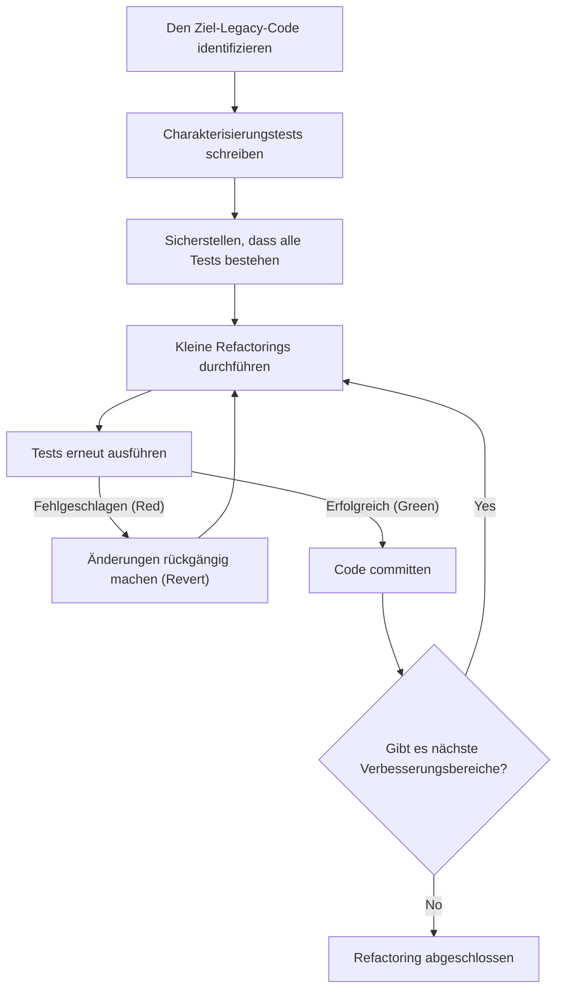
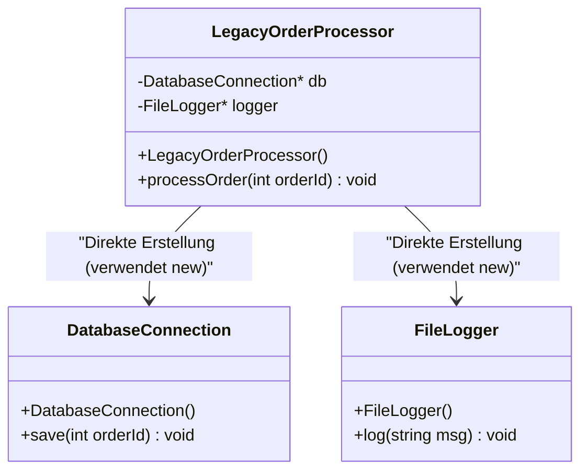
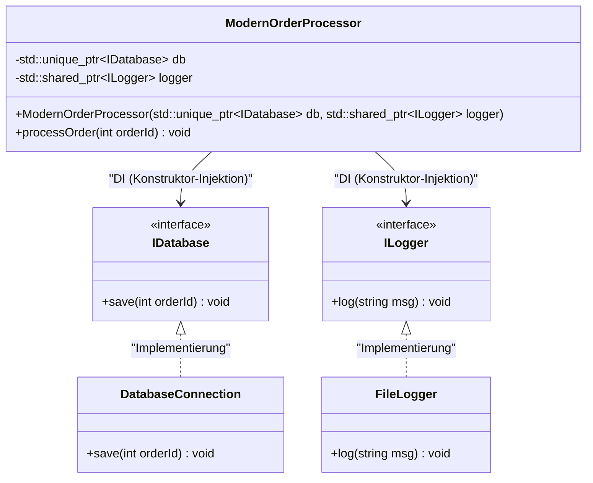

# Die Kunst des Refactorings: Veralteten C++ Code sicher verbessern

In der modernen Softwareentwicklung ist der Kampf gegen "Legacy-Code" (veralteten Code) unvermeidlich. Besonders in der Sprache C++ stellt Legacy-Code eine Bedrohung dar, die mit der in anderen Sprachen unvergleichlich ist. Manuelle Speicherverwaltung (ein Sturm aus rohen Zeigern, `new` und `delete`), der Missbrauch globaler Variablen, fehlende Ausnahmesicherheit und vor allem die Tatsache, dass es "keine Tests" gibt. Michael Feathers behauptete in seinem Meisterwerk "Working Effectively with Legacy Code": "Code ohne Tests ist Legacy-Code."

Dieser Artikel erläutert umfassend sowohl die Theorie als auch die Praxis, wie man eine über Jahrzehnte angesammelte C++-Legacy-Codebasis sicher und zuverlässig zu Modern C++ (C++11/14/17/20) migriert und refaktoriert. Ausgehend von mathematischen Modellen für technische Schulden, über die sichere Trennung von Abhängigkeiten, bis hin zur Bereinigung des Codes mit modernen Sprachfunktionen, decken wir praktische Ansätze ab.

---

## 1. Mathematisches Modell von Komplexität und technischen Schulden

Um Refactoring zu rechtfertigen, ist es notwendig, die Probleme der aktuellen Codebasis zu quantifizieren. Die gängigste Metrik zur Messung der strukturellen Komplexität von Code ist die "Zyklomatische Komplexität" (Cyclomatic Complexity). Diese Komplexität ist basierend auf der Graphentheorie von Kontrollflussgraphen durch die folgende Formel definiert:

$$ M = E - N + 2P $$

Hierbei ist:
- $M$ die zyklomatische Komplexität
- $E$ die Anzahl der Kanten (Verarbeitungsfluss, Übergänge) im Graphen
- $N$ die Anzahl der Knoten (grundlegende Verarbeitungsblöcke) im Graphen
- $P$ die Anzahl der zusammenhängenden Komponenten (normalerweise $P=1$ für eine einzelne Funktion oder Methode)

Je größer die Komplexität $M$ wird, desto linearer oder – abhängig von den Verzweigungskombinationen – exponentieller steigt die Anzahl der Testfälle, die für einen umfassenden Test der Funktion erforderlich sind. Darüber hinaus gibt es eine Faustregel, dass die Wahrscheinlichkeit des Auftretens eines Bugs $P(bug)$ exponentiell zur Komplexität $M$ steigt. Wenn wir dies ähnlich einer Poisson-Verteilung modellieren, erhalten wir Folgendes:

$$ P(bug) = 1 - e^{-\lambda \cdot M} $$

(Hierbei ist $\lambda$ eine Konstante, die von den Fähigkeiten des Entwicklungsteams und der Schwierigkeit der Domäne abhängt.)

Außerdem steigen die Kosten für technische Schulden mit Zinseszins. Wenn die anfänglichen technischen Schulden $C_0$ sind und der Zinssatz pro Iteration (Prozentsatz des Produktivitätsverlusts aufgrund von Schwierigkeiten bei Codeänderungen) $r$ ist, können die Überarbeitungskosten $Cost(t)$ nach $t$ Perioden wie folgt ausgedrückt werden:

$$ Cost(t) = C_0 \times (1 + r)^t $$

Diese Formel zeigt deutlich die grausame Tatsache: "Das Belassen von Legacy-Code führt im Laufe der Zeit zu einem exponentiellen Kostenanstieg." Daher müssen Schulden frühzeitig zurückgezahlt (refaktoriert) werden.

---

## 2. Das absolute Prinzip des Refactorings: "Test First"

Die größte Angst bei der Änderung von Legacy-Code ist, dass man "das bestehende, normale Verhalten zerstören könnte (eine Regression verursachen)". Der einzige Weg, diese Angst zu beseitigen, sind "automatisierte Tests".

Legacy-Code hat jedoch von vornherein keine Tests. Hier wird die Einführung von "Charakterisierungstests" (Characterization Tests) wichtig. Ein Charakterisierungstest ist ein Test, der aufzeichnet, "wie sich das System derzeit verhält", und nicht, "wie es sich eigentlich verhalten sollte".

Das folgende Flussdiagramm zeigt den Lebenszyklus eines sicheren Refactorings.



Durch das Durchlaufen dieses Zyklus können Entwickler den Code immer in einem Sicherheitsnetz ändern. Wenn ein Test fehlschlägt, ist es wichtig, ihn sofort rückgängig zu machen (`Revert`), ohne die Ursache zu tief zu untersuchen.

---

## 3. Das Konzept der "Säume" (Seams) zur Schaffung von Testbarkeit

Wenn Sie versuchen, Tests zu Legacy-Code hinzuzufügen, ist die erste Hürde, auf die Sie stoßen, "Abhängigkeiten". Wenn direkte Datenbankverbindungen, Netzwerkkommunikation und fest codierte Dateisystemzugriffe eng gekoppelt sind, ist es unmöglich, Unit-Tests zu schreiben.

Hier kommt das Konzept einer "Naht" oder eines "Saums" (Seam) ins Spiel. Ein Saum ist "ein Ort, an dem Sie das Verhalten des Systems ändern können, ohne den Code selbst zu bearbeiten". In C++ verwenden wir hauptsächlich die folgenden drei Arten von Säumen:

1. **Objektsäume (Object Seams)**: Polymorphismus unter Verwendung von virtuellen Funktionen (Virtual Functions).
2. **Kompilierzeitsäume (Compile-time Seams)**: Vorlagen (Templates) oder das Umschalten von `#include`.
3. **Linkzeitsäume (Link-time Seams)**: Umschalten der zu linkenden Bibliotheken oder Objektdateien während des Builds.

Indem Sie diese voll ausschöpfen, können Sie Abhängigkeiten isolieren, indem Sie Produktionsumgebungsmodule durch Mock-Objekte für die Testumgebung ersetzen.

---

## 4. Das Brechen enger Kopplungen: Abhängigkeitsinjektion (Dependency Injection)

Die Abhängigkeitsinjektion (DI: Dependency Injection) ist ein mächtiges Muster, um die Verantwortung für die Objekterstellung vom Inneren einer Klasse nach außen zu verlagern.

Schauen wir uns zunächst ein veraltetes und eng gekoppeltes Klassendesign in C++ an.



Dieser `LegacyOrderProcessor` verwendet in seinem Konstruktor direkt `new` für `DatabaseConnection` und `FileLogger`, daher gibt es keine Säume, um sie durch Mocks zu ersetzen. Wir werden dies mit Schnittstellen (rein virtuellen Klassen) refaktorieren, um lose gekoppelt zu sein.



### Beispiel für Legacy-Code (C++03)
```cpp
class LegacyOrderProcessor {
private:
    DatabaseConnection* db_;
    FileLogger* logger_;
public:
    LegacyOrderProcessor() {
        db_ = new DatabaseConnection("localhost", 3306);
        logger_ = new FileLogger("/var/log/app.log");
    }
    
    ~LegacyOrderProcessor() {
        delete db_;
        delete logger_;
    }
    
    void processOrder(int orderId) {
        // Verarbeitung...
        db_->save(orderId);
        logger_->log("Order processed");
    }
};
```

### Nach dem Refactoring (Modern C++)
```cpp
// Definition von Schnittstellen (Objektsäume)
class IDatabase {
public:
    virtual ~IDatabase() = default;
    virtual void save(int orderId) = 0;
};

class ILogger {
public:
    virtual ~ILogger() = default;
    virtual void log(const std::string& msg) = 0;
};

// Design zur Injektion von Abhängigkeiten von außen
class ModernOrderProcessor {
private:
    std::unique_ptr<IDatabase> db_;
    std::shared_ptr<ILogger> logger_;
public:
    // Konstruktor-Injektion (Constructor Injection)
    ModernOrderProcessor(std::unique_ptr<IDatabase> db, std::shared_ptr<ILogger> logger)
        : db_(std::move(db)), logger_(std::move(logger)) {}
    
    void processOrder(int orderId) {
        db_->save(orderId);
        logger_->log("Order processed");
    }
};
```
Durch diese Überarbeitung des Designs können Mock-Objekte von `IDatabase` problemlos mit Frameworks wie Google Mock (gmock) erstellt werden, was testgetriebene Entwicklung (TDD) ermöglicht.

---

## 5. Der Abbau der teuflischen globalen Variablen und Singletons

Was bei Legacy-C++ die meisten Kopfschmerzen bereitet, ist der Missbrauch von globalen Variablen und dem "Singleton-Muster". Das Singleton mag auf den ersten Blick wie ein praktisches Entwurfsmuster erscheinen, aber in Wirklichkeit ist es nichts anderes als eine "globale Variable im Gewand der Objektorientierung".

Ein globaler Zustand teilt den Zustand zwischen Testfällen, was die parallele Ausführung von Tests unmöglich macht und unvorhersehbare unzuverlässige Tests (Flaky Tests) verursacht.

Die Lösung besteht darin, Abhängigkeiten von impliziten globalen Zuständen zu beseitigen und den erforderlichen Zustand explizit als Funktionsargumente zu übergeben (Parametrisierung). Dies wird als "Übergabe des Kontexts" bezeichnet.

---

## 6. Modernisierung der Speicherverwaltung und das Wesen von RAII

Im Code der C++98/03-Ära waren `new` und `delete` im gesamten Code verstreut, was ein Nährboden für Speicherlecks (Memory Leaks) und hängende Zeiger (Dangling Pointers) war. In Modern C++ (ab C++11) wird das Konzept der **Eigentümerschaft (Ownership)** auf Sprachebene unterstützt, und eine sichere Ressourcenverwaltung mithilfe von Smart Pointern ist zum Standard geworden.

### RAII (Resource Acquisition Is Initialization)
RAII ist das wichtigste Idiom in C++. Indem die Ressourcenzuweisung an die Objektinitialisierung (Konstruktor) und die Ressourcenfreigabe an die Objektzerstörung (Destruktor) gebunden wird, wird garantiert, dass die Ressource beim Verlassen des Gültigkeitsbereichs sicher freigegeben wird.

Selbst wenn Ausnahmen (Exceptions) auftreten, wird der Destruktor lokaler Variablen während des Stack-Unwinding-Prozesses automatisch aufgerufen, wodurch Ressourcenlecks verhindert werden.

**Vorher (Gefährlicher Legacy-Code)**
```cpp
void processFile(const char* filename) {
    FILE* file = fopen(filename, "r");
    if (!file) return;

    Data* data = new Data();
    if (!readData(file, data)) {
        delete data; // Leicht zu vergessen
        fclose(file); // Leicht zu vergessen
        return;
    }

    try {
        process(data);
    } catch (...) {
        delete data; // Vermeidung von Speicherlecks im Ausnahmefall
        fclose(file);
        throw;
    }

    delete data;
    fclose(file);
}
```

Dieser Code erfordert die manuelle Freigabe von Ressourcen bei jeder Verzweigung im Kontrollfluss, was eine extrem fragile Struktur darstellt.

**Nachher (Nutzung von RAII und Smart Pointern)**
```cpp
void processFile(const std::string& filename) {
    // std::ifstream verwaltet Datei-Handles mit RAII
    std::ifstream file(filename);
    if (!file.is_open()) return;

    // std::unique_ptr ist ein exklusiver Besitzer, der Heap-Speicher mit RAII verwaltet
    auto data = std::make_unique<Data>();
    if (!readData(file, *data)) {
        return; // Wird beim Verlassen des Gültigkeitsbereichs automatisch freigegeben
    }

    // Selbst wenn eine Ausnahme auftritt, geben die Destruktoren von unique_ptr und ifstream 
    // die Ressourcen sicher frei (Garantie für null Speicherlecks)
    process(*data);
}
```

Durch dieses Refactoring wird die Code-Menge drastisch reduziert, die Absicht wird klar und vor allem wird die Ausnahmesicherheit (Exception Safety) perfekt garantiert.

---

## 7. Verbesserte Ausdruckskraft durch Funktionen von Modern C++

Beim Refactoring von Legacy-Code sollten Sie die Vorteile von Aktualisierungen der Sprachfunktionen voll ausschöpfen.

### 7.1. Typableitung mit `auto`
Die Lesbarkeit wird verbessert, indem ausführliche Schreibweisen, wie z. B. lange Iterator-Typnamen, durch `auto` ersetzt werden. Best Practice ist jedoch, es nicht überall zu verwenden, sondern nur "wenn der Typ durch einen Blick auf die rechte Seite offensichtlich ist".

### 7.2. Berechnungen zur Kompilierzeit mit `constexpr` und `consteval`
Nutzen Sie `constexpr` aktiv, um den Overhead zur Laufzeit zu reduzieren und Fehler zur Kompilierzeit zu erkennen.

```cpp
// Legacy-Code (Makros und Laufzeitberechnungen)
#define MAX_BUFFER_SIZE 1024
const double PI = 3.1415926535;

double calculateCircleArea(double radius) {
    return PI * radius * radius;
}
```

```cpp
// Modern C++ (ab C++20) Stil
constexpr std::size_t MaxBufferSize = 1024;
constexpr double Pi = 3.14159265358979323846;

// consteval (C++20) garantiert die Auswertbarkeit zur Kompilierzeit
consteval double calculateCircleArea(double radius) {
    return Pi * radius * radius;
}

// Null Laufzeitkosten. Die resultierende Konstante wird zur Kompilierzeit direkt in das Binary eingebettet.
constexpr double area = calculateCircleArea(10.0);
```

### 7.3. Attribut `[[nodiscard]]`
Um Fehler zu vermeiden, bei denen der Rückgabewert einer Funktion (insbesondere Fehlercodes und wichtige Zustände) ignoriert wird, fügen Sie das Attribut `[[nodiscard]]` hinzu. Dadurch gibt der Compiler eine Warnung für Aufrufe aus, die den Rückgabewert nicht akzeptieren.

```cpp
[[nodiscard]] bool initializeSystem(); // Verbietet das Ignorieren des Rückgabewerts
```

---

## 8. Nutzung automatisierter Tools und kontinuierliche Verbesserung

Die manuelle Korrektur einer großen Legacy-Codebasis ist unrealistisch. Die Nutzung der Leistungsfähigkeit einer Toolchain ist der schnellste Weg zum Erfolg.

- **Clang-Tidy**: Ein leistungsstarker Linter und statisches Analysetool für C++. Durch Aktivieren der `modernize-*`-Prüfungen können Sie automatisch (Fix-it) `auto` anwenden, durch `nullptr` ersetzen, `override` hinzufügen und vieles mehr.
- **AddressSanitizer (ASan)**: Die Einbindung als Kompilierungsoption (`-fsanitize=address`) lokalisiert Speicherlecks und Pufferüberläufe zur Laufzeit genau. Es sollte während der Testausführung immer aktiviert sein.
- **Aufbau einer CI/CD-Pipeline**: Verwenden Sie GitHub Actions oder GitLab CI, um Builds, automatisierte Tests und statische Analysen für alle Pull Requests auszuführen und so das Einschleichen neuer technischer Schulden zu verhindern.

---

## 9. Fazit

Das Refactoring von Legacy-C++-Code ist keine Aufgabe, die über Nacht erledigt werden kann. Es ist eine heikle, aber kühne Aufgabe, vergleichbar mit einer Operation am System.

Bitte behalten Sie die in diesem Artikel erläuterten folgenden Schritte im Hinterkopf.
1. **Messen Sie die Komplexität und entwickeln Sie eine Strategie auf der Grundlage von Fakten**
2. **Finden Sie Säume und schützen Sie das System mit Charakterisierungstests**
3. **Brechen Sie enge Kopplungen durch DI auf und beseitigen Sie globale Zustände**
4. **Beseitigen Sie Bedenken hinsichtlich der Speicherverwaltung durch RAII und Smart Pointer**
5. **Nutzen Sie die Funktionen von Modern C++ und lassen Sie den Compiler die Arbeit erledigen**

Die wahre Kunst des Refactorings besteht darin, den Geist der "Pfadfinderregel" (Hinterlasse den Campingplatz sauberer, als du ihn vorgefunden hast) beizubehalten und den Code durch tägliche Entwicklungsaufgaben allmählich, aber stetig weiter zu verbessern.
