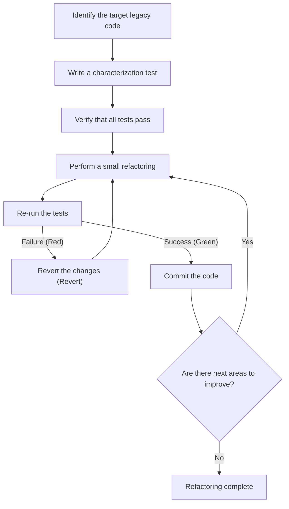
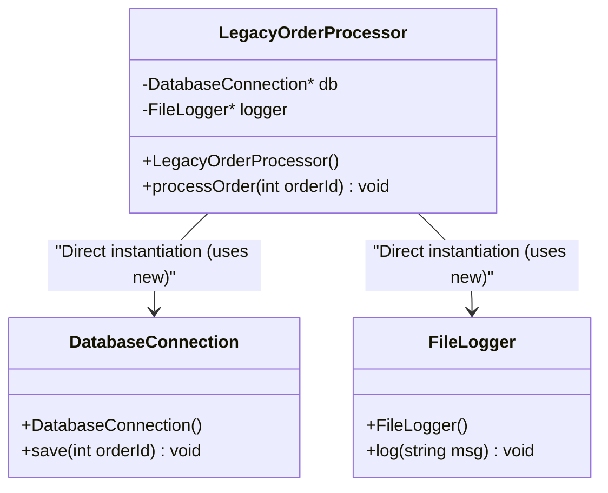
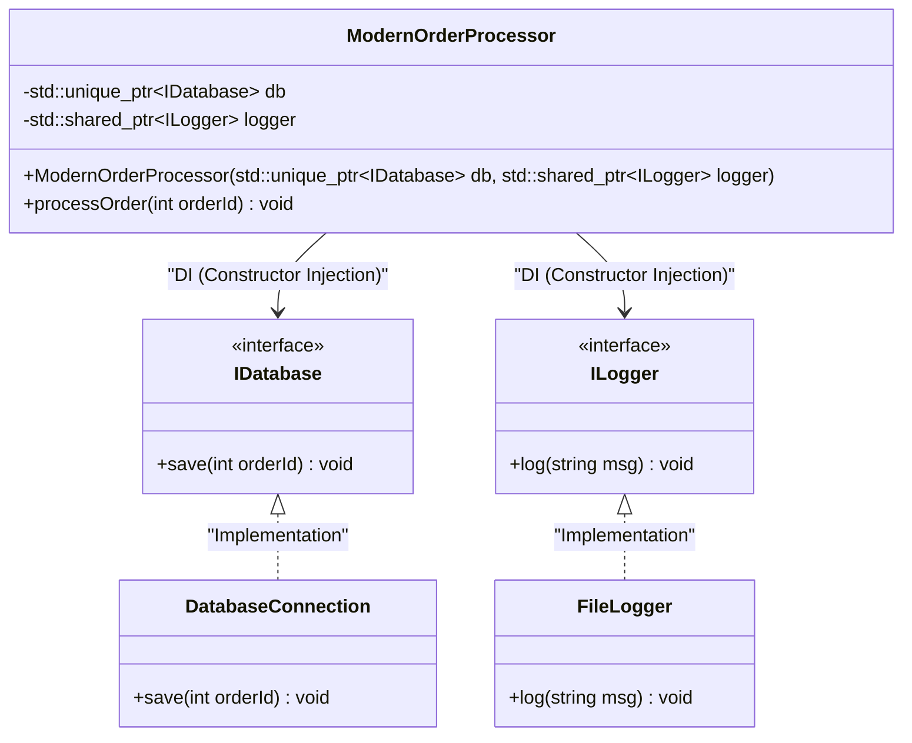

# The Secret of Refactoring: Safely Improving Legacy C++ Code

In modern software development, the battle against "legacy code" is inevitable. Especially in a language like C++, legacy code poses a threat beyond comparison to that of other languages. Manual memory management (a storm of raw pointers and `new` / `delete`), abuse of global variables, lack of exception safety, and above all, the fact that "there are no tests." Michael Feathers boldly asserted in his renowned book *Working Effectively with Legacy Code* that "Code without tests is legacy code."

In this article, we will thoroughly explain the secrets of refactoring and safely, reliably migrating a legacy C++ codebase accumulated over decades to Modern C++ (C++11/14/17/20), from both theoretical and practical perspectives. Ranging from mathematical models of technical debt to safely decoupling dependencies and purifying code using modern language features, we cover practical approaches.

---

## 1. The Mathematical Model of Complexity and Technical Debt

To justify refactoring, it is necessary to quantify the problems the current codebase holds. The most common metric for measuring structural complexity of code is "Cyclomatic Complexity". This complexity is defined by the following formula based on graph theory of control flow graphs.

$$ M = E - N + 2P $$

Here,
- $M$ is the Cyclomatic Complexity
- $E$ is the number of edges of the graph (flow of execution, transitions)
- $N$ is the number of nodes of the graph (basic blocks of execution)
- $P$ is the number of connected components (typically $P=1$ for a single function or method)

As the complexity $M$ increases, the number of test cases required to comprehensively test the function increases linearly, or depending on the combination of conditional branches, exponentially. Furthermore, there is an empirical rule that the probability of bug occurrence, $P(bug)$, increases exponentially with respect to complexity $M$. Modeling this in a form similar to the Poisson distribution gives the following:

$$ P(bug) = 1 - e^{-\lambda \cdot M} $$

(Here $\lambda$ is a constant depending on the development team's skills and the difficulty of the domain.)

Also, the cost of technical debt increases with compound interest. Assuming the initial technical debt is $C_0$, and the interest rate per iteration (the rate of productivity decline due to difficulty in changing code) is $r$, the modification cost $Cost(t)$ after $t$ periods can be expressed as follows:

$$ Cost(t) = C_0 \times (1 + r)^t $$

What this formula clearly shows is the cruel fact that "leaving legacy code as it is leads to an exponential increase in costs over time." Therefore, debt must be repaid (refactored) early.

---

## 2. The Absolute Principle of Refactoring: "Test First"

The greatest fear when modifying legacy code is "What if I break existing normal behavior (cause regressions)?". The only way to dispel this fear is "automated testing".

However, legacy code does not have tests to begin with. This is where the introduction of "Characterization Tests" becomes important. Characterization tests are tests that record not "how the system should inherently behave", but rather "how it currently behaves" as is.

The flowchart below shows the lifecycle of safe refactoring.



By looping this cycle, developers can always change code on a safety net. If a test fails, it is important to immediately `Revert` (undo) without deeply pursuing the cause.

---

## 3. The Concept of "Seams" that Create Testability

When trying to add tests to legacy code, the first wall you face is "dependencies". If there is tight coupling like direct database connections, network communication, hardcoded file system access, etc., writing Unit Tests is impossible.

This is where the concept of "Seams" comes in. A seam refers to "a place where you can alter behavior in your system without editing in that place." In C++, we mainly utilize the following three seams:

1. **Object Seams**: Polymorphism utilizing Virtual Functions.
2. **Compile-time Seams**: Switching `#include` or Templates.
3. **Link-time Seams**: Switching libraries or object files to link at build time.

By making full use of these to swap production environment modules with Mock objects for testing environments, dependencies are isolated.

---

## 4. Breaking Tight Coupling: Dependency Injection

Dependency Injection (DI) is a powerful pattern for stripping the responsibility of object creation from inside a class to the outside.

First, let's look at a legacy, tightly coupled C++ class design.



This `LegacyOrderProcessor` directly `new`s `DatabaseConnection` and `FileLogger` inside its constructor, so there is no seam to swap them with mocks. We will refactor this to be loosely coupled using interfaces (pure virtual classes).



### Legacy Code Example (C++03)
```cpp
class LegacyOrderProcessor {
private:
    DatabaseConnection* db_;
    FileLogger* logger_;
public:
    LegacyOrderProcessor() {
        db_ = new DatabaseConnection("localhost", 3306);
        logger_ = new FileLogger("/var/log/app.log");
    }
    
    ~LegacyOrderProcessor() {
        delete db_;
        delete logger_;
    }
    
    void processOrder(int orderId) {
        // Processing...
        db_->save(orderId);
        logger_->log("Order processed");
    }
};
```

### After Refactoring (Modern C++)
```cpp
// Interface definition (Object Seam)
class IDatabase {
public:
    virtual ~IDatabase() = default;
    virtual void save(int orderId) = 0;
};

class ILogger {
public:
    virtual ~ILogger() = default;
    virtual void log(const std::string& msg) = 0;
};

// Design where dependencies are injected from the outside
class ModernOrderProcessor {
private:
    std::unique_ptr<IDatabase> db_;
    std::shared_ptr<ILogger> logger_;
public:
    // Constructor Injection
    ModernOrderProcessor(std::unique_ptr<IDatabase> db, std::shared_ptr<ILogger> logger)
        : db_(std::move(db)), logger_(std::move(logger)) {}
    
    void processOrder(int orderId) {
        db_->save(orderId);
        logger_->log("Order processed");
    }
};
```
By revamping the design in this way, mock objects of `IDatabase` can be easily created using frameworks like Google Mock (gmock), enabling Test-Driven Development (TDD).

---

## 5. Dismantling the Demon of Global Variables and Singletons

The biggest headache in legacy C++ is the abuse of global variables and the "Singleton pattern". Singletons seem like a convenient design pattern at first glance, but in reality they are nothing more than "global variables disguised in object-oriented clothing".

Global state shares state between test cases, making parallel execution of tests impossible and causing unexplained flaky tests.

The solution is to eliminate implicit dependencies on global state and pass required state explicitly as function arguments (parameterization). This is called "context passing".

---

## 6. Modernizing Memory Management and the Essence of RAII

In code from the C++98/03 era, `new` and `delete` are scattered everywhere, serving as a hotbed for memory leaks and dangling pointers. In Modern C++ (C++11 and later), the concept of **Ownership** is supported at the language level, and safe resource management using smart pointers has become the standard.

### RAII (Resource Acquisition Is Initialization)
RAII is the most important idiom in C++. By tying resource acquisition to object initialization (constructor) and resource release to object destruction (destructor), it guarantees that resources are reliably released when they go out of scope.

Even if Exceptions occur, local variable destructors are automatically called during the Stack Unwinding process, thus preventing resource leaks.

**Before (Dangerous legacy code)**
```cpp
void processFile(const char* filename) {
    FILE* file = fopen(filename, "r");
    if (!file) return;

    Data* data = new Data();
    if (!readData(file, data)) {
        delete data; // Easy to forget
        fclose(file); // Easy to forget
        return;
    }

    try {
        process(data);
    } catch (...) {
        delete data; // Avoid memory leak on exception
        fclose(file);
        throw;
    }

    delete data;
    fclose(file);
}
```

This code must manually release resources at every branch in control flow and has an extremely fragile structure.

**After (Utilizing RAII and smart pointers)**
```cpp
void processFile(const std::string& filename) {
    // std::ifstream manages the file handle with RAII
    std::ifstream file(filename);
    if (!file.is_open()) return;

    // std::unique_ptr is an exclusive owner managing heap memory with RAII
    auto data = std::make_unique<Data>();
    if (!readData(file, *data)) {
        return; // Automatically released at the point it goes out of scope
    }

    // Even if an exception occurs, the destructors of unique_ptr and ifstream
    // reliably release resources, making it safe (guarantees zero memory leaks)
    process(*data);
}
```

Through this refactoring, the amount of code is significantly reduced, the intent becomes clear, and above all, Exception Safety is perfectly guaranteed.

---

## 7. Increasing Expressiveness with Modern C++ Features

When refactoring legacy code, you should fully utilize the benefits that come with language feature updates.

### 7.1. Type Inference with `auto`
Replacing redundant syntax, such as long iterator type names, with `auto` improves readability. However, best practice is not to make everything `auto`, but to limit it to "cases where the type is obvious by looking at the right hand side."

### 7.2. Compile-time Calculation with `constexpr` and `consteval`
To reduce runtime overhead and detect errors at compile time, actively utilize `constexpr`.

```cpp
// Legacy code (Macros or runtime calculation)
#define MAX_BUFFER_SIZE 1024
const double PI = 3.1415926535;

double calculateCircleArea(double radius) {
    return PI * radius * radius;
}
```

```cpp
// Modern C++ (C++20 and later) style
constexpr std::size_t MaxBufferSize = 1024;
constexpr double Pi = 3.14159265358979323846;

// consteval (C++20) to guarantee it can be evaluated at compile time
consteval double calculateCircleArea(double radius) {
    return Pi * radius * radius;
}

// Zero runtime cost. The constant result is directly embedded into the binary at compile time.
constexpr double area = calculateCircleArea(10.0);
```

### 7.3. `[[nodiscard]]` Attribute
To prevent bugs where the return value of a function (especially error codes or important states) is ignored, apply the `[[nodiscard]]` attribute. This causes the compiler to issue a warning for calls that do not receive the return value.

```cpp
[[nodiscard]] bool initializeSystem(); // Forbids ignoring the return value
```

---

## 8. Utilizing Automation Tools and Continuous Improvement

It is unrealistic to manually modify a large-scale legacy codebase. Enlisting the power of the toolchain is a shortcut to success.

- **Clang-Tidy**: A powerful linter and static analysis tool for C++. By enabling the `modernize-*` checks, it can automatically apply (Fix-it) things like applying `auto`, replacing with `nullptr`, adding `override`, etc.
- **AddressSanitizer (ASan)**: By integrating it as a compilation option (`-fsanitize=address`), it accurately pinpoints runtime memory leaks and buffer overruns. You should definitely enable it when running tests.
- **Building a CI/CD Pipeline**: Use GitHub Actions or GitLab CI to run builds, automated testing, and static analysis for every pull request, preventing the intrusion of new technical debt.

---

## 9. Conclusion

Refactoring legacy C++ code is by no means something completed overnight. It is a delicate yet bold task, like performing surgery on a system.

Keep the following steps explained in this article in mind.
1. **Measure complexity and strategize based on facts**
2. **Find seams and protect the system with characterization tests**
3. **Break tight coupling with DI and eradicate global state**
4. **Remove anxiety around memory management with RAII and smart pointers**
5. **Utilize Modern C++ features and let the compiler do the work**

Having the spirit of "the Boy Scout Rule (leave the campground cleaner than you found it)" and continuously, steadily improving the code little by little during daily development tasks is the true secret of refactoring.
