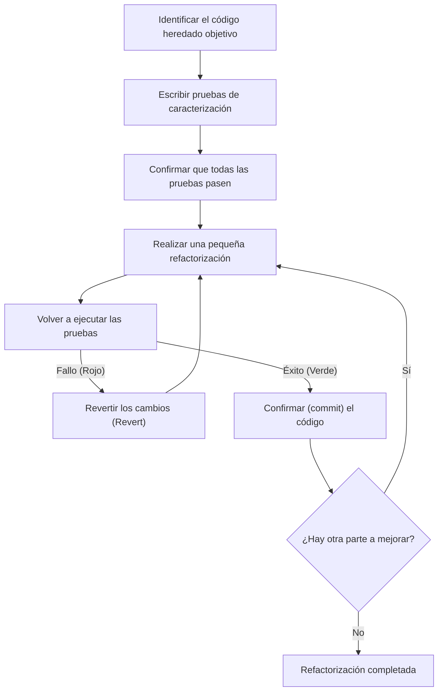
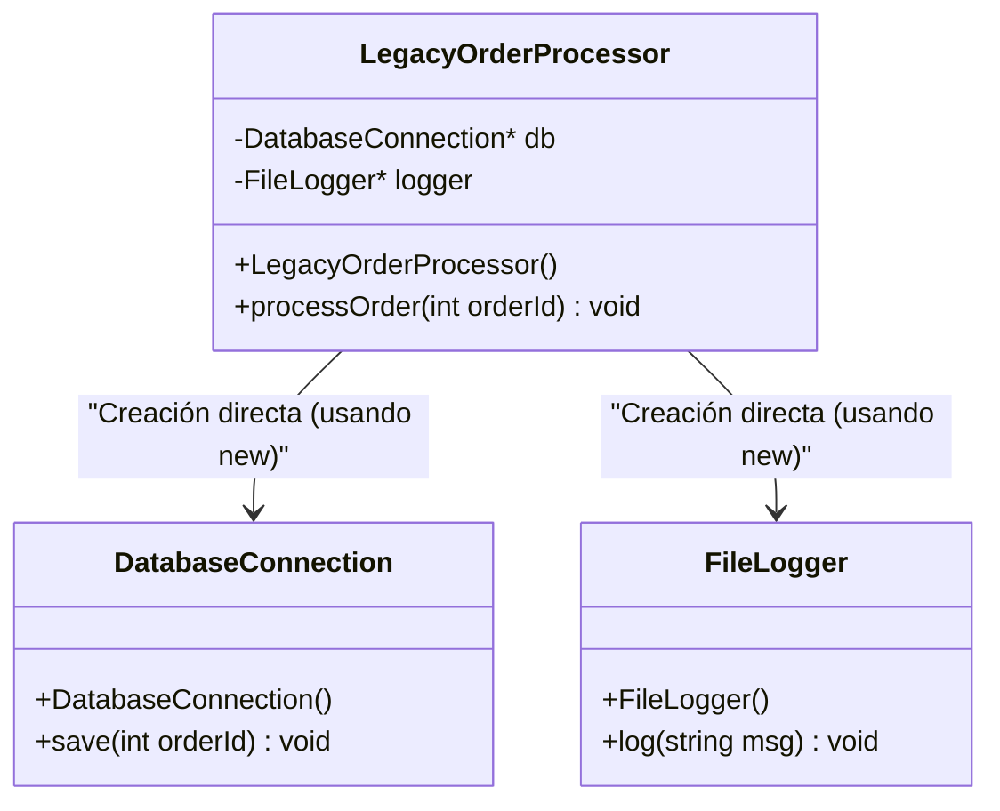
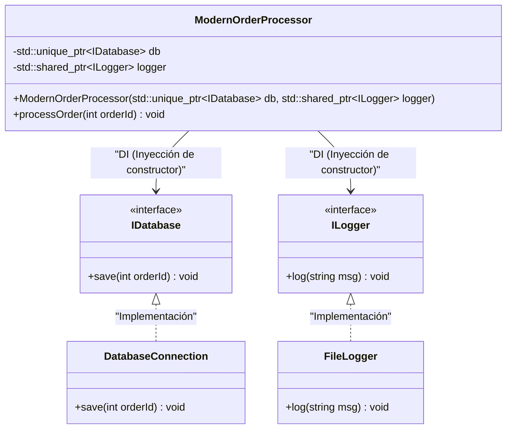

# El arte de la refactorización: Mejorando el código C++ heredado de forma segura

En el desarrollo de software moderno, la batalla contra el "código heredado" (legacy code) es inevitable. Especialmente en un lenguaje como C++, el código heredado representa una amenaza incomparable a la de otros lenguajes. Gestión de memoria manual (una tormenta de punteros crudos y `new` / `delete`), abuso de variables globales, falta de seguridad contra excepciones, y sobre todo, el hecho de que "no hay pruebas". Michael Feathers afirmó contundentemente en su famoso libro *Working Effectively with Legacy Code*: "El código sin pruebas es código heredado".

En este artículo, explicaremos a fondo los secretos tanto teóricos como prácticos para migrar y refactorizar de manera segura y confiable una base de código C++ heredada, acumulada durante décadas, hacia Modern C++ (C++11/14/17/20). Cubriremos enfoques prácticos que van desde modelos matemáticos de la deuda técnica, la separación segura de dependencias, hasta la limpieza del código utilizando características de lenguaje modernas.

---

## 1. Modelo matemático de la complejidad y la deuda técnica

Para justificar la refactorización, es necesario cuantificar los problemas que la base de código actual tiene. La métrica más común para medir la complejidad estructural del código es la "Complejidad Ciclomática" (Cyclomatic Complexity). Esta complejidad se define mediante la siguiente fórmula basada en la teoría de grafos del gráfico de flujo de control.

$$ M = E - N + 2P $$

Donde,
- $M$ es la complejidad ciclomática
- $E$ es el número de aristas (flujo de procesamiento, transiciones) del grafo
- $N$ es el número de nodos (bloques básicos de procesamiento) del grafo
- $P$ es el número de componentes conectados (generalmente, para una sola función o método, $P=1$)

A medida que la complejidad $M$ aumenta, el número de casos de prueba necesarios para probar la función exhaustivamente aumenta linealmente o, dependiendo de las combinaciones de ramificaciones condicionales, exponencialmente. Además, existe la regla empírica de que la probabilidad de ocurrencia de errores, $P(bug)$, aumenta exponencialmente con la complejidad $M$. Modelando esto de manera similar a una distribución de Poisson, se obtiene lo siguiente.

$$ P(bug) = 1 - e^{-\lambda \cdot M} $$

(Donde $\lambda$ es una constante que depende de la habilidad del equipo de desarrollo y la dificultad del dominio).

Además, el costo de la deuda técnica aumenta de forma compuesta. Si asumimos la deuda técnica inicial como $C_0$ y la tasa de interés por iteración (tasa de disminución de la productividad debido a la dificultad de modificar el código) como $r$, el costo de modificación $Cost(t)$ después de $t$ períodos se puede expresar de la siguiente manera.

$$ Cost(t) = C_0 \times (1 + r)^t $$

Lo que esta fórmula muestra claramente es la cruel realidad de que "ignorar el código heredado conduce a un aumento exponencial del costo con el tiempo". Por lo tanto, la deuda debe ser pagada (refactorizada) temprano.

---

## 2. El principio absoluto de la refactorización: "Primero las pruebas" (Test First)

El mayor miedo al modificar código heredado radica en "romper el funcionamiento normal existente (causar una regresión)". La única forma de disipar este miedo es con "pruebas automatizadas".

Sin embargo, el código heredado no tiene pruebas en primer lugar. Aquí es donde es importante introducir las "Pruebas de caracterización" (Characterization Tests). Las pruebas de caracterización son pruebas que registran "cómo se comporta actualmente" el sistema tal cual, en lugar de "cómo debería comportarse" originalmente.

El siguiente diagrama de flujo muestra el ciclo de vida de una refactorización segura.



Al iterar este ciclo, los desarrolladores siempre pueden modificar el código sobre una red de seguridad. Si una prueba falla, es importante hacer un `Revert` (deshacer los cambios) inmediatamente sin investigar a fondo la causa.

---

## 3. El concepto de "Costuras" (Seams) para crear testeabilidad

Al intentar agregar pruebas al código heredado, la primera barrera con la que te encuentras es la de las "dependencias". Cuando las conexiones directas a bases de datos, las comunicaciones de red y el acceso al sistema de archivos codificados de forma rígida están fuertemente acoplados, es imposible escribir pruebas unitarias (Unit Tests).

Aquí aparece el concepto de "Costura" (Seam). Una costura se refiere a "un lugar donde se puede alterar el comportamiento del sistema sin editar el código en sí". En C++, se utilizan principalmente las siguientes 3 costuras.

1. **Costuras de objeto (Object Seams)**: Polimorfismo utilizando funciones virtuales (Virtual Functions).
2. **Costuras de compilación (Compile-time Seams)**: Intercambio de plantillas (Templates) o `#include`.
3. **Costuras de enlace (Link-time Seams)**: Intercambio de bibliotecas o archivos objeto enlazados durante la construcción.

Haciendo pleno uso de estas, aislamos las dependencias reemplazando los módulos del entorno de producción con objetos simulados (Mock) para el entorno de pruebas.

---

## 4. Rompiendo el fuerte acoplamiento: Inyección de dependencias (Dependency Injection)

La Inyección de Dependencias (DI) es un patrón poderoso para extraer la responsabilidad de crear objetos desde el interior de una clase hacia el exterior.

Primero, echemos un vistazo al diseño de clases fuertemente acopladas del C++ heredado.



Dado que este `LegacyOrderProcessor` crea directamente con `new` a `DatabaseConnection` y `FileLogger` dentro del constructor, no existe ninguna costura para reemplazarlos con un mock. Vamos a refactorizar esto a un acoplamiento débil (loose coupling) usando interfaces (clases virtuales puras).



### Ejemplo de código heredado (C++03)
```cpp
class LegacyOrderProcessor {
private:
    DatabaseConnection* db_;
    FileLogger* logger_;
public:
    LegacyOrderProcessor() {
        db_ = new DatabaseConnection("localhost", 3306);
        logger_ = new FileLogger("/var/log/app.log");
    }
    
    ~LegacyOrderProcessor() {
        delete db_;
        delete logger_;
    }
    
    void processOrder(int orderId) {
        // Procesamiento...
        db_->save(orderId);
        logger_->log("Order processed");
    }
};
```

### Después de la refactorización (Modern C++)
```cpp
// Definición de interfaces (Costura de objeto)
class IDatabase {
public:
    virtual ~IDatabase() = default;
    virtual void save(int orderId) = 0;
};

class ILogger {
public:
    virtual ~ILogger() = default;
    virtual void log(const std::string& msg) = 0;
};

// Diseño para inyectar dependencias desde el exterior
class ModernOrderProcessor {
private:
    std::unique_ptr<IDatabase> db_;
    std::shared_ptr<ILogger> logger_;
public:
    // Inyección de constructor (Constructor Injection)
    ModernOrderProcessor(std::unique_ptr<IDatabase> db, std::shared_ptr<ILogger> logger)
        : db_(std::move(db)), logger_(std::move(logger)) {}
    
    void processOrder(int orderId) {
        db_->save(orderId);
        logger_->log("Order processed");
    }
};
```
Al revisar el diseño de esta manera, se puede crear fácilmente un objeto simulado (mock) de `IDatabase` utilizando frameworks como Google Mock (gmock), lo que hace posible el Desarrollo Guiado por Pruebas (TDD).

---

## 5. El desmantelamiento de variables globales maliciosas y singletons

Lo más preocupante en el C++ heredado es el uso abusivo de variables globales y del patrón "Singleton". El singleton parece a primera vista un patrón de diseño conveniente, pero en realidad no es más que "una variable global disfrazada de programación orientada a objetos".

El estado global hace imposible la ejecución paralela de pruebas porque el estado se comparte entre los casos de prueba, y causa pruebas intermitentes (Flaky Tests) de origen desconocido.

La solución es eliminar la dependencia implícita en estados globales y pasar el estado necesario explícitamente como argumento de la función (parametrización). A esto se le llama "paso de contexto" (context passing).

---

## 6. La modernización de la gestión de la memoria y la esencia de RAII

En el código de la era C++98/03, `new` y `delete` se esparcen por todo el código, convirtiéndose en semilleros de fugas de memoria (memory leaks) y punteros colgantes (dangling pointers). En Modern C++ (C++11 en adelante), el concepto de **Propiedad (Ownership)** es compatible a nivel de lenguaje, y la gestión segura de recursos mediante punteros inteligentes se ha convertido en el estándar.

### RAII (Resource Acquisition Is Initialization)
RAII es el modismo (idiom) más importante en C++. Al vincular la adquisición de recursos a la inicialización de objetos (constructor) y la liberación de recursos a la destrucción de objetos (destructor), se garantiza que el recurso se libere definitivamente al salir del alcance (scope).

Incluso si ocurre una excepción (Exceptions), el destructor de las variables locales se llama automáticamente durante el proceso de desbobinado de la pila (Stack Unwinding), evitando así fugas de recursos.

**Antes (Código heredado peligroso)**
```cpp
void processFile(const char* filename) {
    FILE* file = fopen(filename, "r");
    if (!file) return;

    Data* data = new Data();
    if (!readData(file, data)) {
        delete data; // Fácil de olvidar
        fclose(file); // Fácil de olvidar
        return;
    }

    try {
        process(data);
    } catch (...) {
        delete data; // Evitar fugas de memoria en caso de excepciones
        fclose(file);
        throw;
    }

    delete data;
    fclose(file);
}
```

Este código debe liberar recursos manualmente en todas las bifurcaciones del flujo de control y tiene una estructura extremadamente frágil.

**Después (Uso de RAII y punteros inteligentes)**
```cpp
void processFile(const std::string& filename) {
    // std::ifstream gestiona el manejador del archivo mediante RAII
    std::ifstream file(filename);
    if (!file.is_open()) return;

    // std::unique_ptr es un propietario exclusivo que gestiona la memoria del heap mediante RAII
    auto data = std::make_unique<Data>();
    if (!readData(file, *data)) {
        return; // Se libera automáticamente en el momento en que sale del alcance
    }

    // Incluso si ocurre una excepción, es seguro porque los destructores de unique_ptr e ifstream
    // aseguran la liberación del recurso (garantía de cero fugas de memoria)
    process(*data);
}
```

Con esta refactorización, la cantidad de código se reduce significativamente, la intención es más clara y, por encima de todo, la seguridad frente a excepciones (Exception Safety) está perfectamente garantizada.

---

## 7. Mayor expresividad a través de las características de Modern C++

Al refactorizar código heredado, se deben aprovechar al máximo los beneficios asociados con las actualizaciones de las características del lenguaje.

### 7.1. Inferencia de tipos mediante `auto`
Se mejora la legibilidad sustituyendo con `auto` las descripciones redundantes, como los nombres de tipo de iteradores largos. Sin embargo, no todo debería ser `auto`; la mejor práctica es limitarlo a "cuando el tipo es evidente con mirar el lado derecho".

### 7.2. Cálculos en tiempo de compilación con `constexpr` y `consteval`
Usamos de manera activa `constexpr` para reducir la sobrecarga en tiempo de ejecución y detectar errores en el momento de la compilación.

```cpp
// Código heredado (macros o cálculos en tiempo de ejecución)
#define MAX_BUFFER_SIZE 1024
const double PI = 3.1415926535;

double calculateCircleArea(double radius) {
    return PI * radius * radius;
}
```

```cpp
// Estilo Modern C++ (C++20 y posterior)
constexpr std::size_t MaxBufferSize = 1024;
constexpr double Pi = 3.14159265358979323846;

// consteval que garantiza la evaluación en tiempo de compilación (C++20)
consteval double calculateCircleArea(double radius) {
    return Pi * radius * radius;
}

// Costo en tiempo de ejecución de cero. La constante del resultado se incrusta directamente en el binario al compilar.
constexpr double area = calculateCircleArea(10.0);
```

### 7.3. Atributo `[[nodiscard]]`
Añadimos el atributo `[[nodiscard]]` para evitar errores donde se ignore el valor de retorno de una función (especialmente códigos de error y estados críticos). Con esto, el compilador emitirá una advertencia para cualquier llamada que no reciba el valor de retorno.

```cpp
[[nodiscard]] bool initializeSystem(); // Prohibir ignorar el valor de retorno
```

---

## 8. Utilización de herramientas de automatización y mejora continua

Modificar manualmente una gran base de código heredado es poco realista. Apoyarse en cadenas de herramientas (toolchains) es un atajo para el éxito.

- **Clang-Tidy**: Un potente linter de C++ y herramienta de análisis estático. Al habilitar comprobaciones `modernize-*`, aplica automáticamente (Fix-it) implementaciones de `auto`, reemplazos de `nullptr` y adiciones de `override`, etc.
- **AddressSanitizer (ASan)**: Integrándolo como opción de compilación (`-fsanitize=address`), identifica con precisión fugas de memoria y desbordamientos de búfer en tiempo de ejecución. Debería habilitarse siempre durante la ejecución de las pruebas.
- **Construcción de pipeline CI/CD**: Utilizando GitHub Actions o GitLab CI, ejecuta la compilación, las pruebas automáticas y el análisis estático en cada pull request para evitar la introducción de nueva deuda técnica.

---

## 9. Conclusión

Refactorizar código C++ heredado nunca se completa de la noche a la mañana. Es una tarea tan delicada y audaz como realizar una cirugía en el sistema.

Tenga en mente los siguientes pasos explicados en este artículo.
1. **Medir la complejidad y trazar una estrategia basada en hechos**
2. **Encontrar costuras y proteger el sistema con pruebas de caracterización**
3. **Romper el acoplamiento fuerte mediante DI y erradicar los estados globales**
4. **Eliminar la ansiedad en la gestión de memoria usando RAII y punteros inteligentes**
5. **Aprovechar las funcionalidades de Modern C++ y hacer que el compilador haga el trabajo**

Mantener el espíritu de la "regla del boy scout" (dejar el campamento más limpio de como lo encontraste) y seguir mejorando constante y progresivamente el código en tus tareas diarias de desarrollo, ese es el verdadero arte de la refactorización.
