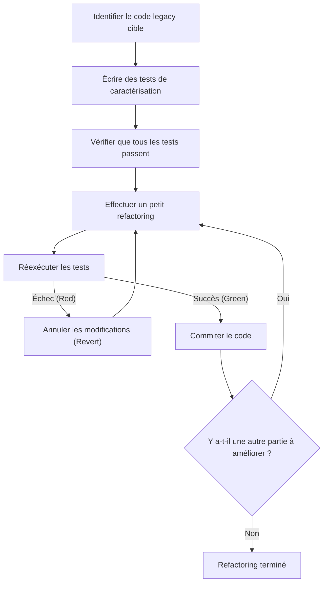
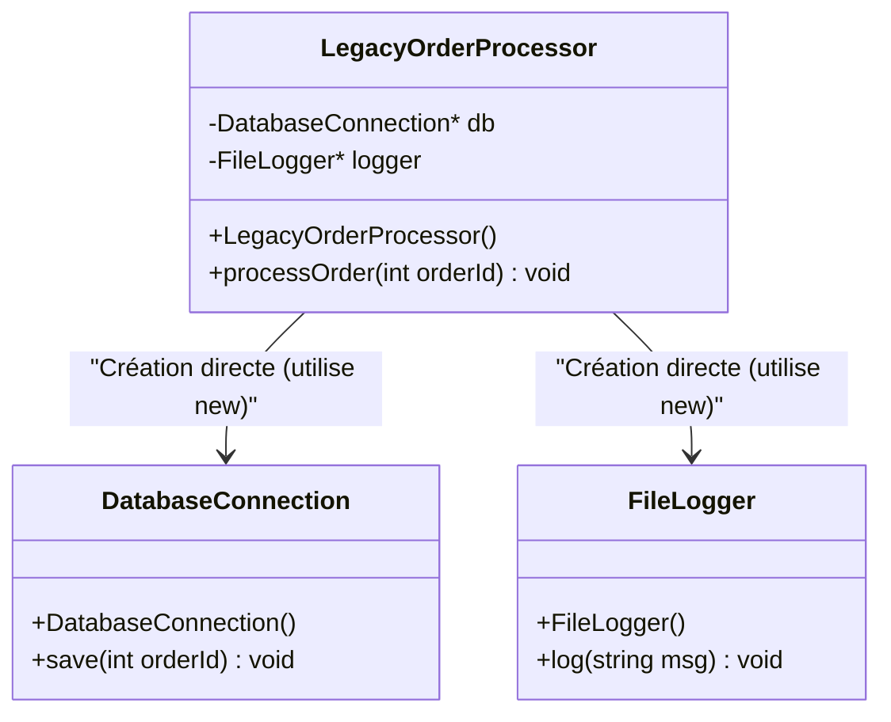
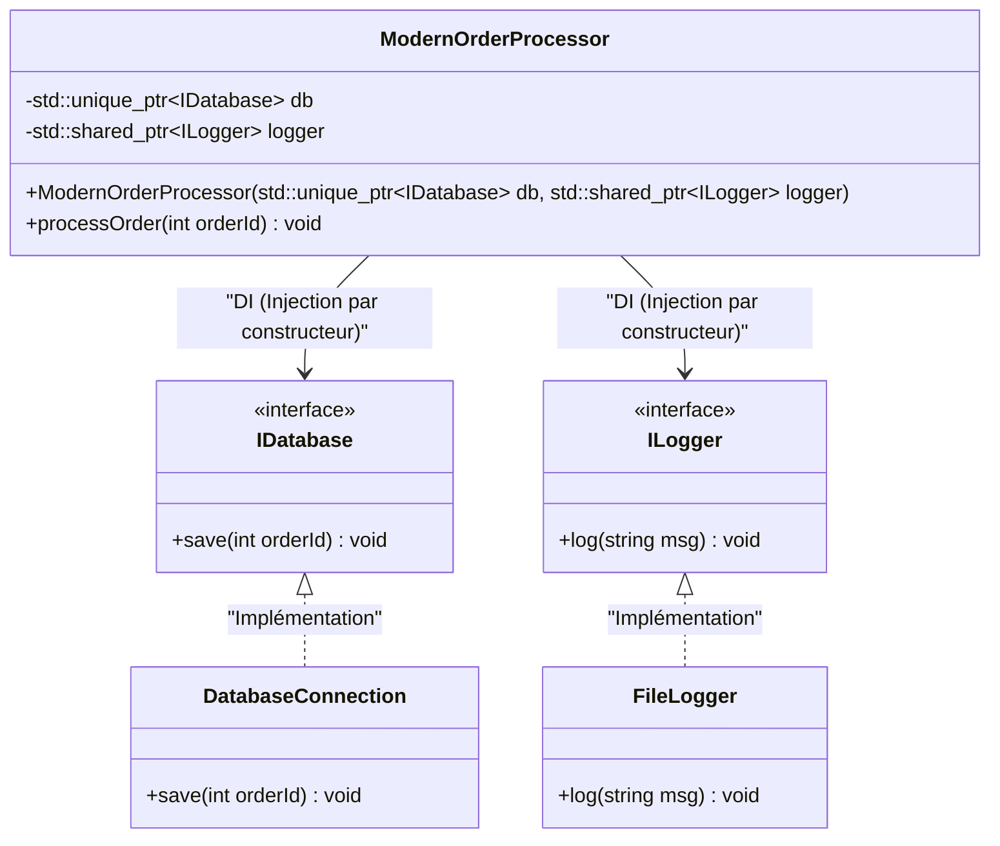

# Le secret du refactoring : améliorer le code C++ legacy en toute sécurité

Dans le développement logiciel moderne, la bataille contre le "code legacy" est inévitable. Surtout dans un langage comme le C++, le code legacy présente une menace bien supérieure à celle des autres langages. La gestion manuelle de la mémoire (une tempête de pointeurs bruts, de `new` et de `delete`), l'abus de variables globales, le manque de sécurité des exceptions et, par-dessus tout, le fait qu'il n'y ait "pas de tests". Michael Feathers a déclaré dans son célèbre ouvrage *Working Effectively with Legacy Code* que "le code sans tests est du code legacy".

Cet article expliquera de manière exhaustive, d'un point de vue à la fois théorique et pratique, les secrets pour migrer et refactoriser de manière sûre et fiable une base de code C++ legacy accumulée sur plusieurs décennies vers du Modern C++ (C++11/14/17/20). Commençant par un modèle mathématique de la dette technique, nous couvrirons des approches pratiques telles que l'isolation sûre des dépendances et le nettoyage du code à l'aide de fonctionnalités de langage modernes.

---

## 1. Modèle mathématique de la complexité et de la dette technique

Pour justifier le refactoring, il est nécessaire de quantifier les problèmes de la base de code actuelle. La "complexité cyclomatique" (Cyclomatic Complexity) est la métrique la plus courante pour mesurer la complexité structurelle du code. Cette complexité est définie par la formule suivante, basée sur la théorie des graphes du graphe de flux de contrôle.

$$ M = E - N + 2P $$

Ici,
- $M$ est la complexité cyclomatique
- $E$ est le nombre d'arêtes (flux de traitement, transitions) du graphe
- $N$ est le nombre de nœuds (blocs de base de traitement) du graphe
- $P$ est le nombre de composantes connexes (généralement, pour une seule fonction ou méthode, $P=1$)

Plus la complexité $M$ est grande, plus le nombre de cas de test requis pour tester cette fonction de manière exhaustive augmente linéairement, ou exponentiellement selon la combinaison des branchements conditionnels. De plus, il existe une règle empirique selon laquelle la probabilité d'apparition de bugs $P(bug)$ augmente de façon exponentielle avec la complexité $M$. Si nous modélisons cela sous une forme similaire à la distribution de Poisson, nous obtenons ce qui suit.

$$ P(bug) = 1 - e^{-\lambda \cdot M} $$

(Où $\lambda$ est une constante dépendant des compétences de l'équipe de développement et de la difficulté du domaine.)

De plus, le coût de la dette technique augmente de manière composée. Si la dette technique initiale est $C_0$ et le taux d'intérêt par itération (le taux de baisse de productivité due à la difficulté de modifier le code) est $r$, le coût de modification $Cost(t)$ après $t$ périodes peut être exprimé comme suit :

$$ Cost(t) = C_0 \times (1 + r)^t $$

Ce que cette formule montre clairement est la cruelle réalité selon laquelle "laisser le code legacy tel quel entraîne une augmentation exponentielle des coûts au fil du temps". Par conséquent, la dette doit être remboursée (refactorisée) rapidement.

---

## 2. Le principe absolu du refactoring : "Test First"

La plus grande peur lors de la modification de code legacy est la question : "Ne vais-je pas casser le comportement normal existant (provoquer une régression) ?". La seule façon de dissiper cette peur est d'utiliser des "tests automatisés".

Cependant, le code legacy ne possède pas de tests au départ. C'est là qu'intervient l'introduction de "tests de caractérisation" (Characterization Test). Un test de caractérisation est un test qui n'enregistre pas "comment le système devrait se comporter", mais plutôt "comment il se comporte actuellement".

L'organigramme suivant illustre le cycle de vie d'un refactoring sûr.



En répétant ce cycle, les développeurs peuvent toujours modifier le code sur un filet de sécurité. Si un test échoue, il est important d'annuler immédiatement les modifications (`Revert`) sans chercher la cause en profondeur.

---

## 3. Le concept de "Coutures" (Seams) créant la testabilité

Lorsque vous essayez d'ajouter des tests à du code legacy, le premier mur auquel vous vous heurtez est celui des "dépendances". Si les connexions directes à la base de données, la communication réseau ou l'accès codé en dur au système de fichiers sont étroitement couplés, il est impossible d'écrire des tests unitaires (Unit Test).

C'est là qu'intervient le concept de "Couture" (Seam). Une couture désigne "un endroit où vous pouvez modifier le comportement du système sans éditer le code lui-même". En C++, nous utilisons principalement les trois coutures suivantes.

1. **Coutures d'objets (Object Seams)** : Polymorphisme utilisant des fonctions virtuelles (Virtual Functions).
2. **Coutures à la compilation (Compile-time Seams)** : Basculement de templates (Templates) ou de `#include`.
3. **Coutures à l'édition de liens (Link-time Seams)** : Basculement des bibliothèques ou fichiers objets liés lors du build.

En utilisant ces éléments, vous pouvez isoler les dépendances en remplaçant les modules de l'environnement de production par des objets factices (Mock) pour l'environnement de test.

---

## 4. Briser le couplage fort : l'Injection de Dépendances (Dependency Injection)

L'Injection de Dépendances (DI : Dependency Injection) est un modèle puissant pour retirer la responsabilité de la création d'objets de l'intérieur d'une classe vers l'extérieur.

Tout d'abord, examinons la conception d'une classe C++ legacy et étroitement couplée.



Ce `LegacyOrderProcessor` instancie directement `DatabaseConnection` et `FileLogger` avec `new` dans le constructeur, il n'y a donc pas de couture pour les remplacer par des mocks. Nous allons refactoriser cela en un couplage faible en utilisant des interfaces (classes virtuelles pures).



### Exemple de code legacy (C++03)
```cpp
class LegacyOrderProcessor {
private:
    DatabaseConnection* db_;
    FileLogger* logger_;
public:
    LegacyOrderProcessor() {
        db_ = new DatabaseConnection("localhost", 3306);
        logger_ = new FileLogger("/var/log/app.log");
    }
    
    ~LegacyOrderProcessor() {
        delete db_;
        delete logger_;
    }
    
    void processOrder(int orderId) {
        // Traitement...
        db_->save(orderId);
        logger_->log("Order processed");
    }
};
```

### Après refactoring (Modern C++)
```cpp
// Définition de l'interface (Couture d'objet)
class IDatabase {
public:
    virtual ~IDatabase() = default;
    virtual void save(int orderId) = 0;
};

class ILogger {
public:
    virtual ~ILogger() = default;
    virtual void log(const std::string& msg) = 0;
};

// Conception qui injecte les dépendances de l'extérieur
class ModernOrderProcessor {
private:
    std::unique_ptr<IDatabase> db_;
    std::shared_ptr<ILogger> logger_;
public:
    // Injection par constructeur (Constructor Injection)
    ModernOrderProcessor(std::unique_ptr<IDatabase> db, std::shared_ptr<ILogger> logger)
        : db_(std::move(db)), logger_(std::move(logger)) {}
    
    void processOrder(int orderId) {
        db_->save(orderId);
        logger_->log("Order processed");
    }
};
```
En modifiant la conception de cette manière, vous pouvez facilement créer des objets mock pour `IDatabase` à l'aide de frameworks comme Google Mock (gmock), permettant ainsi le développement piloté par les tests (TDD).

---

## 5. Le démantèlement des redoutables variables globales et des singletons

Ce qui cause le plus de maux de tête dans le C++ legacy est l'abus des variables globales et du "modèle Singleton". À première vue, un singleton peut sembler être un modèle de conception pratique, mais en réalité, ce n'est qu'une "variable globale déguisée en orientation objet".

Les états globaux partagent l'état entre les cas de test, ce qui rend l'exécution parallèle des tests impossible et provoque des tests instables (Flaky Tests) de cause inconnue.

La solution consiste à éliminer les dépendances implicites à l'état global et à transmettre explicitement l'état nécessaire en tant qu'arguments de fonction (paramétrage). Cela s'appelle la "transmission de contexte".

---

## 6. Modernisation de la gestion de la mémoire et l'essence du RAII

Le code de l'époque du C++98/03 a des `new` et `delete` éparpillés partout, ce qui en fait un vivier de fuites de mémoire et de pointeurs fantômes. Dans le Modern C++ (C++11 et ultérieur), le concept de **propriété (Ownership)** est supporté au niveau du langage, et la gestion sûre des ressources à l'aide de pointeurs intelligents est devenue la norme.

### RAII (Resource Acquisition Is Initialization)
Le RAII est l'idiome le plus important en C++. En liant l'acquisition des ressources à l'initialisation de l'objet (constructeur) et la libération des ressources à la destruction de l'objet (destructeur), il garantit que les ressources sont libérées de manière fiable lors de la sortie de la portée.

Même si une exception (Exceptions) se produit, le destructeur des variables locales est appelé automatiquement lors du processus de déroulement de la pile (Stack Unwinding), ce qui empêche les fuites de ressources.

**Avant (Code legacy dangereux)**
```cpp
void processFile(const char* filename) {
    FILE* file = fopen(filename, "r");
    if (!file) return;

    Data* data = new Data();
    if (!readData(file, data)) {
        delete data; // Souvent oublié
        fclose(file); // Souvent oublié
        return;
    }

    try {
        process(data);
    } catch (...) {
        delete data; // Évitement de la fuite de mémoire lors d'une exception
        fclose(file);
        throw;
    }

    delete data;
    fclose(file);
}
```

Ce code nécessite la libération manuelle des ressources dans chaque branche du flux de contrôle, ce qui est une structure extrêmement fragile.

**Après (Utilisation du RAII et des pointeurs intelligents)**
```cpp
void processFile(const std::string& filename) {
    // std::ifstream gère le descripteur de fichier avec le RAII
    std::ifstream file(filename);
    if (!file.is_open()) return;

    // std::unique_ptr est le propriétaire exclusif gérant la mémoire tas avec le RAII
    auto data = std::make_unique<Data>();
    if (!readData(file, *data)) {
        return; // Libéré automatiquement lors de la sortie de la portée
    }

    // Même si une exception se produit, les destructeurs de unique_ptr et ifstream
    // libéreront de manière fiable les ressources de manière sûre (garantie de zéro fuite de mémoire)
    process(*data);
}
```

Grâce à ce refactoring, la quantité de code est considérablement réduite, l'intention devient claire et, par-dessus tout, la sécurité des exceptions (Exception Safety) est parfaitement garantie.

---

## 7. Amélioration de l'expressivité grâce aux fonctionnalités du Modern C++

Lors du refactoring du code legacy, vous devez tirer pleinement parti des avantages apportés par les mises à jour des fonctionnalités du langage.

### 7.1. `auto` pour l'inférence de type
En remplaçant les descriptions verbeuses, telles que les noms de types d'itérateurs longs, par `auto`, la lisibilité est améliorée. Cependant, la meilleure pratique n'est pas de tout changer en `auto`, mais de le limiter aux "cas où le type est évident en regardant le côté droit".

### 7.2. Calcul à la compilation avec `constexpr` et `consteval`
Afin de réduire la surcharge d'exécution et de détecter les erreurs à la compilation, `constexpr` est activement utilisé.

```cpp
// Code legacy (macros et calculs à l'exécution)
#define MAX_BUFFER_SIZE 1024
const double PI = 3.1415926535;

double calculateCircleArea(double radius) {
    return PI * radius * radius;
}
```

```cpp
// Style Modern C++ (C++20 et ultérieur)
constexpr std::size_t MaxBufferSize = 1024;
constexpr double Pi = 3.14159265358979323846;

// consteval garantissant que cela peut être évalué à la compilation (C++20)
consteval double calculateCircleArea(double radius) {
    return Pi * radius * radius;
}

// Coût d'exécution nul. La constante du résultat est directement intégrée au binaire à la compilation.
constexpr double area = calculateCircleArea(10.0);
```

### 7.3. Attribut `[[nodiscard]]`
Pour éviter les bugs où les valeurs de retour des fonctions (en particulier les codes d'erreur et les états importants) sont ignorées, l'attribut `[[nodiscard]]` est ajouté. Ainsi, le compilateur émettra un avertissement pour les appels qui ne reçoivent pas la valeur de retour.

```cpp
[[nodiscard]] bool initializeSystem(); // Interdit d'ignorer la valeur de retour
```

---

## 8. Utilisation d'outils d'automatisation et amélioration continue

Il est irréaliste de corriger manuellement une base de code legacy à grande échelle. L'aide d'une chaîne d'outils est le chemin le plus court vers le succès.

- **Clang-Tidy** : Un linter et un outil d'analyse statique puissant pour C++. En activant les vérifications de la famille `modernize-*`, il appliquera automatiquement (Fix-it) des choses comme l'application d'`auto`, le remplacement par `nullptr`, et l'ajout d'`override`.
- **AddressSanitizer (ASan)** : En l'intégrant comme option de compilation (`-fsanitize=address`), il identifiera avec précision les fuites de mémoire et les débordements de tampon (buffer overruns) à l'exécution. Il doit absolument être activé lors de l'exécution des tests.
- **Construction de pipelines CI/CD** : Utilisez GitHub Actions ou GitLab CI pour exécuter des builds, des tests automatisés et une analyse statique sur toutes les pull requests, empêchant ainsi l'introduction d'une nouvelle dette technique.

---

## 9. Conclusion

Le refactoring du code C++ legacy n'est jamais terminé du jour au lendemain. C'est un travail à la fois délicat et audacieux, semblable à la réalisation d'une intervention chirurgicale sur un système.

Veuillez garder à l'esprit les étapes suivantes expliquées dans cet article.
1. **Mesurez la complexité et établissez une stratégie basée sur des faits**
2. **Trouvez les coutures et protégez le système avec des tests de caractérisation**
3. **Brisez le couplage fort par la DI et éradiquez l'état global**
4. **Dissipez les inquiétudes liées à la gestion de la mémoire grâce au RAII et aux pointeurs intelligents**
5. **Utilisez les fonctionnalités du Modern C++ et laissez le compilateur faire le travail**

Avoir l'esprit de la "règle du Boy Scout (quittez le terrain de camping plus propre que vous ne l'avez trouvé)" et continuer à améliorer le code petit à petit, mais sûrement, au sein de vos tâches de développement quotidiennes est le véritable secret du refactoring.
