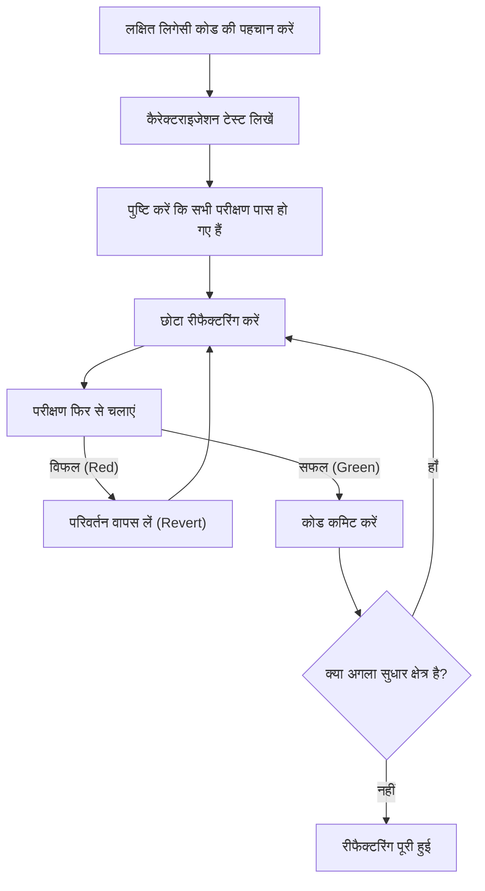
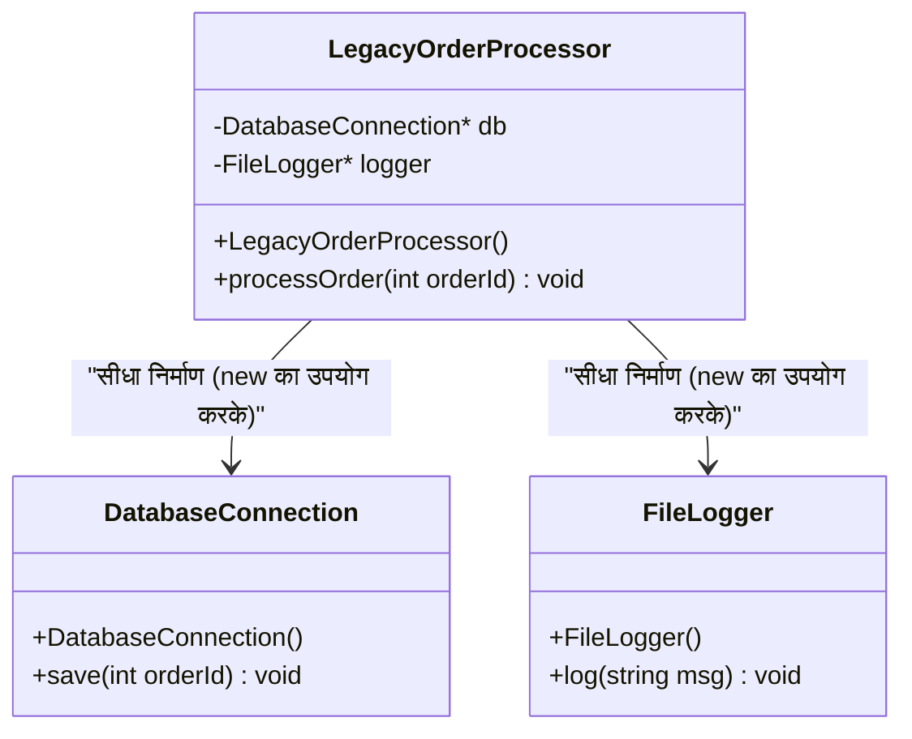
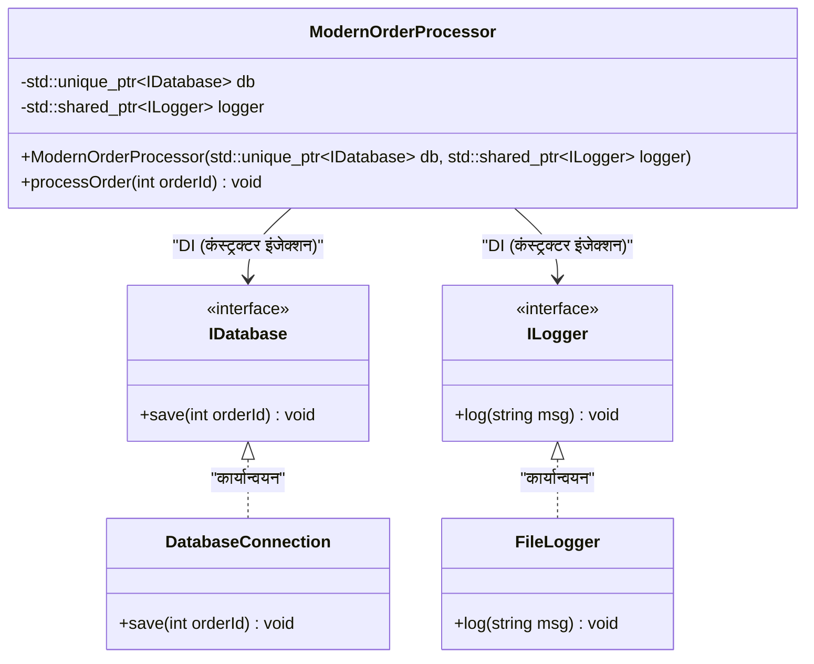

# रीफैक्टरिंग का रहस्य: लिगेसी C++ कोड को सुरक्षित रूप से सुधारना

आधुनिक सॉफ्टवेयर विकास में, "लिगेसी कोड" के साथ संघर्ष एक अपरिहार्य मार्ग है। विशेष रूप से C++ जैसी भाषा में, लिगेसी कोड किसी भी अन्य भाषा की तुलना में बहुत बड़ा खतरा पैदा करता है। मैन्युअल मेमोरी प्रबंधन (कच्चे पॉइंटर्स और `new` / `delete` का तूफान), ग्लोबल वेरिएबल्स का दुरुपयोग, अपवाद सुरक्षा का अभाव, और सबसे महत्वपूर्ण बात, "कोई परीक्षण नहीं" होने का तथ्य। माइकल फेदर्स ने अपनी उत्कृष्ट पुस्तक 'वर्किंग इफेक्टिवली विद लिगेसी कोड' में स्पष्ट रूप से कहा है: "बिना परीक्षण वाले कोड को लिगेसी कोड कहा जाता है।"

इस लेख में, हम दशकों से जमा हुए लिगेसी C++ कोडबेस को सुरक्षित और मज़बूती से मॉडर्न C++ (C++11/14/17/20) में माइग्रेट और रीफैक्टर करने के रहस्यों को सिद्धांत और व्यवहार दोनों पहलुओं से विस्तार से समझेंगे। तकनीकी ऋण के गणितीय मॉडल से शुरू करते हुए, सुरक्षित निर्भरता अलगाव, और आधुनिक भाषा सुविधाओं का उपयोग करके कोड को साफ करने तक के व्यावहारिक दृष्टिकोण शामिल होंगे।

---

## 1. जटिलता और तकनीकी ऋण का गणितीय मॉडल

रीफैक्टरिंग को उचित ठहराने के लिए, वर्तमान कोडबेस की समस्याओं को मापना आवश्यक है। कोड की संरचनात्मक जटिलता को मापने के लिए सबसे आम मीट्रिक "साइक्लोमेटिक जटिलता (Cyclomatic Complexity)" है। यह जटिलता नियंत्रण प्रवाह ग्राफ के ग्राफ सिद्धांत के आधार पर निम्नलिखित सूत्र द्वारा परिभाषित की गई है:

$$ M = E - N + 2P $$

यहाँ,
- $M$ साइक्लोमेटिक जटिलता है
- $E$ ग्राफ के किनारों (प्रसंस्करण प्रवाह, संक्रमण) की संख्या है
- $N$ ग्राफ के नोड्स (प्रसंस्करण के बुनियादी ब्लॉक) की संख्या है
- $P$ जुड़े घटकों की संख्या है (आमतौर पर, एकल फ़ंक्शन या विधि के लिए $P=1$)

जटिलता $M$ जितनी अधिक होगी, उस फ़ंक्शन का व्यापक रूप से परीक्षण करने के लिए आवश्यक परीक्षण मामलों की संख्या रैखिक रूप से, या सशर्त शाखाओं के संयोजन के आधार पर घातीय रूप से बढ़ेगी। इसके अलावा, एक अनुभवजन्य नियम है कि बग होने की संभावना $P(bug)$, जटिलता $M$ के सापेक्ष घातीय रूप से बढ़ती है। यदि इसे पॉइसन वितरण के समान आकार में मॉडल किया जाए, तो यह इस प्रकार होगा:

$$ P(bug) = 1 - e^{-\lambda \cdot M} $$

(यहाँ $\lambda$ एक स्थिरांक है जो विकास टीम के कौशल और डोमेन की कठिनाई पर निर्भर करता है।)

साथ ही, तकनीकी ऋण की लागत चक्रवृद्धि ब्याज की तरह बढ़ती है। यदि प्रारंभिक तकनीकी ऋण को $C_0$ और प्रति पुनरावृत्ति ब्याज दर (कोड को बदलने में कठिनाई के कारण उत्पादकता में कमी का प्रतिशत) को $r$ मान लिया जाए, तो $t$ अवधि के बाद संशोधन लागत $Cost(t)$ को इस प्रकार व्यक्त किया जा सकता है:

$$ Cost(t) = C_0 \times (1 + r)^t $$

यह सूत्र स्पष्ट रूप से एक क्रूर सच्चाई को दर्शाता है: "लिगेसी कोड को अनदेखा करने से समय के साथ लागत में घातीय वृद्धि होती है।" इसलिए, ऋण को जल्दी चुकाना (रीफैक्टरिंग) आवश्यक है।

---

## 2. रीफैक्टरिंग का पूर्ण सिद्धांत: "टेस्ट-फर्स्ट"

लिगेसी कोड को बदलते समय सबसे बड़ा डर यह होता है कि "क्या मौजूदा सामान्य कार्यक्षमता टूट (रिग्रेशन) तो नहीं जाएगी?" इस डर को दूर करने का एकमात्र तरीका "स्वचालित परीक्षण" है।

हालाँकि, लिगेसी कोड में कोई परीक्षण नहीं होता है। यहीं पर "कैरेक्टराइजेशन टेस्ट (Characterization Test)" शुरू करने का महत्व आता है। कैरेक्टराइजेशन टेस्ट एक ऐसा परीक्षण है जो सिस्टम "कैसा व्यवहार करना चाहिए" के बजाय "वर्तमान में कैसे व्यवहार कर रहा है" को रिकॉर्ड करता है।

निम्नलिखित फ्लोचार्ट सुरक्षित रीफैक्टरिंग के जीवनचक्र को दर्शाता है।



इस चक्र को घुमाकर, डेवलपर्स हमेशा सुरक्षा जाल पर कोड बदल सकते हैं। यदि परीक्षण विफल हो जाता है, तो कारण का गहराई से पता लगाए बिना तुरंत `Revert` (वापस लेना) करना महत्वपूर्ण है।

---

## 3. परीक्षण क्षमता बनाने के लिए "सीम्स (Seams)" की अवधारणा

जब आप लिगेसी कोड में परीक्षण जोड़ने का प्रयास करते हैं, तो सबसे पहली बाधा "निर्भरता" होती है। यदि डेटाबेस से सीधा कनेक्शन, नेटवर्क संचार, या हार्ड-कोडेड फाइल सिस्टम एक्सेस मजबूती से जुड़े हुए हैं, तो यूनिट टेस्ट (Unit Test) लिखना असंभव है।

यहीं पर "सीम (Seam)" की अवधारणा आती है। सीम उस स्थान को संदर्भित करता है "जहां आप कोड को संपादित किए बिना सिस्टम के व्यवहार को बदल सकते हैं।" C++ में, हम मुख्य रूप से निम्नलिखित तीन सीम्स का उपयोग ঘনত্ব का उपयोग करते हैं:

1. **ऑब्जेक्ट सीम्स (Object Seams)**: वर्चुअल फ़ंक्शंस (Virtual Functions) का उपयोग करके बहुरूपता (Polymorphism)।
2. **कंपाइल-टाइम सीम्स (Compile-time Seams)**: टेम्प्लेट्स (Templates) या `#include` को स्विच करना।
3. **लिंक-टाइम सीम्स (Link-time Seams)**: बिल्ड के समय लिंक किए गए लाइब्रेरी या ऑब्जेक्ट फ़ाइलों को स्विच करना।

इनका उपयोग करके, हम उत्पादन पर्यावरण के मॉड्यूल को परीक्षण पर्यावरण के लिए मॉक (Mock) ऑब्जेक्ट्स से बदल सकते हैं, जिससे निर्भरता अलग हो जाती है।

---

## 4. घनिष्ठ युग्मन (Tight Coupling) को तोड़ना: डिपेंडेंसी इंजेक्शन (Dependency Injection)

डिपेंडेंसी इंजेक्शन (DI) ऑब्जेक्ट निर्माण की जिम्मेदारी को क्लास के अंदर से बाहर निकालने का एक शक्तिशाली पैटर्न है।

आइए सबसे पहले लिगेसी और कसकर जुड़े (tightly coupled) C++ क्लास डिज़ाइन को देखें।



यह `LegacyOrderProcessor`, कंस्ट्रक्टर के अंदर `DatabaseConnection` और `FileLogger` को सीधे `new` करता है, इसलिए इसे मॉक से बदलने के लिए कोई सीम नहीं है। इसे इंटरफ़ेस (शुद्ध वर्चुअल क्लास) का उपयोग करके ढीले युग्मित (loosely coupled) डिज़ाइन में रीफैक्टर करते हैं।



### लिगेसी कोड का उदाहरण (C++03)
```cpp
class LegacyOrderProcessor {
private:
    DatabaseConnection* db_;
    FileLogger* logger_;
public:
    LegacyOrderProcessor() {
        db_ = new DatabaseConnection("localhost", 3306);
        logger_ = new FileLogger("/var/log/app.log");
    }
    
    ~LegacyOrderProcessor() {
        delete db_;
        delete logger_;
    }
    
    void processOrder(int orderId) {
        // प्रोसेसिंग...
        db_->save(orderId);
        logger_->log("Order processed");
    }
};
```

### रीफैक्टरिंग के बाद (Modern C++)
```cpp
// इंटरफ़ेस परिभाषा (ऑब्जेक्ट सीम)
class IDatabase {
public:
    virtual ~IDatabase() = default;
    virtual void save(int orderId) = 0;
};

class ILogger {
public:
    virtual ~ILogger() = default;
    virtual void log(const std::string& msg) = 0;
};

// बाहर से निर्भरता को इंजेक्ट करने के लिए डिज़ाइन
class ModernOrderProcessor {
private:
    std::unique_ptr<IDatabase> db_;
    std::shared_ptr<ILogger> logger_;
public:
    // कंस्ट्रक्टर इंजेक्शन (Constructor Injection)
    ModernOrderProcessor(std::unique_ptr<IDatabase> db, std::shared_ptr<ILogger> logger)
        : db_(std::move(db)), logger_(std::move(logger)) {}
    
    void processOrder(int orderId) {
        db_->save(orderId);
        logger_->log("Order processed");
    }
};
```
इस तरह से डिज़ाइन को संशोधित करने से, Google Mock (gmock) जैसे फ्रेमवर्क का उपयोग करके आसानी से `IDatabase` के मॉक ऑब्जेक्ट्स बनाए जा सकते हैं, जिससे टेस्ट ड्रिवन डेवलपमेंट (TDD) संभव हो जाता है।

---

## 5. खतरनाक ग्लोबल वेरिएबल्स और सिंगलटन को नष्ट करना

लिगेसी C++ में सबसे अधिक परेशान करने वाली बात ग्लोबल वेरिएबल्स और "सिंगलटन (Singleton) पैटर्न" का दुरुपयोग है। सिंगलटन पहली नज़र में एक सुविधाजनक डिज़ाइन पैटर्न लग सकता है, लेकिन वास्तव में यह "ऑब्जेक्ट-ओरिएंटेड आवरण में छिपा एक ग्लोबल वेरिएबल" मात्र है।

ग्लोबल अवस्था, परीक्षण मामलों के बीच स्थिति को साझा करती है, जिससे परीक्षणों का समानांतर निष्पादन असंभव हो जाता है और अज्ञात कारणों से फ्लेकी टेस्ट्स (Flaky Tests) होते हैं।

समाधान यह है कि निहित ग्लोबल अवस्था पर निर्भरता को खत्म किया जाए और आवश्यक स्थिति को फ़ंक्शन तर्कों के रूप में स्पष्ट रूप से पास किया जाए (पैरामीटराइजेशन)। इसे "कंटेक्स्ट पासिंग (Context Passing)" कहा जाता है।

---

## 6. मेमोरी प्रबंधन का आधुनिकीकरण और RAII का सार

C++98/03 युग के कोड में, `new` और `delete` कोड में हर जगह बिखरे होते थे, जो मेमोरी लीक और डैंगलिंग पॉइंटर्स का एक प्रमुख कारण है। मॉडर्न C++ (C++11 और बाद) में, **स्वामित्व (Ownership)** की अवधारणा को भाषा स्तर पर समर्थित किया गया है, और स्मार्ट पॉइंटर्स का उपयोग करके सुरक्षित संसाधन प्रबंधन एक मानक बन गया है।

### RAII (Resource Acquisition Is Initialization)
RAII C++ में सबसे महत्वपूर्ण इडियॉम है। यह संसाधन के आवंटन को ऑब्जेक्ट के आरंभीकरण (कंस्ट्रक्टर) के साथ जोड़ता है, और संसाधन की मुक्ति को ऑब्जेक्ट के विनाश (डिस्ट्रक्टर) के साथ जोड़ता है। यह सुनिश्चित करता है कि स्कोप से बाहर निकलने पर संसाधन निश्चित रूप से मुक्त हो जाएंगे।

यदि कोई अपवाद (Exceptions) उत्पन्न होता है, तब भी स्टैक अनवाइंडिंग (Stack Unwinding) प्रक्रिया के दौरान स्थानीय वेरिएबल्स के डिस्ट्रक्टर स्वचालित रूप से कॉल किए जाते हैं, जिससे संसाधन रिसाव को रोका जा सकता है।

**पहले (खतरनाक लिगेसी कोड)**
```cpp
void processFile(const char* filename) {
    FILE* file = fopen(filename, "r");
    if (!file) return;

    Data* data = new Data();
    if (!readData(file, data)) {
        delete data; // भूलने की संभावना
        fclose(file); // भूलने की संभावना
        return;
    }

    try {
        process(data);
    } catch (...) {
        delete data; // अपवाद के दौरान मेमोरी लीक से बचाव
        fclose(file);
        throw;
    }

    delete data;
    fclose(file);
}
```

इस कोड में, नियंत्रण प्रवाह की हर शाखा पर मैन्युअल रूप से संसाधनों को मुक्त करना पड़ता है, जो एक अत्यंत नाजुक संरचना है।

**बाद में (RAII और स्मार्ट पॉइंटर्स का उपयोग)**
```cpp
void processFile(const std::string& filename) {
    // std::ifstream फ़ाइल हैंडल को RAII के माध्यम से प्रबंधित करता है
    std::ifstream file(filename);
    if (!file.is_open()) return;

    // std::unique_ptr हीप मेमोरी को RAII के माध्यम से प्रबंधित करने वाला अनन्य स्वामी (exclusive owner) है
    auto data = std::make_unique<Data>();
    if (!readData(file, *data)) {
        return; // स्कोप छोड़ने पर स्वचालित रूप से मुक्त हो जाता है
    }

    // अपवाद होने पर भी, unique_ptr और ifstream के डिस्ट्रक्टर
    // निश्चित रूप से संसाधनों को मुक्त करते हैं, इसलिए यह सुरक्षित है (शून्य मेमोरी लीक की गारंटी)
    process(*data);
}
```

इस रीफैक्टरिंग से, कोड की मात्रा काफी कम हो जाती है, इरादा भी स्पष्ट हो जाता है, और सबसे महत्वपूर्ण बात यह है कि अपवाद सुरक्षा (Exception Safety) की पूरी तरह से गारंटी दी जाती है।

---

## 7. मॉडर्न C++ सुविधाओं द्वारा अभिव्यक्ति में सुधार

लिगेसी कोड को रीफैक्टर करते समय, भाषा सुविधाओं के अपडेट के साथ आने वाले लाभों का पूरा उपयोग किया जाना चाहिए।

### 7.1. `auto` के साथ प्रकार अनुमान (Type Inference)
लंबे इटरेटर प्रकार नामों जैसे अनावश्यक विवरणों को `auto` से बदलकर पठनीयता में सुधार होता है। हालाँकि, हर चीज़ को `auto` बनाना सबसे अच्छा अभ्यास नहीं है, इसे केवल "उन मामलों तक सीमित करना सबसे अच्छा है जहाँ दाईं ओर देखने पर प्रकार स्पष्ट हो।"

### 7.2. `constexpr` और `consteval` के साथ कंपाइल-टाइम गणना
रनटाइम ओवरहेड को कम करने और कंपाइल टाइम पर त्रुटियों का पता लगाने के लिए `constexpr` का सक्रिय रूप से उपयोग करें।

```cpp
// लिगेसी कोड (मैक्रोज़ या रनटाइम गणना)
#define MAX_BUFFER_SIZE 1024
const double PI = 3.1415926535;

double calculateCircleArea(double radius) {
    return PI * radius * radius;
}
```

```cpp
// मॉडर्न C++ (C++20 और बाद) की शैली
constexpr std::size_t MaxBufferSize = 1024;
constexpr double Pi = 3.14159265358979323846;

// consteval (C++20) यह गारंटी देता है कि मूल्यांकन कंपाइल टाइम पर किया जा सकता है
consteval double calculateCircleArea(double radius) {
    return Pi * radius * radius;
}

// रनटाइम लागत शून्य है। संकलन के समय परिणामी स्थिरांक सीधे बाइनरी में एम्बेड हो जाता है।
constexpr double area = calculateCircleArea(10.0);
```

### 7.3. `[[nodiscard]]` विशेषता (Attribute)
फ़ंक्शंस के रिटर्न वैल्यू (विशेषकर एरर कोड या महत्वपूर्ण अवस्थाओं) को अनदेखा करने वाले बग्स को रोकने के लिए `[[nodiscard]]` एट्रिब्यूट जोड़ें। ऐसा करने से, कंपाइलर उन कॉल्स के लिए चेतावनी जारी करेगा जो रिटर्न वैल्यू प्राप्त नहीं करते हैं।

```cpp
[[nodiscard]] bool initializeSystem(); // रिटर्न वैल्यू को अनदेखा करना निषिद्ध है
```

---

## 8. ऑटोमेशन टूल्स का उपयोग और निरंतर सुधार

बड़े पैमाने पर लिगेसी कोडबेस को मैन्युअल रूप से संशोधित करना अवास्तविक है। टूलचेन की मदद लेना सफलता का शॉर्टकट है।

- **Clang-Tidy**: एक शक्तिशाली C++ लिंटर और स्टैटिक एनालिसिस टूल। `modernize-*` चेक को सक्षम करके, यह स्वचालित रूप से `auto` लागू करता है, `nullptr` से बदलता है, `override` जोड़ता है आदि (Fix-it)।
- **AddressSanitizer (ASan)**: कंपाइल विकल्प (`-fsanitize=address`) के रूप में शामिल करके, यह निष्पादन के दौरान मेमोरी लीक और बफर ओवररन्स की सटीक पहचान करता है। परीक्षण चलाते समय इसे हमेशा सक्षम किया जाना चाहिए।
- **CI/CD पाइपलाइन का निर्माण**: GitHub Actions या GitLab CI का उपयोग करके सभी पुल अनुरोधों (Pull Requests) के लिए बिल्ड, स्वचालित परीक्षण और स्थिर विश्लेषण (static analysis) चलाएं, ताकि नए तकनीकी ऋण को प्रवेश करने से रोका जा सके।

---

## 9. निष्कर्ष

लिगेसी C++ कोड को रीफैक्टर करना एक रात में पूरा होने वाला काम नहीं है। यह सिस्टम पर सर्जरी करने जैसा एक नाजुक लेकिन साहसिक कार्य है।

कृपया इस लेख में समझाए गए निम्नलिखित चरणों को ध्यान में रखें:
1. **जटिलता को मापें और तथ्यों के आधार पर रणनीति बनाएं**
2. **सीम्स खोजें और कैरेक्टराइजेशन टेस्ट के साथ सिस्टम को सुरक्षित करें**
3. **DI के साथ घनिष्ठ युग्मन (tight coupling) को तोड़ें और ग्लोबल अवस्था को खत्म करें**
4. **RAII और स्मार्ट पॉइंटर्स के माध्यम से मेमोरी प्रबंधन की चिंताओं को दूर करें**
5. **मॉडर्न C++ सुविधाओं का उपयोग करें और कंपाइलर को काम करने दें**

"बॉय स्काउट नियम (कैंपग्राउंड को आपके आने से अधिक साफ छोड़कर जाएं)" की भावना रखें, और दैनिक विकास कार्यों में धीरे-धीरे लेकिन लगातार कोड में सुधार करना ही रीफैक्टरिंग का सच्चा रहस्य है।
