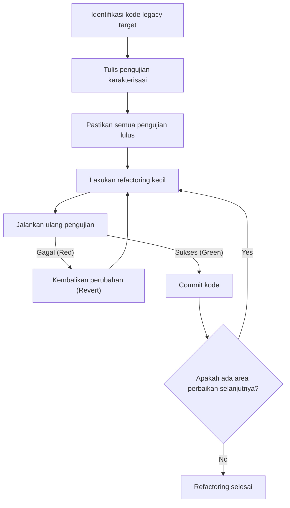
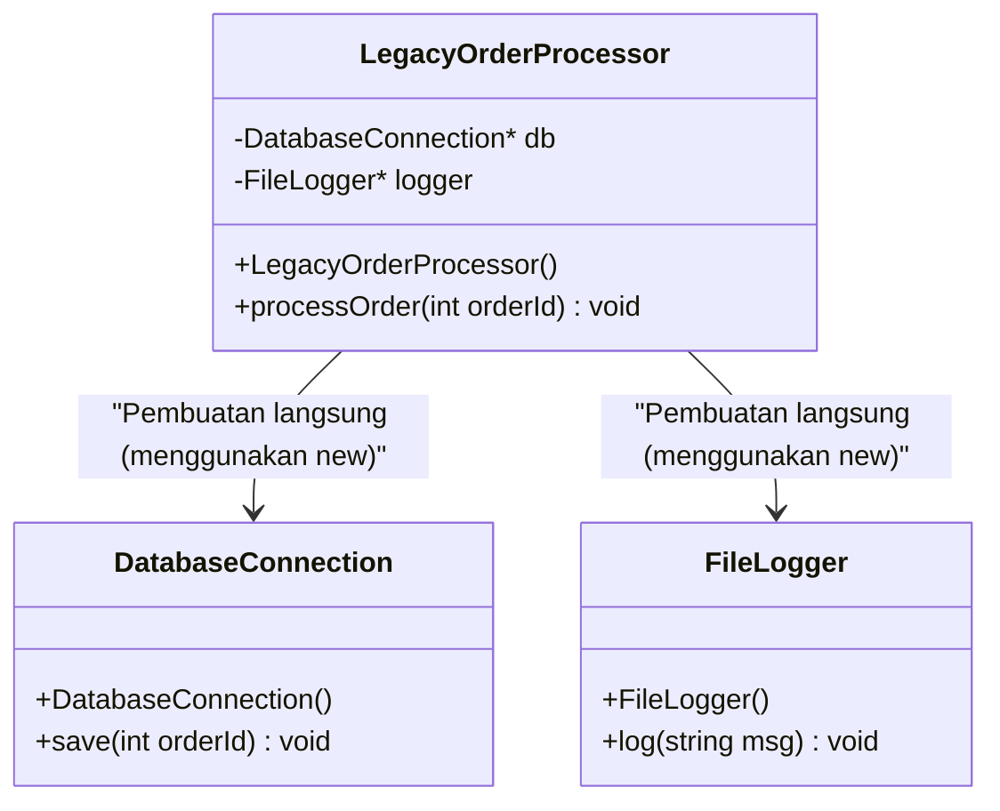
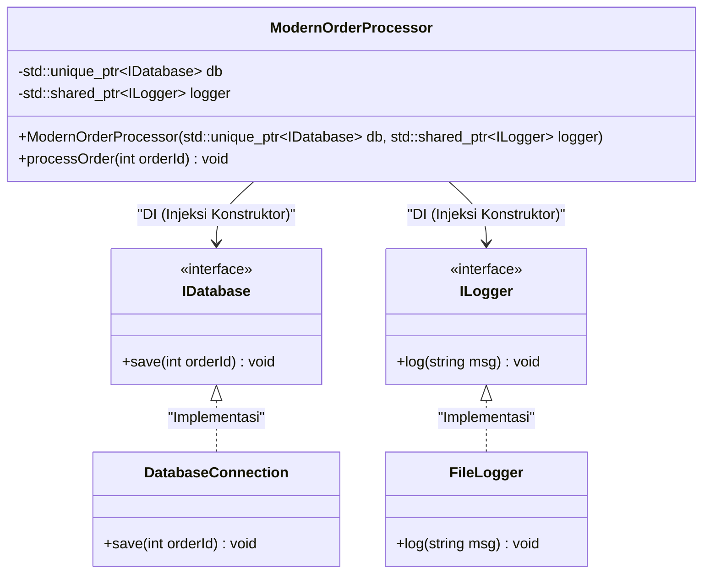

# Rahasia Refactoring: Memperbaiki Kode C++ Legacy dengan Aman

Dalam pengembangan perangkat lunak modern, pertempuran melawan "kode legacy" adalah jalan yang tidak bisa dihindari. Khususnya dalam bahasa C++, kode legacy memiliki ancaman yang tidak sebanding dengan bahasa lain. Manajemen memori manual (badai pointer mentah dan `new` / `delete`), penyalahgunaan variabel global, kurangnya keamanan pengecualian (exception safety), dan yang terpenting, fakta bahwa "tidak ada pengujian". Michael Feathers dengan tegas menyatakan dalam buku terkenalnya "Working Effectively with Legacy Code", "Kode tanpa pengujian adalah kode legacy".

Artikel ini akan membahas secara menyeluruh rahasia, baik dari sisi teori maupun praktik, untuk secara aman dan pasti memigrasikan basis kode C++ legacy yang telah terakumulasi selama beberapa dekade ke Modern C++ (C++11/14/17/20) dan melakukan refactoring. Mulai dari model matematika dari utang teknis (technical debt), pemisahan dependensi secara aman, hingga pembersihan kode menggunakan fitur bahasa modern, kami akan membahas pendekatan praktis secara lengkap.

---

## 1. Kompleksitas dan Model Matematika Utang Teknis

Untuk membenarkan refactoring, kita perlu mengukur masalah yang dimiliki basis kode saat ini. Indikator paling umum untuk mengukur kompleksitas struktural kode adalah "Kompleksitas Siklomatik (Cyclomatic Complexity)". Kompleksitas ini didefinisikan oleh rumus berikut berdasarkan teori graf dari grafik aliran kontrol (control flow graph).

$$ M = E - N + 2P $$

Di mana,
- $M$ adalah kompleksitas siklomatik
- $E$ adalah jumlah edge (aliran proses, transisi) dalam graf
- $N$ adalah jumlah node (blok dasar proses) dalam graf
- $P$ adalah jumlah komponen yang terhubung (biasanya $P=1$ untuk fungsi atau metode tunggal)

Semakin besar kompleksitas $M$, jumlah kasus uji yang diperlukan untuk menguji fungsi tersebut secara komprehensif meningkat secara linier, atau bahkan secara eksponensial tergantung pada kombinasi percabangan kondisi. Lebih lanjut, terdapat aturan empiris bahwa probabilitas terjadinya bug, $P(bug)$, meningkat secara eksponensial terhadap kompleksitas $M$. Memodelkan ini dalam bentuk yang mirip dengan distribusi Poisson akan terlihat seperti berikut:

$$ P(bug) = 1 - e^{-\lambda \cdot M} $$

(Di sini $\lambda$ adalah konstanta yang bergantung pada keahlian tim pengembang dan tingkat kesulitan domain.)

Selain itu, biaya utang teknis meningkat dengan bunga majemuk. Jika utang teknis awal adalah $C_0$, dan tingkat bunga per iterasi (persentase penurunan produktivitas karena sulitnya mengubah kode) adalah $r$, maka biaya perbaikan $Cost(t)$ setelah periode $t$ dapat dinyatakan sebagai berikut:

$$ Cost(t) = C_0 \times (1 + r)^t $$

Rumus ini dengan jelas menunjukkan fakta kejam bahwa "membiarkan kode legacy akan mengakibatkan peningkatan biaya secara eksponensial seiring berjalannya waktu". Oleh karena itu, utang harus dibayar kembali (di-refactor) sejak dini.

---

## 2. Prinsip Mutlak Refactoring: "Test-First"

Ketakutan terbesar saat mengubah kode legacy adalah, "Apakah ini akan merusak perilaku normal yang sudah ada (menyebabkan regresi)?" Satu-satunya cara untuk menghilangkan ketakutan ini adalah dengan "pengujian otomatis (automated testing)".

Namun, kode legacy pada awalnya tidak memiliki pengujian. Di sinilah penerapan "Pengujian Karakterisasi (Characterization Test)" menjadi penting. Pengujian karakterisasi bukanlah pengujian tentang bagaimana sistem "seharusnya berperilaku", melainkan mencatat bagaimana sistem "berperilaku saat ini" apa adanya.

Diagram alur berikut menunjukkan siklus hidup refactoring yang aman.



Dengan menjalankan siklus ini, pengembang selalu dapat mengubah kode di atas jaring pengaman. Jika pengujian gagal, sangat penting untuk segera me-`Revert` (mengembalikan) tanpa menelusuri penyebabnya terlalu dalam.

---

## 3. Konsep "Jahitan (Seams)" yang Menciptakan Testabilitas

Ketika mencoba menambahkan pengujian pada kode legacy, dinding pertama yang dihadapi adalah "dependensi (dependencies)". Jika koneksi langsung ke database, komunikasi jaringan, akses sistem file yang di-hardcode, dll., digabungkan secara erat (tightly coupled), maka mustahil untuk menulis Pengujian Unit (Unit Test).

Di sinilah konsep "Jahitan (Seam)" muncul. Jahitan mengacu pada "tempat di mana perilaku sistem dapat diubah tanpa mengedit kode itu sendiri". Dalam C++, tiga jahitan utama berikut sering digunakan:

1. **Jahitan Objek (Object Seams)**: Polimorfisme menggunakan fungsi virtual (Virtual Functions).
2. **Jahitan Waktu Kompilasi (Compile-time Seams)**: Beralih menggunakan template (Templates) atau `#include`.
3. **Jahitan Waktu Tautan (Link-time Seams)**: Beralih file objek atau pustaka (library) yang ditautkan pada saat build.

Dengan memanfaatkan hal-hal ini, dependensi dapat diisolasi dengan mengganti modul lingkungan produksi dengan objek mock untuk lingkungan pengujian.

---

## 4. Mendobrak Penggabungan Erat: Injeksi Dependensi (Dependency Injection)

Injeksi Dependensi (DI: Dependency Injection) adalah pola (pattern) yang kuat untuk menarik tanggung jawab pembuatan objek dari dalam kelas ke luar.

Pertama, mari kita lihat desain kelas C++ legacy yang digabungkan secara erat.



Karena `LegacyOrderProcessor` ini secara langsung me-`new` `DatabaseConnection` dan `FileLogger` di dalam konstruktor, tidak ada jahitan untuk menggantinya dengan mock. Kita akan melakukan refactoring ini menjadi tergabung longgar (loosely coupled) menggunakan antarmuka (interface - kelas virtual murni).



### Contoh Kode Legacy (C++03)
```cpp
class LegacyOrderProcessor {
private:
    DatabaseConnection* db_;
    FileLogger* logger_;
public:
    LegacyOrderProcessor() {
        db_ = new DatabaseConnection("localhost", 3306);
        logger_ = new FileLogger("/var/log/app.log");
    }
    
    ~LegacyOrderProcessor() {
        delete db_;
        delete logger_;
    }
    
    void processOrder(int orderId) {
        // Proses...
        db_->save(orderId);
        logger_->log("Order processed");
    }
};
```

### Setelah Refactoring (Modern C++)
```cpp
// Definisi antarmuka (Jahitan Objek)
class IDatabase {
public:
    virtual ~IDatabase() = default;
    virtual void save(int orderId) = 0;
};

class ILogger {
public:
    virtual ~ILogger() = default;
    virtual void log(const std::string& msg) = 0;
};

// Desain untuk menyuntikkan dependensi dari luar
class ModernOrderProcessor {
private:
    std::unique_ptr<IDatabase> db_;
    std::shared_ptr<ILogger> logger_;
public:
    // Injeksi Konstruktor (Constructor Injection)
    ModernOrderProcessor(std::unique_ptr<IDatabase> db, std::shared_ptr<ILogger> logger)
        : db_(std::move(db)), logger_(std::move(logger)) {}
    
    void processOrder(int orderId) {
        db_->save(orderId);
        logger_->log("Order processed");
    }
};
```
Dengan mengubah desain seperti ini, objek mock dari `IDatabase` dapat dengan mudah dibuat menggunakan framework seperti Google Mock (gmock), dan Pengembangan Berbasis Pengujian (TDD - Test-Driven Development) menjadi memungkinkan.

---

## 5. Membongkar Variabel Global Iblis dan Singleton

Hal yang paling memusingkan dalam C++ legacy adalah variabel global dan penyalahgunaan "Pola Singleton (Singleton pattern)". Singleton sekilas tampak seperti pola desain yang nyaman, tetapi pada kenyataannya itu tidak lebih dari "variabel global yang bersembunyi di balik jubah berorientasi objek".

Keadaan (state) global berbagi keadaan antar kasus uji, sehingga membuat eksekusi pengujian secara paralel menjadi tidak mungkin dan menyebabkan pengujian tidak stabil (Flaky Tests) yang penyebabnya tidak diketahui.

Solusinya adalah dengan menghilangkan dependensi pada keadaan global implisit dan secara eksplisit melewatkan keadaan yang diperlukan sebagai argumen fungsi (parameterisasi). Ini disebut "meneruskan konteks (passing context)".

---

## 6. Modernisasi Manajemen Memori dan Esensi RAII

Kode di era C++98/03 tersebar dengan `new` dan `delete` di mana-mana, yang merupakan sarang kebocoran memori (memory leaks) dan pointer menjuntai (dangling pointers). Dalam Modern C++ (C++11 dan yang lebih baru), konsep **Kepemilikan (Ownership)** didukung pada tingkat bahasa, dan manajemen sumber daya yang aman menggunakan smart pointer telah menjadi standar.

### RAII (Resource Acquisition Is Initialization)
RAII adalah idiom paling penting dalam C++. Dengan mengikat akuisisi sumber daya ke inisialisasi objek (konstruktor) dan pembebasan sumber daya ke penghancuran objek (destruktor), ini memastikan bahwa sumber daya dibebaskan dengan aman saat keluar dari cakupan (scope).

Bahkan jika Pengecualian (Exceptions) terjadi, destruktor dari variabel lokal dipanggil secara otomatis selama proses stack unwinding, sehingga kebocoran sumber daya dapat dicegah.

**Sebelum (Kode legacy yang berbahaya)**
```cpp
void processFile(const char* filename) {
    FILE* file = fopen(filename, "r");
    if (!file) return;

    Data* data = new Data();
    if (!readData(file, data)) {
        delete data; // Sering terlupakan
        fclose(file); // Sering terlupakan
        return;
    }

    try {
        process(data);
    } catch (...) {
        delete data; // Menghindari kebocoran memori saat terjadi pengecualian
        fclose(file);
        throw;
    }

    delete data;
    fclose(file);
}
```

Kode ini mengharuskan pembebasan sumber daya secara manual di setiap percabangan aliran kontrol, menjadikannya struktur yang sangat rapuh.

**Sesudah (Memanfaatkan RAII dan smart pointer)**
```cpp
void processFile(const std::string& filename) {
    // std::ifstream mengelola file handle dengan RAII
    std::ifstream file(filename);
    if (!file.is_open()) return;

    // std::unique_ptr adalah pemilik tunggal (exclusive owner) yang mengelola memori heap dengan RAII
    auto data = std::make_unique<Data>();
    if (!readData(file, *data)) {
        return; // Dibebaskan secara otomatis saat keluar dari scope
    }

    // Bahkan jika pengecualian terjadi, destruktor dari unique_ptr dan ifstream
    // memastikan pembebasan sumber daya, sehingga aman (jaminan nol kebocoran memori)
    process(*data);
}
```

Melalui refactoring ini, jumlah kode berkurang secara drastis, tujuannya menjadi jelas, dan yang terpenting, keamanan pengecualian (Exception Safety) dijamin secara sempurna.

---

## 7. Peningkatan Daya Ekspresi Melalui Kelompok Fitur Modern C++

Dalam refactoring kode legacy, Anda harus memanfaatkan sepenuhnya manfaat yang datang bersama dengan pembaruan fitur bahasa.

### 7.1. Inferensi tipe dengan `auto`
Mengganti deskripsi redundan, seperti nama tipe iterator yang panjang, dengan `auto` akan meningkatkan keterbacaan (readability). Namun, praktik terbaiknya adalah tidak membuat semuanya menjadi `auto`, melainkan membatasinya pada kasus di mana "tipenya terbukti dengan sendirinya dengan melihat sisi kanan".

### 7.2. Perhitungan waktu kompilasi dengan `constexpr` dan `consteval`
Untuk mengurangi overhead saat waktu berjalan (runtime) dan mendeteksi kesalahan pada waktu kompilasi (compile-time), `constexpr` harus dimanfaatkan secara aktif.

```cpp
// Kode legacy (Macro atau perhitungan saat runtime)
#define MAX_BUFFER_SIZE 1024
const double PI = 3.1415926535;

double calculateCircleArea(double radius) {
    return PI * radius * radius;
}
```

```cpp
// Gaya Modern C++ (C++20 dan setelahnya)
constexpr std::size_t MaxBufferSize = 1024;
constexpr double Pi = 3.14159265358979323846;

// consteval yang menjamin bahwa perhitungan dapat dievaluasi saat kompilasi (C++20)
consteval double calculateCircleArea(double radius) {
    return Pi * radius * radius;
}

// Biaya eksekusi (runtime cost) adalah nol. Hasil konstanta disematkan langsung ke dalam biner pada waktu kompilasi.
constexpr double area = calculateCircleArea(10.0);
```

### 7.3. Atribut `[[nodiscard]]`
Untuk mencegah bug yang mengabaikan nilai kembalian fungsi (terutama kode kesalahan atau keadaan penting), atribut `[[nodiscard]]` ditambahkan. Ini menyebabkan kompiler mengeluarkan peringatan terhadap panggilan yang tidak menerima nilai kembalian.

```cpp
[[nodiscard]] bool initializeSystem(); // Melarang pengabaian nilai kembalian
```

---

## 8. Memanfaatkan Alat Otomatisasi dan Peningkatan Berkelanjutan

Memperbaiki basis kode legacy yang berskala besar secara manual adalah hal yang tidak realistis. Mendapatkan bantuan dari toolchain adalah jalan pintas menuju kesuksesan.

- **Clang-Tidy**: Linter dan alat analisis statis yang kuat untuk C++. Dengan mengaktifkan pemeriksaan berbasis `modernize-*`, ini dapat secara otomatis menerapkan (Fix-it) hal-hal seperti penerapan `auto`, penggantian ke `nullptr`, penambahan `override`, dll.
- **AddressSanitizer (ASan)**: Dengan memasukkannya sebagai opsi kompilasi (`-fsanitize=address`), ini secara akurat mengidentifikasi kebocoran memori atau buffer overrun selama runtime. Ini harus selalu diaktifkan saat menjalankan pengujian.
- **Membangun pipeline CI/CD**: Menggunakan GitHub Actions atau GitLab CI untuk menjalankan build, pengujian otomatis, dan analisis statis pada semua pull request (PR) guna mencegah masuknya utang teknis baru.

---

## 9. Kesimpulan

Refactoring kode C++ legacy tidak akan pernah selesai dalam semalam. Ini adalah pekerjaan yang rumit namun berani, layaknya melakukan prosedur pembedahan pada sebuah sistem.

Harap ingat langkah-langkah yang dijelaskan dalam artikel ini:
1. **Ukur kompleksitas dan buat strategi berdasarkan fakta**
2. **Temukan jahitan dan lindungi sistem dengan pengujian karakterisasi**
3. **Dobrak penggabungan yang erat melalui DI dan musnahkan keadaan global**
4. **Hilangkan kekhawatiran tentang manajemen memori dengan RAII dan smart pointer**
5. **Manfaatkan fitur Modern C++ dan biarkan kompiler melakukan pekerjaan itu**

Dengan semangat "Aturan Pramuka (Tinggalkan tempat perkemahan lebih bersih daripada saat Anda menemukannya)" dan terus meningkatkan kode sedikit demi sedikit namun pasti dalam tugas pengembangan sehari-hari adalah rahasia sesungguhnya dari refactoring.
