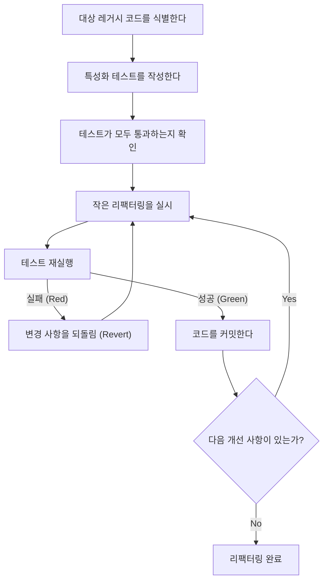
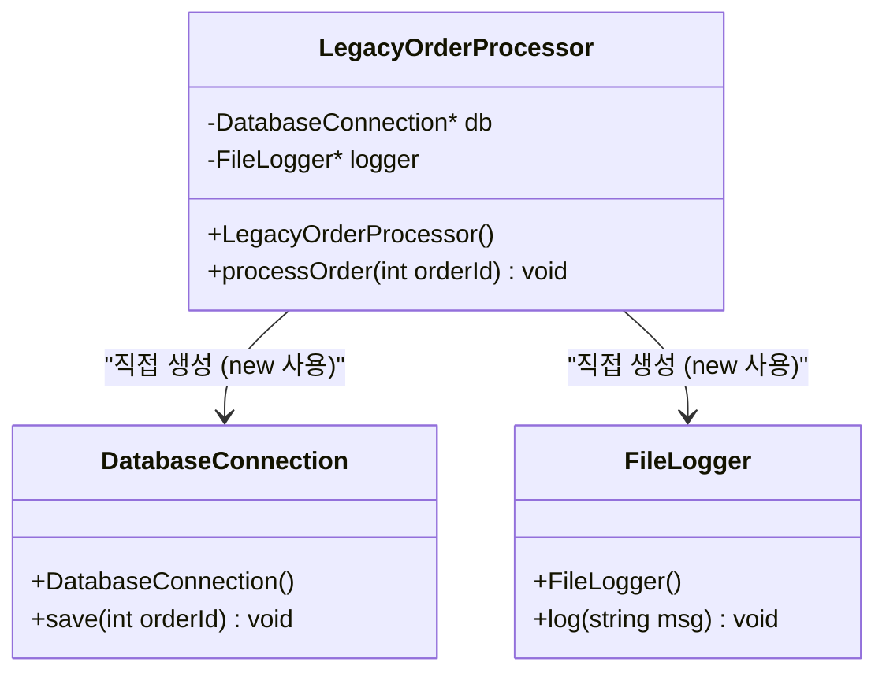
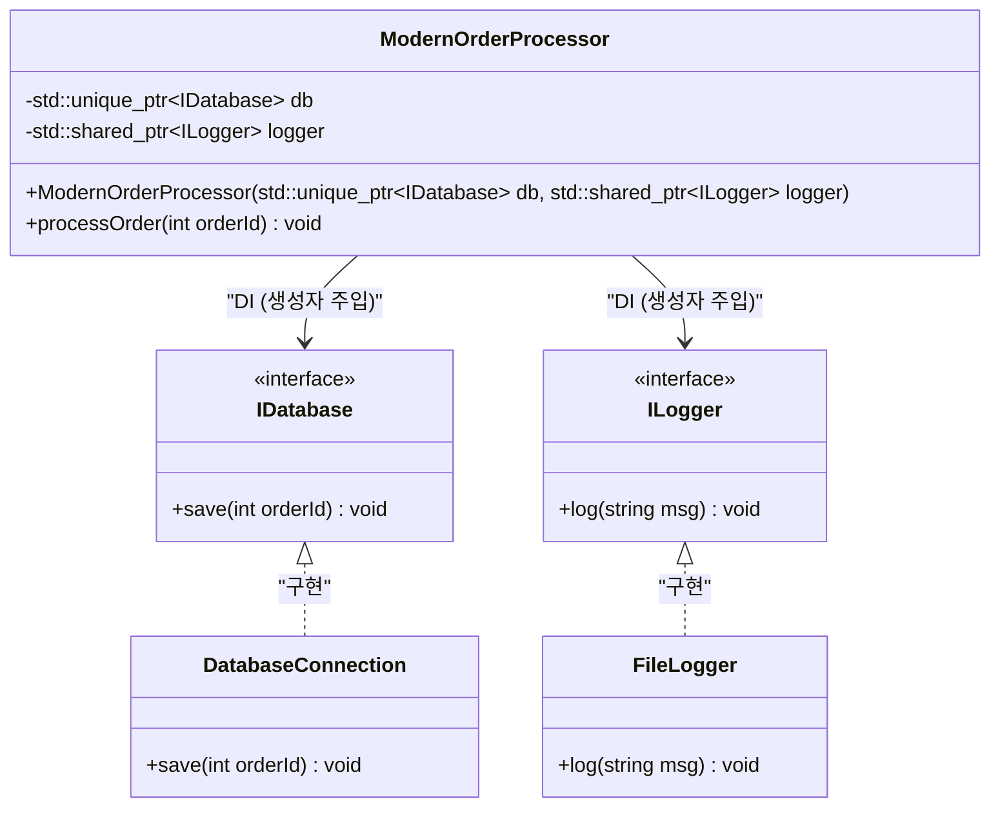

# 리팩터링의 비결: 레거시 C++ 코드를 안전하게 개선하기

현대의 소프트웨어 개발에서 '레거시 코드'와의 싸움은 피할 수 없는 길입니다. 특히 C++라는 언어에서 레거시 코드는 다른 언어의 그것과는 비교할 수 없을 정도의 위협을 가집니다. 수동 메모리 관리(원시 포인터와 `new` / `delete`의 폭풍), 전역 변수의 남용, 예외 안전성의 결여, 그리고 무엇보다 '테스트가 없다'는 사실. 마이클 페더스는 그의 명저 『레거시 코드 활용 전략(Working Effectively with Legacy Code)』에서 "테스트가 없는 코드는 레거시 코드이다"라고 단언했습니다.

이 글에서는 수십 년에 걸쳐 축적된 레거시 C++ 코드베이스를 안전하고 확실하게 Modern C++ (C++11/14/17/20)로 마이그레이션하고 리팩터링하기 위한 비결을 이론과 실제 양면에서 철저하게 해설합니다. 기술 부채의 수학적 모델에서 시작하여 안전한 의존성 분리, 그리고 모던한 언어 기능을 사용한 코드 정화까지 실용적인 접근 방식을 망라합니다.

---

## 1. 복잡도와 기술 부채의 수학적 모델

리팩터링을 정당화하려면 현재 코드베이스가 안고 있는 문제를 정량화해야 합니다. 코드의 구조적인 복잡성을 측정하는 지표로서 가장 일반적인 것이 '순환 복잡도(Cyclomatic Complexity)'입니다. 이 복잡도는 제어 흐름 그래프의 그래프 이론에 기초하여 다음 수식으로 정의됩니다.

$$ M = E - N + 2P $$

여기서,
- $M$ 은 순환 복잡도
- $E$ 는 그래프의 엣지(처리 흐름, 전이)의 수
- $N$ 은 그래프의 노드(처리의 기본 블록)의 수
- $P$ 는 연결 요소의 수(보통 단일 함수나 메서드에서는 $P=1$)

복잡도 $M$ 이 커질수록 해당 함수를 포괄적으로 테스트하는 데 필요한 테스트 케이스의 수는 선형적으로, 혹은 조건 분기의 조합에 따라 지수 함수적으로 증가합니다. 또한 버그 발생 확률 $P(bug)$ 는 복잡도 $M$ 에 대해 지수 함수적으로 증가한다는 경험 법칙이 있습니다. 이를 포아송 분포와 비슷한 형태로 모델화하면 다음과 같습니다.

$$ P(bug) = 1 - e^{-\lambda \cdot M} $$

(여기서 $\lambda$ 는 개발 팀의 기술이나 도메인의 난이도에 의존하는 상수입니다.)

또한 기술 부채의 비용은 복리로 증대됩니다. 초기의 기술 부채를 $C_0$, 반복(Iteration)별 이자율(코드의 변경 어려움으로 인한 생산성 저하 비율)을 $r$ 이라고 했을 때, $t$ 기간 후의 개수(수정) 비용 $Cost(t)$ 는 다음과 같이 표현할 수 있습니다.

$$ Cost(t) = C_0 \times (1 + r)^t $$

이 수식이 명확하게 보여주는 것은 "레거시 코드의 방치는 시간 경과와 함께 지수 함수적인 비용 증대를 초래한다"는 잔혹한 사실입니다. 따라서 부채는 조기에 상환(리팩터링)할 필요가 있는 것입니다.

---

## 2. 리팩터링의 절대 원칙: '테스트 퍼스트'

레거시 코드를 변경할 때 가장 두려운 점은 '기존의 정상적인 동작을 망가뜨리는(회귀 버그를 일으키는) 것은 아닐까' 하는 점에 있습니다. 이 두려움을 불식시킬 유일한 방법이 '자동화된 테스트'입니다.

그러나 레거시 코드에는 애초에 테스트가 없습니다. 그래서 중요해지는 것이 '특성화 테스트(Characterization Test)'의 도입입니다. 특성화 테스트란, 시스템이 '본래 어떻게 동작해야 하는가'가 아니라, '현재 어떻게 동작하고 있는가'를 있는 그대로 기록하는 테스트를 말합니다.

다음 순서도는 안전한 리팩터링의 수명 주기를 보여줍니다.



이 사이클을 돌림으로써 개발자는 항상 안전망 위에서 코드를 변경할 수 있습니다. 테스트가 실패한 경우 원인을 깊게 파고들지 않고 즉시 `Revert`(원상 복구)하는 것이 중요합니다.

---

## 3. 테스트 가능성을 창출하는 '이음새(Seams)'의 개념

레거시 코드에 테스트 추가를 시도할 때 가장 먼저 직면하는 장벽이 '의존성'입니다. 데이터베이스에 대한 직접 연결, 네트워크 통신, 하드코딩된 파일 시스템에 대한 액세스 등이 단단히 결합되어 있으면 단위 테스트(Unit Test)를 작성하는 것이 불가능합니다.

여기서 등장하는 것이 '이음새(Seam)'라는 개념입니다. 이음새란 '코드 자체를 편집하지 않고도 시스템의 동작을 변경할 수 있는 위치'를 가리킵니다. C++에서는 주로 다음의 3가지 이음새를 이용합니다.

1. **객체 이음새 (Object Seams)**: 가상 함수 (Virtual Functions)를 이용한 다형성.
2. **컴파일 시점 이음새 (Compile-time Seams)**: 템플릿 (Templates)이나 `#include`의 전환.
3. **링크 시점 이음새 (Link-time Seams)**: 빌드 시 링크하는 라이브러리나 객체 파일의 전환.

이들을 구사하여 프로덕션 환경의 모듈을 테스트 환경용 모의(Mock) 객체로 바꿔치기함으로써 의존성을 격리합니다.

---

## 4. 강결합의 타파: 의존성 주입 (Dependency Injection)

의존성 주입(DI: Dependency Injection)은 객체의 생성 책임을 클래스 내부에서 외부로 떼어내기 위한 강력한 패턴입니다.

먼저, 레거시하고 강하게 결합된 C++의 클래스 설계를 살펴보겠습니다.



이 `LegacyOrderProcessor`는 생성자 내에서 `DatabaseConnection`이나 `FileLogger`를 직접 `new`하고 있기 때문에 모의 객체로 교체할 이음새가 존재하지 않습니다. 이를 인터페이스(순수 가상 클래스)를 사용하여 느슨한 결합으로 리팩터링합니다.



### 레거시 코드의 예 (C++03)
```cpp
class LegacyOrderProcessor {
private:
    DatabaseConnection* db_;
    FileLogger* logger_;
public:
    LegacyOrderProcessor() {
        db_ = new DatabaseConnection("localhost", 3306);
        logger_ = new FileLogger("/var/log/app.log");
    }
    
    ~LegacyOrderProcessor() {
        delete db_;
        delete logger_;
    }
    
    void processOrder(int orderId) {
        // 처리...
        db_->save(orderId);
        logger_->log("Order processed");
    }
};
```

### 리팩터링 후 (Modern C++)
```cpp
// 인터페이스 정의 (객체 이음새)
class IDatabase {
public:
    virtual ~IDatabase() = default;
    virtual void save(int orderId) = 0;
};

class ILogger {
public:
    virtual ~ILogger() = default;
    virtual void log(const std::string& msg) = 0;
};

// 의존성을 외부에서 주입하는 설계
class ModernOrderProcessor {
private:
    std::unique_ptr<IDatabase> db_;
    std::shared_ptr<ILogger> logger_;
public:
    // 생성자 주입 (Constructor Injection)
    ModernOrderProcessor(std::unique_ptr<IDatabase> db, std::shared_ptr<ILogger> logger)
        : db_(std::move(db)), logger_(std::move(logger)) {}
    
    void processOrder(int orderId) {
        db_->save(orderId);
        logger_->log("Order processed");
    }
};
```
이와 같이 설계를 고침으로써, Google Mock (gmock) 등의 프레임워크를 사용하여 `IDatabase`의 모의 객체를 쉽게 작성할 수 있어 테스트 주도 개발(TDD)이 가능해집니다.

---

## 5. 마의 전역 변수와 싱글톤의 해체

레거시 C++에서 가장 골치를 앓는 것이 전역 변수와 '싱글톤(Singleton) 패턴'의 남용입니다. 싱글톤은 언뜻 보기에 편리한 디자인 패턴처럼 보이지만, 실상은 '객체 지향의 탈을 쓴 전역 변수'에 지나지 않습니다.

전역 상태는 테스트 케이스 간에 상태를 공유해 버리기 때문에 테스트의 병렬 실행을 불가능하게 하고, 원인을 알 수 없는 불안정한 테스트(Flaky Tests)를 유발합니다.

해결책은 암묵적인 전역 상태에 대한 의존성을 배제하고, 필요한 상태를 함수의 인수로 명시적으로 전달하는 것(매개변수화)입니다. 이를 '컨텍스트 전달'이라고 부릅니다.

---

## 6. 메모리 관리의 현대화와 RAII의 진수

C++98/03 시절의 코드는 `new`와 `delete`가 코드 곳곳에 흩어져 있어 메모리 누수나 댕글링 포인터의 온상이 되고 있습니다. Modern C++ (C++11 이후)에서는 **소유권 (Ownership)** 의 개념이 언어 수준에서 지원되어, 스마트 포인터를 사용한 안전한 리소스 관리가 표준이 되었습니다.

### RAII (Resource Acquisition Is Initialization)
RAII는 C++에서 가장 중요한 관용구(Idiom)입니다. 리소스의 확보를 객체의 초기화(생성자)와 결부시키고, 리소스의 해제를 객체의 파괴(소멸자)와 결부시킴으로써, 스코프를 벗어날 때 확실하게 리소스가 해제되는 것을 보장합니다.

예외(Exceptions)가 발생한 경우라도 스택 언와인딩(Stack Unwinding) 과정에서 지역 변수의 소멸자가 자동으로 호출되므로 리소스 누수를 방지할 수 있습니다.

**Before (위험한 레거시 코드)**
```cpp
void processFile(const char* filename) {
    FILE* file = fopen(filename, "r");
    if (!file) return;

    Data* data = new Data();
    if (!readData(file, data)) {
        delete data; // 잊기 쉬움
        fclose(file); // 잊기 쉬움
        return;
    }

    try {
        process(data);
    } catch (...) {
        delete data; // 예외 발생 시 메모리 누수 회피
        fclose(file);
        throw;
    }

    delete data;
    fclose(file);
}
```

이 코드는 제어 흐름의 모든 분기에서 수동으로 리소스를 해제해야 하므로 매우 취약한 구조입니다.

**After (RAII와 스마트 포인터의 활용)**
```cpp
void processFile(const std::string& filename) {
    // std::ifstream은 파일 핸들을 RAII로 관리한다
    std::ifstream file(filename);
    if (!file.is_open()) return;

    // std::unique_ptr은 힙 메모리를 RAII로 관리하는 독점적 소유자
    auto data = std::make_unique<Data>();
    if (!readData(file, *data)) {
        return; // 스코프를 벗어나는 시점에 자동으로 해제된다
    }

    // 예외가 발생하더라도 unique_ptr과 ifstream의 소멸자가
    // 확실하게 리소스를 해제하므로 안전하다 (메모리 누수 제로 보장)
    process(*data);
}
```

이 리팩터링을 통해 코드 양은 대폭 감소하고 의도도 명확해지며, 무엇보다 예외 안전성(Exception Safety)이 완벽하게 보장되게 되었습니다.

---

## 7. Modern C++ 기능군에 의한 표현력 향상

레거시 코드의 리팩터링에서는 언어 기능의 업데이트에 따른 혜택을 적극적으로 활용해야 합니다.

### 7.1. `auto` 를 통한 타입 추론
긴 반복자의 타입명 등 장황한 기술을 `auto`로 대체함으로써 가독성이 향상됩니다. 그러나 무조건 `auto`로 하는 것이 아니라, '우변을 보면 타입이 자명한 경우'로 한정하는 것이 모범 사례입니다.

### 7.2. `constexpr` 와 `consteval` 에 의한 컴파일 시점 계산
실행 시의 오버헤드를 줄이고 컴파일 시점에 오류를 검출하기 위해 `constexpr`을 적극적으로 활용합니다.

```cpp
// 레거시 코드 (매크로나 실행 시 계산)
#define MAX_BUFFER_SIZE 1024
const double PI = 3.1415926535;

double calculateCircleArea(double radius) {
    return PI * radius * radius;
}
```

```cpp
// Modern C++ (C++20 이후) 의 스타일
constexpr std::size_t MaxBufferSize = 1024;
constexpr double Pi = 3.14159265358979323846;

// 컴파일 시점에 평가 가능함을 보장하는 consteval (C++20)
consteval double calculateCircleArea(double radius) {
    return Pi * radius * radius;
}

// 실행 시의 비용은 제로. 컴파일 시점에 결과 상수가 직접 바이너리에 내장된다.
constexpr double area = calculateCircleArea(10.0);
```

### 7.3. `[[nodiscard]]` 속성
함수의 반환값(특히 에러 코드나 중요한 상태)을 무시해 버리는 버그를 방지하기 위해 `[[nodiscard]]` 속성을 부여합니다. 이를 통해 반환값을 받지 않는 호출에 대해 컴파일러가 경고를 발생시킵니다.

```cpp
[[nodiscard]] bool initializeSystem(); // 반환값 무시를 금지한다
```

---

## 8. 자동화 도구의 활용과 지속적인 개선

대규모 레거시 코드베이스를 수작업으로 수정하는 것은 비현실적입니다. 툴체인의 힘을 빌리는 것이 성공으로 가는 지름길이 됩니다.

- **Clang-Tidy**: 강력한 C++용 린터 및 정적 분석 도구. `modernize-*` 계열의 검사를 활성화하여 `auto`의 적용, `nullptr`로의 대체, `override` 부여 등을 자동으로 적용(Fix-it)해 줍니다.
- **AddressSanitizer (ASan)**: 컴파일 옵션(`-fsanitize=address`)으로 통합하여 실행 시의 메모리 누수나 버퍼 오버런을 정확하게 식별합니다. 테스트 실행 시에는 반드시 활성화해야 합니다.
- **CI/CD 파이프라인 구축**: GitHub Actions나 GitLab CI를 사용하여 모든 풀 리퀘스트에 대해 빌드와 자동 테스트, 정적 분석을 실행하고 새로운 기술 부채의 유입을 방지합니다.

---

## 9. 결론

레거시 C++ 코드의 리팩터링은 결코 하루아침에 완료되는 것이 아닙니다. 그것은 시스템에 외과 수술을 하는 것과 같은, 섬세하고 대담한 작업입니다.

이 글에서 해설한 다음의 단계들을 마음속에 새겨두십시오.
1. **복잡도를 측정하고, 사실에 근거하여 전략을 세운다**
2. **이음새를 찾아내고, 특성화 테스트로 시스템을 보호한다**
3. **DI를 통해 강결합을 타파하고, 전역 상태를 근절한다**
4. **RAII와 스마트 포인터를 통해 메모리 관리에 대한 불안을 제거한다**
5. **Modern C++의 기능을 활용하여, 컴파일러가 일을 하게 한다**

'보이스카우트 규칙(캠프장을 왔을 때보다 더 깨끗하게 하고 떠난다)'의 정신을 갖고, 일상적인 개발 작업 속에서 조금씩 그러나 착실하게 코드를 계속 개선하는 것이 리팩터링의 진정한 비결입니다.
