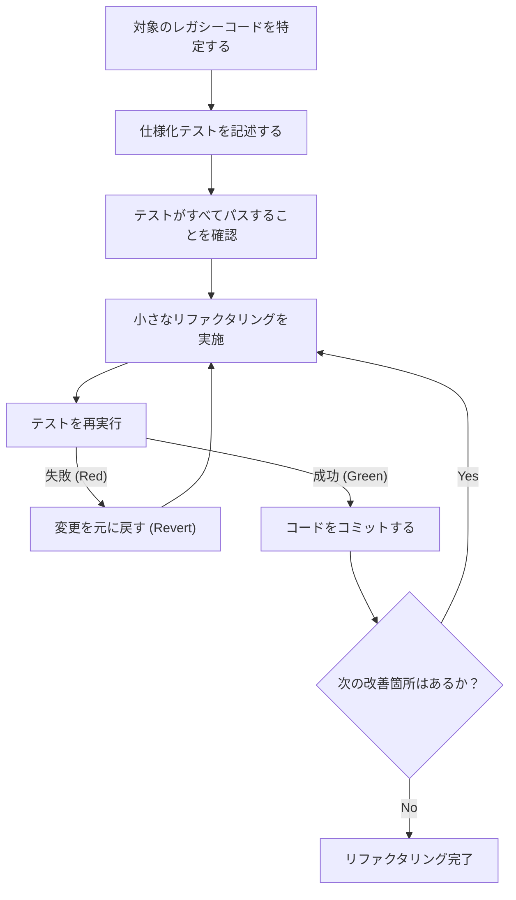
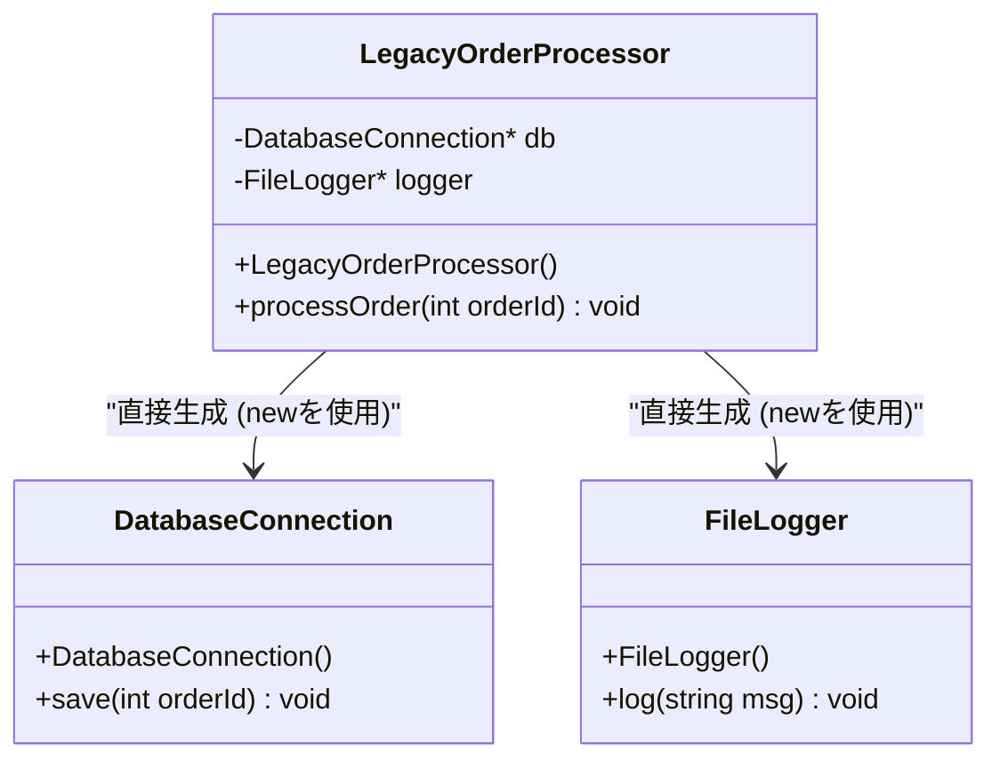
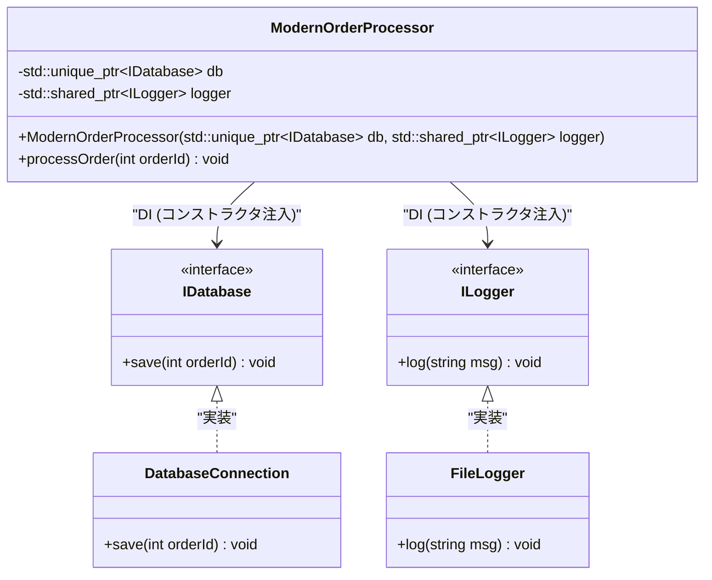

# リファクタリングの極意：レガシーなC++コードを安全に改善する

現代のソフトウェア開発において、「レガシーコード」との戦いは避けて通れない道です。特にC++という言語において、レガシーコードは他言語のそれとは比較にならないほどの脅威を持ちます。手動でのメモリ管理（生ポインタと `new` / `delete` の嵐）、グローバル変数の乱用、例外安全性の欠如、そして何より「テストがない」という事実。マイケル・フェザーズは名著『レガシーコード改善ガイド』の中で、「テストのないコードはレガシーコードである」と断言しました。

本記事では、数十年にわたって蓄積されたレガシーなC++コードベースを、安全かつ確実にModern C++ (C++11/14/17/20) へと移行し、リファクタリングするための極意を、理論と実践の両面から徹底的に解説します。技術的負債の数学的モデルから始まり、安全な依存関係の分離、そしてモダンな言語機能を用いたコードの浄化まで、実践的なアプローチを網羅します。

---

## 1. 複雑度と技術的負債の数学的モデル

リファクタリングを正当化するためには、現在のコードベースが抱える問題を定量化する必要があります。コードの構造的な複雑さを測る指標として最も一般的なのが「サイクロマティック複雑度（Cyclomatic Complexity）」です。この複雑度は、コントロールフローグラフのグラフ理論に基づいて以下の数式で定義されます。

$$ M = E - N + 2P $$

ここで、
- $M$ はサイクロマティック複雑度
- $E$ はグラフのエッジ（処理の流れ、遷移）の数
- $N$ はグラフのノード（処理の基本ブロック）の数
- $P$ は連結成分の数（通常、単一の関数やメソッドでは $P=1$）

複雑度 $M$ が大きくなるほど、その関数を網羅的にテストするために必要なテストケースの数は線形に、あるいは条件分岐の組み合わせによっては指数関数的に増加します。さらに、バグの発生確率 $P(bug)$ は、複雑度 $M$ に対して指数関数的に増加するという経験則があります。これをポアソン分布に似た形でモデル化すると、以下のようになります。

$$ P(bug) = 1 - e^{-\lambda \cdot M} $$

（ここで $\lambda$ は開発チームのスキルやドメインの難易度に依存する定数です。）

また、技術的負債のコストは複利的に増大します。初期の技術的負債を $C_0$、イテレーションごとの利子率（コードの変更しづらさによる生産性低下の割合）を $r$ とした場合、$t$ 期間後の改修コスト $Cost(t)$ は以下のように表せます。

$$ Cost(t) = C_0 \times (1 + r)^t $$

この数式が明確に示しているのは、「レガシーコードの放置は時間経過とともに指数関数的なコストの増大を招く」という残酷な事実です。したがって、負債は早期に返済（リファクタリング）する必要があるのです。

---

## 2. リファクタリングの絶対原則：「テストファースト」

レガシーコードを変更する際の最大の恐怖は、「既存の正常な動作を壊してしまう（デグレを起こす）のではないか」という点にあります。この恐怖を払拭する唯一の方法が「自動化されたテスト」です。

しかし、レガシーコードにはそもそもテストがありません。そこで重要になるのが「仕様化テスト (Characterization Test)」の導入です。仕様化テストとは、システムが「本来どう振る舞うべきか」ではなく、「現在どのように振る舞っているか」をそのまま記録するテストのことです。

以下のフローチャートは、安全なリファクタリングのライフサイクルを示しています。



このサイクルを回すことで、開発者は常にセーフティネットの上でコードを変更することができます。テストが失敗した場合は、原因を深追いせずに直ちに `Revert`（元に戻す）することが重要です。

---

## 3. テスト可能性を生み出す「接合部 (Seams)」の概念

レガシーコードにテストを追加しようとしたとき、最初に直面する壁が「依存関係」です。データベースへの直接接続、ネットワーク通信、ハードコードされたファイルシステムへのアクセスなどが密に結合していると、単体テスト（Unit Test）を書くことが不可能です。

ここで登場するのが「接合部 (Seam)」という概念です。接合部とは、「コードそのものを編集することなく、システムの振る舞いを変更できる場所」を指します。C++においては、主に以下の3つの接合部を利用します。

1. **オブジェクト接合部 (Object Seams)**: 仮想関数 (Virtual Functions) を利用したポリモーフィズム。
2. **コンパイル時接合部 (Compile-time Seams)**: テンプレート (Templates) や `#include` の切り替え。
3. **リンク時接合部 (Link-time Seams)**: ビルド時のリンクするライブラリやオブジェクトファイルの切り替え。

これらを駆使して、本番環境のモジュールをテスト環境用のモック (Mock) オブジェクトにすり替えることで、依存関係を隔離します。

---

## 4. 密結合の打破：依存性の注入 (Dependency Injection)

依存性の注入 (DI: Dependency Injection) は、オブジェクトの生成責任をクラス内部から外部へ引き剥がすための強力なパターンです。

まずは、レガシーで密結合なC++のクラス設計を見てみましょう。



この `LegacyOrderProcessor` は、コンストラクタ内で `DatabaseConnection` や `FileLogger` を直接 `new` しているため、モックに差し替える接合部が存在しません。これをインターフェース (純粋仮想クラス) を用いて疎結合にリファクタリングします。



### レガシーコードの例 (C++03)
```cpp
class LegacyOrderProcessor {
private:
    DatabaseConnection* db_;
    FileLogger* logger_;
public:
    LegacyOrderProcessor() {
        db_ = new DatabaseConnection("localhost", 3306);
        logger_ = new FileLogger("/var/log/app.log");
    }
    
    ~LegacyOrderProcessor() {
        delete db_;
        delete logger_;
    }
    
    void processOrder(int orderId) {
        // 処理...
        db_->save(orderId);
        logger_->log("Order processed");
    }
};
```

### リファクタリング後 (Modern C++)
```cpp
// インターフェースの定義 (オブジェクト接合部)
class IDatabase {
public:
    virtual ~IDatabase() = default;
    virtual void save(int orderId) = 0;
};

class ILogger {
public:
    virtual ~ILogger() = default;
    virtual void log(const std::string& msg) = 0;
};

// 依存関係を外部から注入する設計
class ModernOrderProcessor {
private:
    std::unique_ptr<IDatabase> db_;
    std::shared_ptr<ILogger> logger_;
public:
    // コンストラクタ注入 (Constructor Injection)
    ModernOrderProcessor(std::unique_ptr<IDatabase> db, std::shared_ptr<ILogger> logger)
        : db_(std::move(db)), logger_(std::move(logger)) {}
    
    void processOrder(int orderId) {
        db_->save(orderId);
        logger_->log("Order processed");
    }
};
```
このように設計を改めることで、Google Mock (gmock) などのフレームワークを用いて `IDatabase` のモックオブジェクトを容易に作成でき、テスト駆動開発 (TDD) が可能になります。

---

## 5. 魔のグローバル変数とシングルトンの解体

レガシーC++において最も頭を悩ませるのが、グローバル変数と「シングルトン (Singleton) パターン」の乱用です。シングルトンは一見すると便利なデザインパターンに思えますが、実態は「オブジェクト指向の皮を被ったグローバル変数」に過ぎません。

グローバルな状態は、テストケース間で状態を共有してしまうため、テストの並列実行を不可能にし、原因不明のフレイキーテスト (Flaky Tests) を引き起こします。

解決策は、暗黙的なグローバル状態への依存を排除し、必要な状態を関数の引数として明示的に渡すこと（パラメータ化）です。これを「コンテキストの受け渡し」と呼びます。

---

## 6. メモリ管理の近代化と RAII の真髄

C++98/03 時代のコードは、`new` と `delete` がコードの至る所に散らばっており、メモリリークやダングリングポインタの温床となっています。Modern C++ (C++11以降) では、**所有権 (Ownership)** の概念が言語レベルでサポートされ、スマートポインタを用いた安全なリソース管理が標準となりました。

### RAII (Resource Acquisition Is Initialization)
RAIIはC++における最も重要なイディオムです。リソースの確保をオブジェクトの初期化 (コンストラクタ) と結びつけ、リソースの解放をオブジェクトの破棄 (デストラクタ) と結びつけることで、スコープを抜ける際に確実にリソースが解放されることを保証します。

例外 (Exceptions) が発生した場合でも、スタックアンワインド (Stack Unwinding) のプロセスにおいてローカル変数のデストラクタが自動的に呼ばれるため、リソースリークを防ぐことができます。

**Before (危険なレガシーコード)**
```cpp
void processFile(const char* filename) {
    FILE* file = fopen(filename, "r");
    if (!file) return;

    Data* data = new Data();
    if (!readData(file, data)) {
        delete data; // 忘れがち
        fclose(file); // 忘れがち
        return;
    }

    try {
        process(data);
    } catch (...) {
        delete data; // 例外時のメモリリーク回避
        fclose(file);
        throw;
    }

    delete data;
    fclose(file);
}
```

このコードは、制御フローのあらゆる分岐で手動でリソースを解放しなければならず、極めて脆い構造です。

**After (RAIIとスマートポインタの活用)**
```cpp
void processFile(const std::string& filename) {
    // std::ifstreamはファイルハンドルをRAIIで管理する
    std::ifstream file(filename);
    if (!file.is_open()) return;

    // std::unique_ptrはヒープメモリをRAIIで管理する独占的オーナー
    auto data = std::make_unique<Data>();
    if (!readData(file, *data)) {
        return; // スコープを抜ける時点で自動的に解放される
    }

    // 例外が発生しても、unique_ptrとifstreamのデストラクタが
    // 確実にリソースを解放するため安全（メモリリークゼロの保証）
    process(*data);
}
```

このリファクタリングにより、コード量は大幅に減少し、意図も明確になり、何より例外安全 (Exception Safety) が完璧に保証されるようになりました。

---

## 7. Modern C++機能群による表現力の向上

レガシーコードのリファクタリングでは、言語機能のアップデートに伴う恩恵をフル活用すべきです。

### 7.1. `auto` による型推論
長いイテレータの型名など、冗長な記述を `auto` に置き換えることで可読性が向上します。しかし、何でも `auto` にするのではなく、「右辺を見れば型が自明な場合」に限定するのがベストプラクティスです。

### 7.2. `constexpr` と `consteval` によるコンパイル時計算
実行時のオーバーヘッドを削減し、コンパイル時にエラーを検出するために、`constexpr` を積極的に活用します。

```cpp
// レガシーコード（マクロや実行時計算）
#define MAX_BUFFER_SIZE 1024
const double PI = 3.1415926535;

double calculateCircleArea(double radius) {
    return PI * radius * radius;
}
```

```cpp
// Modern C++ (C++20以降) のスタイル
constexpr std::size_t MaxBufferSize = 1024;
constexpr double Pi = 3.14159265358979323846;

// コンパイル時に評価可能であることを保証する consteval (C++20)
consteval double calculateCircleArea(double radius) {
    return Pi * radius * radius;
}

// 実行時のコストはゼロ。コンパイル時に結果の定数が直接バイナリに埋め込まれる。
constexpr double area = calculateCircleArea(10.0);
```

### 7.3. `[[nodiscard]]` 属性
関数の戻り値（特にエラーコードや重要な状態）を無視してしまうバグを防ぐため、`[[nodiscard]]` 属性を付与します。これにより、戻り値を受け取らない呼び出しに対してコンパイラが警告を出します。

```cpp
[[nodiscard]] bool initializeSystem(); // 戻り値の無視を禁止する
```

---

## 8. 自動化ツールの活用と継続的改善

大規模なレガシーコードベースを手作業で修正するのは非現実的です。ツールチェーンの力を借りることが成功への近道となります。

- **Clang-Tidy**: 強力なC++用リンター・静的解析ツール。`modernize-*` 系のチェックを有効にすることで、`auto` の適用、`nullptr` への置換、`override` の付与などを自動的に適用 (Fix-it) してくれます。
- **AddressSanitizer (ASan)**: コンパイルオプション (`-fsanitize=address`) として組み込むことで、実行時のメモリリークやバッファオーバーランを正確に特定します。テスト実行時には必ず有効にすべきです。
- **CI/CDパイプラインの構築**: GitHub ActionsやGitLab CIを用いて、すべてのプルリクエストに対してビルドと自動テスト、静的解析を実行し、新たな技術的負債の侵入を防ぎます。

---

## 9. 結論

レガシーなC++コードのリファクタリングは、決して一朝一夕に完了するものではありません。それはシステムに外科手術を施すような、繊細かつ大胆な作業です。

本記事で解説した以下のステップを心に刻んでください。
1. **複雑度を計測し、事実に基づいて戦略を立てる**
2. **接合部を見つけ出し、仕様化テストでシステムを保護する**
3. **DIによって密結合を打破し、グローバル状態を根絶する**
4. **RAIIとスマートポインタによってメモリ管理の不安を取り除く**
5. **Modern C++の機能を活用し、コンパイラに仕事を行わせる**

「ボーイスカウトの規則（キャンプ場を来たときよりも綺麗にして去る）」の精神を持ち、日々の開発タスクの中で少しずつ、しかし着実にコードを改善し続けることが、リファクタリングの真の極意なのです。
