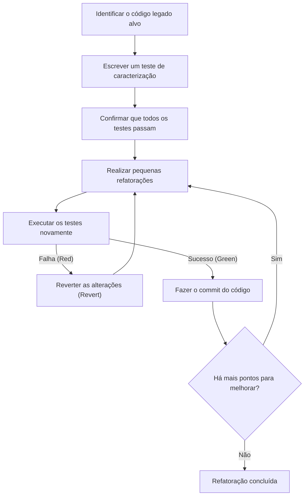
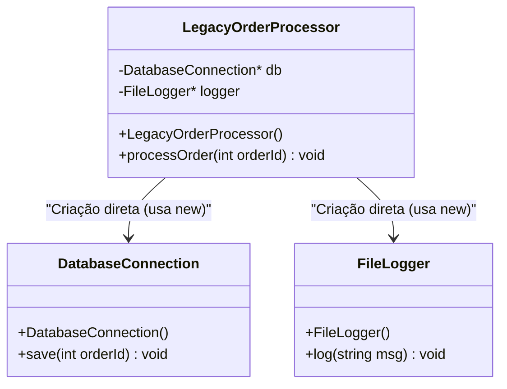
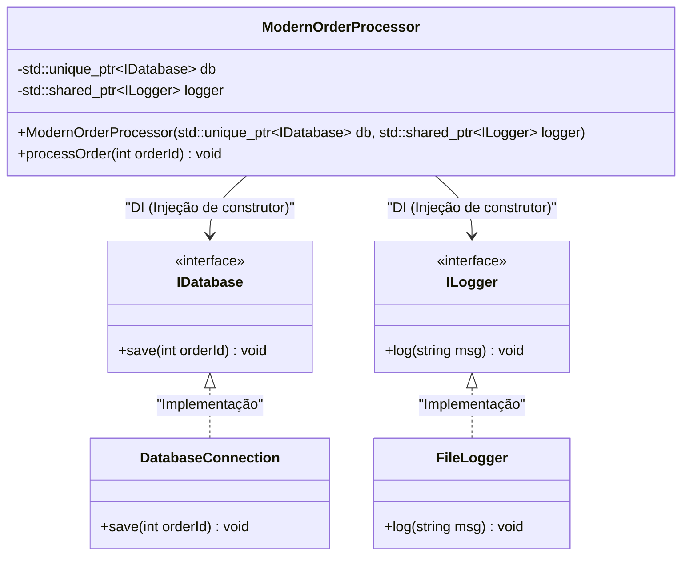

# A Arte da Refatoração: Melhorando Código C++ Legado com Segurança

Na moderna área de desenvolvimento de software, a batalha contra o "código legado" é inevitável. Especialmente na linguagem C++, o código legado representa uma ameaça incomparável à de outras linguagens. Gerenciamento de memória manual (uma tempestade de ponteiros brutos e `new` / `delete`), abuso de variáveis globais, falta de segurança contra exceções e, acima de tudo, o fato de que "não há testes". Em sua obra clássica "Working Effectively with Legacy Code" (Trabalhando Eficazmente com Código Legado), Michael Feathers declarou firmemente: "Código sem testes é código legado."

Neste artigo, explicaremos exaustivamente, tanto na teoria quanto na prática, os segredos para migrar e refatorar de forma segura e confiável uma base de código C++ legado, acumulada ao longo de décadas, para o C++ Moderno (C++11/14/17/20). Abrangeremos abordagens práticas, começando com o modelo matemático da dívida técnica, passando pela separação segura de dependências e terminando com a purificação do código usando recursos modernos da linguagem.

---

## 1. Complexidade e o Modelo Matemático da Dívida Técnica

Para justificar a refatoração, precisamos quantificar os problemas que a base de código atual enfrenta. A métrica mais comum para medir a complexidade estrutural do código é a "Complexidade Ciclomática (Cyclomatic Complexity)". Esta complexidade é definida pela seguinte fórmula baseada na teoria dos grafos de fluxo de controle:

$$ M = E - N + 2P $$

Onde:
- $M$ é a complexidade ciclomática
- $E$ é o número de arestas do grafo (fluxo de processamento, transições)
- $N$ é o número de nós do grafo (blocos básicos de processamento)
- $P$ é o número de componentes conectados (geralmente $P=1$ para uma única função ou método)

À medida que a complexidade $M$ aumenta, o número de casos de teste necessários para testar exaustivamente a função aumenta de forma linear, ou, dependendo da combinação de ramificações condicionais, de forma exponencial. Além disso, existe uma regra empírica de que a probabilidade de ocorrer um bug $P(bug)$ aumenta exponencialmente com a complexidade $M$. Se modelarmos isso em uma forma semelhante à distribuição de Poisson, ficaria assim:

$$ P(bug) = 1 - e^{-\lambda \cdot M} $$

(Onde $\lambda$ é uma constante dependente da habilidade da equipe de desenvolvimento ou da dificuldade do domínio.)

Além disso, o custo da dívida técnica cresce com juros compostos. Se a dívida técnica inicial for $C_0$ e a taxa de juros por iteração (a taxa de declínio da produtividade devido à dificuldade de alteração do código) for $r$, o custo de modificação $Cost(t)$ após o período $t$ pode ser expresso da seguinte forma:

$$ Cost(t) = C_0 \times (1 + r)^t $$

O que esta fórmula mostra claramente é a cruel realidade de que "ignorar o código legado leva a um aumento exponencial dos custos ao longo do tempo". Portanto, a dívida precisa ser paga (refatorada) precocemente.

---

## 2. A Regra Absoluta da Refatoração: "Test First" (Testes Primeiro)

O maior medo ao modificar código legado é: "Vou quebrar o comportamento normal existente (causar uma regressão)?". A única forma de eliminar esse medo são os "testes automatizados".

No entanto, o código legado não possui testes em primeiro lugar. É aqui que se torna importante a introdução dos "Testes de Caracterização (Characterization Tests)". Testes de caracterização são testes que registram o comportamento atual do sistema "exatamente como ele é", em vez de "como ele deveria se comportar originalmente".

O fluxograma a seguir mostra o ciclo de vida de uma refatoração segura.



Ao executar este ciclo, os desenvolvedores podem sempre modificar o código com uma rede de segurança. Se os testes falharem, é importante usar o `Revert` (reverter) imediatamente sem tentar encontrar a causa raiz.

---

## 3. O Conceito de "Costuras (Seams)" para Criar Testabilidade

A primeira barreira enfrentada ao tentar adicionar testes ao código legado são as "dependências". Conexões diretas a bancos de dados, comunicações de rede, acessos a sistemas de arquivos embutidos no código etc., quando fortemente acoplados, impossibilitam a escrita de testes unitários (Unit Tests).

É aqui que o conceito de "Costura (Seam)" entra em jogo. Uma costura refere-se a um "lugar onde você pode alterar o comportamento do sistema sem editar o código propriamente dito". Em C++, usamos principalmente as seguintes 3 costuras:

1. **Costuras de Objetos (Object Seams)**: Polimorfismo usando funções virtuais (Virtual Functions).
2. **Costuras de Tempo de Compilação (Compile-time Seams)**: Troca de Templates (Templates) ou inclusões (`#include`).
3. **Costuras de Tempo de Vinculação (Link-time Seams)**: Troca das bibliotecas ou arquivos de objeto vinculados durante a compilação.

Aproveitando essas costuras, substituímos os módulos do ambiente de produção por objetos simulados (Mocks) para ambientes de teste, isolando as dependências.

---

## 4. Quebrando o Forte Acoplamento: Injeção de Dependência (Dependency Injection)

A Injeção de Dependência (DI: Dependency Injection) é um padrão poderoso para separar a responsabilidade de criação de objetos do interior de uma classe para o exterior.

Primeiro, vejamos um design de classe em C++ que é legado e fortemente acoplado.



Este `LegacyOrderProcessor` cria diretamente `DatabaseConnection` e `FileLogger` usando `new` dentro de seu construtor, por isso não há costuras para substituí-los por mocks. Vamos refatorar isso para acoplamento fraco usando interfaces (classes puramente virtuais).



### Exemplo de Código Legado (C++03)
```cpp
class LegacyOrderProcessor {
private:
    DatabaseConnection* db_;
    FileLogger* logger_;
public:
    LegacyOrderProcessor() {
        db_ = new DatabaseConnection("localhost", 3306);
        logger_ = new FileLogger("/var/log/app.log");
    }
    
    ~LegacyOrderProcessor() {
        delete db_;
        delete logger_;
    }
    
    void processOrder(int orderId) {
        // Processamento...
        db_->save(orderId);
        logger_->log("Order processed");
    }
};
```

### Após a Refatoração (C++ Moderno)
```cpp
// Definição das interfaces (Costura de Objeto)
class IDatabase {
public:
    virtual ~IDatabase() = default;
    virtual void save(int orderId) = 0;
};

class ILogger {
public:
    virtual ~ILogger() = default;
    virtual void log(const std::string& msg) = 0;
};

// Design onde as dependências são injetadas externamente
class ModernOrderProcessor {
private:
    std::unique_ptr<IDatabase> db_;
    std::shared_ptr<ILogger> logger_;
public:
    // Injeção de Construtor (Constructor Injection)
    ModernOrderProcessor(std::unique_ptr<IDatabase> db, std::shared_ptr<ILogger> logger)
        : db_(std::move(db)), logger_(std::move(logger)) {}
    
    void processOrder(int orderId) {
        db_->save(orderId);
        logger_->log("Order processed");
    }
};
```
Melhorando o design desta forma, podemos criar facilmente objetos mock para `IDatabase` usando frameworks como Google Mock (gmock), tornando possível o Desenvolvimento Orientado a Testes (TDD).

---

## 5. O Desmantelamento das Terríveis Variáveis Globais e do Singleton

O que causa mais dores de cabeça no C++ legado é o uso excessivo de variáveis globais e do "padrão Singleton (Singleton pattern)". O Singleton pode parecer um padrão de design conveniente à primeira vista, mas, na realidade, não passa de uma "variável global disfarçada de orientação a objetos".

O estado global compartilha o estado entre os casos de teste, impossibilitando a execução de testes em paralelo e causando testes instáveis (Flaky Tests) de origem desconhecida.

A solução é eliminar a dependência implícita do estado global e passar explicitamente os estados necessários como argumentos de função (parametrização). Isso é chamado de "passagem de contexto".

---

## 6. A Modernização do Gerenciamento de Memória e a Essência de RAII

No código da era do C++98/03, `new` e `delete` estão espalhados por toda a base de código, servindo como um terreno fértil para vazamentos de memória (memory leaks) e ponteiros pendentes (dangling pointers). No C++ Moderno (C++11 e posterior), o conceito de **Propriedade (Ownership)** é suportado em nível de linguagem, e o gerenciamento seguro de recursos usando ponteiros inteligentes tornou-se o padrão.

### RAII (Resource Acquisition Is Initialization)
RAII é o idioma mais importante do C++. Ao associar a aquisição de recursos com a inicialização do objeto (construtor) e a liberação de recursos com a destruição do objeto (destrutor), garantimos que os recursos sejam invariavelmente liberados ao sair do escopo.

Mesmo se ocorrerem exceções (Exceptions), o destrutor das variáveis locais é chamado automaticamente durante o processo de desenrolar da pilha (Stack Unwinding), impedindo assim vazamentos de recursos.

**Antes (Código legado perigoso)**
```cpp
void processFile(const char* filename) {
    FILE* file = fopen(filename, "r");
    if (!file) return;

    Data* data = new Data();
    if (!readData(file, data)) {
        delete data; // Fácil de esquecer
        fclose(file); // Fácil de esquecer
        return;
    }

    try {
        process(data);
    } catch (...) {
        delete data; // Evitar memory leak na exceção
        fclose(file);
        throw;
    }

    delete data;
    fclose(file);
}
```

Neste código, os recursos devem ser liberados manualmente em cada ramificação do fluxo de controle, resultando em uma estrutura extremamente frágil.

**Depois (Utilização de RAII e Ponteiros Inteligentes)**
```cpp
void processFile(const std::string& filename) {
    // std::ifstream gerencia o handle do arquivo usando RAII
    std::ifstream file(filename);
    if (!file.is_open()) return;

    // std::unique_ptr é o proprietário exclusivo que gerencia a memória heap com RAII
    auto data = std::make_unique<Data>();
    if (!readData(file, *data)) {
        return; // Liberado automaticamente ao sair do escopo
    }

    // Mesmo se ocorrer uma exceção, os destrutores do unique_ptr e do ifstream
    // garantem que os recursos sejam liberados de forma segura (garantia de zero memory leaks)
    process(*data);
}
```

Através desta refatoração, a quantidade de código é drasticamente reduzida, a intenção torna-se clara e, acima de tudo, a segurança de exceção (Exception Safety) é perfeitamente garantida.

---

## 7. O Aumento da Expressividade com os Recursos do C++ Moderno

Na refatoração de código legado, devemos tirar o máximo proveito dos benefícios das atualizações das funcionalidades da linguagem.

### 7.1. Inferência de Tipos com `auto`
A legibilidade é melhorada ao substituir declarações redundantes, como nomes de tipos longos de iteradores, por `auto`. No entanto, a melhor prática é não transformar tudo em `auto`, mas limitá-lo a casos em que "o tipo é óbvio ao observar o lado direito".

### 7.2. Cálculos em Tempo de Compilação com `constexpr` e `consteval`
Usamos proativamente `constexpr` para reduzir a sobrecarga no tempo de execução e detectar erros em tempo de compilação.

```cpp
// Código legado (macros e cálculos em tempo de execução)
#define MAX_BUFFER_SIZE 1024
const double PI = 3.1415926535;

double calculateCircleArea(double radius) {
    return PI * radius * radius;
}
```

```cpp
// Estilo C++ Moderno (C++20 em diante)
constexpr std::size_t MaxBufferSize = 1024;
constexpr double Pi = 3.14159265358979323846;

// consteval garante que a função possa ser avaliada em tempo de compilação (C++20)
consteval double calculateCircleArea(double radius) {
    return Pi * radius * radius;
}

// Custo em tempo de execução nulo. A constante resultante é incorporada diretamente no binário durante a compilação.
constexpr double area = calculateCircleArea(10.0);
```

### 7.3. Atributo `[[nodiscard]]`
Para evitar bugs nos quais os valores de retorno das funções (especialmente códigos de erro e estados importantes) são ignorados, aplicamos o atributo `[[nodiscard]]`. Com isso, o compilador emitirá um aviso para chamadas de função onde o valor de retorno não é recebido.

```cpp
[[nodiscard]] bool initializeSystem(); // Proibir que o valor de retorno seja ignorado
```

---

## 8. Utilização de Ferramentas de Automação e Melhoria Contínua

Modificar uma grande base de código legado manualmente não é realista. Aproveitar o poder de cadeias de ferramentas (toolchains) é o caminho mais rápido para o sucesso.

- **Clang-Tidy**: Um poderoso linter e ferramenta de análise estática para C++. Ao habilitar as verificações do tipo `modernize-*`, ele pode aplicar automaticamente (Fix-it) a utilização de `auto`, substituições por `nullptr`, adições de `override`, entre outras coisas.
- **AddressSanitizer (ASan)**: Ao incluí-lo como uma opção de compilação (`-fsanitize=address`), ele identifica com precisão os vazamentos de memória e os buffer overruns (estouros de buffer) durante a execução. Ele deve estar sempre habilitado ao executar testes.
- **Construção de Pipelines CI/CD**: Usando GitHub Actions ou GitLab CI, executamos builds, testes automáticos e análise estática para todos os Pull Requests (solicitações de pull), evitando assim a introdução de novas dívidas técnicas.

---

## 9. Conclusão

A refatoração de um código C++ legado não é algo que se conclua da noite para o dia. É um trabalho delicado e arrojado, semelhante a realizar uma cirurgia em um sistema.

Lembre-se dos seguintes passos discutidos neste artigo:
1. **Medir a complexidade e construir uma estratégia com base em fatos**
2. **Descobrir as costuras e proteger o sistema com testes de caracterização**
3. **Quebrar o forte acoplamento usando DI e erradicar os estados globais**
4. **Remover a ansiedade do gerenciamento de memória usando RAII e ponteiros inteligentes**
5. **Fazer uso das funcionalidades do C++ Moderno e deixar o compilador trabalhar para você**

A verdadeira essência da refatoração é manter o espírito da "Regra do Escoteiro (deixe o acampamento mais limpo do que o encontrou)" e continuar melhorando o código, pouco a pouco, mas de maneira constante, durante suas tarefas de desenvolvimento diárias.
