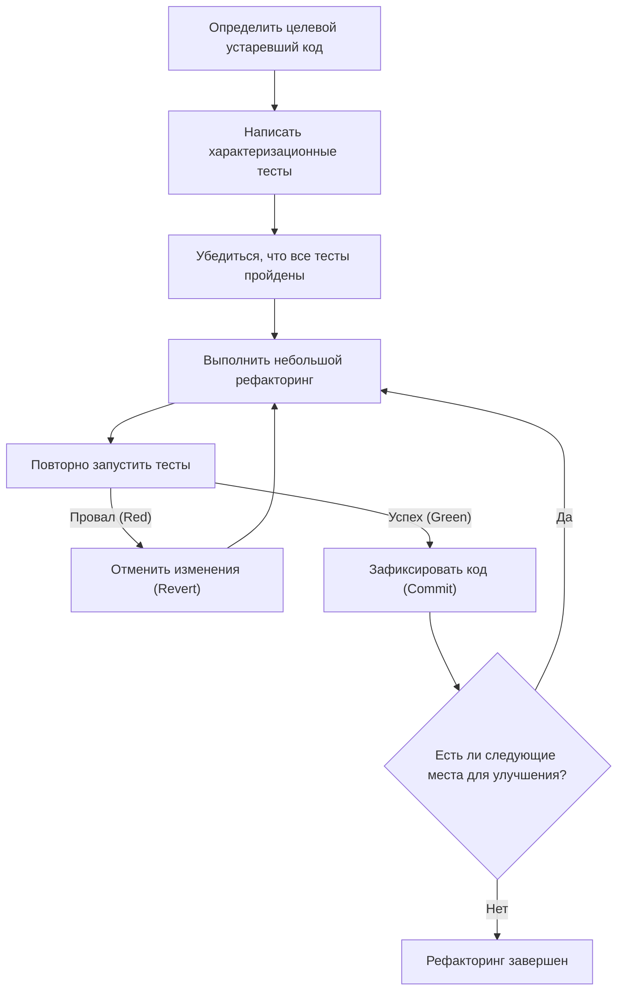
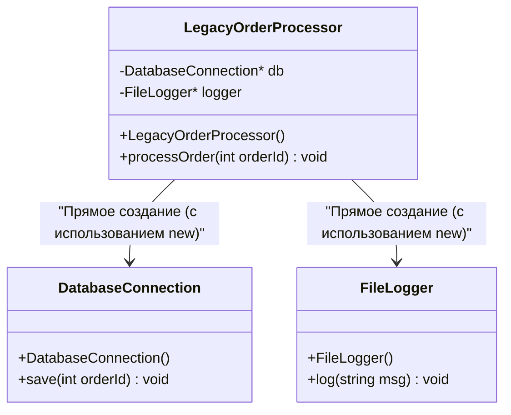
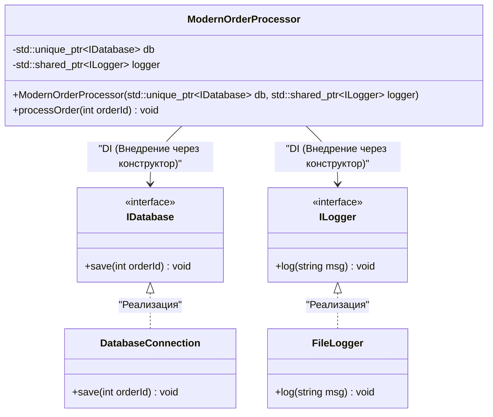

# Секреты рефакторинга: безопасное улучшение устаревшего кода C++

В современной разработке программного обеспечения битва с "устаревшим кодом" (legacy code) неизбежна. Особенно в таком языке, как C++, устаревший код представляет собой угрозу, несравнимую с другими языками. Ручное управление памятью (шторм сырых указателей и `new` / `delete`), злоупотребление глобальными переменными, отсутствие безопасности исключений и, что важнее всего, тот факт, что "нет тестов". Майкл Физерс в своей известной книге «Эффективная работа с унаследованным кодом» категорично заявил: «Код без тестов — это унаследованный (legacy) код».

В этой статье мы подробно и всесторонне, как с теоретической, так и с практической точек зрения, объясним секреты безопасного и надежного перехода базы устаревшего кода C++, накопленной десятилетиями, на Modern C++ (C++11/14/17/20) и ее рефакторинга. Мы охватим практические подходы, начиная с математических моделей технического долга, безопасного разделения зависимостей и заканчивая очисткой кода с использованием современных языковых функций.

---

## 1. Математическая модель сложности и технического долга

Чтобы оправдать рефакторинг, необходимо количественно оценить проблемы, присущие текущей кодовой базе. Наиболее распространенным показателем для измерения структурной сложности кода является "цикломатическая сложность" (Cyclomatic Complexity). Эта сложность определяется следующей формулой, основанной на теории графов для графа потока управления (control flow graph).

$$ M = E - N + 2P $$

Где:
- $M$ — цикломатическая сложность
- $E$ — количество ребер (потоков обработки, переходов) в графе
- $N$ — количество узлов (базовых блоков обработки) в графе
- $P$ — количество компонент связности (обычно для одной функции или метода $P=1$)

Чем больше сложность $M$, тем количество тестовых случаев, необходимых для исчерпывающего тестирования этой функции, увеличивается линейно или, в зависимости от комбинации условных ветвлений, экспоненциально. Кроме того, существует эмпирическое правило, согласно которому вероятность возникновения ошибки $P(bug)$ возрастает экспоненциально по отношению к сложности $M$. Если мы смоделируем это в форме, похожей на распределение Пуассона, получится следующее:

$$ P(bug) = 1 - e^{-\lambda \cdot M} $$

(Где $\lambda$ — это константа, зависящая от навыков команды разработчиков и сложности предметной области.)

Также стоимость технического долга растет по принципу сложных процентов. Если первоначальный технический долг равен $C_0$, а процентная ставка за итерацию (процент снижения производительности из-за сложности изменения кода) равна $r$, стоимость доработки $Cost(t)$ через $t$ периодов можно выразить следующим образом:

$$ Cost(t) = C_0 \times (1 + r)^t $$

Эта формула ясно демонстрирует жестокий факт: "игнорирование устаревшего кода приводит к экспоненциальному росту затрат с течением времени". Следовательно, долг необходимо погашать (рефакторить) на ранних этапах.

---

## 2. Абсолютный принцип рефакторинга: "Сначала тесты"

Самый большой страх при изменении устаревшего кода заключается в том: "А не сломаю ли я существующее нормальное поведение (не вызову ли регрессию)?". Единственный способ избавиться от этого страха — "автоматизированные тесты".

Однако в устаревшем коде тестов изначально нет. Здесь и становится важным внедрение "характеризационных тестов" (Characterization Test). Характеризационное тестирование — это тестирование, которое записывает не то, "как система должна вести себя в идеале", а "как она ведет себя в настоящее время" в точности так, как есть.

Следующая блок-схема показывает жизненный цикл безопасного рефакторинга.



Проходя этот цикл, разработчики всегда могут изменять код с помощью системы безопасности (страховочной сетки). Важно немедленно применять `Revert` (отменить), если тест не пройден, не вдаваясь слишком глубоко в причины.

---

## 3. Концепция "Швов" (Seams), создающих возможность тестирования

При попытке добавить тесты в устаревший код первая стена, с которой вы сталкиваетесь — это "зависимости". Прямые подключения к базам данных, сетевая связь, жестко закодированный доступ к файловой системе и т. д. — если они тесно связаны, написать модульные тесты (Unit Test) невозможно.

Здесь и появляется концепция "Шва" (Seam). Шов — это "место, где вы можете изменить поведение системы без редактирования самого кода". В C++ в основном используются следующие три типа швов:

1. **Объектные швы (Object Seams)**: Полиморфизм с использованием виртуальных функций (Virtual Functions).
2. **Швы времени компиляции (Compile-time Seams)**: Шаблоны (Templates) и переключение `#include`.
3. **Швы времени компоновки (Link-time Seams)**: Переключение библиотек или объектных файлов для компоновки во время сборки.

Используя их для замены модулей производственной среды на фиктивные объекты (Mock) для тестовой среды, мы изолируем зависимости.

---

## 4. Разрушение сильной связности: Внедрение зависимостей (Dependency Injection)

Внедрение зависимостей (DI: Dependency Injection) — это мощный паттерн для переноса ответственности за создание объектов изнутри класса наружу.

Во-первых, давайте посмотрим на архитектуру сильно связанного устаревшего класса C++.



Поскольку этот `LegacyOrderProcessor` напрямую вызывает `new` для `DatabaseConnection` и `FileLogger` внутри своего конструктора, не существует шва для замены их на мок-объекты. Мы проведем рефакторинг, чтобы сделать их слабо связанными с использованием интерфейсов (чисто абстрактных классов).



### Пример устаревшего кода (C++03)
```cpp
class LegacyOrderProcessor {
private:
    DatabaseConnection* db_;
    FileLogger* logger_;
public:
    LegacyOrderProcessor() {
        db_ = new DatabaseConnection("localhost", 3306);
        logger_ = new FileLogger("/var/log/app.log");
    }
    
    ~LegacyOrderProcessor() {
        delete db_;
        delete logger_;
    }
    
    void processOrder(int orderId) {
        // Обработка...
        db_->save(orderId);
        logger_->log("Order processed");
    }
};
```

### После рефакторинга (Modern C++)
```cpp
// Определение интерфейсов (Объектный шов)
class IDatabase {
public:
    virtual ~IDatabase() = default;
    virtual void save(int orderId) = 0;
};

class ILogger {
public:
    virtual ~ILogger() = default;
    virtual void log(const std::string& msg) = 0;
};

// Архитектура, в которой зависимости внедряются извне
class ModernOrderProcessor {
private:
    std::unique_ptr<IDatabase> db_;
    std::shared_ptr<ILogger> logger_;
public:
    // Внедрение через конструктор (Constructor Injection)
    ModernOrderProcessor(std::unique_ptr<IDatabase> db, std::shared_ptr<ILogger> logger)
        : db_(std::move(db)), logger_(std::move(logger)) {}
    
    void processOrder(int orderId) {
        db_->save(orderId);
        logger_->log("Order processed");
    }
};
```
Изменив дизайн таким образом, мы сможем легко создавать мок-объекты для `IDatabase` с помощью таких фреймворков, как Google Mock (gmock), что сделает возможной разработку через тестирование (TDD).

---

## 5. Демонтаж злополучных глобальных переменных и синглтонов

Что больше всего беспокоит в устаревшем C++, так это злоупотребление глобальными переменными и "паттерном Одиночка (Singleton)". На первый взгляд синглтон кажется удобным паттерном проектирования, но на самом деле это не более чем "глобальная переменная в шкуре объектно-ориентированного программирования".

Поскольку глобальное состояние является общим для тестовых случаев, оно делает параллельное выполнение тестов невозможным и вызывает нестабильные тесты (Flaky Tests) по неизвестным причинам.

Решение состоит в том, чтобы устранить неявные зависимости от глобального состояния и явно передавать необходимые состояния в качестве аргументов функций (параметризация). Это называется "передачей контекста".

---

## 6. Модернизация управления памятью и суть RAII

В коде эпохи C++98/03 `new` и `delete` разбросаны повсюду, становясь рассадником утечек памяти и висячих указателей. В Modern C++ (C++11 и новее) концепция **владения (Ownership)** поддерживается на уровне языка, и безопасное управление ресурсами с использованием умных указателей стало стандартом.

### RAII (Resource Acquisition Is Initialization)
RAII — важнейшая идиома в C++. Связывая захват ресурса с инициализацией объекта (конструктор), а освобождение ресурса — с разрушением объекта (деструктор), гарантируется, что ресурсы будут гарантированно освобождены при выходе из области видимости.

Даже при возникновении исключений (Exceptions), деструкторы локальных переменных вызываются автоматически в процессе развертывания стека (Stack Unwinding), что предотвращает утечки ресурсов.

**До (опасный устаревший код)**
```cpp
void processFile(const char* filename) {
    FILE* file = fopen(filename, "r");
    if (!file) return;

    Data* data = new Data();
    if (!readData(file, data)) {
        delete data; // Легко забыть
        fclose(file); // Легко забыть
        return;
    }

    try {
        process(data);
    } catch (...) {
        delete data; // Избегание утечки памяти при исключении
        fclose(file);
        throw;
    }

    delete data;
    fclose(file);
}
```

Этот код имеет чрезвычайно хрупкую структуру, требующую ручного освобождения ресурсов в каждой ветви потока управления.

**После (Использование RAII и умных указателей)**
```cpp
void processFile(const std::string& filename) {
    // std::ifstream управляет дескриптором файла через RAII
    std::ifstream file(filename);
    if (!file.is_open()) return;

    // std::unique_ptr — эксклюзивный владелец, управляющий памятью кучи через RAII
    auto data = std::make_unique<Data>();
    if (!readData(file, *data)) {
        return; // Автоматически освобождается при выходе из области видимости
    }

    // Даже в случае исключения деструкторы unique_ptr и ifstream
    // надежно освободят ресурсы, поэтому это безопасно (гарантия нулевой утечки памяти)
    process(*data);
}
```

С помощью этого рефакторинга объем кода значительно сократился, намерения стали ясными, и, прежде всего, была полностью гарантирована безопасность исключений (Exception Safety).

---

## 7. Повышение выразительности с помощью функций Modern C++

При рефакторинге устаревшего кода следует в полной мере использовать преимущества обновлений функций языка.

### 7.1. Вывод типов с помощью `auto`
Замена избыточных описаний, таких как длинные имена типов итераторов, на `auto` улучшает читаемость. Однако лучшая практика — не использовать `auto` для всего подряд, а ограничивать его случаями, когда "тип очевиден при взгляде на правую часть".

### 7.2. Вычисления во время компиляции с помощью `constexpr` и `consteval`
Мы активно используем `constexpr` для уменьшения накладных расходов во время выполнения и выявления ошибок во время компиляции.

```cpp
// Устаревший код (макросы и вычисления во время выполнения)
#define MAX_BUFFER_SIZE 1024
const double PI = 3.1415926535;

double calculateCircleArea(double radius) {
    return PI * radius * radius;
}
```

```cpp
// Стиль Modern C++ (C++20 и новее)
constexpr std::size_t MaxBufferSize = 1024;
constexpr double Pi = 3.14159265358979323846;

// consteval (C++20), который гарантирует, что это можно вычислить во время компиляции
consteval double calculateCircleArea(double radius) {
    return Pi * radius * radius;
}

// Затраты во время выполнения равны нулю. Константа-результат встраивается непосредственно в бинарный файл во время компиляции.
constexpr double area = calculateCircleArea(10.0);
```

### 7.3. Атрибут `[[nodiscard]]`
Чтобы предотвратить ошибки, при которых игнорируется возвращаемое значение функции (особенно коды ошибок или важные состояния), добавляется атрибут `[[nodiscard]]`. Это заставляет компилятор выдавать предупреждение при вызовах, которые не принимают возвращаемое значение.

```cpp
[[nodiscard]] bool initializeSystem(); // Запретить игнорирование возвращаемого значения
```

---

## 8. Использование средств автоматизации и непрерывное улучшение

Редактировать большую базу устаревшего кода вручную нереально. Использование возможностей цепочек инструментов — кратчайший путь к успеху.

- **Clang-Tidy**: Мощный линтер и инструмент статического анализа для C++. Включив проверки серии `modernize-*`, он автоматически применит (Fix-it) использование `auto`, замену на `nullptr`, добавление `override` и т. д.
- **AddressSanitizer (ASan)**: Будучи интегрированным в качестве опции компиляции (`-fsanitize=address`), он точно выявляет утечки памяти и переполнения буфера во время выполнения. Он всегда должен быть включен во время выполнения тестов.
- **Создание пайплайна CI/CD**: Используйте GitHub Actions или GitLab CI для выполнения сборок, автоматических тестов и статического анализа для всех pull-запросов, чтобы предотвратить появление нового технического долга.

---

## 9. Заключение

Рефакторинг устаревшего кода на C++ никогда не бывает завершен в одночасье. Это тонкая и смелая операция, похожая на хирургическое вмешательство в систему.

Пожалуйста, помните шаги, описанные в этой статье:
1. **Измерьте сложность и разработайте стратегию, основанную на фактах**
2. **Найдите швы и защитите систему с помощью характеризационных тестов**
3. **Разрушьте сильную связность с помощью DI и искорените глобальное состояние**
4. **Устраните беспокойство по поводу управления памятью с помощью RAII и умных указателей**
5. **Используйте функции Modern C++ и позвольте компилятору делать свою работу**

Истинный секрет рефакторинга заключается в том, чтобы иметь дух "Правила бойскаутов (Оставь место стоянки чище, чем оно было до твоего прихода)" и продолжать улучшать код понемногу, но неуклонно, во время ежедневных задач по разработке.
