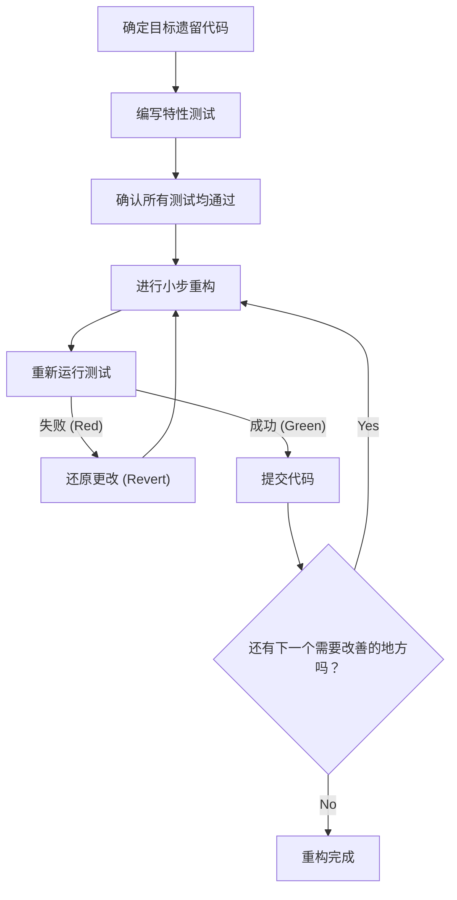
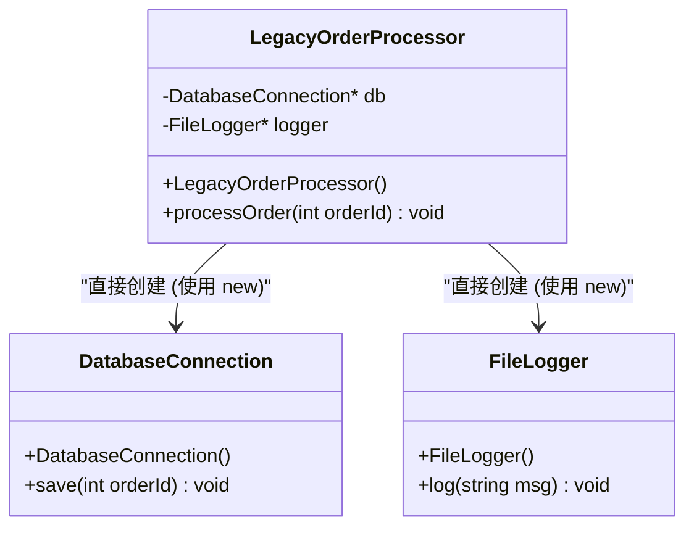
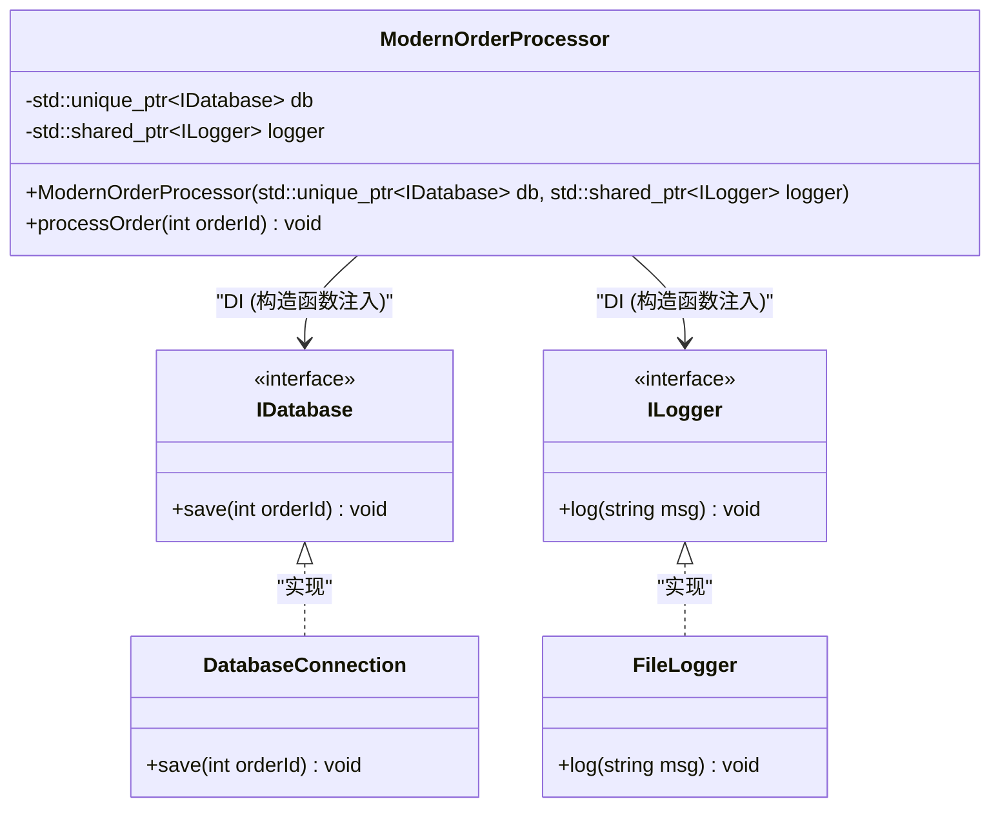

# 重构的秘诀：安全地改善遗留的 C++ 代码

在现代软件开发中，与“遗留代码”作斗争是一条无法回避的道路。特别是在 C++ 这门语言中，遗留代码具有其他语言无法比拟的威胁。手动内存管理（裸指针与 `new` / `delete` 的风暴）、滥用全局变量、缺乏异常安全性，以及最重要的一点——“没有测试”。迈克尔·费瑟斯在名著《修改代码的艺术》（Working Effectively with Legacy Code）中直言不讳地断言：“没有测试的代码就是遗留代码”。

本文将从理论和实践两方面全面深入地讲解如何将积累了数十年的遗留 C++ 代码库，安全且可靠地迁移至 Modern C++ (C++11/14/17/20) 并进行重构的秘诀。从技术债务的数学模型开始，到安全的依赖关系分离，再到使用现代语言特性净化代码，涵盖了全面的实践方法。

---

## 1. 复杂度和技术债务的数学模型

为了证明重构的合理性，我们需要量化当前代码库存在的问题。衡量代码结构复杂度最常用的指标是“圈复杂度（Cyclomatic Complexity）”。该复杂度基于控制流图的图论，通过以下数学公式定义：

$$ M = E - N + 2P $$

这里，
- $M$ 是圈复杂度
- $E$ 是图的边（控制流、转移）的数量
- $N$ 是图的节点（处理的基本块）的数量
- $P$ 是连通分量的数量（通常在单个函数或方法中 $P=1$）

复杂度 $M$ 越大，全面测试该函数所需的测试用例数量就会呈线性增加，甚至根据条件分支的组合呈指数级增加。此外，根据经验法则，产生 Bug 的概率 $P(bug)$ 会相对于复杂度 $M$ 呈指数级增加。将其建模为类似于泊松分布的形式如下：

$$ P(bug) = 1 - e^{-\lambda \cdot M} $$

（这里的 $\lambda$ 是取决于开发团队技能和领域难度的常数。）

另外，技术债务的成本会以复利形式增加。如果初始技术债务为 $C_0$，每次迭代的利率（因代码难以修改而导致的生产力下降的比例）为 $r$，那么 $t$ 个周期后的修复成本 $Cost(t)$ 可以表示为：

$$ Cost(t) = C_0 \times (1 + r)^t $$

这个数学公式清楚地表明了一个残酷的事实：“对遗留代码置之不理将导致成本随时间呈指数级增长”。因此，必须尽早偿还债务（重构）。

---

## 2. 重构的绝对原则：“测试先行”

修改遗留代码时最大的恐惧在于：“是否会破坏现有的正常功能（引发退化）”。消除这种恐惧的唯一方法是“自动化测试”。

然而，遗留代码本来就没有测试。这时候引入“特性测试 (Characterization Test)”就变得至关重要。特性测试不是指系统“本来应该怎么运行”，而是原封不动地记录系统“现在是怎么运行的”的测试。

以下流程图展示了安全重构的生命周期。



通过不断循环这个周期，开发者可以在始终有安全网保护的情况下修改代码。当测试失败时，重要的是不要深入追究原因，而是立即 `Revert`（还原）。

---

## 3. 创造可测试性的“接缝 (Seams)”概念

当试图向遗留代码添加测试时，遇到的第一个障碍就是“依赖关系”。如果直接连接数据库、网络通信、对硬编码文件系统的访问等紧密耦合在一起，就不可能编写单元测试 (Unit Test)。

这时候就轮到“接缝 (Seam)”概念登场了。接缝是指“无需编辑代码本身，即可改变系统行为的位置”。在 C++ 中，主要利用以下三种接缝：

1. **对象接缝 (Object Seams)**: 利用虚函数 (Virtual Functions) 的多态性。
2. **编译时接缝 (Compile-time Seams)**: 切换模板 (Templates) 或 `#include`。
3. **链接时接缝 (Link-time Seams)**: 切换构建时链接的库或目标文件。

通过熟练运用这些方法，将生产环境的模块替换为测试环境专用的 Mock（模拟）对象，从而隔离依赖关系。

---

## 4. 打破紧密耦合：依赖注入 (Dependency Injection)

依赖注入 (DI: Dependency Injection) 是一种强大的模式，用于将对象的创建责任从类内部剥离到外部。

首先，让我们来看一个遗留且紧密耦合的 C++ 类设计。



这个 `LegacyOrderProcessor` 在构造函数内直接 `new` 了 `DatabaseConnection` 和 `FileLogger`，因此不存在可以替换为 Mock 的接缝。我们可以使用接口（纯虚类）将其重构为松散耦合。



### 遗留代码示例 (C++03)
```cpp
class LegacyOrderProcessor {
private:
    DatabaseConnection* db_;
    FileLogger* logger_;
public:
    LegacyOrderProcessor() {
        db_ = new DatabaseConnection("localhost", 3306);
        logger_ = new FileLogger("/var/log/app.log");
    }
    
    ~LegacyOrderProcessor() {
        delete db_;
        delete logger_;
    }
    
    void processOrder(int orderId) {
        // 处理...
        db_->save(orderId);
        logger_->log("Order processed");
    }
};
```

### 重构后 (Modern C++)
```cpp
// 接口定义 (对象接缝)
class IDatabase {
public:
    virtual ~IDatabase() = default;
    virtual void save(int orderId) = 0;
};

class ILogger {
public:
    virtual ~ILogger() = default;
    virtual void log(const std::string& msg) = 0;
};

// 从外部注入依赖关系的设计
class ModernOrderProcessor {
private:
    std::unique_ptr<IDatabase> db_;
    std::shared_ptr<ILogger> logger_;
public:
    // 构造函数注入 (Constructor Injection)
    ModernOrderProcessor(std::unique_ptr<IDatabase> db, std::shared_ptr<ILogger> logger)
        : db_(std::move(db)), logger_(std::move(logger)) {}
    
    void processOrder(int orderId) {
        db_->save(orderId);
        logger_->log("Order processed");
    }
};
```
通过这样修改设计，我们可以使用 Google Mock (gmock) 等框架轻松创建 `IDatabase` 的 Mock 对象，从而实现测试驱动开发 (TDD)。

---

## 5. 拆除罪恶的全局变量与单例模式

在遗留 C++ 中，最令人头疼的就是滥用全局变量和“单例 (Singleton) 模式”。单例乍一看像是一个方便的设计模式，但其本质只不过是“披着面向对象外衣的全局变量”。

全局状态会在测试用例之间共享状态，从而导致无法并行执行测试，并引发原因不明的间歇性失败测试 (Flaky Tests)。

解决方案是消除对隐式全局状态的依赖，将所需的状态作为函数的参数显式传递（参数化）。这被称为“传递上下文”。

---

## 6. 内存管理现代化与 RAII 的精髓

C++98/03 时代的代码中，`new` 和 `delete` 散布在代码的各个角落，成为了内存泄漏和悬空指针的温床。在 Modern C++ (C++11 及以后) 中，语言级别支持了**所有权 (Ownership)** 的概念，使用智能指针进行安全资源管理成为了标准。

### RAII (Resource Acquisition Is Initialization)
RAII 是 C++ 中最重要的惯用法。它将资源的获取与对象的初始化（构造函数）结合起来，并将资源的释放与对象的销毁（析构函数）结合起来，从而保证在离开作用域时必定会释放资源。

即使发生异常 (Exceptions)，在栈展开 (Stack Unwinding) 的过程中也会自动调用局部变量的析构函数，从而防止资源泄漏。

**Before (危险的遗留代码)**
```cpp
void processFile(const char* filename) {
    FILE* file = fopen(filename, "r");
    if (!file) return;

    Data* data = new Data();
    if (!readData(file, data)) {
        delete data; // 容易忘记
        fclose(file); // 容易忘记
        return;
    }

    try {
        process(data);
    } catch (...) {
        delete data; // 发生异常时避免内存泄漏
        fclose(file);
        throw;
    }

    delete data;
    fclose(file);
}
```

这段代码必须在控制流的每个分支处手动释放资源，结构极其脆弱。

**After (利用 RAII 和智能指针)**
```cpp
void processFile(const std::string& filename) {
    // std::ifstream 通过 RAII 管理文件句柄
    std::ifstream file(filename);
    if (!file.is_open()) return;

    // std::unique_ptr 是通过 RAII 管理堆内存的独占所有者
    auto data = std::make_unique<Data>();
    if (!readData(file, *data)) {
        return; // 在离开作用域时会自动释放
    }

    // 即使发生异常，unique_ptr 和 ifstream 的析构函数
    // 也会确切地释放资源，因此非常安全（保证零内存泄漏）
    process(*data);
}
```

通过这次重构，代码量大幅减少，意图也更加明确，最重要的是完全保证了异常安全性 (Exception Safety)。

---

## 7. 借助 Modern C++ 特性群提升表现力

在重构遗留代码时，应充分利用语言功能更新带来的好处。

### 7.1. 使用 `auto` 进行类型推导
将冗长的描述（例如长迭代器类型名称）替换为 `auto` 可以提高可读性。然而，最佳实践并不是将所有内容都替换为 `auto`，而是仅限于“看等号右边就能不言自明其类型的情况”。

### 7.2. 使用 `constexpr` 和 `consteval` 进行编译时计算
为了减少运行时的开销并在编译时检测错误，积极利用 `constexpr`。

```cpp
// 遗留代码（宏或运行时计算）
#define MAX_BUFFER_SIZE 1024
const double PI = 3.1415926535;

double calculateCircleArea(double radius) {
    return PI * radius * radius;
}
```

```cpp
// Modern C++ (C++20 及以后) 风格
constexpr std::size_t MaxBufferSize = 1024;
constexpr double Pi = 3.14159265358979323846;

// 保证可以在编译时求值的 consteval (C++20)
consteval double calculateCircleArea(double radius) {
    return Pi * radius * radius;
}

// 运行时开销为零。编译时的结果常量直接嵌入到二进制文件中。
constexpr double area = calculateCircleArea(10.0);
```

### 7.3. `[[nodiscard]]` 属性
为了防止由于忽略函数的返回值（特别是错误代码或重要状态）而导致错误，请添加 `[[nodiscard]]` 属性。这会导致编译器对未接收返回值的调用发出警告。

```cpp
[[nodiscard]] bool initializeSystem(); // 禁止忽略返回值
```

---

## 8. 利用自动化工具与持续改进

手动修改大规模的遗留代码库是不切实际的。借助工具链的力量是通往成功的捷径。

- **Clang-Tidy**: 强大的 C++ 代码静态分析工具 (Linter)。通过启用 `modernize-*` 类的检查，它会自动应用 (Fix-it) 诸如应用 `auto`、替换为 `nullptr`、添加 `override` 等操作。
- **AddressSanitizer (ASan)**: 通过将其作为编译选项 (`-fsanitize=address`) 包含在内，可以准确地找出运行时的内存泄漏或缓冲区溢出。在运行测试时应始终启用它。
- **构建 CI/CD 流水线**: 使用 GitHub Actions 或 GitLab CI，针对所有 Pull Request 执行构建、自动测试和静态分析，从而防止引入新的技术债务。

---

## 9. 结论

重构遗留的 C++ 代码绝非一朝一夕就能完成。这就像是对系统进行外科手术一样，是一项既细致又大胆的工作。

请牢记本文中解释的以下步骤。
1. **测量复杂度，并基于事实制定战略**
2. **找出接缝，并通过特性测试保护系统**
3. **通过 DI 打破紧密耦合，根除全局状态**
4. **通过 RAII 和智能指针消除内存管理的担忧**
5. **活用 Modern C++ 的特性，让编译器来工作**

保持“童子军规则（离开时营地要比来时更干净）”的精神，在日常开发任务中一点一滴地，但扎实地持续改善代码，这才是重构真正的秘诀。
