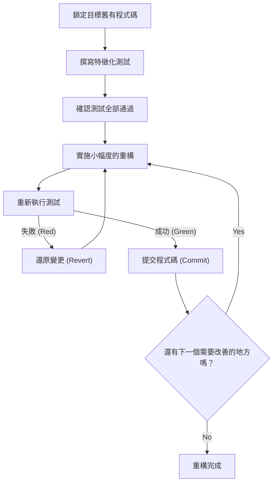
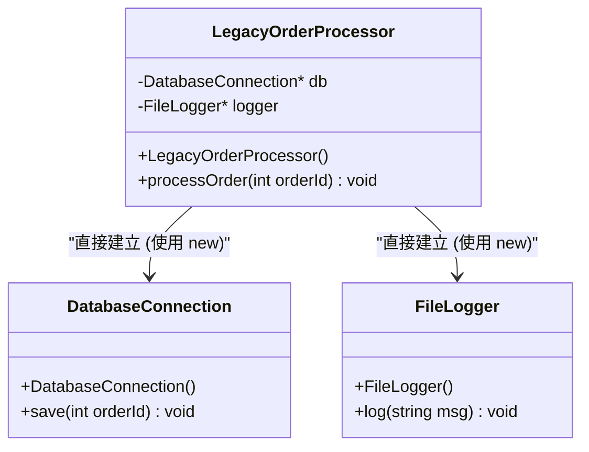
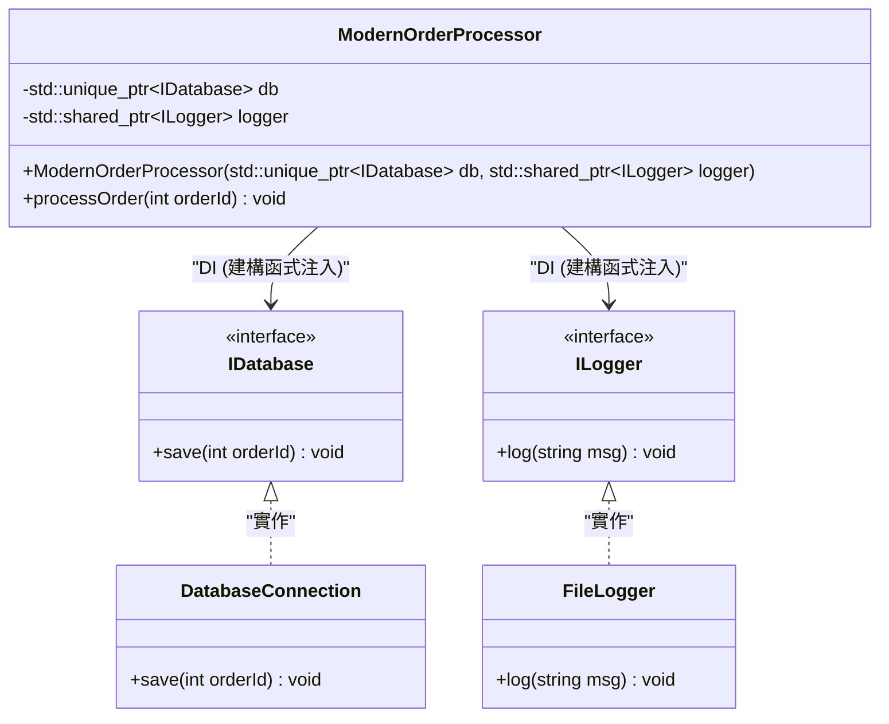

# 重構的秘訣：安全地改善舊有 C++ 程式碼

在現代的軟體開發中，與「舊有程式碼 (Legacy Code)」的抗爭是無法避免的道路。特別是在 C++ 這個語言中，舊有程式碼的威脅是其他語言無法比擬的。手動的記憶體管理（原始指標 (raw pointers) 與 `new` / `delete` 的風暴）、全域變數的濫用、缺乏例外安全性，以及最重要的是「沒有測試」這個事實。Michael Feathers 在其名著《修改軟體的藝術 (Working Effectively with Legacy Code)》中斷言：「沒有測試的程式碼就是舊有程式碼」。

本文將從理論與實踐兩方面，徹底解說如何將累積了數十年的舊有 C++ 程式碼庫，安全且確實地轉移至 Modern C++ (C++11/14/17/20) 並進行重構的秘訣。從技術債的數學模型開始，到安全的依賴關係分離，以及使用現代語言功能進行程式碼的淨化，網羅了實用的方法。

---

## 1. 複雜度與技術債的數學模型

為了讓重構正當化，必須將目前程式碼庫所擁有的問題予以量化。作為測量程式碼結構複雜度的指標，最常見的就是「循環複雜度 (Cyclomatic Complexity)」。這個複雜度是基於控制流程圖 (Control Flow Graph) 的圖論，以下列公式定義：

$$ M = E - N + 2P $$

在這裡，
- $M$ 是循環複雜度
- $E$ 是圖的邊（處理的流程、轉移）的數量
- $N$ 是圖的節點（處理的基本區塊）的數量
- $P$ 是連通元件的數量（通常在單一函式或方法中 $P=1$）

複雜度 $M$ 越大，為了網羅測試該函式所需的測試案例數量將呈線性增長，或者根據條件分支的組合，呈指數級增長。此外，有一個經驗法則，就是錯誤發生的機率 $P(bug)$，相對於複雜度 $M$ 會呈指數級增加。若將此以類似泊松分佈 (Poisson distribution) 的形式進行模型化，如下所示：

$$ P(bug) = 1 - e^{-\lambda \cdot M} $$

（這裡的 $\lambda$ 是取決於開發團隊技能或領域難度常數。）

此外，技術債的成本會以複利的方式增加。如果將初期的技術債設為 $C_0$，每個迭代的利率（因程式碼難以修改而導致生產力下降的比例）設為 $r$，那麼 $t$ 期間後的修改成本 $Cost(t)$ 可以表示如下：

$$ Cost(t) = C_0 \times (1 + r)^t $$

這個公式明確指出了一個殘酷的事實：「放置舊有程式碼不管，將隨著時間推移導致成本呈指數級增長」。因此，債務必須及早償還（重構）。

---

## 2. 重構的絕對原則：「測試優先 (Test-First)」

在修改舊有程式碼時，最大的恐懼在於「是否會破壞現有正常的行為（發生退化 / Regression）」。消除這種恐懼的唯一方法就是「自動化測試」。

然而，舊有程式碼原本就沒有測試。這時最重要的就是導入「特徵化測試 (Characterization Test)」。特徵化測試不是在記錄系統「本來應該如何運作」，而是將系統「現在實際上是如何運作的」原封不動地記錄下來的測試。

以下的流程圖顯示了安全重構的生命週期。



透過循環這個週期，開發者可以始終在安全網上修改程式碼。如果測試失敗，重要的是不要深入追究原因，而是立即 `Revert`（還原）。

---

## 3. 產生可測試性的「接縫 (Seams)」概念

當嘗試為舊有程式碼添加測試時，首先面臨的障礙是「依賴關係」。如果直接連接資料庫、網路通訊、或存取硬編碼的檔案系統等發生緊密耦合，那麼要撰寫單元測試 (Unit Test) 是不可能的。

這時登場的是「接縫 (Seam)」這個概念。接縫是指「無需編輯程式碼本身，就能改變系統行為的地方」。在 C++ 中，主要利用以下三個接縫：

1. **物件接縫 (Object Seams)**: 利用虛擬函式 (Virtual Functions) 的多型 (Polymorphism)。
2. **編譯期接縫 (Compile-time Seams)**: 樣板 (Templates) 或 `#include` 的切換。
3. **連結期接縫 (Link-time Seams)**: 建置時連結的函式庫或物件檔的切換。

充分運用這些方法，將正式環境的模組替換為測試環境用的模擬 (Mock) 物件，藉此隔離依賴關係。

---

## 4. 打破緊密耦合：依賴注入 (Dependency Injection)

依賴注入 (DI: Dependency Injection) 是一種強大的模式，用於將物件的建立責任從類別內部抽離至外部。

首先，我們來看看舊有且緊密耦合的 C++ 類別設計。



這個 `LegacyOrderProcessor` 在建構函式內直接 `new` 出 `DatabaseConnection` 和 `FileLogger`，因此不存在可替換成 Mock 的接縫。我們使用介面（純虛擬類別）將其重構為鬆散耦合。



### 舊有程式碼範例 (C++03)
```cpp
class LegacyOrderProcessor {
private:
    DatabaseConnection* db_;
    FileLogger* logger_;
public:
    LegacyOrderProcessor() {
        db_ = new DatabaseConnection("localhost", 3306);
        logger_ = new FileLogger("/var/log/app.log");
    }
    
    ~LegacyOrderProcessor() {
        delete db_;
        delete logger_;
    }
    
    void processOrder(int orderId) {
        // 處理...
        db_->save(orderId);
        logger_->log("Order processed");
    }
};
```

### 重構後 (Modern C++)
```cpp
// 介面定義 (物件接縫)
class IDatabase {
public:
    virtual ~IDatabase() = default;
    virtual void save(int orderId) = 0;
};

class ILogger {
public:
    virtual ~ILogger() = default;
    virtual void log(const std::string& msg) = 0;
};

// 從外部注入依賴關係的設計
class ModernOrderProcessor {
private:
    std::unique_ptr<IDatabase> db_;
    std::shared_ptr<ILogger> logger_;
public:
    // 建構函式注入 (Constructor Injection)
    ModernOrderProcessor(std::unique_ptr<IDatabase> db, std::shared_ptr<ILogger> logger)
        : db_(std::move(db)), logger_(std::move(logger)) {}
    
    void processOrder(int orderId) {
        db_->save(orderId);
        logger_->log("Order processed");
    }
};
```
藉由這樣修改設計，可以使用諸如 Google Mock (gmock) 等框架輕鬆建立 `IDatabase` 的模擬物件，讓測試驅動開發 (TDD) 成為可能。

---

## 5. 解構萬惡的全域變數與單例模式 (Singleton)

在舊有的 C++ 中，最令人頭痛的莫過於全域變數與「單例模式 (Singleton Pattern)」的濫用。單例模式乍看之下是個便利的設計模式，但其實際上不過是「披著物件導向外衣的全域變數」而已。

全域狀態會導致狀態在測試案例之間共享，使得測試無法平行執行，並引發原因不明的不穩定測試 (Flaky Tests)。

解決方案是消除對隱式全域狀態的依賴，並將必要的狀態明確地作為函式的參數傳遞（參數化）。這被稱為「傳遞上下文 (Context Passing)」。

---

## 6. 記憶體管理的現代化與 RAII 的精髓

C++98/03 時代的程式碼，`new` 和 `delete` 散佈在程式碼的各個角落，成為記憶體洩漏 (Memory Leak) 和懸空指標 (Dangling Pointers) 的溫床。在 Modern C++ (C++11 之後) 中，**所有權 (Ownership)** 的概念在語言層面受到支援，使用智慧型指標 (Smart Pointers) 進行安全的資源管理成為了標準。

### RAII (Resource Acquisition Is Initialization)
RAII 是 C++ 中最重要的慣用語 (Idiom)。它將資源的獲取與物件的初始化（建構函式）結合，並將資源的釋放與物件的銷毀（解構函式）結合，確保在離開作用域時能確實地釋放資源。

即使發生了例外 (Exceptions)，在堆疊展開 (Stack Unwinding) 的過程中，區域變數的解構函式也會自動被呼叫，因此可以防止資源洩漏。

**Before (危險的舊有程式碼)**
```cpp
void processFile(const char* filename) {
    FILE* file = fopen(filename, "r");
    if (!file) return;

    Data* data = new Data();
    if (!readData(file, data)) {
        delete data; // 容易忘記
        fclose(file); // 容易忘記
        return;
    }

    try {
        process(data);
    } catch (...) {
        delete data; // 避免發生例外時的記憶體洩漏
        fclose(file);
        throw;
    }

    delete data;
    fclose(file);
}
```

這個程式碼在控制流程的每個分支都需要手動釋放資源，是非常脆弱的結構。

**After (活用 RAII 與智慧型指標)**
```cpp
void processFile(const std::string& filename) {
    // std::ifstream 使用 RAII 管理檔案代碼 (file handle)
    std::ifstream file(filename);
    if (!file.is_open()) return;

    // std::unique_ptr 是使用 RAII 管理堆積 (Heap) 記憶體的獨佔擁有者
    auto data = std::make_unique<Data>();
    if (!readData(file, *data)) {
        return; // 在離開作用域時會自動釋放
    }

    // 即使發生例外，unique_ptr 和 ifstream 的解構函式
    // 也會確保資源被釋放，因此是安全的（保證零記憶體洩漏）
    process(*data);
}
```

透過這次重構，程式碼量大幅減少，意圖變得明確，最重要的是完美地保證了例外安全性 (Exception Safety)。

---

## 7. 透過 Modern C++ 功能群提升表現力

在重構舊有程式碼時，應該充分利用伴隨語言功能更新所帶來的好處。

### 7.1. 使用 `auto` 進行型別推斷
將長迭代器等冗長的型別名稱替換為 `auto`，可以提升可讀性。然而，最佳實踐並不是將所有東西都改成 `auto`，而是限定在「只要看右邊就能清楚知道型別的情況」。

### 7.2. 使用 `constexpr` 與 `consteval` 進行編譯期計算
為了減少執行期的負擔，並在編譯時偵測錯誤，積極活用 `constexpr`。

```cpp
// 舊有程式碼（巨集或執行期計算）
#define MAX_BUFFER_SIZE 1024
const double PI = 3.1415926535;

double calculateCircleArea(double radius) {
    return PI * radius * radius;
}
```

```cpp
// Modern C++ (C++20 之後) 的風格
constexpr std::size_t MaxBufferSize = 1024;
constexpr double Pi = 3.14159265358979323846;

// consteval (C++20) 保證可以在編譯期求值
consteval double calculateCircleArea(double radius) {
    return Pi * radius * radius;
}

// 執行期成本為零。編譯時計算結果的常數會直接嵌入二進制檔案中。
constexpr double area = calculateCircleArea(10.0);
```

### 7.3. `[[nodiscard]]` 屬性
為了防止忽略函式回傳值（特別是錯誤碼或重要狀態）的 Bug 發生，添加 `[[nodiscard]]` 屬性。這樣一來，編譯器就會針對不接收回傳值的呼叫發出警告。

```cpp
[[nodiscard]] bool initializeSystem(); // 禁止忽略回傳值
```

---

## 8. 自動化工具的活用與持續改善

手動修正大規模的舊有程式碼庫是不切實際的。借助工具鏈的力量是通往成功的捷徑。

- **Clang-Tidy**: 強大的 C++ Linter 與靜態分析工具。啟用 `modernize-*` 系列的檢查，它可以自動套用 (Fix-it) 如應用 `auto`、替換為 `nullptr`、添加 `override` 等操作。
- **AddressSanitizer (ASan)**: 作為編譯選項 (`-fsanitize=address`) 納入，可以在執行期準確地定位出記憶體洩漏與緩衝區溢位 (Buffer Overrun)。執行測試時務必啟用它。
- **建構 CI/CD 管線**: 使用 GitHub Actions 或 GitLab CI，對所有的 Pull Request 執行建置、自動測試與靜態分析，以防止新的技術債侵入。

---

## 9. 結論

重構舊有的 C++ 程式碼，絕不是一朝一夕就能完成的。那就像是在對系統進行外科手術，是一項細膩且大膽的工作。

請將本文中解說的以下步驟銘記在心。
1. **測量複雜度，基於事實制定策略**
2. **找出接縫，使用特徵化測試來保護系統**
3. **透過 DI 打破緊密耦合，根除全域狀態**
4. **透過 RAII 與智慧型指標消除對記憶體管理的擔憂**
5. **活用 Modern C++ 的功能，讓編譯器為您工作**

抱持著「童子軍規則（離開營地時要比來的時候更乾淨）」的精神，在日常的開發任務中一點一滴地，但確實地持續改善程式碼，這才是重構真正的秘訣。
