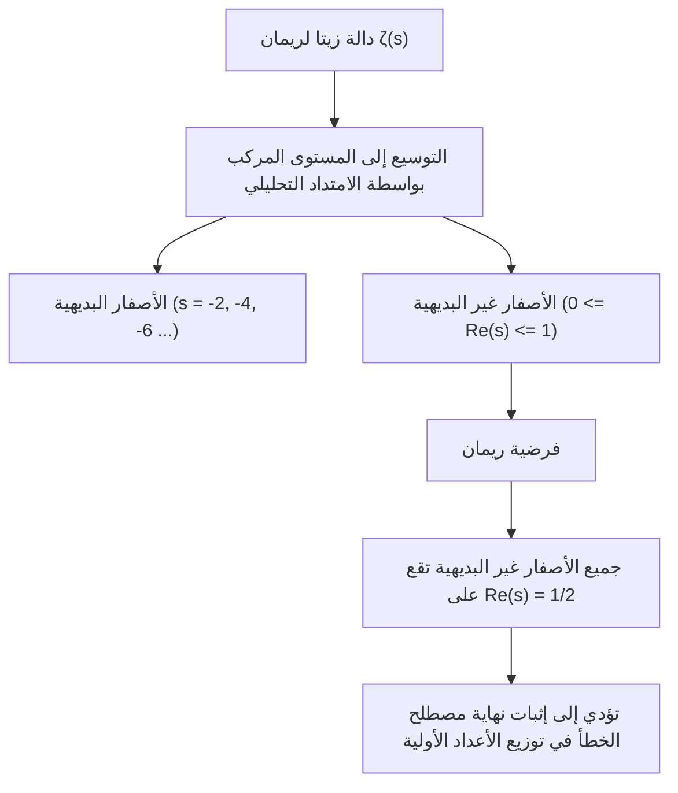
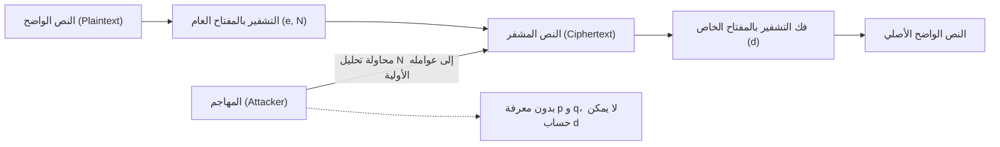
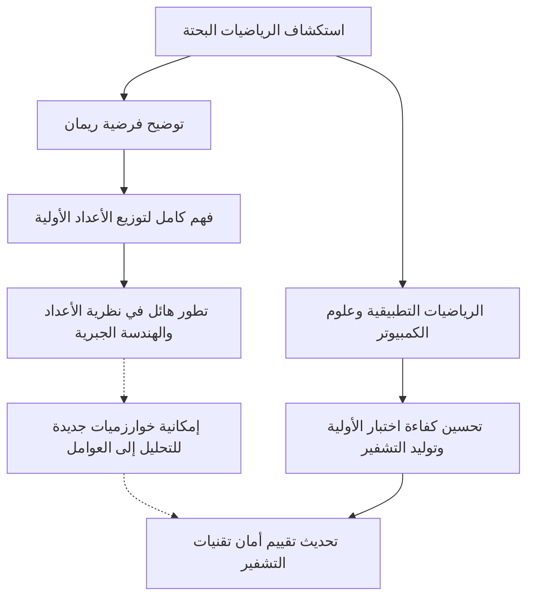

# 1. مقدمة: غموض الأعداد الأولية في الكون وفرضية ريمان

"الأعداد الأولية (Prime Numbers)" هي الأعداد الطبيعية التي لا تقبل القسمة إلا على 1 وعلى نفسها، وتُعرف أيضاً بـ "ذرات" عالم الرياضيات. تبدو هذه السلسلة من الأعداد 2, 3, 5, 7, 11, 13... عشوائية وبدون نظام واضح للوهلة الأولى. منذ أن أثبت عالم الرياضيات اليوناني القديم إقليدس أن "الأعداد الأولية لا نهائية"، حاول عدد لا يحصى من علماء الرياضيات كشف القواعد الخفية وراء تسلسل هذه الأعداد.

أقرب محاولة لحل لغز الأعداد الأولية كانت **"فرضية ريمان (Riemann Hypothesis)"** التي اقترحها عالم الرياضيات الألماني برنارد ريمان (Bernhard Riemann) في عام 1859. تعتبر فرضية ريمان واحدة من أهم المسائل المستعصية في الرياضيات الحديثة، وهي إحدى مسائل جائزة الألفية التي حددها معهد كلاي للرياضيات بجائزة قدرها مليون دولار.

للوهلة الأولى، قد يبدو لغز التوزيع للأعداد الأولية في الرياضيات البحتة غير ذي صلة بحياتنا اليومية. ومع ذلك، فإن أمن الإنترنت الذي يدعم البنية التحتية للمجتمع الحديث، وخاصة **تقنيات التشفير الحديثة مثل تشفير RSA وتشفير المنحنيات الإهليلجية (ECC)**، يعتمد بشدة على خصائص الأعداد الأولية الضخمة.

في هذا المقال، سنقوم برحلة رياضية من توزيع الأعداد الأولية إلى مبرهنة الأعداد الأولية، ودالة زيتا لريمان، وصولاً إلى جوهر فرضية ريمان، وسنتعمق بالتفصيل في كيفية ارتباطها بتقنيات التشفير الحديثة، وماذا سيحدث للعالم إذا تم إثبات فرضية ريمان.

---

# 2. مبرهنة الأعداد الأولية وتوزيع الأعداد الأولية: اكتشاف غاوس

لفهم كيفية توزيع الأعداد الأولية، فكر علماء الرياضيات في **دالة عد الأعداد الأولية (Prime-counting function)** $\pi(x)$ التي تعبر عن "عدد الأعداد الأولية الموجودة أقل من أو تساوي عدداً معيناً $x$".

على سبيل المثال:
- $\pi(10) = 4$ (2, 3, 5, 7)
- $\pi(100) = 25$
- $\pi(1000) = 168$

اكتشف عالم الرياضيات العبقري كارل فريدريش غاوس (Carl Friedrich Gauss) في سن الخامسة عشرة، بعد حساب جداول ضخمة للأعداد الأولية، أن تكرار ظهور الأعداد الأولية يتناقص بشكل يتناسب عكسياً مع اللوغاريتم الطبيعي $\ln x$. بمعنى آخر، توقع أن احتمال العثور على عدد أولي بالقرب من عدد معين $x$ هو حوالي $\frac{1}{\ln x}$.

تم التعبير عن هذا باستخدام التكامل في **التكامل اللوغاريتمي (Logarithmic integral)** $\text{Li}(x)$:

$$ \text{Li}(x) = \int_{2}^{x} \frac{dt}{\ln t} $$

تم إثبات توقع غاوس لاحقاً وبشكل مستقل من قبل جاك هادامار وشارل جان دو لا فالي بوسان في عام 1896، وتأسست كـ **مبرهنة الأعداد الأولية (Prime Number Theorem, PNT)**:

$$ \lim_{x \to \infty} \frac{\pi(x)}{\text{Li}(x)} = 1 $$

أو يمكن التعبير عنها تقريبياً على النحو التالي:

$$ \pi(x) \sim \frac{x}{\ln x} $$

بفضل هذه المبرهنة، أصبح من الواضح أن الأعداد الأولية، عند النظر إليها على نطاق واسع (ماكروسكوبي)، تمتلك توزيعاً سلساً للغاية ويمكن التنبؤ به. ومع ذلك، عند النظر إليها على نطاق ضيق (ميكروسكوبي)، هناك دائماً "خطأ" أو "تذبذب" بين $\pi(x)$ و $\text{Li}(x)$. الهوية الحقيقية لهذا التذبذب هي اللغز الأكبر الذي تحاول فرضية ريمان حله.

---

# 3. دالة زيتا لريمان وحاصل ضرب أويلر

أقوى سلاح في تحليل توزيع الأعداد الأولية هو **دالة زيتا لريمان (Riemann Zeta Function)**. في الأصل، كانت متسلسلة لانهائية تم تعريفها من قبل ليونهارت أويلر (Leonhard Euler) للأعداد الحقيقية $s > 1$:

$$ \zeta(s) = \sum_{n=1}^\infty \frac{1}{n^s} = 1 + \frac{1}{2^s} + \frac{1}{3^s} + \frac{1}{4^s} + \dots $$

أحد أعظم إنجازات أويلر هو إثباته أن هذه المتسلسلة اللانهائية يمكن التعبير عنها كحاصل ضرب لانهائي يشمل جميع الأعداد الأولية $p$. هذا هو **حاصل ضرب أويلر (Euler Product Formula)**:

$$ \zeta(s) = \prod_{p \text{ prime}} \frac{1}{1 - p^{-s}} = \left( \frac{1}{1 - 2^{-s}} \right) \left( \frac{1}{1 - 3^{-s}} \right) \left( \frac{1}{1 - 5^{-s}} \right) \dots $$

الفهم الحدسي لهذا الإثبات هو أنه إذا قمنا بنشر كل حد في الجانب الأيمن كمتسلسلة هندسية وضربناها معاً، فبفضل المبرهنة الأساسية في الحساب (كل عدد طبيعي يمكن التعبير عنه بشكل فريد كحاصل ضرب أعداد أولية)، يتم إعادة بناء مجموع مقلوبات الأعداد الطبيعية في الجانب الأيسر بالكامل.

**هذه المعادلة الرياضية الواحدة أصبحت جسراً يربط بين التحليل الرياضي (المتسلسلات اللانهائية والدوال المستمرة) ونظرية الأعداد (الأعداد الأولية والأعداد المنفصلة).** دراسة دالة زيتا مرادفة لدراسة توزيع الأعداد الأولية.

---

# 4. الامتداد التحليلي والتوسيع إلى المستوى المركب

تكمن عبقرية ريمان في أنه وسع المتغير $s$ في الدالة $\zeta(s)$، الذي كان أويلر يعتبره عدداً حقيقياً فقط، ليصبح **عدداً مركباً $s = \sigma + it$ ($\sigma$ هو الجزء الحقيقي و $t$ هو الجزء التخيلي)**.

المتسلسلة اللانهائية الأصلية تتقارب فقط عندما يكون $\sigma > 1$، ولكن باستخدام تقنية "الامتداد التحليلي (Analytic Continuation)"، وسع ريمان التعريف بحيث أصبح للدالة $\zeta(s)$ معنى في كل المستوى المركب باستثناء القطب عند $s = 1$.

وعلاوة على ذلك، استنتج معادلة دالية (Functional equation) جميلة تحققها دالة زيتا:

$$ \zeta(s) = 2^s \pi^{s-1} \sin\left(\frac{\pi s}{2}\right) \Gamma(1-s) \zeta(1-s) $$

حيث $\Gamma(x)$ هي دالة غاما. من خلال هذه المعادلة، يمكننا معرفة خصائص النصف الأيسر من المستوى بناءً على خصائص النصف الأيمن.

### الأصفار (Zeros of the Zeta Function)
تُسمى الأعداد المركبة $s$ التي تجعل قيمة دالة زيتا تساوي 0 بـ "الأصفار".
من المعادلة الدالية، عندما يكون $s$ عدداً زوجياً سالباً ($-2, -4, -6, \dots$)، تصبح $\sin(\pi s / 2)$ صفراً، وبالتالي تكون $\zeta(s) = 0$. وتُعرف هذه بـ **الأصفار البديهية (Trivial zeros)**.

ومع ذلك، ما يهم في توزيع الأعداد الأولية هي الأصفار الأخرى، وتحديداً **الأصفار غير البديهية (Non-trivial zeros)** التي تقع في "الشريط الحرج (Critical strip)" حيث $0 \le \sigma \le 1$.

---

# 5. جوهر فرضية ريمان والصيغة الصريحة

حسب ريمان عدداً قليلاً من الأصفار وطرح فرضية مذهلة. هذه هي **فرضية ريمان**.

> **فرضية ريمان (Riemann Hypothesis)**
> جميع الأصفار غير البديهية لدالة زيتا لريمان $\zeta(s)$ تقع على خط مستقيم جزؤه الحقيقي يساوي $1/2$ (أي $\text{Re}(s) = 1/2$).

يسمى هذا الخط الذي يكون فيه الجزء الحقيقي 1/2 بـ "الخط الحرج (Critical line)".

لماذا تعتبر فرضية ريمان على هذا القدر من الأهمية؟ لأن أصفار دالة زيتا تحدد **بالكامل** توزيع الأعداد الأولية.

استنتج ريمان ولاحقاً عالم الرياضيات فون مانجولدت "الصيغة الصريحة (Explicit formula)" التي تصف توزيع الأعداد الأولية بدقة. باستخدام دالة تشيبيشيف $\psi(x)$، يمكن التعبير عنها كما يلي:

$$ \psi(x) = x - \sum_{\rho} \frac{x^\rho}{\rho} - \ln(2\pi) - \frac{1}{2}\ln(1 - x^{-2}) $$

حيث $\rho$ يمثل المجموع عبر جميع الأصفار غير البديهية لدالة زيتا.
المصطلح الرئيسي هو $x$ (والذي يتوافق مع مبرهنة الأعداد الأولية)، ومن خلال إضافة أو طرح المصطلحات الشبيهة بالتموجات التي تعتمد على الأصفار $\rho$، يتم إعادة بناء التوزيع الدقيق المتدرج للأعداد الأولية. يمكن القول إن الأصفار غير البديهية تمثل "ترددات (موجات)" توزيع الأعداد الأولية.

إذا كانت فرضية ريمان صحيحة، وكان الجزء الحقيقي لجميع الأصفار غير البديهية $\rho$ هو بالضبط $1/2$، فإن مصطلح الخطأ في مبرهنة الأعداد الأولية سيندرج ضمن أصغر نطاق يمكن تصوره نظرياً.

$$ |\pi(x) - \text{Li}(x)| \le \frac{1}{8\pi} \sqrt{x} \ln x \quad \text{for} \quad x \ge 2657 $$

بعبارة أخرى، **إذا كانت فرضية ريمان صحيحة، فسيثبت ذلك أن الأعداد الأولية موزعة بأكثر الطرق "انتظاماً وجمالاً" التي يمكننا تخيلها**.

---

# 6. العلاقة التي لا تنفصل بين تقنيات التشفير الحديثة والأعداد الأولية

حتى هذه النقطة كنا في عالم الرياضيات البحتة العميق، ولكن هذه الخصائص للأعداد الأولية تدعم من الأساس مجتمعنا الرقمي الحديث. والمثال الأبرز على ذلك هو تشفير المفتاح العام مثل **تشفير RSA**.

تعتمد أمان كافة الاتصالات مثل مدفوعات بطاقات الائتمان على الإنترنت، وإرسال كلمات المرور، والتوقيعات الإلكترونية لتقنية البلوك تشين على "الأعداد الأولية".

### كيفية عمل تشفير RSA
يعتمد أمان تشفير RSA على الحقيقة الرياضية القائلة بأن "تحليل رقم مركب كبير جداً إلى عوامله الأولية يمثل صعوبة بالغة" (مسألة التحليل إلى العوامل الأولية).

1. **توليد المفاتيح**:
   يتم اختيار عددين أوليين ضخمين بشكل عشوائي $p$ و $q$ (مثلاً 2048 بت لكل منهما).
   يتم ضربهما معاً لحساب $N = p \times q$. هذا الـ $N$ يصبح جزءاً من المفتاح العام.
   باستخدام دالة مؤشر أويلر $\phi(N) = (p-1)(q-1)$، يتم توليد المفتاح الخاص $d$.
   
   $$ e \times d \equiv 1 \pmod{\phi(N)} $$

2. **التشفير وفك التشفير**:
   يتم تحويل النص الواضح $M$ إلى نص مشفر $C$ باستخدام المفتاح العام $e, N$.
   $$ C \equiv M^e \pmod{N} $$
   فقط من يمتلك المفتاح الخاص $d$ يمكنه فك التشفير.
   $$ M \equiv C^d \pmod{N} $$

لكسر تشفير RSA، من الضروري إيجاد الأعداد الأولية الأصلية $p$ و $q$ (التحليل إلى عوامل) انطلاقاً من العدد الضخم $N$. حتى باستخدام الخوارزميات السائدة حالياً (مثل منخل حقل الأعداد العام: GNFS)، فإن تحليل عدد يتكون من مئات الأرقام قد يستغرق وقتاً يتجاوز بكثير عمر الكون، حتى باستخدام أجهزة الكمبيوتر الفائقة.

---

# 7. تأثير فرضية ريمان على تقنيات التشفير

إذن، كيف تتقاطع "فرضية ريمان" الموجودة في قمة الرياضيات البحتة مع "تقنيات التشفير"؟

### 7.1. خوارزميات توليد الأعداد الأولية (اختبار الأولية) وفرضية ريمان المعممة (GRH)
لتشغيل تشفير RSA، يجب أولاً توليد أعداد أولية ضخمة $p$ و $q$. ومع ذلك، فإن التحديد السريع والمؤكد لـ "ما إذا كان عدد ما أولياً أم لا" ليس أمراً سهلاً.

حالياً، تستخدم الخوارزمية الاحتمالية المعروفة بـ **اختبار ميلر-رابين لأولية عدد (Miller-Rabin primality test)** بشكل عملي. هذه الخوارزمية سريعة جداً، ولكنها تحمل خطراً ضئيلاً جداً لحدوث "أعداد شبه أولية"، حيث يتم تحديد عدد مركب بشكل خاطئ على أنه عدد أولي.

ومع ذلك، إذا افترضنا أن **"فرضية ريمان المعممة (Generalized Riemann Hypothesis, GRH)"**، التي توسع فرضية ريمان إلى دوال L لدركليه، صحيحة، فإن القصة تتغير بشكل جذري.
إذا كانت GRH صحيحة، فإن الحد الأقصى لعدد الاختبارات في خوارزمية ميلر-رابين يصبح مضموناً رياضياً، وترتقي من خوارزمية احتمالية إلى **"خوارزمية حتمية ذات وقت كثير الحدود"** (كانت هذه حقيقة مهمة معروفة قبل اكتشاف اختبار AKS للأولية).

بمعنى آخر، تلعب فرضية ريمان (وتعميماتها) دوراً في إعطاء ضمانات مباشرة وقاطعة لتوليد الأعداد الأولية الضخمة بسرعة وموثوقية مطلقة، وهو ما يمثل الأساس لتوليد التشفير.

### 7.2. العلاقة بخوارزميات التحليل إلى العوامل
تعتبر معرفة توزيع الأعداد الأولية أمراً حتمياً عند تقييم التعقيد الحسابي للخوارزميات المستخدمة لفك التشفير (مثل منخل حقل الأعداد العام). تعتمد العديد من خوارزميات التحليل إلى عوامل على توزيع "الأعداد السلسة (Smooth numbers: الأعداد التي تحتوي فقط على عوامل أولية صغيرة)".

لتقييم مدى تكرار ظهور الأعداد السلسة بدقة، يلزم وجود فهم عميق لتوزيع الأعداد الأولية، وهنا أيضاً يتم استخدام تقنيات نظرية الأعداد التحليلية المرتبطة مباشرة بدالة زيتا وفرضية ريمان. إذا تم إثبات فرضية ريمان وتم تحديد خطأ توزيع الأعداد الأولية بالكامل، فسيصبح من الممكن تحديد حدود الأداء لخوارزميات التحليل إلى عوامل بشكل أكثر دقة.

---

# 8. إذا تم إثبات فرضية ريمان، هل سيتم كسر التشفير؟

غالباً ما يُقال كنوع من الأساطير الحضرية: "إذا حُلت فرضية ريمان، سينهار تشفير RSA في لحظة"، ولكن **هذا غير دقيق رياضياً**.

إثبات فرضية ريمان بحد ذاته لا يخلق فوراً خوارزمية سحرية تسرع بشكل كبير من التحليل إلى عوامل أولية. فرضية ريمان هي مجرد نظرية حول "الانتظام الماكروسكوبي لتوزيع" الأعداد الأولية، ولا تخبرنا مباشرة (كخاصية محلية) عن الأعداد الأولية التي تقسم عدداً معيناً $N$.

ومع ذلك، فإن التأثير ليس صفراً.
لأنه في عملية إثبات فرضية ريمان، هناك احتمال كبير جداً لاكتشاف **"أدوات رياضية جديدة" أو "أساليب تحليل غير معروفة"**. بالنظر إلى التاريخ، عندما تم إثبات مبرهنة فيرما الأخيرة أو حدسية بوانكاريه، فإن النظريات الجديدة التي طُورت خلال تلك العملية دفعت الرياضيات بأكملها إلى قفزات هائلة.

إذا تم تأسيس طرق هندسية جبرية غير معروفة أو أساليب هندسية غير تبادلية قادرة على التحكم الكامل في خصائص أصفار دالة زيتا لريمان، فلا يمكن إنكار احتمال أن يؤدي ذلك كنتيجة إلى اكتشاف خوارزميات ثورية للتحليل إلى العوامل (على سبيل المثال، خوارزمية كلاسيكية تقلل وقت الحساب إلى وقت كثير الحدود). بهذا المعنى، لا يمكن لعلماء التشفير أن يغضوا الطرف أبداً عن تطورات فرضية ريمان.

### الحواسيب الكمومية وخوارزمية شور
التهديد الأكثر مباشرة وواقعية لتقنيات التشفير ليس إثبات فرضية ريمان، بل **الحواسيب الكمومية**. "خوارزمية شور" التي نشرها بيتر شور (Peter Shor) في عام 1994، أثبتت أنه بوجود حاسوب كمي ذو أداء كافٍ، يمكن حل التحليل إلى العوامل في وقت كثير الحدود. هذا يعني أن تشفير RSA وتشفير المنحنيات الإهليلجية سيتم كسرهما بشكل جذري.

حالياً، يجري التحول عالمياً نحو "تشفير ما بعد الكوانتم (Post-Quantum Cryptography, PQC)" الذي لا يمكن فك تشفيره حتى بواسطة الحواسيب الكمومية (مثل التشفير القائم على الشبكات). ربما يقترب العصر الذهبي لتقنيات التشفير المعتمدة على الأعداد الأولية من نهايته بطريقة ما، لكن القيمة الرياضية للأعداد الأولية بحد ذاتها لن تضيع أبداً.

---

# 9. الخاتمة: تقاطع التجريد الرياضي مع المجتمع الواقعي

الاستكشاف اللانهائي للأعداد الأولية، والذي استمر منذ اليونان القديمة، ارتقى بفضل العبقري ريمان ليصبح سيمفونية جميلة على المستوى المركب (أصفار دالة زيتا). ومن المثير للدهشة أن هذه البلورة الرياضية النقية، بعد مرور قرون، تُستخدم كأقوى درع لضمان أمن مجتمع الإنترنت.

فرضية ريمان هي رمز يجسد في وقت واحد "الجمال التجريدي" للرياضيات و "القدرة المذهلة على التطبيق في العالم المادي والمجتمع الواقعي".

عندما يتم قهر هذا الجبل الرياضي الضخم الذي لم يصل إلى قمته أحد بعد، سنفهم تماماً الحقيقة الكونية المتمثلة في الأعداد الأولية، وسنمتلك منظوراً جديداً لبنية مجتمع المعلومات. إن دراسة تقنيات التشفير هي، في حد ذاتها، رحلة لتتبع تاريخ حكمة البشرية.
