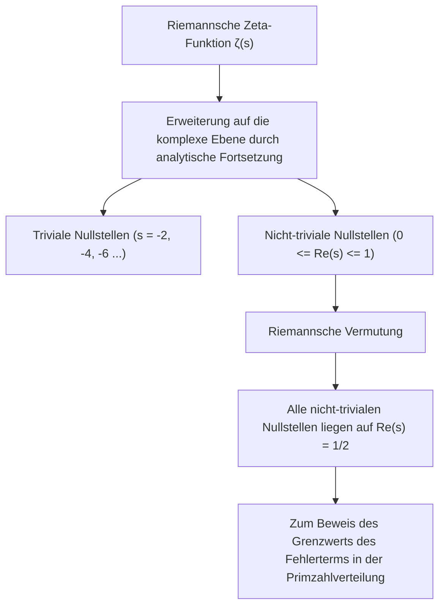
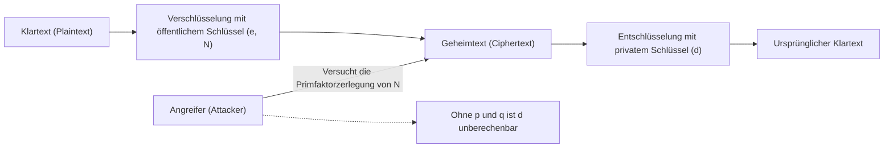
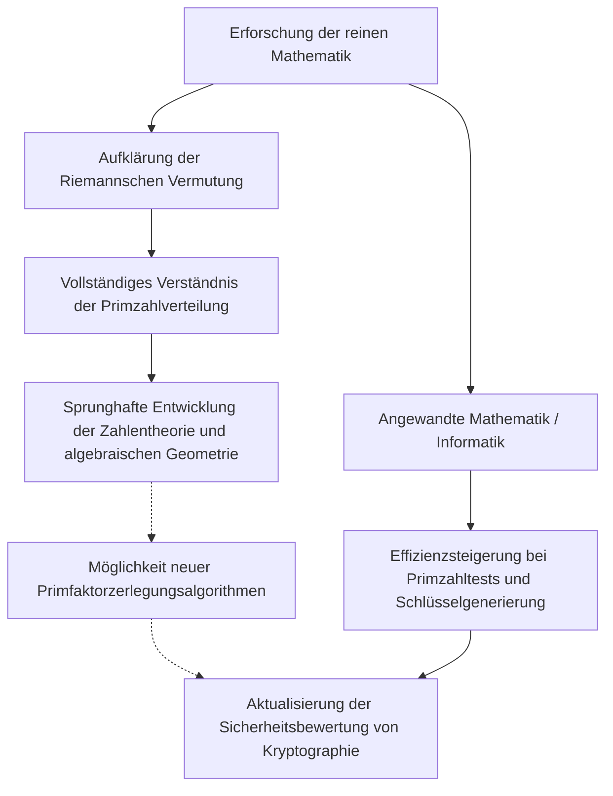

# 1. Einleitung: Das Geheimnis des Universums der Primzahlen und die Riemannsche Vermutung

"Primzahlen" (Prime Numbers) sind natürliche Zahlen, die nur durch 1 und sich selbst teilbar sind, und werden auch als die "Atome" der Mathematik bezeichnet. Die Folge 2, 3, 5, 7, 11, 13... scheint auf den ersten Blick unordentlich und zufällig aufzutreten. Seit der antike griechische Mathematiker Euklid bewiesen hat, dass "es unendlich viele Primzahlen gibt", haben unzählige Mathematiker versucht, die verborgenen Gesetzmäßigkeiten in dieser Anordnung von Primzahlen zu entschlüsseln.

Am nächsten an dieses Rätsel der Primzahlen kam die 1859 von dem deutschen Mathematiker Bernhard Riemann aufgestellte **"Riemannsche Vermutung" (Riemann Hypothesis)** heran. Die Riemannsche Vermutung ist eines der wichtigsten und ungelösten Probleme der modernen Mathematik und als eines der Millennium-Probleme des Clay Mathematics Institute mit einem Preisgeld von einer Million Dollar dotiert.

Auf den ersten Blick mag ein Problem der reinen Mathematik über die Verteilung von Primzahlen nichts mit unserem Alltag zu tun haben. Die Sicherheit des Internets, das die Infrastruktur der modernen Gesellschaft stützt, insbesondere **moderne Verschlüsselungstechnologien wie die RSA-Kryptographie und die Elliptische-Kurven-Kryptographie (ECC)**, hängt jedoch stark von den Eigenschaften riesiger Primzahlen ab.

In diesem Artikel begeben wir uns auf eine mathematische Reise von der Verteilung der Primzahlen über den Primzahlsatz und die Riemannsche Zeta-Funktion bis hin zum Kern der Riemannschen Vermutung. Wir werden extrem detailliert und tiefgreifend erklären, wie all dies mit der modernen Kryptographie verbunden ist und was mit der Welt passieren würde, wenn die Riemannsche Vermutung bewiesen werden sollte.

---

# 2. Der Primzahlsatz und die Verteilung der Primzahlen: Die Entdeckung von Gauss

Um zu verstehen, wie Primzahlen verteilt sind, betrachteten Mathematiker die **Primzahlzählfunktion (Prime-counting function)** $\pi(x)$, die angibt, "wie viele Primzahlen kleiner oder gleich einer bestimmten Zahl $x$ existieren".

Zum Beispiel:
- $\pi(10) = 4$ (2, 3, 5, 7)
- $\pi(100) = 25$
- $\pi(1000) = 168$

Der 15-jährige geniale Mathematiker Carl Friedrich Gauss berechnete umfangreiche Primzahltabellen und fand heraus, dass die Häufigkeit des Auftretens von Primzahlen umgekehrt proportional zum natürlichen Logarithmus $\ln x$ abnimmt. Das heißt, er vermutete, dass die Wahrscheinlichkeit, eine Primzahl in der Nähe einer bestimmten Zahl $x$ zu finden, etwa $\frac{1}{\ln x}$ beträgt.

Dies wird mit Hilfe eines Integrals als **Integrallogarithmus (Logarithmic integral)** $\text{Li}(x)$ ausgedrückt:

$$ \text{Li}(x) = \int_{2}^{x} \frac{dt}{\ln t} $$

Die Vermutung von Gauss wurde später 1896 von Jacques Hadamard und Charles-Jean de La Vallée Poussin unabhängig voneinander bewiesen und als **Primzahlsatz (Prime Number Theorem, PNT)** etabliert.

$$ \lim_{x \to \infty} \frac{\pi(x)}{\text{Li}(x)} = 1 $$

Oder näherungsweise wie folgt ausgedrückt:

$$ \pi(x) \sim \frac{x}{\ln x} $$

Durch diesen Satz wurde klar, dass Primzahlen makroskopisch betrachtet eine sehr glatte und vorhersehbare Verteilung aufweisen. Mikroskopisch betrachtet gibt es jedoch immer einen "Fehler" oder eine "Schwankung" zwischen $\pi(x)$ und $\text{Li}(x)$. Die wahre Natur dieser Schwankung ist das größte Rätsel, das die Riemannsche Vermutung zu lösen versucht.

---

# 3. Die Riemannsche Zeta-Funktion und das Euler-Produkt

Die stärkste Waffe bei der Analyse der Verteilung von Primzahlen ist die **Riemannsche Zeta-Funktion (Riemann Zeta Function)**. Ursprünglich war es eine unendliche Reihe, die von Leonhard Euler für reelle Zahlen $s > 1$ definiert wurde.

$$ \zeta(s) = \sum_{n=1}^\infty \frac{1}{n^s} = 1 + \frac{1}{2^s} + \frac{1}{3^s} + \frac{1}{4^s} + \dots $$

Eine der größten Errungenschaften Eulers war der Beweis, dass diese unendliche Reihe als unendliches Produkt über alle Primzahlen $p$ dargestellt werden kann. Dies ist das **Euler-Produkt (Euler Product Formula)**.

$$ \zeta(s) = \prod_{p \text{ prime}} \frac{1}{1 - p^{-s}} = \left( \frac{1}{1 - 2^{-s}} \right) \left( \frac{1}{1 - 3^{-s}} \right) \left( \frac{1}{1 - 5^{-s}} \right) \dots $$

Ein intuitives Verständnis des Beweises ist, dass wenn man jeden Term auf der rechten Seite als geometrische Reihe entwickelt und diese miteinander multipliziert, aufgrund des Fundamentalsatzes der Arithmetik (jede natürliche Zahl kann eindeutig als Produkt von Primzahlen dargestellt werden) die Summe der Kehrwerte der natürlichen Zahlen auf der linken Seite vollständig rekonstruiert wird.

**Diese einzige Formel wurde zur Brücke zwischen der Analysis (unendliche Reihen, stetige Funktionen) und der Zahlentheorie (Primzahlen, diskrete Zahlen).** Die Untersuchung der Zeta-Funktion ist gleichbedeutend mit der Untersuchung der Verteilung der Primzahlen.

---

# 4. Analytische Fortsetzung und die Erweiterung auf die komplexe Zahlenebene

Riemanns Genialität lag darin, dass er die Variable $s$ von $\zeta(s)$, die Euler nur für reelle Zahlen betrachtete, auf **komplexe Zahlen $s = \sigma + it$ ($\sigma$ ist der Realteil, $t$ ist der Imaginärteil)** erweiterte.

Die ursprüngliche unendliche Reihe konvergiert nur für $\sigma > 1$, aber Riemann nutzte eine Methode namens "analytische Fortsetzung (Analytic Continuation)", um die Definition so zu erweitern, dass $\zeta(s)$ auf der gesamten komplexen Zahlenebene, mit Ausnahme des Pols bei $s = 1$, sinnvoll ist.

Er leitete außerdem eine wunderschöne Funktionalgleichung (Functional equation) ab, die die Zeta-Funktion erfüllt.

$$ \zeta(s) = 2^s \pi^{s-1} \sin\left(\frac{\pi s}{2}\right) \Gamma(1-s) \zeta(1-s) $$

Hierbei ist $\Gamma(x)$ die Gamma-Funktion. Durch diese Gleichung können wir die Eigenschaften der linken Halbebene aus den Eigenschaften der rechten Halbebene ableiten.

### Nullstellen (Zeros of the Zeta Function)
Komplexe Zahlen $s$, für die der Wert der Zeta-Funktion 0 wird, nennt man "Nullstellen".
Aus der Funktionalgleichung ergibt sich, dass für negative gerade Zahlen $s$ ($-2, -4, -6, \dots$) $\sin(\pi s / 2)$ zu 0 wird, also $\zeta(s) = 0$. Diese werden **triviale Nullstellen (Trivial zeros)** genannt.

Was jedoch für die Verteilung der Primzahlen wichtig ist, sind die anderen Nullstellen, nämlich die **nicht-trivialen Nullstellen (Non-trivial zeros)**, die im "kritischen Streifen (Critical strip)" von $0 \le \sigma \le 1$ liegen.

---

# 5. Der Kern der Riemannschen Vermutung und die explizite Formel

Riemann berechnete eine kleine Anzahl von Nullstellen und stellte eine erstaunliche Vermutung auf. Dies ist die **Riemannsche Vermutung**.

> **Riemannsche Vermutung (Riemann Hypothesis)**
> Alle nicht-trivialen Nullstellen der Riemannschen Zeta-Funktion $\zeta(s)$ liegen auf der Geraden, deren Realteil $1/2$ ist ($\text{Re}(s) = 1/2$).

Diese Gerade, deren Realteil 1/2 ist, wird als "kritische Gerade (Critical line)" bezeichnet.

Warum ist die Riemannsche Vermutung so wichtig? Weil die Nullstellen der Zeta-Funktion die Verteilung der Primzahlen **vollständig** bestimmen.

Riemann und der spätere Mathematiker von Mangoldt leiteten eine "explizite Formel (Explicit formula)" ab, die die Verteilung der Primzahlen genau beschreibt. Unter Verwendung der Tschebyschow-Funktion $\psi(x)$ lässt sie sich wie folgt ausdrücken:

$$ \psi(x) = x - \sum_{\rho} \frac{x^\rho}{\rho} - \ln(2\pi) - \frac{1}{2}\ln(1 - x^{-2}) $$

Hierbei ist $\rho$ die Summe über alle nicht-trivialen Nullstellen der Zeta-Funktion.
Der Hauptterm ist $x$ (der dem Primzahlsatz entspricht), und durch Addition und Subtraktion von wellenartigen Termen, die von den Nullstellen $\rho$ abhängen, wird die genaue treppenförmige Verteilung der Primzahlen wiederhergestellt. Man kann sagen, dass die nicht-trivialen Nullstellen die "Frequenzen (Wellen)" der Primzahlverteilung darstellen.

Wenn die Riemannsche Vermutung wahr ist und der Realteil aller nicht-trivialen Nullstellen $\rho$ genau $1/2$ beträgt, dann wird der Fehlerterm des Primzahlsatzes theoretisch auf den kleinstmöglichen Bereich beschränkt sein.

$$ |\pi(x) - \text{Li}(x)| \le \frac{1}{8\pi} \sqrt{x} \ln x \quad \text{for} \quad x \ge 2657 $$

Das bedeutet: **Wenn die Riemannsche Vermutung wahr ist, wird bewiesen sein, dass Primzahlen auf die "regelmäßigste und schönste" Weise verteilt sind, die wir uns vorstellen können.**

---

# 6. Die untrennbare Beziehung zwischen der modernen Kryptographie und Primzahlen

Bisher befanden wir uns in der Welt der tiefgründigen reinen Mathematik, aber diese Eigenschaften von Primzahlen stützen die moderne digitale Gesellschaft grundlegend. Der repräsentativste Vertreter dafür ist die Public-Key-Kryptographie wie die **RSA-Kryptographie**.

Die Sicherheit jeglicher Kommunikation, von Kreditkartenzahlungen im Internet über das Senden von Passwörtern bis hin zu digitalen Signaturen der Blockchain, hängt von "Primzahlen" ab.

### Funktionsweise der RSA-Kryptographie
Die Sicherheit der RSA-Kryptographie beruht auf der mathematischen Tatsache, dass "die Primfaktorzerlegung großer zusammengesetzter Zahlen sehr schwierig ist" (Primfaktorzerlegungsproblem).

1. **Schlüsselerzeugung (Key generation)**:
   Zwei riesige Primzahlen $p$ und $q$ (z.B. jeweils 2048 Bit) werden zufällig ausgewählt.
   Sie werden miteinander multipliziert, um $N = p \times q$ zu berechnen. Dieses $N$ wird Teil des öffentlichen Schlüssels.
   Unter Verwendung der Eulerschen Phi-Funktion $\phi(N) = (p-1)(q-1)$ wird der private Schlüssel $d$ generiert.
   
   $$ e \times d \equiv 1 \pmod{\phi(N)} $$

2. **Verschlüsselung und Entschlüsselung**:
   Der Klartext $M$ wird mit dem öffentlichen Schlüssel $e, N$ in einen Geheimtext $C$ umgewandelt.
   $$ C \equiv M^e \pmod{N} $$
   Nur derjenige mit dem privaten Schlüssel $d$ kann ihn entschlüsseln.
   $$ M \equiv C^d \pmod{N} $$

Um die RSA-Kryptographie zu brechen, müssen aus dem riesigen $N$ die ursprünglichen Primzahlen $p$ und $q$ gefunden werden (Primfaktorzerlegung). Es wird geschätzt, dass selbst mit Supercomputern und der Verwendung derzeit gängiger Algorithmen (wie dem Zahlkörpersieb: GNFS) die Primfaktorzerlegung von Zahlen mit hunderten von Ziffern weitaus länger dauern würde als das Alter des Universums.

---

# 7. Die Auswirkungen der Riemannschen Vermutung auf die Kryptographie

Wie kreuzen sich also die "Riemannsche Vermutung", der Gipfel der reinen Mathematik, und die "Kryptographie"?

### 7.1. Primzahlengenerierungsalgorithmen (Primzahltest) und die Erweiterte Riemannsche Vermutung (GRH)
Um die RSA-Kryptographie zu betreiben, müssen zuerst die riesigen Primzahlen $p$ und $q$ generiert werden. Es ist jedoch nicht einfach, zuverlässig und schnell zu bestimmen, "ob eine bestimmte Zahl eine Primzahl ist".

Gegenwärtig wird in der Praxis der **Miller-Rabin-Primzahltest (Miller-Rabin primality test)**, ein probabilistischer Algorithmus, verwendet. Dieser Algorithmus ist schnell, birgt jedoch das Risiko von "Pseudoprimzahlen", d.h., dass eine zusammengesetzte Zahl mit extrem geringer Wahrscheinlichkeit fälschlicherweise als Primzahl identifiziert wird.

Wenn wir jedoch annehmen, dass die **"Erweiterte Riemannsche Vermutung" (Generalized Riemann Hypothesis, GRH)**, die die Riemannsche Vermutung auf die Dirichletschen L-Funktionen erweitert, wahr ist, ändert sich die Situation dramatisch.
Wenn GRH wahr ist, wird eine obere Schranke für die Anzahl der Tests im Miller-Rabin-Verfahren mathematisch garantiert, und der probabilistische Algorithmus wird zu einem **"deterministischen Polynomialzeitalgorithmus" sublimiert** (dies war eine wichtige Tatsache, die bereits vor der Entdeckung des AKS-Primzahltests bekannt war).

Das heißt, die Riemannsche Vermutung (und ihre Erweiterung) spielt die Rolle einer direkten Garantie für die Generierung der Grundlage der Kryptographie: "Können riesige Primzahlen mit absoluter Zuverlässigkeit und hoher Geschwindigkeit generiert werden?".

### 7.2. Beziehung zu Primfaktorzerlegungsalgorithmen
Bei der Bewertung der Komplexität von Algorithmen zur Entschlüsselung (wie dem Zahlkörpersieb) ist das Wissen über die Verteilung von Primzahlen ebenfalls unerlässlich. Viele Primfaktorzerlegungsalgorithmen basieren auf der Verteilung "glatter Zahlen (Smooth numbers: Zahlen, die nur kleine Primfaktoren haben)".

Um genau beurteilen zu können, wie oft glatte Zahlen auftreten, ist ein tiefes Verständnis der Primzahlverteilung erforderlich, und auch hier kommen Techniken der analytischen Zahlentheorie zum Einsatz, die direkt mit der Zeta-Funktion und der Riemannschen Vermutung verbunden sind. Wenn die Riemannsche Vermutung bewiesen ist und der Fehler in der Primzahlverteilung vollständig bestimmt ist, wird es möglich sein, die Leistungsgrenzen von Primfaktorzerlegungsalgorithmen genauer zu bestimmen.

---

# 8. Wenn die Riemannsche Vermutung bewiesen wird, wird die Kryptographie gebrochen?

Wie eine urbane Legende wird oft erzählt: "Wenn die Riemannsche Vermutung gelöst ist, wird die RSA-Kryptographie in einem Augenblick zusammenbrechen", aber **das ist mathematisch inkorrekt**.

Der Beweis der Riemannschen Vermutung selbst wird nicht sofort einen magischen Algorithmus hervorbringen, der die Primfaktorzerlegung drastisch beschleunigt. Die Riemannsche Vermutung ist nur ein Theorem über die "makroskopische Regelmäßigkeit der Verteilung" von Primzahlen und sagt uns nicht direkt, durch welche Primzahlen eine bestimmte Zahl $N$ teilbar ist (lokale Eigenschaften).

Die Auswirkungen sind jedoch nicht null.
Es ist extrem wahrscheinlich, dass während des Prozesses des Beweises der Riemannschen Vermutung **"neue mathematische Werkzeuge" oder "unbekannte Analysemethoden" entdeckt werden**. Die Geschichte zeigt, dass bei Beweisen wie dem Großen Fermatschen Satz oder der Poincaré-Vermutung neue Theorien entwickelt wurden, die die gesamte Mathematik maßgeblich vorangebracht haben.

Sollten unbekannte Methoden der algebraischen Geometrie oder der nichtkommutativen Geometrie etabliert werden, die die Eigenschaften der Nullstellen der Riemannschen Zeta-Funktion vollständig manipulieren können, lässt sich nicht leugnen, dass dies zur Entdeckung eines bahnbrechenden Algorithmus zur Primfaktorzerlegung führen könnte (z.B. ein klassischer Algorithmus, der die Komplexität auf Polynomzeit reduziert). In diesem Sinne können Kryptographen ihre Augen niemals von den Entwicklungen rund um die Riemannsche Vermutung abwenden.

### Quantencomputer und Shors Algorithmus
Eine direktere und realistischere Bedrohung für die Kryptographie ist nicht der Beweis der Riemannschen Vermutung, sondern **Quantencomputer**. Der 1994 von Peter Shor veröffentlichte "Shor-Algorithmus" bewies, dass ein Quantencomputer mit ausreichender Leistung die Primfaktorzerlegung in Polynomzeit lösen kann. Dies würde die RSA-Kryptographie und die Elliptische-Kurven-Kryptographie grundlegend brechen.

Derzeit wird weltweit der Übergang zur "Post-Quanten-Kryptographie (Post-Quantum Cryptography, PQC)" (wie gitterbasierte Kryptographie) vorangetrieben, die selbst von Quantencomputern nicht geknackt werden kann. Die von Primzahlen abhängige Kryptographie könnte in gewissem Sinne ihr goldenes Zeitalter beenden, aber der mathematische Wert der Primzahlen selbst wird niemals verloren gehen.

---

# 9. Fazit: Die Kreuzung von mathematischer Abstraktion und der realen Gesellschaft

Die unersättliche Suche nach Primzahlen, die in der griechischen Antike begann, wurde von dem Genie Riemann in eine wunderschöne Sinfonie (die Nullstellen der Zeta-Funktion) auf der komplexen Ebene sublimiert. Erstaunlicherweise wird dieser reine Kristall der Mathematik Jahrhunderte später als der stärkste Schild zum Schutz der Sicherheit der Internetgesellschaft angewendet.

Die Riemannsche Vermutung ist eine Existenz, die gleichzeitig die "abstrakte Schönheit" der Mathematik und ihre "erstaunliche Anwendbarkeit in der physischen Welt und der realen Gesellschaft" symbolisiert.

Wenn dieser riesige mathematische Berg, dessen Gipfel noch niemand erreicht hat, eines Tages bezwungen wird, werden wir die Wahrheit des Universums der Primzahlen vollständig verstehen und eine neue Perspektive auf die Grundlagen der Informationsgesellschaft gewinnen. Das Studium der Kryptographie ist auch eine Reise, die die Geschichte der menschlichen Weisheit nachzeichnet.
